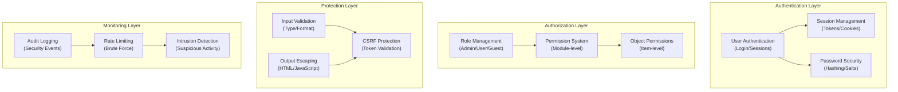

# ADR-004: Αρχιτεκτονική συστημάτων ασφαλείας

> Ολοκληρωμένη αρχιτεκτονική ασφαλείας για XOOPS CMS προστασία από σύγχρονες απειλές.

---

## Κατάσταση

**Αποδεκτό** - Βασικό επίπεδο ασφαλείας από το XOOPS 2.5

---

## Περιεχόμενο

## # Δήλωση προβλήματος

Το XOOPS χρειάζεται ένα ισχυρό σύστημα ασφαλείας που:

1. **Προστατεύει από κοινά τρωτά σημεία ιστού** (OWASP Top 10)
2. **Παρέχει λεπτομερή έλεγχο αδειών** σε όλες τις μονάδες
3. **Επιτρέπει τον ασφαλή έλεγχο ταυτότητας χρήστη** με σύγχρονα πρότυπα
4. **Αποτρέπει τις παραβιάσεις δεδομένων** και τη μη εξουσιοδοτημένη πρόσβαση
5. **Υποστηρίζει έλεγχο πρόσβασης πολλαπλών επιπέδων** (διαχειριστής, συντονιστής, χρήστης, επισκέπτης)
6. **Ενσωματώνεται με όλες τις μονάδες** απρόσκοπτα

## # Τρέχουσες απειλές

Οι σύγχρονες διαδικτυακές επιθέσεις περιλαμβάνουν:

- **SQL Έγχυση** - Κακόβουλο SQL στην είσοδο χρήστη
- **XSS (Σενάρια μεταξύ τοποθεσιών)** - Ένταξη JavaScript στις σελίδες
- **CSRF (Πλαστογραφία αιτήματος μεταξύ ιστοτόπων)** - Μη εξουσιοδοτημένες υποβολές φορμών
- **Παράκαμψη ελέγχου ταυτότητας** - Αδύναμος χειρισμός session/password
- **Παράκαμψη εξουσιοδότησης** - Κλιμάκωση προνομίων
- **Εκθεση δεδομένων** - Ευαίσθητα δεδομένα σε διευθύνσεις URL, αρχεία καταγραφής ή κρυφές μνήμες

## # XOOPS Απαιτήσεις ασφαλείας

1. Έλεγχος ταυτότητας χρήστη και διαχείριση συνεδρίας
2. Έλεγχος πρόσβασης βάσει ρόλων (RBAC)
3. Σύστημα αδειών για μονάδες και αντικείμενα
4. Επικύρωση εισόδου και διαφυγή εξόδου
5. Προστασία από κοινές επιθέσεις
6. Έλεγχος καταγραφής συμβάντων ασφαλείας
7. Ασφαλής χειρισμός κωδικού πρόσβασης
8. CSRF συμβολική προστασία

---

## Απόφαση

## # Βασική Αρχιτεκτονική Ασφαλείας



---

## Στοιχεία ασφαλείας

## # 1. Σύστημα ελέγχου ταυτότητας

**Διαδικασία σύνδεσης χρήστη:**

```php
<?php
// 1. Validate credentials
$user = $userHandler->findByLogin($username);
if (!$user || !password_verify($password, $user->getVar('pass'))) {
    throw new AuthenticationException('Invalid credentials');
}

// 2. Check if account is active
if (!$user->getVar('uactive')) {
    throw new AuthenticationException('Account inactive');
}

// 3. Create secure session
session_regenerate_id(true);
$_SESSION['uid'] = $user->getVar('uid');
$_SESSION['token'] = bin2hex(random_bytes(32));
$_SESSION['created'] = time();

// 4. Log the login
$this->auditLog('USER_LOGIN', $user->getVar('uid'));
```

**Ασφάλεια κωδικού πρόσβασης:**

```php
<?php
// Use password_hash (not MD5 or SHA1)
$hashed = password_hash($password, PASSWORD_BCRYPT, [
    'cost' => 12, // High cost = slow brute force
]);

// Verify password
if (!password_verify($inputPassword, $hashed)) {
    throw new Exception('Invalid password');
}

// Rehash if algorithm or cost changed
if (password_needs_rehash($hashed, PASSWORD_BCRYPT, ['cost' => 12])) {
    $newHash = password_hash($password, PASSWORD_BCRYPT, ['cost' => 12]);
    $user->setVar('pass', $newHash);
    $userHandler->insert($user);
}
```

## # 2. Διαχείριση συνεδρίας

**Ασφαλής χειρισμός συνεδρίας:**

```php
<?php
// Session configuration
ini_set('session.cookie_httponly', true);  // No JS access
ini_set('session.cookie_secure', true);     // HTTPS only
ini_set('session.cookie_samesite', 'Strict'); // CSRF protection
ini_set('session.gc_maxlifetime', 3600);   // 1 hour timeout
ini_set('session.sid_length', 64);         // 64-char session ID

// Validate session
function validateSession() {
    // Check timeout
    if (time() - $_SESSION['created'] > 3600) {
        session_destroy();
        throw new SessionExpiredException();
    }

    // Validate user agent (prevent session hijacking)
    if ($_SESSION['user_agent'] !== $_SERVER['HTTP_USER_AGENT']) {
        throw new SessionInvalidException();
    }

    // Validate IP (optional, can be too strict)
    if (!in_array($_SERVER['REMOTE_ADDR'], $_SESSION['ips'])) {
        $_SESSION['ips'][] = $_SERVER['REMOTE_ADDR'];
    }
}
```

## # 3. Εξουσιοδότηση (RBAC)

**Έλεγχος πρόσβασης βάσει ρόλων:**

```php
<?php
class XoopsUser {
    public function hasPermission(string $permissionName): bool
    {
        // Get user groups
        $groups = $this->getGroups();

        // Check if any group has permission
        foreach ($groups as $groupId) {
            if ($this->checkGroupPermission($groupId, $permissionName)) {
                return true;
            }
        }

        return false;
    }

    /**
     * User groups and their permissions
     * Admin: Full access
     * Moderator: Content management
     * User: Create own content
     * Guest: Read-only access
     */
    private function checkGroupPermission(int $groupId, string $permission): bool
    {
        $permissions = [
            1 => ['admin_access'],                 // Admin group
            2 => ['moderate_content', 'edit_own'], // Moderator group
            3 => ['create_content', 'edit_own'],   // User group
            4 => [],                               // Guest group (no permissions)
        ];

        return in_array($permission, $permissions[$groupId] ?? []);
    }
}
```

## # 4. Επικύρωση εισόδου

**Αποτροπή SQL Σφάλματα έγχυσης και τύπου:**

```php
<?php
// Always use prepared statements
$sql = 'SELECT * FROM users WHERE id = ?';
$result = $db->query($sql, [$userId]); // ✅ Safe

// Input validation
function validateUserInput(array $data): array
{
    return [
        'email' => filter_var($data['email'] ?? '', FILTER_VALIDATE_EMAIL),
        'age' => filter_var($data['age'] ?? 0, FILTER_VALIDATE_INT),
        'website' => filter_var($data['website'] ?? '', FILTER_VALIDATE_URL),
        'title' => substr(trim($data['title'] ?? ''), 0, 255),
    ];
}

// XOOPS Safe Input class
$safe = \Xmf\Request::getHtmlRequest('var_name', '');
$int = \Xmf\Request::getInt('page', 1);
```

## # 5. Διαφυγή εξόδου

**Αποτροπή XSS επιθέσεων:**

```php
<?php
// In PHP templates
echo htmlspecialchars($userInput, ENT_QUOTES, 'UTF-8');

// In Smarty templates (automatic escaping)
<{$user_input}>  {* Escaped by default *}
<{$html|escape:false}>  {* Only when needed *}

// JavaScript context
<script>
var message = "<{$userMessage|escape:'javascript'}>";
</script>

// URL context
<a href="<{$url|escape:'url'}>">Link</a>
```

## # 6. CSRF Προστασία

**Πρόληψη πλαστογράφησης αιτημάτων διασταυρούμενης τοποθεσίας:**

```php
<?php
// Generate CSRF token
session_start();
if (empty($_SESSION['csrf_token'])) {
    $_SESSION['csrf_token'] = bin2hex(random_bytes(32));
}

// In forms
<form method="POST">
    <input type="hidden" name="csrf_token" value="<{$csrf_token}>">
    <button type="submit">Submit</button>
</form>

// Validate token
if ($_SERVER['REQUEST_METHOD'] === 'POST') {
    if (hash_equals($_SESSION['csrf_token'], $_POST['csrf_token'] ?? '')) {
        // Process form
    } else {
        throw new InvalidTokenException('CSRF token invalid');
    }
}
```

---

## Συνέπειες

## # Θετικές επιδράσεις

1. **Ολοκληρωμένη προστασία** - Καλύπτει μεγάλες κατηγορίες ευπάθειας
2. **Επίπεδη ασφάλεια** - Πολλαπλά επίπεδα άμυνας
3. **Εύκαμπτο RBAC** - Λεπτός έλεγχος αδειών
4. **Διαδρομή ελέγχου** - Παρακολούθηση συμβάντων ασφαλείας
5. **Βιομηχανικό Πρότυπο** - Ευθυγραμμίζεται με τις συστάσεις OWASP
6. **Ενσωμάτωση μονάδας** - Εύκολη χρήση των API ασφαλείας από τις μονάδες

## # Αρνητικές Επιδράσεις

1. **Πολυπλοκότητα** - Απαιτείται περισσότερος κώδικας και διαμόρφωση
2. **Απόδοση** - Ο κατακερματισμός και η επικύρωση προσθέτουν γενικά έξοδα
3. **Εμπειρία χρήστη** - Η ασφάλεια μερικές φορές είναι ενοχλητική
4. **Συντήρηση** - Απαιτεί συνεχείς ενημερώσεις ασφαλείας
5. **Απαιτείται εκπαίδευση** - Οι προγραμματιστές πρέπει να ακολουθούν πρακτικές

## # Κίνδυνοι και μετριασμούς

| Κίνδυνος | Σοβαρότητα | Μετριασμός |
|------|----------|-----------|
| Ο προγραμματιστής αγνοεί την ασφάλεια | Υψηλή | Αναθεώρηση κώδικα, εκπαίδευση ασφάλειας |
| Ανακαλύφθηκαν νέα τρωτά σημεία | Μεσαία | Τακτικοί έλεγχοι ασφαλείας, ενημερώσεις |
| Επίδραση απόδοσης | Χαμηλό | Βελτιστοποίηση καυτών μονοπατιών, προσωρινή αποθήκευση |
| Υπερβολικά πολύπλοκα δικαιώματα | Μεσαία | Σαφής τεκμηρίωση, παραδείγματα |

---

## Βέλτιστες πρακτικές ασφάλειας

## # Για προγραμματιστές ενοτήτων

```php
<?php
// ✅ DO: Use prepared statements
$result = $db->prepare('SELECT * FROM table WHERE id = ?')->execute([$id]);

// ❌ DON'T: Concatenate queries
$result = $db->query("SELECT * FROM table WHERE id = $id");

// ✅ DO: Escape output
echo htmlspecialchars($user_input, ENT_QUOTES, 'UTF-8');

// ❌ DON'T: Output raw user data
echo $user_input;

// ✅ DO: Check permissions
if (!$user->hasPermission('edit_content')) {
    throw new PermissionException();
}

// ❌ DON'T: Trust user roles directly
if ($_POST['is_admin']) {
    // Make user admin - SECURITY HOLE!
}

// ✅ DO: Validate input types
$page = (int)$_GET['page'];

// ❌ DON'T: Use untrusted values directly
$sql .= " LIMIT " . $_GET['limit'];
```

---

## Εξετάζονται εναλλακτικές λύσεις

## # OAuth/OpenID Σύνδεση

**Γιατί δεν επιλέχθηκε αρχικά:** Πολύ περίπλοκο για κοινόχρηστο περιβάλλον φιλοξενίας, αλλά καλό για μελλοντική ενσωμάτωση με εξωτερικά συστήματα εξουσιοδότησης.

## # Έλεγχος ταυτότητας δύο παραγόντων (2FA)

**Κατάσταση:** Αποδεκτή ως επέκταση, όχι βασική απαίτηση, ανατρέξτε στο ADR-006

## # HTTP μόνο Cookies περιόδου λειτουργίας

**Κατάσταση:** Υλοποιήθηκε - αποτρέπει την πρόσβαση JavaScript στα δεδομένα περιόδου λειτουργίας

---

## Σχετικές Αποφάσεις

- ADR-001: Modular Architecture - Οι ενότητες υλοποιούν ασφάλεια
- ADR-005: Σύστημα αδειών μονάδας
- ADR-006: Έλεγχος ταυτότητας δύο παραγόντων (μέλλον)

---

## Αναφορές

## # Πρότυπα ασφαλείας

- [OWASP Top 10](https://owasp.org/www-project-top-ten/)
- [NIST Πλαίσιο Κυβερνοασφάλειας](https://www.nist.gov/cyberframework)
- [CWE Κορυφαία 25](https://cwe.mitre.org/top25/)

## # PHP Ασφάλεια

- [PHP Εγχειρίδιο ασφαλείας](https://www.php.net/manual/en/security.php)
- [password_hash() Τεκμηρίωση](https://www.php.net/manual/en/function.password-hash.php)
- [Session Security](https://www.php.net/manual/en/session.security.php)

## # Εργαλεία

- [OWASP ZAP](https://www.zaproxy.org/) - Δοκιμή ασφαλείας
- [Snyk](https://snyk.io/) - Σάρωση ευπάθειας
- [SonarQube](https://www.sonarqube.org/) - Ποιότητα κωδικού

---

## Λίστα ελέγχου υλοποίησης

- [ ] Σύστημα ελέγχου ταυτότητας χρήστη
- [ ] Διαχείριση συνεδρίας
- [ ] Κατακερματισμός κωδικού πρόσβασης (bcrypt)
- [ ] Έλεγχος πρόσβασης βάσει ρόλων
- [ ] Δικαιώματα μονάδας
- [ ] Πλαίσιο επικύρωσης εισόδου
- [ ] Διαφυγή εξόδου (PHP + Smarty)
- [ ] CSRF διακριτική προστασία
- [ ] Καταγραφή ελέγχου ασφαλείας
- [ ] Περιορισμός ποσοστού
- [ ] Κεφαλίδες ασφαλείας

---

## Ιστορικό έκδοσης

| Έκδοση | Ημερομηνία | Αλλαγές |
|---------|------|---------|
| 1.0.0 | 28-01-2024 | Αρχικό έγγραφο |

---

# XOOPS #adr #security #architecture #authentication #authorization #rbac
