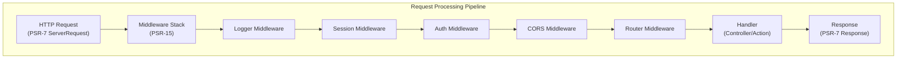

# ADR-005: PSR-15 Μοτίβο Middleware για XOOPS 4.0

> Υιοθετήστε PSR-15 HTTP χειριστές αιτημάτων διακομιστή (middleware) για βελτιωμένη διοχέτευση επεξεργασίας αιτημάτων.

:::caution[XOOPS 4.0 Πρόταση — Μη Διαθέσιμο σε 2.5.x]
Αυτό το ADR περιγράφει μια **προτεινόμενη αρχιτεκτονική για το XOOPS 4.0**. Το ενδιάμεσο λογισμικό PSR-15 **δεν είναι διαθέσιμο στο XOOPS 2.5.x**. Οι τρέχουσες μονάδες 2.5.x χρησιμοποιούν το μοτίβο του Ελεγκτή σελίδας με `mainfile.php` bootstrap. Δείτε XOOPS Αρχιτεκτονική για τον τρέχοντα κύκλο ζωής αιτήματος.
:::

---

## Κατάσταση

**Προτεινόμενο** - Υπό αξιολόγηση για την έκδοση XOOPS 4.0

---

## Περιεχόμενο

## # Τρέχουσα προσέγγιση

Το XOOPS 2.5 χρησιμοποιεί μια μονολιθική προσέγγιση χειρισμού αιτημάτων:

```php
// Current: Sequential processing
require_once 'mainfile.php';
// → Kernel initialization
// → User authentication
// → Module loading
// → Page rendering

// All in one flow, mixed concerns
```

## # Προβλήματα με την τρέχουσα προσέγγιση

1. **Μικτές ανησυχίες** - Έλεγχος ταυτότητας, καταγραφή, δρομολόγηση όλα αλληλένδετα
2. **Δύσκολο στη δοκιμή** - Δύσκολα στη μονάδα δοκιμής μεμονωμένα βήματα επεξεργασίας αιτημάτων
3. **Δύσκολο στην επέκταση** - Οι μονάδες μπορούν να συνδεθούν μόνο μέσω preload/events
4. **Κακός διαχωρισμός** - Λογική επεξεργασίας αιτήματος διάσπαρτη σε όλη τη βάση κώδικα
5. **Not Composable** - Δεν είναι εύκολη η αλυσίδα ή η αναδιάταξη των βημάτων επεξεργασίας

## # Τι είναι το PSR-15 Middleware;

Το PSR-15 ορίζει μια τυπική διεπαφή για HTTP ενδιάμεσο λογισμικό:

```php
<?php
interface RequestHandlerInterface {
    public function handle(ServerRequestInterface $request): ResponseInterface;
}

interface MiddlewareInterface {
    public function process(
        ServerRequestInterface $request,
        RequestHandlerInterface $handler
    ): ResponseInterface;
}
```

**Αλυσίδα μεσαίου λογισμικού:**

```
Request
  ↓
[Logger] → logs request
  ↓
[Auth] → validates user session
  ↓
[CORS] → checks cross-origin
  ↓
[Router] → dispatches to handler
  ↓
[Handler] → generates response
  ↓
Response
```

---

## Απόφαση

## # Υιοθετήστε PSR-15 Middleware Stack για XOOPS 4.0

Εφαρμόστε μια γραμμή επεξεργασίας αιτημάτων που βασίζεται σε ενδιάμεσο λογισμικό σύμφωνα με το πρότυπο PSR-15.

## # Επισκόπηση Αρχιτεκτονικής



## # Βασικά στοιχεία Middleware

### # 1. Μεσαίο λογισμικό εφαρμογής (πυρήνας)

```php
<?php
declare(strict_types=1);

namespace XoopsCore;

use Psr\Http\Message\ResponseInterface;
use Psr\Http\Message\ServerRequestInterface;
use Psr\Http\Server\MiddlewareInterface;
use Psr\Http\Server\RequestHandlerInterface;

class SessionMiddleware implements MiddlewareInterface
{
    public function process(
        ServerRequestInterface $request,
        RequestHandlerInterface $handler
    ): ResponseInterface {
        // 1. Retrieve session (or start new)
        $sessionId = $request->getCookieParams()['PHPSESSID'] ?? null;
        $session = $this->sessionManager->load($sessionId);

        // 2. Attach session to request
        $request = $request->withAttribute('session', $session);

        // 3. Pass to next middleware
        $response = $handler->handle($request);

        // 4. Set session cookie if needed
        if ($session->isModified()) {
            $response = $response->withAddedHeader(
                'Set-Cookie',
                'PHPSESSID=' . $session->getId() . '; HttpOnly; SameSite=Strict'
            );
        }

        return $response;
    }
}
```

### # 2. Ενδιάμεσο λογισμικό ελέγχου ταυτότητας

```php
<?php
class AuthMiddleware implements MiddlewareInterface
{
    public function process(
        ServerRequestInterface $request,
        RequestHandlerInterface $handler
    ): ResponseInterface {
        // Get session from previous middleware
        $session = $request->getAttribute('session');

        // Authenticate user from session
        $user = $this->authenticate($session);

        // Attach user to request
        $request = $request->withAttribute('user', $user);

        return $handler->handle($request);
    }

    private function authenticate(?Session $session): User
    {
        if ($session && $session->has('uid')) {
            return $this->userRepository->findById($session->get('uid'));
        }

        return new AnonymousUser();
    }
}
```

### # 3. Ενδιάμεσο λογισμικό εξουσιοδότησης

```php
<?php
class AuthorizationMiddleware implements MiddlewareInterface
{
    public function __construct(private AuthorizationChecker $checker)
    {
    }

    public function process(
        ServerRequestInterface $request,
        RequestHandlerInterface $handler
    ): ResponseInterface {
        $user = $request->getAttribute('user');
        $route = $request->getAttribute('route');

        // Check if user has permission for this route
        if (!$this->checker->isGranted($user, $route)) {
            return new JsonResponse(
                ['error' => 'Unauthorized'],
                403
            );
        }

        return $handler->handle($request);
    }
}
```

### # 4. Ενότητα Middleware

```php
<?php
// Modules can provide their own middleware
class PublisherAccessMiddleware implements MiddlewareInterface
{
    public function process(
        ServerRequestInterface $request,
        RequestHandlerInterface $handler
    ): ResponseInterface {
        $user = $request->getAttribute('user');

        // Module-specific access control
        if (!$user->hasPermission('publisher_view')) {
            return new HtmlResponse('Access denied', 403);
        }

        return $handler->handle($request);
    }
}
```

## # Παράδειγμα υλοποίησης

```php
<?php
// bootstrap.php - Application setup

use Psr\Http\Message\ServerRequestInterface;
use Psr\Http\Server\RequestHandlerInterface;
use Xoops\Core\Middleware\{
    LoggerMiddleware,
    SessionMiddleware,
    AuthMiddleware,
    CorsMiddleware,
    ErrorHandlingMiddleware
};

// Create middleware pipeline
$middlewareStack = [
    // 1. Error handling (outermost)
    new ErrorHandlingMiddleware(),

    // 2. Logging
    new LoggerMiddleware($logger),

    // 3. CORS handling
    new CorsMiddleware($corsConfig),

    // 4. Session management
    new SessionMiddleware($sessionManager),

    // 5. Authentication
    new AuthMiddleware($userRepository),

    // 6. Authorization
    new AuthorizationMiddleware($authChecker),

    // 7. Routing and dispatching
    new RoutingMiddleware($router),

    // 8. Module middleware (dynamic)
    ...$this->loadModuleMiddleware(),
];

// Process request through middleware stack
$request = ServerRequestFactory::fromGlobals();
$dispatcher = new MiddlewareDispatcher($middlewareStack);
$response = $dispatcher->dispatch($request);

// Send response
http_response_code($response->getStatusCode());
foreach ($response->getHeaders() as $name => $values) {
    foreach ($values as $value) {
        header("$name: $value", false);
    }
}
echo $response->getBody();
```

## # Ενοποίηση ενότητας

Οι ενότητες μπορούν να παρέχουν ενδιάμεσο λογισμικό:

```php
<?php
// Publisher module - xoops_version.php

$modversion['middleware'] = [
    'PublisherAccessMiddleware' => true,      // Auto-load
    'PublisherLogMiddleware' => true,
];

// Or custom:
$modversion['middleware_factory'] = function() {
    return [
        new PublisherCacheMiddleware(),
        new PublisherPermissionMiddleware(),
    ];
};
```

---

## Συνέπειες

## # Θετικές επιδράσεις

1. **Διαχωρισμός ανησυχιών** - Κάθε ενδιάμεσο λογισμικό αναλαμβάνει μία ευθύνη
2. **Δυνατότητα δοκιμής** - Εύκολο στη μονάδα δοκιμής μεμονωμένων στοιχείων ενδιάμεσου λογισμικού
3. **Συνθεσιμότητα** - Το Middleware μπορεί να αναμειχθεί και να παραγγελθεί ξανά
4. **Συμβατό με πρότυπα** - Χρησιμοποιεί πρότυπα PSR-15 και PSR-7
5. **Επεκτασιμότητα** - Οι μονάδες μπορούν εύκολα να προσθέσουν προσαρμοσμένο ενδιάμεσο λογισμικό
6. **Εντοπισμός σφαλμάτων** - Εκκαθάριση ροής αιτημάτων μέσω του αγωγού
7. **Απόδοση** - Μπορεί να βελτιστοποιήσει συγκεκριμένα επίπεδα ενδιάμεσου λογισμικού
8. **Διαλειτουργικότητα** - Μπορεί να χρησιμοποιήσει ενδιάμεσο λογισμικό τρίτου κατασκευαστή PSR-15

## # Αρνητικές Επιδράσεις

1. **Καμπύλη μάθησης** - Οι προγραμματιστές πρέπει να κατανοήσουν το PSR-15
2. **Επιβάρυνση απόδοσης** - Περισσότερες κλήσεις λειτουργιών βρίσκονται σε εξέλιξη
3. **Πολυπλοκότητα** - Περισσότερα κινούμενα μέρη παρά μονολιθική προσέγγιση
4. **Προσπάθεια μετεγκατάστασης** - Απαιτεί ανακατασκευή του υπάρχοντος κώδικα
5. **Εξαρτήσεις** - Απαιτεί βιβλιοθήκη PSR-7 HTTP

## # Κίνδυνοι και μετριασμούς

| Κίνδυνος | Σοβαρότητα | Μετριασμός |
|------|----------|-----------|
| Σύνθετες αλυσίδες ενδιάμεσων λογισμικών | Μεσαία | Σαφής τεκμηρίωση, παραδείγματα |
| Υποβάθμιση απόδοσης | Μεσαία | Συγκριτική αξιολόγηση, βελτιστοποίηση καυτών μονοπατιών |
| Κακή χρήση προγραμματιστών | Μεσαία | Αναθεώρηση κώδικα, οδηγός βέλτιστων πρακτικών |
| Αλλαγές που ξεπερνούν τη μετανάστευση | Υψηλή | Περίοδος απαξίωσης, βοηθοί |
| Ζητήματα παραγγελιών μεσαίου λογισμικού | Μεσαία | Διαγραφή γραφήματος εξάρτησης |

---

## Σχέδιο Υλοποίησης

## # Φάση 1: Θεμελίωση (2ο τρίμηνο 2026)

- [ ] Εφαρμογή PSR-7 HTTP περιτύλιξης μηνυμάτων
- [ ] Δημιουργία MiddlewareDispatcher
- [ ] Εφαρμογή βασικού ενδιάμεσου λογισμικού (συνεδρία, εξουσιοδότηση)
- [ ] Ενημερώστε τον πυρήνα για χρήση ενδιάμεσου λογισμικού

## # Φάση 2: Ενοποίηση (3ο τρίμηνο 2026)

- [ ] Μετεγκατάσταση υπάρχουσας λειτουργικότητας σε ενδιάμεσο λογισμικό
- [ ] Προσθήκη υποστήριξης ενδιάμεσου λογισμικού ενότητας
- [ ] Δημιουργήστε βοηθητικά προγράμματα δοκιμής ενδιάμεσου λογισμικού
- [ ] Γράψτε ολοκληρωμένη τεκμηρίωση

## # Φάση 3: Μετανάστευση (Q4 2026)

- [ ] Παροχή επιπέδου συμβατότητας για παλιό κώδικα
- [ ] Ενημερωμένες μονάδες βοήθειας σε νέο ενδιάμεσο λογισμικό
- [ ] Βελτιστοποίηση απόδοσης
- [ ] Έλεγχος ασφαλείας

## # Φάση 4: Έκδοση (1 τρίμηνο 2027)

- [ ] XOOPS 4.0 έκδοση με ενδιάμεσο λογισμικό
- [ ] Καταργήστε το παλιό σύστημα preload/hook
- [ ] Σχόλια και ενημερώσεις της κοινότητας

---

## Κριτήρια επιτυχίας

- [ ] Όλες οι βασικές λειτουργίες μεταφέρθηκαν στο ενδιάμεσο λογισμικό
- [ ] 90%+ κάλυψη δοκιμής για ενδιάμεσο λογισμικό
- [ ] Τεκμηρίωση πλήρης με παραδείγματα
- [ ] Απόδοση εντός 10% από την προηγούμενη έκδοση
- [ ] Οι μονάδες χρησιμοποιούν με επιτυχία νέο σύστημα ενδιάμεσου λογισμικού
- [ ] Κοινοτικό ποσοστό υιοθεσίας >80%

---

## Βέλτιστες πρακτικές Middleware

## # Κάνετε

- Διατηρήστε εστιασμένο το ενδιάμεσο λογισμικό (απλή ευθύνη)
- Χρησιμοποιήστε το αμετάβλητο (δημιουργήστε νέο request/response)
- Χειριστείτε τα λάθη με χάρη
- Εξαρτήσεις εγγράφων
- Προσθέστε συμβουλές τύπου
- Γράψτε δοκιμές για ενδιάμεσο λογισμικό
- Χρησιμοποιήστε τυπικές διεπαφές PSR-15

## # Μην

- Μην τροποποιείτε κοινόχρηστα αντικείμενα request/response
- Μην αποκτάτε απευθείας πρόσβαση σε παγκόσμιους
- Μην δημιουργείτε εξαρτήσεις από την παραγγελία του ενδιάμεσου λογισμικού
- Μην πιάνετε όλες τις εξαιρέσεις
- Μην ανακατεύετε την επιχειρηματική λογική με το ενδιάμεσο λογισμικό
- Μην αναγκάζετε το ενδιάμεσο λογισμικό να κάνει πάρα πολλά

---

## Παραδείγματα

## # Προσαρμοσμένο ενδιάμεσο λογισμικό

```php
<?php
// Example: Rate limiting middleware

use Psr\Http\Message\ResponseInterface;
use Psr\Http\Message\ServerRequestInterface;
use Psr\Http\Server\MiddlewareInterface;
use Psr\Http\Server\RequestHandlerInterface;

class RateLimitMiddleware implements MiddlewareInterface
{
    public function __construct(
        private RateLimiter $limiter,
        private int $limit = 100,
        private int $window = 3600
    ) {
    }

    public function process(
        ServerRequestInterface $request,
        RequestHandlerInterface $handler
    ): ResponseInterface {
        $user = $request->getAttribute('user');
        $identifier = $user->getId() ?? $request->getClientIp();

        // Check rate limit
        $remaining = $this->limiter->check($identifier, $this->limit, $this->window);

        if ($remaining < 0) {
            return new JsonResponse(
                ['error' => 'Rate limit exceeded'],
                429
            );
        }

        // Add rate limit headers
        $response = $handler->handle($request);
        return $response
            ->withAddedHeader('X-RateLimit-Limit', (string)$this->limit)
            ->withAddedHeader('X-RateLimit-Remaining', (string)$remaining);
    }
}
```

---

## Σχετικές Αποφάσεις

- ADR-001: Modular Architecture - Foundation
- ADR-004: Σύστημα ασφαλείας - Χρησιμοποιεί ενδιάμεσο λογισμικό για έλεγχο ταυτότητας
- ADR-006: Έλεγχος δύο παραγόντων - Μπορεί να είναι ενδιάμεσο λογισμικό

---

## Αναφορές

## # PSR Πρότυπα

- [PSR-7: HTTP Διεπαφή μηνυμάτων](https://www.php-fig.org/psr/psr-7/)
- [PSR-15: HTTP Διαχειριστές αιτημάτων διακομιστή](https://www.php-fig.org/psr/psr-15/)

## # Middleware Frameworks

- [Slim Framework](https://www.slimframework.com/) - Παραδείγματα Middleware
- [Zend Expressive](https://docs.zendframework.com/zend-expressive/) - PSR-15 πλαίσιο
- [Guzzle](https://docs.guzzlephp.org/) - HTTP ενδιάμεσο λογισμικό πελάτη

## # Εργαλεία

- [RelayPHP](https://relayphp.com/) - Βιβλιοθήκη Middleware
- [PSR-15 Middleware](https://github.com/middlewares) - Συλλογή ενδιάμεσων λογισμικών

---

## Ιστορικό έκδοσης

| Έκδοση | Ημερομηνία | Αλλαγές |
|---------|------|---------|
| 1.0.0 | 28-01-2024 | Αρχική πρόταση |

---

# XOOPS #adr #psr-15 #middleware #architecture #psr-7
