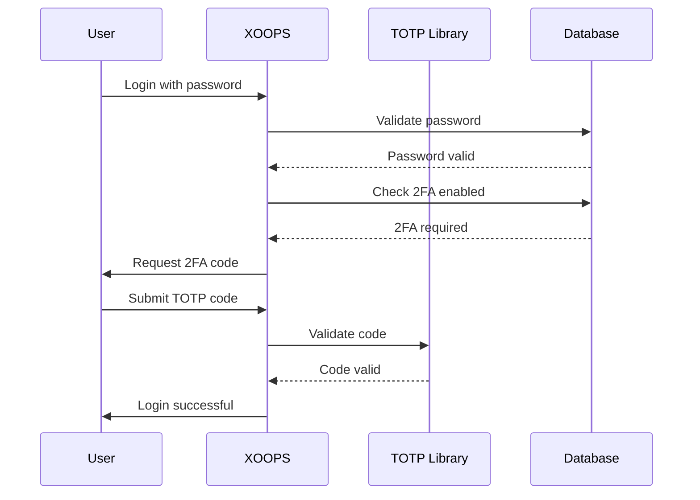

## Κατάσταση

Προτάθηκε

## Περιεχόμενο

Το XOOPS χρειάζεται βελτιωμένη ασφάλεια για τον έλεγχο ταυτότητας χρήστη. Ο έλεγχος ταυτότητας δύο παραγόντων (2FA) παρέχει ένα πρόσθετο επίπεδο ασφάλειας πέρα ​​από τους κωδικούς πρόσβασης, προστατεύοντας τους λογαριασμούς ακόμα και σε περίπτωση παραβίασης των κωδικών πρόσβασης.

Βασικές εκτιμήσεις:
- Συμβατότητα προς τα πίσω με υπάρχοντα έλεγχο ταυτότητας
- Υποστήριξη για πολλαπλές μεθόδους 2FA
- Εμπειρία χρήστη κατά την εγκατάσταση και τη σύνδεση
- Μηχανισμοί ανάκτησης χαμένων συσκευών
- Ενοποίηση με το υπάρχον σύστημα αδειών

## Απόφαση

Θα εφαρμόσουμε το TOTP (Time-based One-Time Password) ως την κύρια μέθοδο 2FA με υποστήριξη για εφεδρικούς κωδικούς.

## # Προσέγγιση Εφαρμογής



## # Σχήμα βάσης δεδομένων

```sql
CREATE TABLE `{PREFIX}_users_2fa` (
    `user_id` INT(11) NOT NULL,
    `secret` VARCHAR(32) NOT NULL,
    `enabled` TINYINT(1) DEFAULT 0,
    `backup_codes` TEXT,
    `last_used` INT(11),
    `created` INT(11) NOT NULL,
    PRIMARY KEY (`user_id`),
    FOREIGN KEY (`user_id`) REFERENCES `{PREFIX}_users`(`uid`)
);
```

## # Διεπαφή υπηρεσίας

```php
interface TwoFactorAuthInterface
{
    public function enable(int $userId): TwoFactorSetup;
    public function disable(int $userId): void;
    public function verify(int $userId, string $code): bool;
    public function generateBackupCodes(int $userId): array;
    public function isEnabled(int $userId): bool;
}
```

## # Ενσωμάτωση Middleware

```php
class TwoFactorMiddleware implements MiddlewareInterface
{
    public function process(
        ServerRequestInterface $request,
        RequestHandlerInterface $handler
    ): ResponseInterface {
        $session = $request->getAttribute('session');

        if ($session->has('pending_2fa_user_id')) {
            // User needs to complete 2FA
            if ($this->isVerificationRequest($request)) {
                return $handler->handle($request);
            }
            return new RedirectResponse('/2fa/verify');
        }

        return $handler->handle($request);
    }
}
```

## Συνέπειες

## # Θετικό

- Σημαντικά βελτιωμένη ασφάλεια λογαριασμού
- Συμβατότητα TOTP με το πρότυπο του κλάδου (Google Authenticator, Authy, κ.λπ.)
- Οι εφεδρικοί κωδικοί αποτρέπουν το κλείδωμα λογαριασμού
- Προαιρετικό ανά χρήστη - δεν επιβάλλει την υιοθέτηση
- PSR-15 το ενδιάμεσο λογισμικό επιτρέπει την καθαρή ενσωμάτωση

## # Αρνητικό

- Το πρόσθετο βήμα σύνδεσης επηρεάζει την εμπειρία χρήστη
- Οι χρήστες πρέπει να διαχειρίζονται εφαρμογές ελέγχου ταυτότητας
- Οι χαμένες συσκευές απαιτούν διαδικασία ανάκτησης
- Πρόσθετη αποθήκευση βάσης δεδομένων και ερωτήματα
- Απαιτεί εξάρτηση από κρυπτογραφική βιβλιοθήκη

## # Διαδρομή Μετανάστευσης

1. Προσθέστε πίνακα βάσης δεδομένων για δεδομένα 2FA
2. Υλοποιήστε την υπηρεσία TOTP με εξάρτηση από τη βιβλιοθήκη
3. Προσθέστε ενδιάμεσο λογισμικό στην αλυσίδα ελέγχου ταυτότητας
4. Δημιουργήστε διεπαφή χρήστη ρύθμισης και επαλήθευσης
5. Επιλογή διαχειριστή να απαιτεί 2FA για συγκεκριμένες ομάδες

## Εξετάζονται εναλλακτικές λύσεις

## # SMS με βάση OTP

Απορρίφθηκε λόγω:
- SIM εναλλαγή τρωτών σημείων
- Κόστος πύλης SMS
- Πολυπλοκότητα επαλήθευσης αριθμού τηλεφώνου
- Ανησυχίες για το απόρρητο

## # Κλειδιά ασφαλείας υλικού (WebAuthn)

Αναβάλλεται για το μέλλον ADR:
- Πιο πολύπλοκη υλοποίηση
- Περιορισμένη υποστήριξη προγράμματος περιήγησης ιστορικά
- Υψηλότερο κόστος χρήστη
- Θα μπορούσε να προστεθεί μαζί με το TOTP αργότερα

## # Βασισμένο σε email OTP

Απορρίφθηκε λόγω:
- Ο συμβιβασμός του λογαριασμού email ακυρώνει τον σκοπό
- Οι καθυστερήσεις παράδοσης επηρεάζουν το UX
- Ζητήματα φίλτρου ανεπιθύμητης αλληλογραφίας

## Αναφορές

- [RFC 6238 - TOTP](https://tools.ietf.org/html/rfc6238)
- [Μορφή κλειδιού Google Authenticator](https://github.com/google/google-authenticator/wiki/Key-Uri-Format)
- ../../02-Core-Concepts/Security/Security-Best-Practices - Οδηγίες ασφαλείας
- ../../02-Core-Concepts/Users-Permissions/Authentication - Τεκμηρίωση συστήματος ελέγχου ταυτότητας
