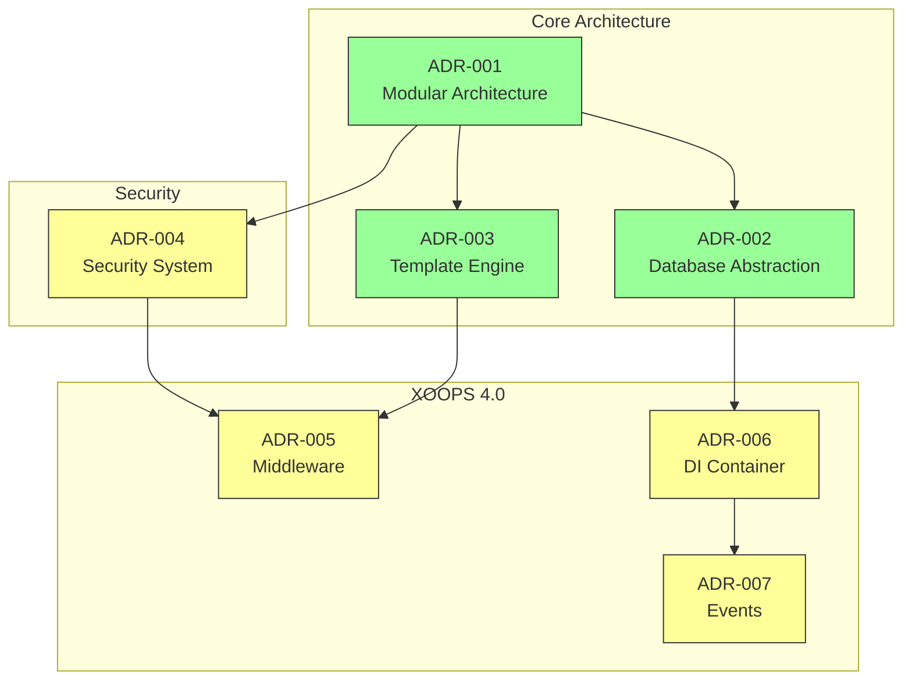
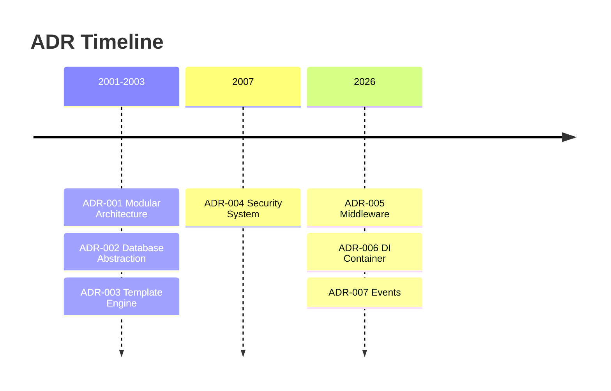

# 📋 Δείκτης Αρχιτεκτονικής Αποφάσεως

> Ολοκληρωμένο ευρετήριο αρχιτεκτονικών αποφάσεων που διαμόρφωσαν το XOOPS CMS.

---

## Τι είναι οι ADR;

Τα Αρχεία Αποφάσεων Αρχιτεκτονικής (ADRs) τεκμηριώνουν σημαντικές αρχιτεκτονικές αποφάσεις που ελήφθησαν κατά την ανάπτυξη του XOOPS. Αποτυπώνουν το πλαίσιο, την απόφαση και τις συνέπειες κάθε επιλογής, παρέχοντας πολύτιμο ιστορικό πλαίσιο για τους συντηρητές και τους συντελεστές.

---

## ADR Υπόμνημα κατάστασης

| Κατάσταση | Σημασία |
|--------|---------|
| **Προτεινόμενο** | Υπό συζήτηση, δεν έγινε ακόμη αποδεκτό |
| **Αποδεκτό** | Η απόφαση εκδόθηκε |
| **Καταργήθηκε** | Δεν συνιστάται πλέον |
| **Αντικαταστάθηκε** | Αντικαταστάθηκε από άλλο ADR |

---

## Τρέχουσες ADR

## # Θεμελιώδεις Αποφάσεις

| ADR | Τίτλος | Κατάσταση | Αντίκτυπος |
|-----|-------|--------|--------|
| ADR-001 | Modular Architecture | Αποδεκτό | Πυρήνας |
| ADR-002 | Πρόσβαση στη βάση δεδομένων αντικειμενοστρεφής | Αποδεκτό | Πυρήνας |
| ADR-003 | Smarty Template Engine | Αποδεκτό | Πυρήνας |

## # Προγραμματισμένες ADR (XOOPS 4.0)

| ADR | Τίτλος | Κατάσταση | Αντίκτυπος |
|-----|-------|--------|--------|
| ADR-004 | Σχεδιασμός Συστήματος Ασφαλείας | Προτεινόμενο | Ασφάλεια |
| ADR-005 | PSR-15 Middleware | Προτεινόμενο | Αρχιτεκτονική |
| ADR-006 | Δοχείο έγχυσης εξάρτησης | Προτεινόμενο | Αρχιτεκτονική |
| ADR-007 | Επανασχεδιασμός Συστήματος Εκδηλώσεων | Προτεινόμενο | Αρχιτεκτονική |

---

## ADR Σχέσεις



---

## Χρονοδιάγραμμα



---

## Δημιουργία νέων ADR

Όταν προτείνετε μια νέα αρχιτεκτονική απόφαση:

1. Αντιγράψτε το πρότυπο ADR
2. Συμπληρώστε όλες τις ενότητες
3. Υποβολή ως αίτημα έλξης
4. Συζητήστε στο GitHub Issues
5. Ενημέρωση κατάστασης μετά την απόφαση

## # ADR Δομή προτύπου

```markdown
# ADR-XXX: Title

## Status
Proposed | Accepted | Deprecated | Superseded

## Context
What is the issue motivating this decision?

## Decision
What is the change that we're proposing?

## Consequences
What becomes easier or harder as a result?

## Alternatives Considered
What other options were evaluated?
```

---

## 🔗 Σχετική τεκμηρίωση

- Βασικές Έννοιες
- Οδηγίες συνεισφοράς
- XOOPS 4.0 Οδικός χάρτης

---

# XOOPS #adr #αρχιτεκτονική #ευρετήριο #αποφάσεις
