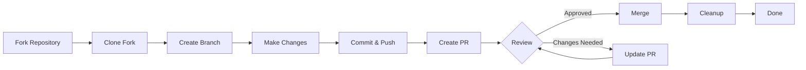

> Αυτός ο οδηγός σας καθοδηγεί στην πλήρη διαδικασία συνεισφοράς στο XOOPS, από την αρχική ρύθμιση έως το αίτημα συγχώνευσης έλξης.

---

## Προαπαιτούμενα

Πριν ξεκινήσετε να συνεισφέρετε, βεβαιωθείτε ότι έχετε:

- Εγκαταστάθηκε και διαμορφώθηκε το **Git**
- **Λογαριασμός GitHub** (δωρεάν)
- **PHP 7.4+** για ανάπτυξη XOOPS
- **Συνθέτης** για διαχείριση εξαρτήσεων
- Βασικές γνώσεις Git workflows
- Εξοικείωση με τον Κώδικα Δεοντολογίας

---

## Βήμα 1: Διαχωρίστε το αποθετήριο

## # Στη διεπαφή ιστού GitHub

1. Μεταβείτε στο αποθετήριο (π.χ. `XOOPS/XoopsCore27`)
2. Κάντε κλικ στο κουμπί **Fork** στην επάνω δεξιά γωνία
3. Επιλέξτε πού θα διαχωρίσετε (τον προσωπικό σας λογαριασμό)
4. Περιμένετε να ολοκληρωθεί το πιρούνι

## # Γιατί Fork;

- Παίρνετε το δικό σας αντίγραφο για να εργαστείτε
- Οι συντηρητές δεν χρειάζεται να διαχειρίζονται πολλά υποκαταστήματα
- Έχετε τον πλήρη έλεγχο του πιρουνιού σας
- Τα αιτήματα έλξης αναφέρονται στο πιρούνι σας και στο αποθετήριο ανάντη

---

## Βήμα 2: Κλωνοποιήστε το πιρούνι σας τοπικά

```bash
# Clone your fork (replace YOUR_USERNAME)
git clone https://github.com/YOUR_USERNAME/XoopsCore27.git
cd XoopsCore27

# Add upstream remote to track original repository
git remote add upstream https://github.com/XOOPS/XoopsCore27.git

# Verify remotes are set correctly
git remote -v
# origin    https://github.com/YOUR_USERNAME/XoopsCore27.git (fetch)
# origin    https://github.com/YOUR_USERNAME/XoopsCore27.git (push)
# upstream  https://github.com/XOOPS/XoopsCore27.git (fetch)
# upstream  https://github.com/XOOPS/XoopsCore27.git (nofetch)
```

---

## Βήμα 3: Ρύθμιση περιβάλλοντος ανάπτυξης

## # Εγκατάσταση εξαρτήσεων

```bash
# Install Composer dependencies
composer install

# Install development dependencies
composer install --dev

# For module development
cd modules/mymodule
composer install
```

## # Διαμόρφωση του Git

```bash
# Set your Git identity
git config user.name "Your Name"
git config user.email "your.email@example.com"

# Optional: Set global Git config
git config --global user.name "Your Name"
git config --global user.email "your.email@example.com"
```

## # Εκτέλεση δοκιμών

```bash
# Make sure tests pass in clean state
./vendor/bin/phpunit

# Run specific test suite
./vendor/bin/phpunit --testsuite unit
```

---

## Βήμα 4: Δημιουργία κλάδου χαρακτηριστικών

## # Σύμβαση Ονομασίας Υποκαταστημάτων

Ακολουθήστε αυτό το μοτίβο: `<type>/<description>`

**Τύποι:**
- `feature/` - Νέα δυνατότητα
- `fix/` - Διόρθωση σφαλμάτων
- `docs/` - Μόνο τεκμηρίωση
- `refactor/` - Ανακατασκευή κωδικών
- `test/` - Προσθήκες δοκιμής
- `chore/` - Συντήρηση, εργαλεία

**Παραδείγματα:**
```bash
# Feature branch
git checkout -b feature/add-two-factor-auth

# Bug fix branch
git checkout -b fix/prevent-xss-in-forms

# Documentation branch
git checkout -b docs/update-api-guide

# Always branch from upstream/main (or develop)
git checkout -b feature/my-feature upstream/main
```

## # Διατηρήστε το υποκατάστημα ενημερωμένο

```bash
# Before you start work, sync with upstream
git fetch upstream
git merge upstream/main

# Later, if upstream has changed
git fetch upstream
git rebase upstream/main
```

---

## Βήμα 5: Κάντε τις αλλαγές σας

## # Πρακτικές Ανάπτυξης

1. **Γράψτε τον κωδικό** ακολουθώντας τα πρότυπα PHP
2. **Γράψτε τεστ** για νέα λειτουργικότητα
3. **Ενημερώστε την τεκμηρίωση** εάν χρειάζεται
4. **Εκτελέστε linters** και μορφοποιητές κώδικα

## # Έλεγχοι ποιότητας κώδικα

```bash
# Run all tests
./vendor/bin/phpunit

# Run with coverage
./vendor/bin/phpunit --coverage-html coverage/

# Run PHP CS Fixer
./vendor/bin/php-cs-fixer fix --dry-run

# Run PHPStan static analysis
./vendor/bin/phpstan analyse class/ src/
```

## # Κάντε καλές αλλαγές

```bash
# Check what you changed
git status
git diff

# Stage specific files
git add class/MyClass.php
git add tests/MyClassTest.php

# Or stage all changes
git add .

# Commit with descriptive message
git commit -m "feat(auth): add two-factor authentication support"
```

---

## Βήμα 6: Διατήρηση του Branch σε συγχρονισμό

Ενώ εργάζεστε στη λειτουργία σας, ο κύριος κλάδος μπορεί να προχωρήσει:

```bash
# Fetch latest changes from upstream
git fetch upstream

# Option A: Rebase (preferred for clean history)
git rebase upstream/main

# Option B: Merge (simpler but adds merge commits)
git merge upstream/main

# If conflicts occur, resolve them then:
git add .
git rebase --continue  # or git merge --continue
```

---

## Βήμα 7: Σπρώξτε στο πιρούνι σας

```bash
# Push your branch to your fork
git push origin feature/my-feature

# On subsequent pushes
git push

# If you rebased, you might need force push (use carefully!)
git push --force-with-lease origin feature/my-feature
```

---

## Βήμα 8: Δημιουργία Αίτησης Τραβήγματος

## # Στη διεπαφή ιστού GitHub

1. Μεταβείτε στο πιρούνι σας στο GitHub
2. Θα δείτε μια ειδοποίηση για να δημιουργήσετε ένα PR από το υποκατάστημά σας
3. Κάντε κλικ στο **"Αίτημα σύγκρισης και έλξης"**
4. Ή κάντε χειροκίνητα κλικ **"Νέο αίτημα έλξης"** και επιλέξτε το υποκατάστημά σας

## # Τίτλος δημοσίων σχέσεων και περιγραφή

**Μορφή τίτλου:**
```
<type>(<scope>): <subject>
```

Παραδείγματα:
```
feat(auth): add two-factor authentication
fix(forms): prevent XSS in text input
docs: update installation guide
refactor(core): improve performance
```

**Πρότυπο περιγραφής:**

```markdown
## Description
Brief explanation of what this PR does.

## Changes
- Changed X from A to B
- Added feature Y
- Fixed bug Z

## Type of Change
- [ ] New feature (adds new functionality)
- [ ] Bug fix (fixes an issue)
- [ ] Breaking change (API/behavior change)
- [ ] Documentation update

## Testing
- [ ] Added tests for new functionality
- [ ] All existing tests pass
- [ ] Manual testing performed

## Screenshots (if applicable)
Include before/after screenshots for UI changes.

## Related Issues
Closes #123
Related to #456

## Checklist
- [ ] Code follows style guidelines
- [ ] Self-reviewed own code
- [ ] Commented complex code
- [ ] Updated documentation
- [ ] No new warnings generated
- [ ] Tests pass locally
```

## # Λίστα ελέγχου αναθεώρησης δημοσίων σχέσεων

Πριν την υποβολή, βεβαιωθείτε:

- [ ] Ο κωδικός ακολουθεί τα πρότυπα PHP
- [ ] Περιλαμβάνονται εξετάσεις και περνούν
- [ ] Ενημερώθηκε η τεκμηρίωση (εάν χρειάζεται)
- [ ] Δεν υπάρχουν διενέξεις συγχώνευσης
- [ ] Τα μηνύματα δέσμευσης είναι σαφή
- [ ] Αναφέρονται σχετικά θέματα
- [ ] Η περιγραφή PR είναι λεπτομερής
- [ ] Δεν υπάρχουν αρχεία καταγραφής κώδικα εντοπισμού σφαλμάτων ή κονσόλας

---

## Βήμα 9: Απαντήστε στα σχόλια

## # Κατά την αναθεώρηση κώδικα

1. **Διαβάστε τα σχόλια προσεκτικά** - Κατανοήστε τα σχόλια
2. **Κάντε ερωτήσεις** - Εάν είναι ασαφές, ζητήστε διευκρινίσεις
3. **Συζητήστε εναλλακτικές λύσεις** - Συζητήστε προσεγγίσεις με σεβασμό
4. **Πραγματοποιήστε τις ζητούμενες αλλαγές** - Ενημερώστε το υποκατάστημά σας
5. **Αναγκαστική ώθηση ενημερωμένες δεσμεύσεις** - Εάν γίνεται επανεγγραφή του ιστορικού

```bash
# Make changes
git add .
git commit --amend  # Modify last commit
git push --force-with-lease origin feature/my-feature

# Or add new commits
git commit -m "Address feedback on PR review"
git push origin feature/my-feature
```

## # Αναμένεται επανάληψη

- Τα περισσότερα PR απαιτούν πολλαπλούς γύρους αναθεώρησης
- Να είστε υπομονετικοί και εποικοδομητικοί
- Δείτε τα σχόλια ως ευκαιρία μάθησης
- Οι συντηρητές μπορεί να προτείνουν ανασχηματιστές

---

## Βήμα 10: Συγχώνευση και εκκαθάριση

## # Μετά την έγκριση

Μόλις οι συντηρητές εγκρίνουν και συγχωνεύσουν:

1. **Αυτόματες συγχωνεύσεις GitHub** ή συγχωνεύονται τα κλικ συντηρητών
2. **Το υποκατάστημά σας διαγράφεται** (συνήθως αυτόματο)
3. **Οι αλλαγές είναι σε ανάντη**

## # Τοπικός καθαρισμός

```bash
# Switch to main branch
git checkout main

# Update main with merged changes
git fetch upstream
git merge upstream/main

# Delete local feature branch
git branch -d feature/my-feature

# Delete from your fork (if not auto-deleted)
git push origin --delete feature/my-feature
```

---

## Διάγραμμα ροής εργασίας



---

## Συνηθισμένα σενάρια

## # Συγχρονισμός πριν από την έναρξη

```bash
# Always start fresh
git fetch upstream
git checkout -b feature/new-thing upstream/main
```

## # Προσθήκη περισσότερων δεσμεύσεων

```bash
# Just push again
git add .
git commit -m "feat: additional changes"
git push origin feature/new-thing
```

## # Διορθώνοντας λάθη

```bash
# Last commit has wrong message
git commit --amend -m "Correct message"
git push --force-with-lease

# Revert to previous state (careful!)
git reset --soft HEAD~1  # Keep changes
git reset --hard HEAD~1  # Discard changes
```

## # Χειρισμός συγκρούσεων συγχώνευσης

```bash
# Rebase and resolve conflicts
git fetch upstream
git rebase upstream/main

# Edit conflicted files to resolve
# Then continue
git add .
git rebase --continue
git push --force-with-lease
```

---

## Βέλτιστες πρακτικές

## # Κάνετε

- Διατηρήστε τα υποκαταστήματα εστιασμένα σε μεμονωμένα θέματα
- Κάντε μικρές, λογικές δεσμεύσεις
- Γράψτε περιγραφικά μηνύματα δέσμευσης
- Ενημερώνετε συχνά το υποκατάστημά σας
- Δοκιμάστε πριν πιέσετε
- Αλλαγές εγγράφων
- Να ανταποκρίνεστε στα σχόλια

## # Μην

- Εργαστείτε απευθείας στο υποκατάστημα main/master
- Αναμείξτε άσχετες αλλαγές σε ένα PR
- Δέσμευση δημιουργημένων αρχείων ή node_modules
- Αναγκαστική ώθηση μετά τη δημοσιοποίηση του PR (χρήση --force-with-lease)
- Αγνοήστε τα σχόλια αναθεώρησης κώδικα
- Δημιουργήστε τεράστια PR (σπάστε σε μικρότερα)
- Δέσμευση ευαίσθητων δεδομένων (API κλειδιά, κωδικοί πρόσβασης)

---

## Συμβουλές για επιτυχία

## # Επικοινωνήστε

- Κάντε ερωτήσεις σε θέματα πριν ξεκινήσετε την εργασία
- Ζητήστε καθοδήγηση σχετικά με σύνθετες αλλαγές
- Συζητήστε την προσέγγιση στην περιγραφή δημοσίων σχέσεων
- Απαντήστε αμέσως στα σχόλια

## # Ακολουθήστε τα πρότυπα

- Αναθεωρήστε τα πρότυπα PHP
- Ελέγξτε τις οδηγίες αναφοράς ζητημάτων
- Διαβάστε την Επισκόπηση Συνεισφοράς
- Ακολουθήστε τις κατευθυντήριες οδηγίες για το αίτημα έλξης

## # Μάθετε τη βάση κώδικα

- Διαβάστε τα υπάρχοντα μοτίβα κώδικα
- Μελετήστε παρόμοιες υλοποιήσεις
- Κατανοήστε την αρχιτεκτονική
- Ελέγξτε τις βασικές έννοιες

---

## Σχετική τεκμηρίωση

- Κώδικας Δεοντολογίας
- Οδηγίες αιτήματος έλξης
- Αναφορά ζητημάτων
- PHP Πρότυπα κωδικοποίησης
- Συνεισφορά Επισκόπηση

---

# XOOPS #git #github #contributing #workflow #pull-request
