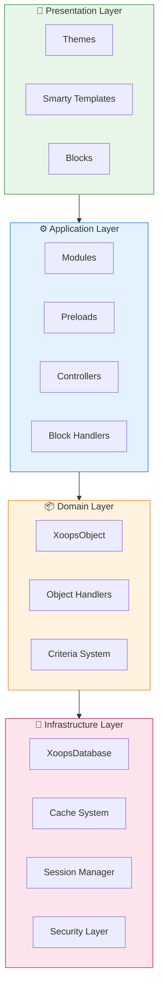
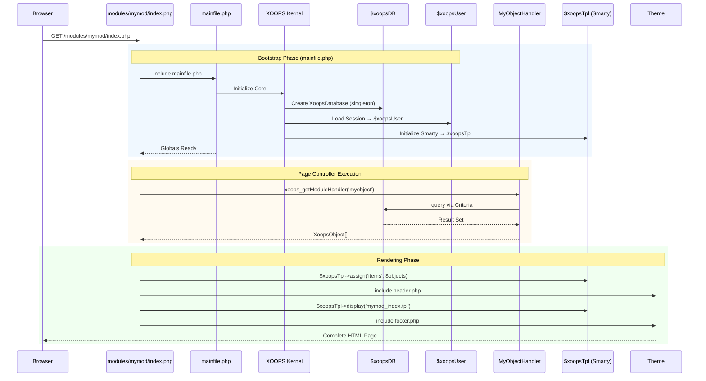

:::note[Σχετικά με αυτό το έγγραφο]
Αυτή η σελίδα περιγράφει την **εννοιολογική αρχιτεκτονική** του XOOPS που ισχύει τόσο για την τρέχουσα (2.5.x) όσο και για τις μελλοντικές (4.0.x) εκδόσεις. Ορισμένα διαγράμματα δείχνουν το πολυεπίπεδο όραμα σχεδιασμού.

**Για λεπτομέρειες σχετικά με την έκδοση:**
- **XOOPS 2.5.x Σήμερα:** Χρησιμοποιεί `mainfile.php `, καθολικά (`$xoopsDB `, `$xoopsUser`), προφορτώσεις και μοτίβο χειριστή
- **XOOPS 4.0 Στόχος:** PSR-15 ενδιάμεσο λογισμικό, κοντέινερ DI, δρομολογητής - δείτε [Χάρτης πορείας](../../07-XOOPS-4.0/XOOPS-4.0-Roadmap.md)
:::

Αυτό το έγγραφο παρέχει μια ολοκληρωμένη επισκόπηση της αρχιτεκτονικής του συστήματος XOOPS, εξηγώντας πώς συνεργάζονται τα διάφορα στοιχεία για τη δημιουργία ενός ευέλικτου και επεκτάσιμου συστήματος διαχείρισης περιεχομένου.

## Επισκόπηση

Το XOOPS ακολουθεί μια αρθρωτή αρχιτεκτονική που διαχωρίζει τις ανησυχίες σε διακριτά επίπεδα. Το σύστημα βασίζεται σε πολλές βασικές αρχές:

- **Modularity**: Η λειτουργικότητα είναι οργανωμένη σε ανεξάρτητες μονάδες που μπορούν να εγκατασταθούν
- **Επεκτασιμότητα**: Το σύστημα μπορεί να επεκταθεί χωρίς τροποποίηση του βασικού κώδικα
- **Αφαίρεση**: Τα επίπεδα βάσης δεδομένων και παρουσίασης αφαιρούνται από την επιχειρηματική λογική
- **Ασφάλεια**: Οι ενσωματωμένοι μηχανισμοί ασφαλείας προστατεύουν από κοινά τρωτά σημεία

## Επίπεδα συστήματος



## # 1. Επίπεδο παρουσίασης

Το επίπεδο παρουσίασης χειρίζεται την απόδοση της διεπαφής χρήστη χρησιμοποιώντας τη μηχανή προτύπων Smarty.

**Βασικά συστατικά:**
- **Θέματα**: Οπτικό στυλ και διάταξη
- **Smarty Templates**: Δυναμική απόδοση περιεχομένου
- **Μπλοκ**: Επαναχρησιμοποιήσιμα γραφικά στοιχεία περιεχομένου

## # 2. Επίπεδο εφαρμογής

Το επίπεδο εφαρμογής περιέχει επιχειρηματική λογική, ελεγκτές και λειτουργικότητα μονάδας.

**Βασικά συστατικά:**
- **Ενότητες**: Αυτοτελή πακέτα λειτουργιών
- **Handlers**: Κατηγορίες χειρισμού δεδομένων
- **Προφορτώσεις**: Ακροατές εκδηλώσεων και αγκίστρια

## # 3. Επίπεδο τομέα

Το επίπεδο τομέα περιέχει βασικά επιχειρηματικά αντικείμενα και κανόνες.

**Βασικά συστατικά:**
- **XoopsObject**: Βασική κλάση για όλα τα αντικείμενα τομέα
- **Handlers**: CRUD λειτουργίες για αντικείμενα τομέα

## # 4. Επίπεδο υποδομής

Το επίπεδο υποδομής παρέχει βασικές υπηρεσίες, όπως πρόσβαση στη βάση δεδομένων και προσωρινή αποθήκευση.

## Αίτημα Κύκλου Ζωής

Η κατανόηση του κύκλου ζωής του αιτήματος είναι ζωτικής σημασίας για την αποτελεσματική ανάπτυξη του XOOPS.

## # XOOPS 2.5.x Ροή ελεγκτή σελίδας

Το τρέχον XOOPS 2.5.x χρησιμοποιεί ένα μοτίβο **Page Controller** όπου κάθε αρχείο PHP χειρίζεται το δικό του αίτημα. Τα καθολικά (`$xoopsDB `, `$xoopsUser `, `$xoopsTpl`, κ.λπ.) αρχικοποιούνται κατά τη διάρκεια της εκκίνησης και είναι διαθέσιμα καθ' όλη τη διάρκεια της εκτέλεσης.



## # Βασικά παγκόσμια σε 2.5.x

| Παγκόσμια | Τύπος | Αρχικοποιήθηκε | Σκοπός |
|--------|------|-------------|---------|
| `$xoopsDB ` | ` XoopsDatabase` | Bootstrap | Σύνδεση βάσης δεδομένων (singleton) |
| `$xoopsUser ` | ` XoopsUser\|null` | Φόρτωση συνεδρίας | Τρέχων συνδεδεμένος χρήστης |
| `$xoopsTpl ` | ` XoopsTpl` | Πρότυπο init | Έξυπνη μηχανή προτύπων |
| `$xoopsModule ` | ` XoopsModule` | Φορτίο μονάδας | Τρέχον πλαίσιο ενότητας |
| `$xoopsConfig ` | ` array` | Φόρτωση διαμόρφωσης | Διαμόρφωση συστήματος |

:::σημείωση[XOOPS 4.0 Σύγκριση]
Στο XOOPS 4.0, το μοτίβο του Ελεγκτή σελίδας αντικαθίσταται από **PSR-15 Middleware Pipeline** και αποστολή που βασίζεται σε δρομολογητή. Τα παγκόσμια αντικαθίστανται με ένεση εξάρτησης. Ανατρέξτε στο [Hybrid Mode Contract](../../07-XOOPS-4.0/Specifications/Hybrid-Mode-Contract.md) για εγγυήσεις συμβατότητας κατά τη μετεγκατάσταση.
:::

## # 1. Φάση εκκίνησης

```php
// mainfile.php is the entry point
include_once XOOPS_ROOT_PATH . '/mainfile.php';

// Core initialization
$xoops = Xoops::getInstance();
$xoops->boot();
```

**Βήματα:**
1. Διαμόρφωση φορτίου (`mainfile.php`)
2. Εκκινήστε την αυτόματη φόρτωση
3. Ρυθμίστε τη διαχείριση σφαλμάτων
4. Δημιουργήστε σύνδεση βάσης δεδομένων
5. Φόρτωση συνεδρίας χρήστη
6. Αρχικοποιήστε τη μηχανή προτύπων Smarty

## # 2. Φάση δρομολόγησης

```php
// Request routing to appropriate module
$module = $GLOBALS['xoopsModule'];
$controller = $module->getController();
$controller->dispatch($request);
```

**Βήματα:**
1. Ανάλυση αιτήματος URL
2. Προσδιορίστε τη μονάδα προορισμού
3. Φορτώστε τη διαμόρφωση της μονάδας
4. Ελέγξτε τα δικαιώματα
5. Περάστε στον κατάλληλο χειριστή

## # 3. Φάση εκτέλεσης

```php
// Controller execution
$data = $handler->getObjects($criteria);
$xoopsTpl->assign('items', $data);
```

**Βήματα:**
1. Εκτελέστε τη λογική του ελεγκτή
2. Αλληλεπίδραση με το επίπεδο δεδομένων
3. Επεξεργαστείτε τους επιχειρηματικούς κανόνες
4. Προετοιμάστε δεδομένα προβολής

## # 4. Φάση απόδοσης

```php
// Template rendering
include XOOPS_ROOT_PATH . '/header.php';
$xoopsTpl->display('db:module_template.tpl');
include XOOPS_ROOT_PATH . '/footer.php';
```

**Βήματα:**
1. Εφαρμογή διάταξης θέματος
2. Render module template
3. Μπλοκ διεργασιών
4. Απόκριση εξόδου

## Βασικά εξαρτήματα

## # XoopsObject

Η βασική κλάση για όλα τα αντικείμενα δεδομένων στο XOOPS.

```php
<?php
class MyModuleItem extends XoopsObject
{
    public function __construct()
    {
        $this->initVar('id', XOBJ_DTYPE_INT, null, false);
        $this->initVar('title', XOBJ_DTYPE_TXTBOX, '', true, 255);
        $this->initVar('content', XOBJ_DTYPE_TXTAREA, '', false);
        $this->initVar('created', XOBJ_DTYPE_INT, time(), false);
    }
}
```

**Βασικές μέθοδοι:**
- `initVar()` - Ορισμός ιδιοτήτων αντικειμένου
- `getVar()` - Ανάκτηση τιμών ιδιοτήτων
- `setVar()` - Ορισμός τιμών ιδιοτήτων
- `assignVars()` - Μαζική ανάθεση από πίνακα

## # XoopsPersistableObjectHandler

Χειρίζεται λειτουργίες CRUD για παρουσίες XoopsObject.

```php
<?php
class MyModuleItemHandler extends XoopsPersistableObjectHandler
{
    public function __construct(\XoopsDatabase $db)
    {
        parent::__construct($db, 'mymodule_items', 'MyModuleItem', 'id', 'title');
    }

    public function getActiveItems($limit = 10)
    {
        $criteria = new CriteriaCompo();
        $criteria->add(new Criteria('status', 1));
        $criteria->setSort('created');
        $criteria->setOrder('DESC');
        $criteria->setLimit($limit);

        return $this->getObjects($criteria);
    }
}
```

**Βασικές μέθοδοι:**
- `create()` - Δημιουργία νέου στιγμιότυπου αντικειμένου
- `get()` - Ανάκτηση αντικειμένου με αναγνωριστικό
- `insert()` - Αποθήκευση αντικειμένου στη βάση δεδομένων
- `delete()` - Αφαίρεση αντικειμένου από τη βάση δεδομένων
- `getObjects()` - Ανάκτηση πολλών αντικειμένων
- `getCount()` - Καταμέτρηση αντικειμένων που ταιριάζουν

## # Δομή ενότητας

Κάθε ενότητα XOOPS ακολουθεί μια τυπική δομή καταλόγου:

```
modules/mymodule/
├── class/                  # PHP classes
│   ├── MyModuleItem.php
│   └── MyModuleItemHandler.php
├── include/                # Include files
│   ├── common.php
│   └── functions.php
├── templates/              # Smarty templates
│   ├── mymodule_index.tpl
│   └── mymodule_item.tpl
├── admin/                  # Admin area
│   ├── index.php
│   └── menu.php
├── language/               # Translations
│   └── english/
│       ├── main.php
│       └── modinfo.php
├── sql/                    # Database schema
│   └── mysql.sql
├── xoops_version.php       # Module info
├── index.php               # Module entry
└── header.php              # Module header
```

## Δοχείο έγχυσης εξάρτησης

Η σύγχρονη ανάπτυξη XOOPS μπορεί να αξιοποιήσει την έγχυση εξάρτησης για καλύτερη δυνατότητα δοκιμής.

## # Βασική υλοποίηση κοντέινερ

```php
<?php
class XoopsDependencyContainer
{
    private array $services = [];

    public function register(string $name, callable $factory): void
    {
        $this->services[$name] = $factory;
    }

    public function resolve(string $name): mixed
    {
        if (!isset($this->services[$name])) {
            throw new \InvalidArgumentException("Service not found: $name");
        }

        $factory = $this->services[$name];

        if (is_callable($factory)) {
            return $factory($this);
        }

        return $factory;
    }

    public function has(string $name): bool
    {
        return isset($this->services[$name]);
    }
}
```

## # PSR-11 Συμβατό δοχείο

```php
<?php
namespace Xmf\Di;

use Psr\Container\ContainerInterface;

class BasicContainer implements ContainerInterface
{
    protected array $definitions = [];

    public function set(string $id, mixed $value): void
    {
        $this->definitions[$id] = $value;
    }

    public function get(string $id): mixed
    {
        if (!$this->has($id)) {
            throw new \InvalidArgumentException("Service not found: $id");
        }

        $entry = $this->definitions[$id];

        if (is_callable($entry)) {
            return $entry($this);
        }

        return $entry;
    }

    public function has(string $id): bool
    {
        return isset($this->definitions[$id]);
    }
}
```

## # Παράδειγμα χρήσης

```php
<?php
// Service registration
$container = new XoopsDependencyContainer();

$container->register('database', function () {
    return XoopsDatabaseFactory::getDatabaseConnection();
});

$container->register('userHandler', function ($c) {
    return new XoopsUserHandler($c->resolve('database'));
});

// Service resolution
$userHandler = $container->resolve('userHandler');
$user = $userHandler->get($userId);
```

## Σημεία επέκτασης

Το XOOPS παρέχει διάφορους μηχανισμούς επέκτασης:

## # 1. Προφορτώσεις

Οι προφορτώσεις επιτρέπουν στις ενότητες να συνδεθούν με βασικά συμβάντα.

```php
<?php
// modules/mymodule/preloads/core.php
class MymoduleCorePreload extends XoopsPreloadItem
{
    public static function eventCoreHeaderEnd($args)
    {
        // Execute when header processing ends
    }

    public static function eventCoreFooterStart($args)
    {
        // Execute when footer processing starts
    }
}
```

## # 2. Πρόσθετα

Τα πρόσθετα επεκτείνουν συγκεκριμένες λειτουργίες εντός των μονάδων.

```php
<?php
// modules/mymodule/plugins/notify.php
class MymoduleNotifyPlugin
{
    public function onItemCreate($item)
    {
        // Send notification when item is created
    }
}
```

## # 3. Φίλτρα

Τα φίλτρα τροποποιούν τα δεδομένα καθώς περνούν μέσα από το σύστημα.

```php
<?php
// Content filter example
$myts = MyTextSanitizer::getInstance();
$content = $myts->displayTarea($rawContent, 1, 1, 1);
```

## Βέλτιστες πρακτικές

## # Οργανισμός κώδικα

1. **Χρησιμοποιήστε χώρους ονομάτων** για νέο κωδικό:
   
```php
   namespace XoopsModules\MyModule;

   class Item extends \XoopsObject
   {
       // Implementation
   }
   
```

2. **Ακολουθήστε PSR-4 αυτόματη φόρτωση**:
   
```json
   {
       "autoload": {
           "psr-4": {
               "XoopsModules\\MyModule\\": "class/"
           }
       }
   }
   
```

3. **Ξεχωριστές ανησυχίες**:
   - Λογική τομέα σε `class/`
   - Παρουσίαση στο `templates/`
   - Ελεγκτές στη ρίζα της μονάδας

## # Απόδοση

1. **Χρησιμοποιήστε προσωρινή αποθήκευση** για ακριβές λειτουργίες
2. **Τεμπέλης φόρτωση** πόρων όταν είναι δυνατόν
3. **Ελαχιστοποιήστε τα ερωτήματα της βάσης δεδομένων** χρησιμοποιώντας ομαδοποίηση κριτηρίων
4. **Βελτιστοποιήστε τα πρότυπα** αποφεύγοντας τη σύνθετη λογική

## # Ασφάλεια

1. **Επικυρώστε όλες τις εισόδους** χρησιμοποιώντας το `XMF\Request`
2. **Εξόδου διαφυγής** σε πρότυπα
3. **Χρησιμοποιήστε έτοιμες δηλώσεις** για ερωτήματα βάσης δεδομένων
4. **Ελέγξτε τα δικαιώματα** πριν από ευαίσθητες λειτουργίες

## Σχετική τεκμηρίωση

- [Design-Patterns](Design-Patterns.md) - Σχεδιαστικά μοτίβα που χρησιμοποιούνται στο XOOPS
- [Επίπεδο βάσης δεδομένων](../Database/Database-Layer.md) - Λεπτομέρειες αφαίρεσης βάσης δεδομένων
- [Smarty Basics](../Templates/Smarty-Basics.md) - Τεκμηρίωση συστήματος προτύπων
- [Βέλτιστες πρακτικές ασφαλείας](../Security/Security-Best-Practices.md) - Οδηγίες ασφαλείας

---

# XOOPS #architecture #core #design #system-design
