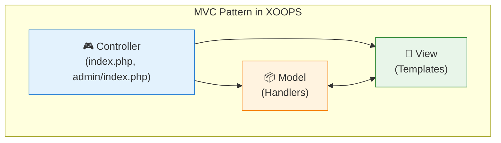

<span class="version-badge version-25x">2.5.x ✅</span> <span class="version-badge version-40x">4.0.x ✅</span>

Τα μοτίβα σχεδίασης είναι επαναχρησιμοποιήσιμες λύσεις σε κοινά προβλήματα σχεδιασμού λογισμικού. Το XOOPS χρησιμοποιεί πολλά καθιερωμένα μοτίβα που βοηθούν στη διατήρηση της ποιότητας του κώδικα, στη βελτίωση της δυνατότητας δοκιμής και στη βελτίωση της ευελιξίας του συστήματος.

:::note[Γρήγορη Επιλογή Μοτίβου]
Δεν είστε σίγουροι ποιο μοτίβο να χρησιμοποιήσετε; Δείτε:
- [Επιλογή μοτίβου πρόσβασης δεδομένων](../../03-Module-Development/Choosing-Data-Access-Pattern.md) — χειριστές έναντι αποθετηρίου έναντι υπηρεσίας έναντι CQRS
- [Επιλογή συστήματος συμβάντων](../Choosing-Event-System.md) — προφορτώσεις έναντι PSR-14 συμβάντων
:::

## Επισκόπηση

Η κατανόηση και η σωστή εφαρμογή μοτίβων σχεδίασης είναι ζωτικής σημασίας για τη δημιουργία συντηρήσιμων μονάδων XOOPS. Αυτός ο οδηγός καλύπτει τα πιο συχνά χρησιμοποιούμενα μοτίβα στην ανάπτυξη XOOPS.

| Μοτίβο | Σκοπός | Περιπτώσεις κοινής χρήσης |
|---------|---------|------------------|
| MVC | Διαχωρισμός ανησυχιών | Δομή ενότητας |
| Σίνγκλετον | Εγγύηση μίας περίπτωσης | Συνδέσεις βάσεων δεδομένων |
| Εργοστάσιο | Αφαίρεση δημιουργίας αντικειμένων | Χειριστές, βάση δεδομένων |
| Παρατηρητής | Ειδοποίηση εκδήλωσης | Προφορτώσεις, ειδοποιήσεις |
| Διακοσμητής | Επέκταση δυναμικής συμπεριφοράς | Στοιχεία φόρμας, φίλτρα |
| Στρατηγική | Ανταλλαγή αλγορίθμων | Έλεγχος ταυτότητας, επικύρωση |
| Προσαρμογέας | Συμβατότητα διεπαφής | Ενσωμάτωση κώδικα παλαιού τύπου |
| Αποθετήριο | Αφαίρεση πρόσβασης δεδομένων | Εμμονή δεδομένων |

## Model-View-Controller (MVC)

Το μοτίβο MVC διαχωρίζει μια εφαρμογή σε τρία διασυνδεδεμένα στοιχεία, καθιστώντας τη βάση κώδικα πιο οργανωμένη και ελεγχόμενη.

## # Αρχιτεκτονική



## # Μοντέλο (Επίπεδο δεδομένων)

```php
<?php
namespace XoopsModules\MyModule;

class Article extends \XoopsObject
{
    public function __construct()
    {
        $this->initVar('article_id', XOBJ_DTYPE_INT, null, false);
        $this->initVar('title', XOBJ_DTYPE_TXTBOX, '', true, 255);
        $this->initVar('content', XOBJ_DTYPE_TXTAREA, '', true);
        $this->initVar('author_id', XOBJ_DTYPE_INT, 0, true);
        $this->initVar('status', XOBJ_DTYPE_INT, 1, false);
        $this->initVar('created', XOBJ_DTYPE_INT, time(), false);
        $this->initVar('modified', XOBJ_DTYPE_INT, time(), false);
    }

    public function isPublished(): bool
    {
        return $this->getVar('status') === 1;
    }

    public function getFormattedDate(): string
    {
        return formatTimestamp($this->getVar('created'));
    }
}

class ArticleHandler extends \XoopsPersistableObjectHandler
{
    public function __construct(\XoopsDatabase $db)
    {
        parent::__construct($db, 'mymodule_articles', Article::class, 'article_id', 'title');
    }

    public function getPublishedArticles(int $limit = 10): array
    {
        $criteria = new \CriteriaCompo();
        $criteria->add(new \Criteria('status', 1));
        $criteria->setSort('created');
        $criteria->setOrder('DESC');
        $criteria->setLimit($limit);

        return $this->getObjects($criteria);
    }
}
```

## # Προβολή (Επίπεδο παρουσίασης)

```smarty
{* templates/article_list.tpl *}
<div class="article-list">
    <h2>{$smarty.const._MD_MYMODULE_ARTICLES}</h2>

    {foreach from=$articles item=article}
        <article class="article-item">
            <h3>
                <a href="{$xoops_url}/modules/mymodule/article.php?id={$article.article_id}">
                    {$article.title|escape}
                </a>
            </h3>
            <p class="meta">
                {$smarty.const._MD_MYMODULE_POSTED}: {$article.formatted_date}
            </p>
            <div class="content">
                {$article.content|truncate:200}
            </div>
        </article>
    {/foreach}
</div>
```

## # Ελεγκτής (Λογικό Επίπεδο)

```php
<?php
// index.php
require_once dirname(__DIR__, 2) . '/mainfile.php';

use XoopsModules\MyModule\Helper;

$helper = Helper::getInstance();
$articleHandler = $helper->getHandler('Article');

// Get action from request
$op = \Xmf\Request::getString('op', 'list');

switch ($op) {
    case 'view':
        $articleId = \Xmf\Request::getInt('id', 0);
        $article = $articleHandler->get($articleId);

        if (!$article) {
            redirect_header(XOOPS_URL, 3, _MD_MYMODULE_NOT_FOUND);
        }

        $GLOBALS['xoopsOption']['template_main'] = 'mymodule_article_view.tpl';
        require_once XOOPS_ROOT_PATH . '/header.php';

        $xoopsTpl->assign('article', $article->toArray());
        break;

    case 'list':
    default:
        $articles = $articleHandler->getPublishedArticles(10);

        $GLOBALS['xoopsOption']['template_main'] = 'mymodule_article_list.tpl';
        require_once XOOPS_ROOT_PATH . '/header.php';

        $xoopsTpl->assign('articles', array_map(fn($a) => $a->toArray(), $articles));
        break;
}

require_once XOOPS_ROOT_PATH . '/footer.php';
```

## Μοτίβο Singleton

Το μοτίβο Singleton διασφαλίζει ότι μια κλάση έχει μόνο μία παρουσία και παρέχει καθολική πρόσβαση σε αυτήν.

## # Πότε να χρησιμοποιείται

- Συνδέσεις βάσεων δεδομένων
- Διαχειριστές διαμόρφωσης
- Περιπτώσεις καταγραφικών
- Διαχειριστές κρυφής μνήμης

## # Υλοποίηση

```php
<?php
namespace XoopsModules\MyModule;

class ConfigurationManager
{
    private static ?self $instance = null;
    private array $config = [];

    private function __construct()
    {
        // Load configuration
        $this->loadConfiguration();
    }

    // Prevent cloning
    private function __clone() {}

    // Prevent unserialization
    public function __wakeup()
    {
        throw new \Exception("Cannot unserialize singleton");
    }

    public static function getInstance(): self
    {
        if (self::$instance === null) {
            self::$instance = new self();
        }

        return self::$instance;
    }

    private function loadConfiguration(): void
    {
        $helper = Helper::getInstance();
        $this->config = [
            'items_per_page' => $helper->getConfig('items_per_page', 10),
            'allow_comments' => $helper->getConfig('allow_comments', true),
            'date_format' => $helper->getConfig('date_format', 'Y-m-d'),
        ];
    }

    public function get(string $key, mixed $default = null): mixed
    {
        return $this->config[$key] ?? $default;
    }
}

// Usage
$config = ConfigurationManager::getInstance();
$itemsPerPage = $config->get('items_per_page');
```

## # XOOPS Βασικά παραδείγματα

```php
<?php
// XoopsDatabaseFactory uses Singleton pattern
$db = XoopsDatabaseFactory::getDatabaseConnection();

// XMF Module Helper uses Singleton
$helper = \Xmf\Module\Helper::getHelper('mymodule');

// Xoops main instance
$xoops = \Xoops::getInstance();
```

## Εργοστασιακό μοτίβο

Το μοτίβο Factory δημιουργεί αντικείμενα χωρίς να προσδιορίζει την ακριβή κατηγορία τους, επιτρέποντας τη δημιουργία ευέλικτων αντικειμένων.

## # Πότε να χρησιμοποιείται

- Δημιουργία χειριστών δυναμικά
- Συνδέσεις βάσεων δεδομένων για διαφορετικές βάσεις δεδομένων
- Πάροχοι ελέγχου ταυτότητας
- Δημιουργία στοιχείων φόρμας

## # Υλοποίηση

```php
<?php
namespace XoopsModules\MyModule;

interface ContentInterface
{
    public function render(): string;
}

class ArticleContent implements ContentInterface
{
    private array $data;

    public function __construct(array $data)
    {
        $this->data = $data;
    }

    public function render(): string
    {
        return "<article><h2>{$this->data['title']}</h2><p>{$this->data['body']}</p></article>";
    }
}

class NewsContent implements ContentInterface
{
    private array $data;

    public function __construct(array $data)
    {
        $this->data = $data;
    }

    public function render(): string
    {
        return "<div class='news'><h3>{$this->data['headline']}</h3><p>{$this->data['summary']}</p></div>";
    }
}

class ContentFactory
{
    public static function create(string $type, array $data): ContentInterface
    {
        return match ($type) {
            'article' => new ArticleContent($data),
            'news' => new NewsContent($data),
            default => throw new \InvalidArgumentException("Unknown content type: $type"),
        };
    }
}

// Usage
$article = ContentFactory::create('article', ['title' => 'Hello', 'body' => 'World']);
echo $article->render();
```

## # XOOPS Εργοστάσιο βάσεων δεδομένων

```php
<?php
class XoopsDatabaseFactory
{
    public static function getDatabaseConnection()
    {
        static $instance;

        if (!isset($instance)) {
            $dbType = XOOPS_DB_TYPE ?? 'mysql';
            $className = 'XoopsDatabase' . ucfirst($dbType);

            if (!class_exists($className)) {
                $file = XOOPS_ROOT_PATH . '/class/database/' . strtolower($dbType) . '.php';
                if (file_exists($file)) {
                    require_once $file;
                }
            }

            $instance = new $className();

            if (!$instance->connect()) {
                trigger_error('Unable to connect to database', E_USER_ERROR);
            }
        }

        return $instance;
    }
}
```

## Μοτίβο παρατηρητή

Το μοτίβο του Observer επιτρέπει στα αντικείμενα να ειδοποιούνται για αλλαγές στην κατάσταση ενός υποκειμένου, επιτρέποντας τη συμπεριφορά που βασίζεται σε γεγονότα.

## # Πότε να χρησιμοποιείται

- Χειρισμός εκδηλώσεων
- Συστήματα ειδοποιήσεων
- Αρχιτεκτονικές προσθηκών
- Καταγραφή και έλεγχος

## # Υλοποίηση

```php
<?php
namespace XoopsModules\MyModule;

interface ObserverInterface
{
    public function update(string $event, array $data): void;
}

class EventDispatcher
{
    private array $observers = [];

    public function attach(string $event, ObserverInterface $observer): void
    {
        if (!isset($this->observers[$event])) {
            $this->observers[$event] = [];
        }

        $this->observers[$event][] = $observer;
    }

    public function detach(string $event, ObserverInterface $observer): void
    {
        if (isset($this->observers[$event])) {
            $key = array_search($observer, $this->observers[$event], true);
            if ($key !== false) {
                unset($this->observers[$event][$key]);
            }
        }
    }

    public function notify(string $event, array $data = []): void
    {
        if (isset($this->observers[$event])) {
            foreach ($this->observers[$event] as $observer) {
                $observer->update($event, $data);
            }
        }
    }
}

class EmailNotifier implements ObserverInterface
{
    public function update(string $event, array $data): void
    {
        if ($event === 'article.published') {
            // Send email notification
            $this->sendEmail($data['article']);
        }
    }

    private function sendEmail($article): void
    {
        $xoopsMailer = xoops_getMailer();
        $xoopsMailer->setSubject('New Article Published: ' . $article->getVar('title'));
        $xoopsMailer->setBody('A new article has been published.');
        $xoopsMailer->send();
    }
}

// Usage
$dispatcher = new EventDispatcher();
$dispatcher->attach('article.published', new EmailNotifier());

// When article is published
$dispatcher->notify('article.published', ['article' => $article]);
```

## # XOOPS Προφορτώσεις (Υλοποίηση παρατηρητή)

```php
<?php
// modules/mymodule/preloads/core.php
class MymoduleCorePreload extends XoopsPreloadItem
{
    public static function eventCoreIncludeCommonEnd($args)
    {
        // React to core common include completing
        $GLOBALS['xoopsLogger']->addExtra('MyModule', 'Initialized');
    }

    public static function eventCoreHeaderEnd($args)
    {
        // Add custom headers
        $GLOBALS['xoTheme']->addStylesheet('modules/mymodule/assets/css/custom.css');
    }

    public static function eventCoreFooterStart($args)
    {
        // Execute before footer renders
    }
}
```

## Μοτίβο διακοσμητή

Το μοτίβο Decorator προσθέτει συμπεριφορά σε αντικείμενα δυναμικά χωρίς να επηρεάζει άλλα αντικείμενα της ίδιας κλάσης.

## # Πότε να χρησιμοποιείται

- Προσαρμογή στοιχείων φόρμας
- Μορφοποίηση εξόδου
- Έλεγχος άδειας
- Αποθήκευση στρωμάτων

## # Υλοποίηση

```php
<?php
namespace XoopsModules\MyModule;

interface FormElementInterface
{
    public function render(): string;
}

class TextInput implements FormElementInterface
{
    private string $name;
    private string $value;

    public function __construct(string $name, string $value = '')
    {
        $this->name = $name;
        $this->value = $value;
    }

    public function render(): string
    {
        return sprintf(
            '<input type="text" name="%s" value="%s">',
            htmlspecialchars($this->name),
            htmlspecialchars($this->value)
        );
    }
}

abstract class FormElementDecorator implements FormElementInterface
{
    protected FormElementInterface $element;

    public function __construct(FormElementInterface $element)
    {
        $this->element = $element;
    }

    public function render(): string
    {
        return $this->element->render();
    }
}

class RequiredDecorator extends FormElementDecorator
{
    public function render(): string
    {
        return $this->element->render() . '<span class="required">*</span>';
    }
}

class LabelDecorator extends FormElementDecorator
{
    private string $label;

    public function __construct(FormElementInterface $element, string $label)
    {
        parent::__construct($element);
        $this->label = $label;
    }

    public function render(): string
    {
        return sprintf(
            '<label>%s</label>%s',
            htmlspecialchars($this->label),
            $this->element->render()
        );
    }
}

class HelpTextDecorator extends FormElementDecorator
{
    private string $helpText;

    public function __construct(FormElementInterface $element, string $helpText)
    {
        parent::__construct($element);
        $this->helpText = $helpText;
    }

    public function render(): string
    {
        return $this->element->render() . sprintf(
            '<small class="help-text">%s</small>',
            htmlspecialchars($this->helpText)
        );
    }
}

// Usage - decorators can be stacked
$input = new TextInput('username');
$input = new RequiredDecorator($input);
$input = new LabelDecorator($input, 'Username');
$input = new HelpTextDecorator($input, 'Enter your username');

echo $input->render();
// Output: <label>Username</label><input type="text" name="username" value=""><span class="required">*</span><small class="help-text">Enter your username</small>
```

## Μοτίβο στρατηγικής

Το μοτίβο στρατηγικής ορίζει μια οικογένεια αλγορίθμων, ενσωματώνει τον καθένα και τους κάνει εναλλάξιμους.

## # Πότε να χρησιμοποιείται

- Πολλαπλές μέθοδοι ελέγχου ταυτότητας
- Διαφορετικοί αλγόριθμοι ταξινόμησης
- Διάφορες μορφές εξαγωγής
- Ευέλικτοι κανόνες επικύρωσης

## # Υλοποίηση

```php
<?php
namespace XoopsModules\MyModule;

interface AuthStrategyInterface
{
    public function authenticate(string $username, string $password): bool;
}

class DatabaseAuthStrategy implements AuthStrategyInterface
{
    public function authenticate(string $username, string $password): bool
    {
        $memberHandler = xoops_getHandler('member');
        $user = $memberHandler->loginUser($username, $password);

        return $user !== false;
    }
}

class LdapAuthStrategy implements AuthStrategyInterface
{
    private string $ldapHost;
    private int $ldapPort;

    public function __construct(string $host, int $port = 389)
    {
        $this->ldapHost = $host;
        $this->ldapPort = $port;
    }

    public function authenticate(string $username, string $password): bool
    {
        $ldap = ldap_connect($this->ldapHost, $this->ldapPort);

        if (!$ldap) {
            return false;
        }

        $bind = @ldap_bind($ldap, "uid=$username,ou=users,dc=example,dc=com", $password);

        ldap_close($ldap);

        return $bind;
    }
}

class AuthService
{
    private AuthStrategyInterface $strategy;

    public function __construct(AuthStrategyInterface $strategy)
    {
        $this->strategy = $strategy;
    }

    public function setStrategy(AuthStrategyInterface $strategy): void
    {
        $this->strategy = $strategy;
    }

    public function login(string $username, string $password): bool
    {
        return $this->strategy->authenticate($username, $password);
    }
}

// Usage
$authService = new AuthService(new DatabaseAuthStrategy());

// Can switch strategies at runtime
if ($useLdap) {
    $authService->setStrategy(new LdapAuthStrategy('ldap.example.com'));
}

$authenticated = $authService->login($username, $password);
```

## Μοτίβο αποθετηρίου

Το μοτίβο αποθετηρίου παρέχει ένα επίπεδο αφαίρεσης μεταξύ της λογικής πρόσβασης δεδομένων και της επιχειρηματικής λογικής.

## # Πότε να χρησιμοποιείται

- Σύνθετες απαιτήσεις πρόσβασης σε δεδομένα
- Πολλαπλές πηγές δεδομένων
- Δοκιμάσιμα επίπεδα δεδομένων
- Σχεδιασμός βάσει τομέα

## # Υλοποίηση

```php
<?php
namespace XoopsModules\MyModule\Repository;

use XoopsModules\MyModule\Entity\Article;

interface ArticleRepositoryInterface
{
    public function find(int $id): ?Article;
    public function findBySlug(string $slug): ?Article;
    public function findPublished(int $limit = 10, int $offset = 0): array;
    public function save(Article $article): bool;
    public function delete(Article $article): bool;
}

class ArticleRepository implements ArticleRepositoryInterface
{
    private \XoopsPersistableObjectHandler $handler;

    public function __construct(\XoopsPersistableObjectHandler $handler)
    {
        $this->handler = $handler;
    }

    public function find(int $id): ?Article
    {
        $obj = $this->handler->get($id);
        return $obj ?: null;
    }

    public function findBySlug(string $slug): ?Article
    {
        $criteria = new \Criteria('slug', $slug);
        $objects = $this->handler->getObjects($criteria);

        return !empty($objects) ? $objects[0] : null;
    }

    public function findPublished(int $limit = 10, int $offset = 0): array
    {
        $criteria = new \CriteriaCompo();
        $criteria->add(new \Criteria('status', 'published'));
        $criteria->setSort('published_at');
        $criteria->setOrder('DESC');
        $criteria->setLimit($limit);
        $criteria->setStart($offset);

        return $this->handler->getObjects($criteria);
    }

    public function save(Article $article): bool
    {
        return $this->handler->insert($article);
    }

    public function delete(Article $article): bool
    {
        return $this->handler->delete($article);
    }
}
```

## Έγχυση εξάρτησης

Το Dependency Injection (DI) επιτρέπει στα αντικείμενα να κατασκευάζονται με τις εξαρτήσεις τους αντί να τα δημιουργούν εσωτερικά.

## # Οφέλη

- Βελτιωμένη δυνατότητα δοκιμής
- Χαλαρή σύζευξη
- Ευέλικτη διαμόρφωση
- Καλύτερη οργάνωση κώδικα

## # Υλοποίηση

```php
<?php
namespace XoopsModules\MyModule;

class ArticleService
{
    private Repository\ArticleRepositoryInterface $repository;
    private CacheInterface $cache;
    private LoggerInterface $logger;

    public function __construct(
        Repository\ArticleRepositoryInterface $repository,
        CacheInterface $cache,
        LoggerInterface $logger
    ) {
        $this->repository = $repository;
        $this->cache = $cache;
        $this->logger = $logger;
    }

    public function getArticle(int $id): ?Entity\Article
    {
        $cacheKey = "article_{$id}";

        // Try cache first
        if ($this->cache->has($cacheKey)) {
            $this->logger->debug("Article {$id} loaded from cache");
            return $this->cache->get($cacheKey);
        }

        // Load from repository
        $article = $this->repository->find($id);

        if ($article) {
            $this->cache->set($cacheKey, $article, 3600);
            $this->logger->debug("Article {$id} loaded from database");
        }

        return $article;
    }
}

// Service container setup
$container = new DependencyContainer();

$container->register('db', fn() => XoopsDatabaseFactory::getDatabaseConnection());

$container->register('articleHandler', fn($c) =>
    new ArticleHandler($c->resolve('db'))
);

$container->register('articleRepository', fn($c) =>
    new Repository\ArticleRepository($c->resolve('articleHandler'))
);

$container->register('cache', fn() => new FileCache(XOOPS_VAR_PATH . '/caches'));

$container->register('logger', fn() => new XoopsLogger());

$container->register('articleService', fn($c) =>
    new ArticleService(
        $c->resolve('articleRepository'),
        $c->resolve('cache'),
        $c->resolve('logger')
    )
);

// Usage
$articleService = $container->resolve('articleService');
$article = $articleService->getArticle(1);
```

## Βέλτιστες πρακτικές

## # Οδηγίες επιλογής μοτίβων

1. **Επιλέξτε μοτίβα με βάση τις πραγματικές ανάγκες**, όχι τις αναμενόμενες
2. **Διατηρήστε απλές τις υλοποιήσεις** - μην κάνετε υπερβολική μηχανική
3. **Χρήση προτύπων εγγράφων** για την κατανόηση της ομάδας
4. **Συνδυάστε μοτίβα** όταν χρειάζεται (π.χ. Factory + Singleton)
5. **Λάβετε υπόψη τη δυνατότητα δοκιμής** όταν επιλέγετε μοτίβα

## # Συνήθη αντι-μοτίβα προς αποφυγή

| Αντι-μοτίβο | Πρόβλημα | Λύση |
|--------------|---------|----------|
| Αντικείμενο Θεού | Η τάξη κάνει πάρα πολλά | Ενιαία Ευθύνη |
| Κωδικός Σπαγγέτι | Χωρίς σαφή δομή | Χρησιμοποιήστε το μοτίβο MVC |
| Αντιγραφή-Επικόλληση | Αντιγραφή κώδικα | Εξαγωγή κοινού κωδικού |
| Μαγικοί Αριθμοί | Ασαφείς σταθερές | Χρησιμοποιήστε επώνυμες σταθερές |
| Σφιχτός σύνδεσμος | Δύσκολο να test/maintain | Χρήση Έγχυσης Εξάρτησης |

## # Μοτίβα δοκιμής

```php
<?php
// Unit testing with dependency injection
class ArticleServiceTest extends \PHPUnit\Framework\TestCase
{
    private $repository;
    private $cache;
    private $logger;
    private $service;

    protected function setUp(): void
    {
        $this->repository = $this->createMock(ArticleRepositoryInterface::class);
        $this->cache = $this->createMock(CacheInterface::class);
        $this->logger = $this->createMock(LoggerInterface::class);

        $this->service = new ArticleService(
            $this->repository,
            $this->cache,
            $this->logger
        );
    }

    public function testGetArticleFromCache(): void
    {
        $article = new Article();
        $article->setVar('article_id', 1);

        $this->cache->expects($this->once())
            ->method('has')
            ->with('article_1')
            ->willReturn(true);

        $this->cache->expects($this->once())
            ->method('get')
            ->with('article_1')
            ->willReturn($article);

        $result = $this->service->getArticle(1);

        $this->assertSame($article, $result);
    }
}
```

## Σχετική τεκμηρίωση

- [XOOPS-Architecture](XOOPS-Architecture.md) - Συνολική αρχιτεκτονική συστήματος
- [Επίπεδο βάσης δεδομένων](../Database/Database-Layer.md) - Μοτίβα επιμονής δεδομένων
- [Βέλτιστες πρακτικές ασφαλείας](../Security/Security-Best-Practices.md) - Ασφαλής εφαρμογή προτύπων

---

# XOOPS #design-patterns #architecture #mvc #singleton #factory #observer
