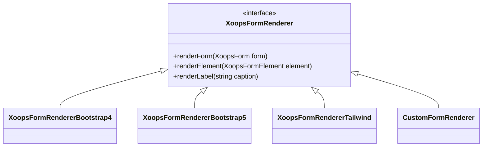

## Επισκόπηση

Το XOOPS επιτρέπει την προσαρμογή της απόδοσης φόρμας μέσω προσαρμοσμένων renderers. Αυτό επιτρέπει το στυλ για συγκεκριμένο θέμα, τις βελτιώσεις προσβασιμότητας και την ενοποίηση με πλαίσια frontend όπως το Bootstrap ή το Tailwind CSS.

## Προεπιλεγμένη απόδοση

Από προεπιλογή, οι φόρμες XOOPS χρησιμοποιούν την κλάση `XoopsFormRenderer` η οποία εξάγει το βασικό HTML:

```php
// Default rendering
$form = new XoopsThemeForm('My Form', 'myform', 'submit.php');
$form->addElement(new XoopsFormText('Name', 'name', 50, 255));
echo $form->render();
```

## Αρχιτεκτονική προσαρμοσμένης απόδοσης



## Δημιουργία προσαρμοσμένης απόδοσης

## # Βασική Κατηγορία Renderer

```php
namespace Xoops\Modules\MyModule\Form;

use XoopsFormRenderer;
use XoopsForm;
use XoopsFormElement;

class BootstrapRenderer extends XoopsFormRenderer
{
    public function renderFormStart(XoopsForm $form): string
    {
        $class = $form->getExtra() ?: 'needs-validation';
        return sprintf(
            '<form name="%s" id="%s" action="%s" method="%s" class="%s" %s>',
            $form->getName(),
            $form->getName(),
            $form->getAction(),
            $form->getMethod(),
            $class,
            $form->getExtra()
        );
    }

    public function renderFormEnd(): string
    {
        return '</form>';
    }

    public function renderElement(XoopsFormElement $element): string
    {
        $output = '<div class="mb-3">';

        // Label
        if ($element->getCaption()) {
            $output .= sprintf(
                '<label for="%s" class="form-label">%s</label>',
                $element->getName(),
                $element->getCaption()
            );
        }

        // Element with Bootstrap classes
        $element->setExtra($element->getExtra() . ' class="form-control"');
        $output .= $element->render();

        // Description
        if ($element->getDescription()) {
            $output .= sprintf(
                '<div class="form-text">%s</div>',
                $element->getDescription()
            );
        }

        $output .= '</div>';

        return $output;
    }

    public function renderButton(XoopsFormElement $button): string
    {
        $type = $button->getType() === 'submit' ? 'btn-primary' : 'btn-secondary';
        return sprintf(
            '<button type="%s" name="%s" class="btn %s">%s</button>',
            $button->getType(),
            $button->getName(),
            $type,
            $button->getValue()
        );
    }
}
```

## # Εγγραφή του Renderer

```php
// In your module's xoops_version.php or bootstrap
$GLOBALS['xoopsOption']['form_renderer'] = new BootstrapRenderer();

// Or set it per-form
$form = new XoopsThemeForm('My Form', 'myform', 'submit.php');
$form->setRenderer(new BootstrapRenderer());
```

## Ενσωματωμένοι Renderers

## # Bootstrap 4 Renderer

```php
use Xoops\Form\Renderer\Bootstrap4Renderer;

$form->setRenderer(new Bootstrap4Renderer());
```

## # Bootstrap 5 Renderer

```php
use Xoops\Form\Renderer\Bootstrap5Renderer;

$form->setRenderer(new Bootstrap5Renderer([
    'floating_labels' => true,
    'validation_style' => 'tooltip'
]));
```

## Απόδοση συγκεκριμένων στοιχείων

## # Προσαρμοσμένη επιλογή απόδοσης

```php
public function renderSelect(XoopsFormSelect $select): string
{
    $multiple = $select->isMultiple() ? 'multiple' : '';
    $size = $select->getSize();

    $output = sprintf(
        '<select name="%s%s" id="%s" class="form-select" %s size="%d">',
        $select->getName(),
        $multiple ? '[]' : '',
        $select->getName(),
        $multiple,
        $size
    );

    foreach ($select->getOptions() as $value => $label) {
        $selected = in_array($value, (array)$select->getValue()) ? 'selected' : '';
        $output .= sprintf(
            '<option value="%s" %s>%s</option>',
            htmlspecialchars($value),
            $selected,
            htmlspecialchars($label)
        );
    }

    $output .= '</select>';

    return $output;
}
```

## # Προσαρμοσμένη απόδοση εισαγωγής αρχείων

```php
public function renderFile(XoopsFormFile $file): string
{
    return sprintf(
        '<div class="mb-3">
            <label for="%s" class="form-label">%s</label>
            <input type="file" class="form-control" id="%s" name="%s" %s>
        </div>',
        $file->getName(),
        $file->getCaption(),
        $file->getName(),
        $file->getName(),
        $file->getExtra()
    );
}
```

## Ενσωμάτωση θεμάτων

## # Στο πρότυπο θέματος

```smarty
{* In theme's form.tpl *}
{foreach $form.elements as $element}
    <div class="form-group {$element.class}">
        {if $element.caption}
            <label class="control-label">{$element.caption}</label>
        {/if}
        {$element.body}
        {if $element.description}
            <span class="help-block">{$element.description}</span>
        {/if}
    </div>
{/foreach}
```

## Βέλτιστες πρακτικές

1. **Κληρονομήστε από το βασικό renderer** - Επέκταση `XoopsFormRenderer` για συνέπεια
2. **Υποστήριξη όλων των τύπων στοιχείων** - Χειρισμός κειμένου, επιλογή, πλαίσιο ελέγχου, ραδιόφωνο κ.λπ.
3. **Προσβασιμότητα** - Συμπεριλάβετε σωστές ετικέτες, ARIA χαρακτηριστικά
4. **Στυλ επικύρωσης** - Εμφάνιση καταστάσεων σφαλμάτων κατάλληλα
5. **Σχεδίαση με απόκριση** - Βεβαιωθείτε ότι οι φόρμες λειτουργούν σε κινητά

## Σχετική τεκμηρίωση

- Επισκόπηση φορμών
- Αναφορά στοιχείων φόρμας
- Επικύρωση φόρμας
- Ανάπτυξη θεμάτων
