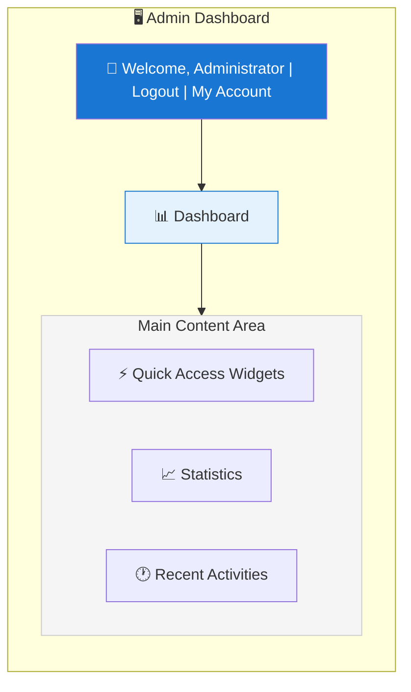
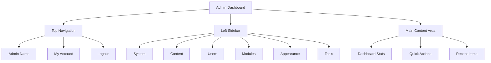

# XOOPS Επισκόπηση πίνακα διαχειριστή

Πλήρης οδηγός για την πλοήγηση και τη χρήση του πίνακα εργαλείων διαχειριστή XOOPS.

## Πρόσβαση στον Πίνακα Διαχειριστή

## # Είσοδος διαχειριστή

Ανοίξτε το πρόγραμμα περιήγησής σας και μεταβείτε σε:

```
http://your-domain.com/xoops/admin/
```

Ή αν το XOOPS είναι στη ρίζα:

```
http://your-domain.com/admin/
```

Εισαγάγετε τα διαπιστευτήρια διαχειριστή:

```
Username: [Your admin username]
Password: [Your admin password]
```

## # Μετά την είσοδο

Θα δείτε τον κύριο πίνακα ελέγχου διαχειριστή:



## Διάταξη πίνακα διαχειριστή



## Στοιχεία πίνακα ελέγχου

## # Top Bar

Η επάνω γραμμή περιέχει βασικά στοιχεία ελέγχου:

| Στοιχείο | Σκοπός |
|---|---|
| **Λογότυπο Διαχειριστή** | Κάντε κλικ για επιστροφή στον πίνακα ελέγχου |
| **Μήνυμα καλωσορίσματος** | Εμφανίζει συνδεδεμένο όνομα διαχειριστή |
| **Ο λογαριασμός μου** | Επεξεργασία προφίλ διαχειριστή και κωδικό πρόσβασης |
| **Βοήθεια** | Τεκμηρίωση πρόσβασης |
| **Αποσύνδεση** | Έξοδος από τον πίνακα διαχείρισης |

## # Αριστερή πλευρική γραμμή πλοήγησης

Κύριο μενού οργανωμένο ανά λειτουργία:

```
├── System
│   ├── Dashboard
│   ├── Preferences
│   ├── Admin Users
│   ├── Groups
│   ├── Permissions
│   ├── Modules
│   └── Tools
├── Content
│   ├── Pages
│   ├── Categories
│   ├── Comments
│   └── Media Manager
├── Users
│   ├── Users
│   ├── User Requests
│   ├── Online Users
│   └── User Groups
├── Modules
│   ├── Modules
│   ├── Module Settings
│   └── Module Updates
├── Appearance
│   ├── Themes
│   ├── Templates
│   ├── Blocks
│   └── Images
└── Tools
    ├── Maintenance
    ├── Email
    ├── Statistics
    ├── Logs
    └── Backups
```

## # Κύρια περιοχή περιεχομένου

Εμφανίζει πληροφορίες και στοιχεία ελέγχου για την επιλεγμένη ενότητα:

- Φόρμες για διαμόρφωση
- Πίνακες δεδομένων με λίστες
- Διαγράμματα και στατιστικά στοιχεία
- Κουμπιά γρήγορης δράσης
- Κείμενο βοήθειας και συμβουλές εργαλείων

## # Γραφικά στοιχεία πίνακα ελέγχου

Γρήγορη πρόσβαση σε βασικές πληροφορίες:

- **Πληροφορίες συστήματος:** PHP έκδοση, MySQL version, XOOPS version
- **Γρήγορα στατιστικά στοιχεία:** Αριθμός χρηστών, συνολικές αναρτήσεις, εγκατεστημένες ενότητες
- **Πρόσφατη δραστηριότητα:** Τελευταίες συνδέσεις, αλλαγές περιεχομένου, σφάλματα
- **Κατάσταση διακομιστή:** CPU, μνήμη, χρήση δίσκου
- **Ειδοποιήσεις:** Ειδοποιήσεις συστήματος, ενημερώσεις σε εκκρεμότητα

## Βασικές Λειτουργίες Διαχειριστή

## # Διαχείριση συστήματος

**Τοποθεσία:** Σύστημα > [Διάφορες επιλογές]

### # Προτιμήσεις

Διαμόρφωση βασικών ρυθμίσεων συστήματος:

```
System > Preferences > [Settings Category]
```

Κατηγορίες:
- Γενικές ρυθμίσεις (όνομα τοποθεσίας, ζώνη ώρας)
- Ρυθμίσεις χρήστη (εγγραφή, προφίλ)
- Ρυθμίσεις email (διαμόρφωση SMTP)
- Ρυθμίσεις προσωρινής μνήμης (επιλογές προσωρινής αποθήκευσης)
- URL Ρυθμίσεις (φιλικές διευθύνσεις URL)
- Μετα-ετικέτες (SEO ρυθμίσεις)

Δείτε Βασικές ρυθμίσεις παραμέτρων και ρυθμίσεις συστήματος.

### # Χρήστες διαχειριστή

Διαχείριση λογαριασμών διαχειριστή:

```
System > Admin Users
```

Λειτουργίες:
- Προσθήκη νέων διαχειριστών
- Επεξεργασία προφίλ διαχειριστή
- Αλλαγή κωδικών πρόσβασης διαχειριστή
- Διαγραφή λογαριασμών διαχειριστή
- Ορίστε δικαιώματα διαχειριστή

## # Διαχείριση περιεχομένου

**Τοποθεσία:** Περιεχόμενο > [Διάφορες επιλογές]

### # Pages/Articles

Διαχείριση περιεχομένου ιστότοπου:

```
Content > Pages (or your module)
```

Λειτουργίες:
- Δημιουργήστε νέες σελίδες
- Επεξεργασία υπάρχοντος περιεχομένου
- Διαγραφή σελίδων
- Publish/unpublish
- Ορίστε κατηγορίες
- Διαχείριση αναθεωρήσεων

### # Κατηγορίες

Οργάνωση περιεχομένου:

```
Content > Categories
```

Λειτουργίες:
- Δημιουργία ιεραρχίας κατηγοριών
- Επεξεργασία κατηγοριών
- Διαγραφή κατηγοριών
- Αντιστοίχιση σε σελίδες

### # Σχόλια

Εποπτεία σχολίων χρηστών:

```
Content > Comments
```

Λειτουργίες:
- Δείτε όλα τα σχόλια
- Έγκριση σχολίων
- Επεξεργασία σχολίων
- Διαγραφή ανεπιθύμητων μηνυμάτων
- Αποκλεισμός σχολιαστών

## # Διαχείριση χρηστών

**Τοποθεσία:** Χρήστες > [Διάφορες Επιλογές]

### # Χρήστες

Διαχείριση λογαριασμών χρηστών:

```
Users > Users
```

Λειτουργίες:
- Προβολή όλων των χρηστών
- Δημιουργήστε νέους χρήστες
- Επεξεργασία προφίλ χρηστών
- Διαγραφή λογαριασμών
- Επαναφορά κωδικών πρόσβασης
- Αλλαγή κατάστασης χρήστη
- Ανάθεση σε ομάδες

### # Διαδικτυακοί χρήστες

Παρακολούθηση ενεργών χρηστών:

```
Users > Online Users
```

Εμφανίζει:
- Επί του παρόντος χρήστες σε απευθείας σύνδεση
- Τελευταία ώρα δραστηριότητας
- Διεύθυνση IP
- Τοποθεσία χρήστη (αν έχει διαμορφωθεί)

### # Ομάδες χρηστών

Διαχείριση ρόλων και δικαιωμάτων χρηστών:

```
Users > Groups
```

Λειτουργίες:
- Δημιουργήστε προσαρμοσμένες ομάδες
- Ορίστε δικαιώματα ομάδας
- Αντιστοίχιση χρηστών σε ομάδες
- Διαγραφή ομάδων

## # Διαχείριση Ενοτήτων

**Τοποθεσία:** Ενότητες > [Διάφορες Επιλογές]

### # Ενότητες

Εγκαταστήστε και ρυθμίστε τις ενότητες:

```
Modules > Modules
```

Λειτουργίες:
- Προβολή εγκατεστημένων μονάδων
- Enable/disable ενότητες
- Ενημέρωση μονάδων
- Διαμορφώστε τις ρυθμίσεις της μονάδας
- Εγκαταστήστε νέες μονάδες
- Προβολή λεπτομερειών ενότητας

### # Έλεγχος για ενημερώσεις

```
Modules > Modules > Check for Updates
```

Εμφανίζει:
- Διαθέσιμες ενημερώσεις ενότητας
- Αλλαγή
- Επιλογές λήψης και εγκατάστασης

## # Διαχείριση εμφάνισης

**Τοποθεσία:** Εμφάνιση > [Διάφορες Επιλογές]

### # Θέματα

Διαχείριση θεμάτων ιστότοπου:

```
Appearance > Themes
```

Λειτουργίες:
- Προβολή εγκατεστημένων θεμάτων
- Ορισμός προεπιλεγμένου θέματος
- Ανεβάστε νέα θέματα
- Διαγραφή θεμάτων
- Προεπισκόπηση θέματος
- Διαμόρφωση θέματος

### # Μπλοκ

Διαχείριση μπλοκ περιεχομένου:

```
Appearance > Blocks
```

Λειτουργίες:
- Δημιουργήστε προσαρμοσμένα μπλοκ
- Επεξεργασία περιεχομένου μπλοκ
- Τακτοποίηση μπλοκ στη σελίδα
- Ρύθμιση ορατότητας μπλοκ
- Διαγραφή μπλοκ
- Διαμόρφωση προσωρινής αποθήκευσης μπλοκ

### # Πρότυπα

Διαχείριση προτύπων (για προχωρημένους):

```
Appearance > Templates
```

Για προχωρημένους χρήστες και προγραμματιστές.

## # Εργαλεία συστήματος

**Τοποθεσία:** Σύστημα > Εργαλεία

### # Λειτουργία συντήρησης

Αποτροπή πρόσβασης χρήστη κατά τη συντήρηση:

```
System > Maintenance Mode
```

Διαμόρφωση:
- Enable/disable συντήρηση
- Προσαρμοσμένο μήνυμα συντήρησης
- Επιτρεπόμενες διευθύνσεις IP (για δοκιμή)

### # Διαχείριση βάσεων δεδομένων

```
System > Database
```

Λειτουργίες:
- Ελέγξτε τη συνοχή της βάσης δεδομένων
- Εκτελέστε ενημερώσεις βάσης δεδομένων
- Τραπέζια επισκευής
- Βελτιστοποίηση βάσης δεδομένων
- Εξαγωγή δομής βάσης δεδομένων

### # Αρχεία καταγραφής δραστηριοτήτων

```
System > Logs
```

Παρακολούθηση:
- Δραστηριότητα χρήστη
- Διοικητικές ενέργειες
- Συμβάντα συστήματος
- Αρχεία καταγραφής σφαλμάτων

## Γρήγορες ενέργειες

Κοινές εργασίες που είναι προσβάσιμες από τον πίνακα ελέγχου:

```
Quick Links:
├── Create New Page
├── Add New User
├── Create Content Block
├── Upload Image
├── Send Mass Email
├── Update All Modules
└── Clear Cache
```

## Συντομεύσεις πληκτρολογίου πίνακα διαχείρισης

Γρήγορη πλοήγηση:

| Συντόμευση | Δράση |
|---|---|
| `Ctrl+H` | Πήγαινε σε βοήθεια |
| `Ctrl+D` | Μετάβαση στον πίνακα ελέγχου |
| `Ctrl+Q` | Γρήγορη αναζήτηση |
| `Ctrl+L` | Αποσύνδεση |

## Διαχείριση λογαριασμού χρήστη

## # Ο λογαριασμός μου

Πρόσβαση στο προφίλ διαχειριστή σας:

1. Κάντε κλικ στο "Ο λογαριασμός μου" επάνω δεξιά
2. Επεξεργασία πληροφοριών προφίλ:
   - Διεύθυνση email
   - Πραγματικό όνομα
   - Πληροφορίες χρήστη
   - Avatar

## # Αλλαγή κωδικού πρόσβασης

Αλλάξτε τον κωδικό πρόσβασης διαχειριστή:

1. Μεταβείτε στο **Ο λογαριασμός μου**
2. Κάντε κλικ στην επιλογή "Αλλαγή κωδικού πρόσβασης"
3. Εισαγάγετε τον τρέχοντα κωδικό πρόσβασης
4. Εισαγάγετε νέο κωδικό πρόσβασης (δύο φορές)
5. Κάντε κλικ στο "Αποθήκευση"

**Συμβουλές ασφαλείας:**
- Χρησιμοποιήστε ισχυρούς κωδικούς πρόσβασης (16+ χαρακτήρες)
- Συμπεριλάβετε κεφαλαία, πεζά, αριθμούς, σύμβολα
- Αλλάξτε τον κωδικό πρόσβασης κάθε 90 ημέρες
- Μην κοινοποιείτε ποτέ διαπιστευτήρια διαχειριστή

## # Αποσύνδεση

Αποσύνδεση από τον πίνακα διαχείρισης:

1. Κάντε κλικ στην επιλογή "Αποσύνδεση" επάνω δεξιά
2. Θα ανακατευθυνθείτε στη σελίδα σύνδεσης

## Στατιστικά πίνακα διαχειριστή

## # Στατιστικά πίνακα ελέγχου

Γρήγορη επισκόπηση των μετρήσεων ιστότοπου:

| Μετρική | Αξία |
|--------|-------|
| Συνδεδεμένοι χρήστες | 12 |
| Σύνολο χρηστών | 256 |
| Σύνολο αναρτήσεων | 1.234 |
| Σύνολο σχολίων | 5.678 |
| Σύνολο Ενοτήτων | 8 |

## # Κατάσταση συστήματος

Πληροφορίες διακομιστή και απόδοσης:

| Συστατικό | Version/Value |
|-----------|---------------|
| XOOPS Έκδοση | 2.5.11 |
| PHP Έκδοση | 8.2.x |
| MySQL Version | 8.0.x |
| Φόρτωση διακομιστή | 0,45, 0,42 |
| Χρόνος λειτουργίας | 45 ημέρες |

## # Πρόσφατη δραστηριότητα

Χρονοδιάγραμμα πρόσφατων γεγονότων:

```
12:45 - Admin login
12:30 - New user registered
12:15 - Page published
12:00 - Comment posted
11:45 - Module updated
```

## Σύστημα ειδοποιήσεων

## # Ειδοποιήσεις διαχειριστή

Λάβετε ειδοποιήσεις για:

- Εγγραφές νέων χρηστών
- Σχόλια που περιμένουν συντονισμό
- Αποτυχημένες προσπάθειες σύνδεσης
- Σφάλματα συστήματος
- Διαθέσιμες ενημερώσεις ενότητας
- Θέματα βάσης δεδομένων
- Προειδοποιήσεις χώρου στο δίσκο

Διαμόρφωση ειδοποιήσεων:

**Σύστημα > Προτιμήσεις > Ρυθμίσεις email**

```
Notify Admin on Registration: Yes
Notify Admin on Comments: Yes
Notify Admin on Errors: Yes
Alert Email: admin@your-domain.com
```

## Κοινές εργασίες διαχειριστή

## # Δημιουργία νέας σελίδας

1. Μεταβείτε στο **Περιεχόμενο > Σελίδες** (ή σχετική ενότητα)
2. Κάντε κλικ στο "Προσθήκη νέας σελίδας"
3. Συμπληρώστε:
   - Τίτλος
   - Περιεχόμενο
   - Περιγραφή
   - Κατηγορία
   - Μεταδεδομένα
4. Κάντε κλικ στο "Δημοσίευση"

## # Διαχείριση χρηστών

1. Μεταβείτε στο **Χρήστες > Χρήστες**
2. Προβολή λίστας χρηστών με:
   - Όνομα χρήστη
   - Email
   - Ημερομηνία εγγραφής
   - Τελευταία είσοδος
   - Κατάσταση

3. Κάντε κλικ στο όνομα χρήστη για να:
   - Επεξεργασία προφίλ
   - Αλλαγή κωδικού πρόσβασης
   - Επεξεργασία ομάδων
   - Block/unblock χρήστης

## # Διαμόρφωση μονάδας

1. Μεταβείτε στο **Modules > Modules**
2. Βρείτε τη μονάδα στη λίστα
3. Κάντε κλικ στο όνομα της μονάδας
4. Κάντε κλικ στο "Προτιμήσεις" ή "Ρυθμίσεις"
5. Διαμορφώστε τις επιλογές της μονάδας
6. Αποθηκεύστε τις αλλαγές

## # Δημιουργία νέου μπλοκ

1. Μεταβείτε στο **Εμφάνιση > Αποκλεισμοί**
2. Κάντε κλικ στο "Προσθήκη νέου μπλοκ"
3. Εισαγάγετε:
   - Τίτλος μπλοκ
   - Αποκλεισμός περιεχομένου (HTML επιτρέπεται)
   - Θέση στη σελίδα
   - Ορατότητα (όλες οι σελίδες ή συγκεκριμένες)
   - Ενότητα (εάν υπάρχει)
4. Κάντε κλικ στο "Υποβολή"

## Βοήθεια πίνακα διαχειριστή

## # Ενσωματωμένη τεκμηρίωση

Πρόσβαση στη βοήθεια από τον πίνακα διαχείρισης:

1. Κάντε κλικ στο κουμπί "Βοήθεια" στην επάνω γραμμή
2. Βοήθεια με ευαισθησία για την τρέχουσα σελίδα
3. Σύνδεσμοι προς τεκμηρίωση
4. Συχνές ερωτήσεις

## # Εξωτερικοί πόροι

- XOOPS Επίσημος ιστότοπος: https://XOOPS.org/
- Φόρουμ κοινότητας: https://XOOPS.org/modules/newbb/
- Αποθετήριο ενότητας: https://XOOPS.org/modules/repository/
- Bugs/Issues: https://github.com/XOOPS/XoopsCore/issues

## Προσαρμογή του πίνακα διαχείρισης

## # Θέμα διαχειριστή

Επιλέξτε θέμα διεπαφής διαχειριστή:

**Σύστημα > Προτιμήσεις > Γενικές ρυθμίσεις**

```
Admin Theme: [Select theme]
```

Διαθέσιμα θέματα:
- Προεπιλογή (ελαφρύ)
- Σκοτεινή λειτουργία
- Προσαρμοσμένα θέματα

## # Προσαρμογή πίνακα ελέγχου

Επιλέξτε ποια γραφικά στοιχεία θα εμφανίζονται:

**Πίνακας ελέγχου > Προσαρμογή**

Επιλέξτε:
- Πληροφορίες συστήματος
- Στατιστικά στοιχεία
- Πρόσφατη δραστηριότητα
- Γρήγορες συνδέσεις
- Προσαρμοσμένα γραφικά στοιχεία

## Δικαιώματα πίνακα διαχειριστή

Διαφορετικά επίπεδα διαχειριστή έχουν διαφορετικά δικαιώματα:

| Ρόλος | Δυνατότητες |
|---|---|
| **Webmaster** | Πλήρης πρόσβαση σε όλες τις λειτουργίες διαχειριστή |
| **Διαχειριστής** | Περιορισμένες λειτουργίες διαχειριστή |
| **Συντονιστής** | Μόνο εποπτεία περιεχομένου |
| **Επιμελητής** | Δημιουργία και επεξεργασία περιεχομένου |

Διαχείριση δικαιωμάτων:

**Σύστημα > Δικαιώματα**

## Βέλτιστες πρακτικές ασφάλειας για τον πίνακα διαχείρισης

1. **Ισχυρός κωδικός πρόσβασης:** Χρησιμοποιήστε κωδικό πρόσβασης 16+ χαρακτήρων
2. **Τακτικές αλλαγές: ** Αλλάξτε τον κωδικό πρόσβασης κάθε 90 ημέρες
3. **Πρόσβαση οθόνης:** Ελέγχετε τακτικά τα αρχεία καταγραφής "Χρήστες διαχειριστή".
4. **Περιορισμός πρόσβασης:** Μετονομάστε το φάκελο διαχειριστή για πρόσθετη ασφάλεια
5. **Χρήση HTTPS:** Πάντα πρόσβαση στον διαχειριστή μέσω του HTTPS
6. **Λίστα επιτρεπόμενων IP:** Περιορίστε την πρόσβαση διαχειριστή σε συγκεκριμένες διευθύνσεις IP
7. **Κανονική αποσύνδεση:** Αποσύνδεση όταν ολοκληρωθεί
8. **Ασφάλεια προγράμματος περιήγησης:** Εκκαθαρίστε τακτικά την προσωρινή μνήμη του προγράμματος περιήγησης

Δείτε Διαμόρφωση ασφαλείας.

## Αντιμετώπιση προβλημάτων Πίνακας διαχειριστή

## # Δεν είναι δυνατή η πρόσβαση στον πίνακα διαχείρισης

**Λύση:**
1. Επαληθεύστε τα διαπιστευτήρια σύνδεσης
2. Εκκαθαρίστε την προσωρινή μνήμη και τα cookie του προγράμματος περιήγησης
3. Δοκιμάστε διαφορετικό πρόγραμμα περιήγησης
4. Ελέγξτε εάν η διαδρομή του φακέλου διαχειριστή είναι σωστή
5. Επαληθεύστε τα δικαιώματα αρχείων στο φάκελο διαχειριστή
6. Ελέγξτε τη σύνδεση της βάσης δεδομένων στο mainfile.php

## # Κενή σελίδα διαχειριστή

**Λύση:**
```bash
# Check PHP errors
tail -f /var/log/apache2/error.log

# Enable debug mode temporarily
sed -i "s/define('XOOPS_DEBUG', 0)/define('XOOPS_DEBUG', 1)/" /var/www/html/xoops/mainfile.php

# Check file permissions
ls -la /var/www/html/xoops/admin/
```

## # Αργός Πίνακας Διαχειριστή

**Λύση:**
1. Εκκαθάριση προσωρινής μνήμης: **Σύστημα > Εργαλεία > Εκκαθάριση προσωρινής μνήμης**
2. Βελτιστοποίηση βάσης δεδομένων: **Σύστημα > Βάση δεδομένων > Βελτιστοποίηση**
3. Ελέγξτε τους πόρους του διακομιστή: `htop`
4. Ελέγξτε τα αργά ερωτήματα στο MySQL

## # Module Not Appearing

**Λύση:**
1. Επαληθεύστε την εγκατεστημένη μονάδα: **Modules > Modules**
2. Ελέγξτε ότι η μονάδα είναι ενεργοποιημένη
3. Επαληθεύστε τα δικαιώματα που έχουν εκχωρηθεί
4. Ελέγξτε ότι υπάρχουν αρχεία μονάδας
5. Ελέγξτε τα αρχεία καταγραφής σφαλμάτων

## Επόμενα βήματα

Αφού εξοικειωθείτε με τον πίνακα διαχείρισης:

1. Δημιουργήστε την πρώτη σας σελίδα
2. Ρυθμίστε ομάδες χρηστών
3. Εγκαταστήστε πρόσθετες μονάδες
4. Διαμορφώστε τις βασικές ρυθμίσεις
5. Εφαρμόστε ασφάλεια

---

**Ετικέτες:** #admin-panel #dashboard #navigation #getting-start

**Σχετικά άρθρα:**
- ../Configuration/Basic-Configuration
- ../Configuration/System-Settings
- Δημιουργία της πρώτης σας σελίδας
- Διαχείριση-Χρήστες
- Εγκατάσταση-Μονάδες
