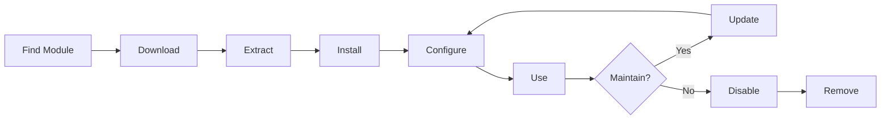

# Εγκατάσταση και διαχείρισηXOOPSΕνότητες

Μάθετε πώς να επεκτείνετεXOOPSλειτουργικότητα με την εγκατάσταση και τη διαμόρφωση μονάδων.

## ΚατανόησηXOOPSΕνότητες

## # Τι είναι οι ενότητες;

Οι μονάδες είναι επεκτάσεις που προσθέτουν λειτουργικότηταXOOPS:

| Τύπος | Σκοπός | Παραδείγματα |
|---|---|---|
| **Περιεχόμενο** | Διαχείριση συγκεκριμένων τύπων περιεχομένου | Ειδήσεις, Blog, Εισιτήρια |
| **Κοινότητα** | Αλληλεπίδραση χρήστη | Φόρουμ, Σχόλια, Κριτικές |
| **Ηλεκτρονικό Εμπόριο** | Πώληση προϊόντων | Κατάστημα, Καλάθι, Πληρωμές |
| **ΜΜΕ** | Λαβήfiles/images| Γκαλερί, Λήψεις, Βίντεο |
| **Βοηθητικό** | Εργαλεία και βοηθοί | Email, Backup, Analytics |

## # Πυρήνας έναντι Προαιρετικών Ενοτήτων

| Ενότητα | Τύπος | Περιλαμβάνεται | Αφαιρούμενο |
|---|---|---|---|
| **Σύστημα** | Πυρήνας | Ναι | Όχι |
| **Χρήστης** | Πυρήνας | Ναι | Όχι |
| **Προφίλ** | Συνιστάται | Ναι | Ναι |
| **PM (Ιδιωτικό μήνυμα)** | Συνιστάται | Ναι | Ναι |
| **Κανάλι WF** | Προαιρετικό | Συχνά | Ναι |
| **Ειδήσεις** | Προαιρετικό | Όχι | Ναι |
| **Φόρουμ** | Προαιρετικό | Όχι | Ναι |

## Κύκλος ζωής ενότητας



## Εύρεση Ενοτήτων

### XOOPSΑποθετήριο ενότητας

ΕπίσημοςXOOPSαποθετήριο ενότητας:

**Επισκεφθείτε:**https://XOOPS.org/modules/repository/

```
Directory > Modules > [Browse Categories]
```

Περιήγηση ανά κατηγορία:
- Διαχείριση περιεχομένου
- Κοινότητα
- Ηλεκτρονικό Εμπόριο
- Πολυμέσα
- Ανάπτυξη
- Διαχείριση τοποθεσίας

## # Αξιολόγηση Ενοτήτων

Πριν την εγκατάσταση, ελέγξτε:

| Κριτήρια | Τι να ψάξετε |
|---|---|
| **Συμβατότητα** | Λειτουργεί με το δικό σαςXOOPSέκδοση |
| **Βαθμολογία** | Καλές κριτικές και αξιολογήσεις χρηστών |
| **Ενημερώσεις** | Πρόσφατα διατηρημένα |
| **Λήψεις** | Δημοφιλές και ευρέως χρησιμοποιούμενο |
| **Απαιτήσεις** | Συμβατό με τον διακομιστή σας |
| **Άδεια** |GPLή παρόμοιο ανοιχτού κώδικα |
| **Υποστήριξη** | Ενεργός προγραμματιστής και κοινότητα |

## # Διαβάστε πληροφορίες ενότητας

Κάθε λίστα ενότητας δείχνει:

```
Module Name: [Name]
Version: [X.X.X]
Requires: XOOPS [Version]
Author: [Name]
Last Update: [Date]
Downloads: [Number]
Rating: [Stars]
Description: [Brief description]
Compatibility: PHP [Version], MySQL [Version]
```

## Εγκατάσταση μονάδων

## # Μέθοδος 1: Εγκατάσταση πίνακα διαχειριστή

**Βήμα 1: Πρόσβαση στην ενότητα λειτουργιών**

1. Συνδεθείτε στον πίνακα διαχείρισης
2. Μεταβείτε στο **Modules > Modules**
3. Κάντε κλικ στο **"Εγκατάσταση νέας μονάδας"** ή **"Αναζήτηση λειτουργικών μονάδων"**

**Βήμα 2: Μεταφόρτωση ενότητας**

Επιλογή Α - Άμεση μεταφόρτωση:
1. Κάντε κλικ στο **"Επιλογή αρχείου"**
2. Επιλέξτε το αρχείο module .zip από τον υπολογιστή
3. Κάντε κλικ στο **"Μεταφόρτωση"**

Επιλογή Β -URLΜεταφόρτωση:
1. Επικόλληση ενότηταςURL2. Κάντε κλικ στο **"Λήψη και εγκατάσταση"**

**Βήμα 3: Έλεγχος πληροφοριών ενότητας**

```
Module Name: [Name shown]
Version: [Version]
Author: [Author info]
Description: [Full description]
Requirements: [PHP/MySQL versions]
```

Ελέγξτε και κάντε κλικ **"Συνέχεια με την εγκατάσταση"**

**Βήμα 4: Επιλέξτε Τύπο εγκατάστασης**

```
☐ Fresh Install (New installation)
☐ Update (Upgrade existing)
☐ Delete Then Install (Replace existing)
```

Επιλέξτε την κατάλληλη επιλογή.

**Βήμα 5: Επιβεβαιώστε την εγκατάσταση**

Ελέγξτε την τελική επιβεβαίωση:
```
Module will be installed to: /modules/modulename/
Database: xoops_db
Proceed? [Yes] [No]
```

Κάντε κλικ στο **"Ναι"** για επιβεβαίωση.

**Βήμα 6: Η εγκατάσταση ολοκληρώθηκε**

```
Installation successful!

Module: [Module Name]
Version: [Version]
Tables created: [Number]
Files installed: [Number]

[Go to Module Settings]  [Return to Modules]
```

## # Μέθοδος 2: Μη αυτόματη εγκατάσταση (Για προχωρημένους)

Για χειροκίνητη εγκατάσταση ή αντιμετώπιση προβλημάτων:

**Βήμα 1: Λήψη ενότητας**

1. Κατεβάστε την ενότητα .zip από το αποθετήριο
2. Απόσπασμα σε `/var/www/html/XOOPS/modules/modulename/`

```bash
# Extract module
unzip module_name.zip
cp -r module_name /var/www/html/xoops/modules/

# Set permissions
chmod -R 755 /var/www/html/xoops/modules/module_name
```

**Βήμα 2: Εκτέλεση σεναρίου εγκατάστασης**

```
Visit: http://your-domain.com/xoops/modules/module_name/admin/index.php?op=install
```

Ή μέσω του πίνακα διαχείρισης (Σύστημα > Ενότητες > Ενημέρωση DB).

**Βήμα 3: Επαλήθευση εγκατάστασης**

1. Μεταβείτε στο **Modules > Modules** στο admin
2. Αναζητήστε τη μονάδα σας στη λίστα
3. Βεβαιωθείτε ότι εμφανίζεται ως "Ενεργό"

## Διαμόρφωση μονάδας

## # Πρόσβαση στις ρυθμίσεις της μονάδας

1. Μεταβείτε στο **Modules > Modules**
2. Βρείτε τη μονάδα σας
3. Κάντε κλικ στο όνομα της μονάδας
4. Κάντε κλικ στο **"Προτιμήσεις"** ή **"Ρυθμίσεις"**

## # Ρυθμίσεις κοινής μονάδας

Οι περισσότερες ενότητες προσφέρουν:

```
Module Status: [Enabled/Disabled]
Display in Menu: [Yes/No]
Module Weight: [1-999] (display order)
Visible To Groups: [Checkboxes for user groups]
```

## # Επιλογές για συγκεκριμένες μονάδες

Κάθε ενότητα έχει μοναδικές ρυθμίσεις. Παραδείγματα:

**Ειδική Ενότητα:**
```
Items Per Page: 10
Show Author: Yes
Allow Comments: Yes
Moderation Required: Yes
```

**Ενότητα φόρουμ:**
```
Topics Per Page: 20
Posts Per Page: 15
Maximum Attachment Size: 5MB
Enable Signatures: Yes
```

**Ενότητα Gallery:**
```
Images Per Page: 12
Thumbnail Size: 150x150
Maximum Upload: 10MB
Watermark: Yes/No
```

Ελέγξτε την τεκμηρίωση της μονάδας σας για συγκεκριμένες επιλογές.

## # Αποθήκευση διαμόρφωσης

Μετά την προσαρμογή των ρυθμίσεων:

1. Κάντε κλικ στο **"Υποβολή"** ή **"Αποθήκευση"**
2. Θα δείτε επιβεβαίωση:
   
```
   Settings saved successfully!
   
```

## Διαχείριση μπλοκ ενοτήτων

Πολλές ενότητες δημιουργούν "μπλοκ" - περιοχές περιεχομένου που μοιάζουν με widget.

## # Προβολή μπλοκ μονάδων

1. Μεταβείτε στο **Εμφάνιση > Αποκλεισμοί**
2. Αναζητήστε μπλοκ από τη μονάδα σας
3. Οι περισσότερες μονάδες εμφανίζουν "[Όνομα μονάδας] - [Περιγραφή μπλοκ]"

## # Διαμόρφωση μπλοκ

1. Κάντε κλικ στο όνομα του μπλοκ
2. Προσαρμογή:
   - Τίτλος μπλοκ
   - Ορατότητα (όλες οι σελίδες ή συγκεκριμένες)
   - Θέση στη σελίδα (αριστερά, κέντρο, δεξιά)
   - Ομάδες χρηστών που μπορούν να δουν
3. Κάντε κλικ στο **"Υποβολή"**

## # Εμφάνιση αποκλεισμού στην αρχική σελίδα

1. Μεταβείτε στο **Εμφάνιση > Αποκλεισμοί**
2. Βρείτε το μπλοκ που θέλετε
3. Κάντε κλικ στο **"Επεξεργασία"**
4. Σετ:
   - **Ορατό σε:** Επιλέξτε ομάδες
   - **Θέση:** Επιλέξτε στήλη (left/center/right)
   - **Σελίδες:** Αρχική σελίδα ή όλες οι σελίδες
5. Κάντε κλικ στο **"Υποβολή"**

## Εγκατάσταση παραδειγμάτων συγκεκριμένων μονάδων

## # Εγκατάσταση ενότητας ειδήσεων

**Ιδανικό για:** αναρτήσεις ιστολογίου, ανακοινώσεις

1. Κάντε λήψη της ενότητας Ειδήσεων από το αποθετήριο
2. Μεταφόρτωση μέσω **Modules > Modules > Install**
3. Διαμορφώστε τις παραμέτρους στις **Ενότητες > Ειδήσεις > Προτιμήσεις**:
   - Ιστορίες ανά σελίδα: 10
   - Να επιτρέπονται σχόλια: Ναι
   - Έγκριση πριν από τη δημοσίευση: Ναι
4. Δημιουργήστε μπλοκ για τα τελευταία νέα
5. Ξεκινήστε να δημοσιεύετε ιστορίες!

## # Εγκατάσταση μονάδας φόρουμ

**Ιδανικό για: ** Κοινοτική συζήτηση

1. Κατεβάστε την ενότητα Φόρουμ
2. Εγκατάσταση μέσω του πίνακα διαχείρισης
3. Δημιουργήστε κατηγορίες φόρουμ σε ενότητα
4. Διαμορφώστε τις ρυθμίσεις:
   -Topics/page: 20
   - Posts/page: 15
   - Ενεργοποίηση εποπτείας: Ναι
5. Εκχωρήστε δικαιώματα για ομάδες χρηστών
6. Δημιουργήστε μπλοκ για πιο πρόσφατα θέματα

## # Εγκατάσταση της μονάδας Gallery

**Ιδανικό για:** Προβολή εικόνων

1. Κατεβάστε την ενότητα Gallery
2. Εγκατάσταση και διαμόρφωση
3. Δημιουργήστε άλμπουμ φωτογραφιών
4. Ανεβάστε εικόνες
5. Ορίστε δικαιώματα γιαviewing/uploading6. Εμφάνιση γκαλερί στον ιστότοπο

## Ενημέρωση ενοτήτων

## # Ελέγξτε για ενημερώσεις

```
Admin Panel > Modules > Modules > Check for Updates
```

Αυτό δείχνει:
- Διαθέσιμες ενημερώσεις ενότητας
- Τρέχουσα έναντι νέας έκδοσης
-Changelog/releaseσημειώσεις

## # Ενημερώστε μια ενότητα

1. Μεταβείτε στο **Modules > Modules**
2. Κάντε κλικ στην ενότητα με διαθέσιμη ενημέρωση
3. Κάντε κλικ στο κουμπί **"Ενημέρωση"**
4. Επιλέξτε **"Ενημέρωση" από τον Τύπο εγκατάστασης**
5. Ακολουθήστε τον οδηγό εγκατάστασης
6. Ενημερώθηκε η ενότητα!

## # Σημαντικές σημειώσεις ενημέρωσης

Πριν από την ενημέρωση:

- [ ] Εφεδρική βάση δεδομένων
- [ ] Δημιουργία αντιγράφων ασφαλείας αρχείων μονάδας
- [ ] Έλεγχος αλλαγών
- [ ] Δοκιμή πρώτα στον διακομιστή σταδιοποίησης
- [ ] Σημειώστε τυχόν προσαρμοσμένες τροποποιήσεις

Μετά την ενημέρωση:
- [ ] Επαλήθευση λειτουργικότητας
- [ ] Ελέγξτε τις ρυθμίσεις της μονάδας
- [ ] Αξιολόγηση γιαwarnings/errors- [ ] Εκκαθάριση προσωρινής μνήμης

## Δικαιώματα ενότητας

## # Εκχώρηση πρόσβασης ομάδας χρηστών

Ελέγξτε ποιες ομάδες χρηστών μπορούν να έχουν πρόσβαση σε λειτουργικές μονάδες:

**Τοποθεσία:** Σύστημα > Δικαιώματα

Για κάθε ενότητα, διαμορφώστε:

```
Module: [Module Name]

Admin Access: [Select groups]
User Access: [Select groups]
Read Permission: [Groups allowed to view]
Write Permission: [Groups allowed to post]
Delete Permission: [Administrators only]
```

## # Κοινά επίπεδα άδειας

```
Public Content (News, Pages):
├── Admin Access: Webmaster
├── User Access: All logged-in users
└── Read Permission: Everyone

Community Features (Forum, Comments):
├── Admin Access: Webmaster, Moderators
├── User Access: All logged-in users
└── Write Permission: All logged-in users

Admin Tools:
├── Admin Access: Webmaster only
└── User Access: Disabled
```

## Απενεργοποίηση και αφαίρεση λειτουργικών μονάδων

## # Απενεργοποίηση μονάδας (Διατήρηση αρχείων)

Διατήρηση της ενότητας αλλά απόκρυψη από τον ιστότοπο:

1. Μεταβείτε στο **Modules > Modules**
2. Βρείτε τη μονάδα
3. Κάντε κλικ στο όνομα της μονάδας
4. Κάντε κλικ στο **"Απενεργοποίηση"** ή ορίστε την κατάσταση σε Ανενεργή
5. Η μονάδα είναι κρυμμένη αλλά τα δεδομένα διατηρούνται

Ενεργοποιήστε ξανά ανά πάσα στιγμή:
1. Κάντε κλικ στην ενότητα
2. Κάντε κλικ στο **"Ενεργοποίηση"**

## # Καταργήστε πλήρως τη μονάδα

Διαγραφή λειτουργικής μονάδας και των δεδομένων της:

1. Μεταβείτε στο **Modules > Modules**
2. Βρείτε τη μονάδα
3. Κάντε κλικ στο **"Κατάργηση εγκατάστασης"** ή **"Διαγραφή"**
4. Επιβεβαιώστε: "Διαγραφή μονάδας και όλων των δεδομένων;"
5. Κάντε κλικ στο **"Ναι"** για επιβεβαίωση

**Προειδοποίηση:** Η απεγκατάσταση διαγράφει όλα τα δεδομένα της μονάδας!

## # Επανεγκατάσταση μετά την απεγκατάσταση

Εάν απεγκαταστήσετε μια λειτουργική μονάδα:
- Τα αρχεία της μονάδας διαγράφηκαν
- Οι πίνακες βάσεων δεδομένων διαγράφηκαν
- Όλα τα δεδομένα χάθηκαν
- Πρέπει να γίνει επανεγκατάσταση για να χρησιμοποιηθεί ξανά
- Δυνατότητα επαναφοράς από αντίγραφο ασφαλείας

## Εγκατάσταση μονάδας αντιμετώπισης προβλημάτων

## # Η μονάδα δεν εμφανίζεται μετά την εγκατάσταση

**Σύμπτωμα:** Η ενότητα παρατίθεται αλλά δεν είναι ορατή στον ιστότοπο

**Λύση:**
```
1. Check module is "Active" (Modules > Modules)
2. Enable module blocks (Appearance > Blocks)
3. Verify user permissions (System > Permissions)
4. Clear cache (System > Tools > Clear Cache)
5. Check .htaccess doesn't block module
```

## # Σφάλμα εγκατάστασης: "Ο πίνακας υπάρχει ήδη"

**Σύμπτωμα:** Σφάλμα κατά την εγκατάσταση της μονάδας

**Λύση:**
```
1. Module partially installed before
2. Try "Delete then Install" option
3. Or uninstall first, then install fresh
4. Check database for existing tables:
   mysql> SHOW TABLES LIKE 'xoops_module%';
```

## # Ενότητα που λείπουν εξαρτήσεις

**Σύμπτωμα:** Η μονάδα δεν θα εγκατασταθεί - απαιτεί άλλη μονάδα

**Λύση:**
```
1. Note required modules from error message
2. Install required modules first
3. Then install the module
4. Install in correct order
```

## # Κενή σελίδα κατά την πρόσβαση στη μονάδα

**Σύμπτωμα:** Η μονάδα φορτώνει αλλά δεν δείχνει τίποτα

**Λύση:**
```
1. Enable debug mode in mainfile.php:
   define('XOOPS_DEBUG', 1);

2. Check PHP error log:
   tail -f /var/log/php_errors.log

3. Verify file permissions:
   chmod -R 755 /var/www/html/xoops/modules/modulename

4. Check database connection in module config

5. Disable module and reinstall
```

## # Ιστότοπος διακοπών ενότητας

**Σύμπτωμα:** Η εγκατάσταση της ενότητας διακόπτει τον ιστότοπο

**Λύση:**
```
1. Disable the problematic module immediately:
   Admin > Modules > [Module] > Disable

2. Clear cache:
   rm -rf /var/www/html/xoops/cache/*
   rm -rf /var/www/html/xoops/templates_c/*

3. Restore from backup if needed

4. Check error logs for root cause

5. Contact module developer
```

## Θέματα ασφάλειας ενότητας

## # Εγκατάσταση μόνο από αξιόπιστες πηγές

```
✓ Official XOOPS Repository
✓ GitHub official XOOPS modules
✓ Trusted module developers
✗ Unknown websites
✗ Unverified sources
```

## # Ελέγξτε τα δικαιώματα μονάδας

Μετά την εγκατάσταση:

1. Ελέγξτε τον κωδικό της μονάδας για ύποπτη δραστηριότητα
2. Ελέγξτε τους πίνακες βάσης δεδομένων για ανωμαλίες
3. Παρακολουθήστε τις αλλαγές αρχείων
4. Διατηρήστε τις ενότητες ενημερωμένες
5. Αφαιρέστε τις αχρησιμοποίητες μονάδες

## # Βέλτιστη πρακτική αδειών

```
Module directory: 755 (readable, not writable by web server)
Module files: 644 (readable only)
Module data: Protected by database
```

## Πόροι ανάπτυξης ενότητας

## # Μάθετε Ανάπτυξη Ενοτήτων

- Επίσημη τεκμηρίωση:https://XOOPS.org/- Αποθετήριο GitHub:https://github.com/XOOPS/- Φόρουμ κοινότητας:https://XOOPS.org/modules/newbb/- Οδηγός προγραμματιστή: Διατίθεται στο φάκελο docs

## Βέλτιστες πρακτικές για ενότητες

1. **Εγκαταστήστε ένα κάθε φορά:** Παρακολούθηση για διενέξεις
2. **Δοκιμή μετά την εγκατάσταση:** Επαλήθευση λειτουργικότητας
3. **Προσαρμοσμένη διαμόρφωση εγγράφου:** Σημειώστε τις ρυθμίσεις σας
4. **Διατήρηση ενημέρωσης:** Εγκαταστήστε άμεσα τις ενημερώσεις της μονάδας
5. **Κατάργηση Unused:** Διαγράψτε τις μονάδες που δεν χρειάζονται
6. **Δημιουργία αντιγράφων ασφαλείας πριν:** Να δημιουργείτε πάντα αντίγραφα ασφαλείας πριν την εγκατάσταση
7. **Διαβάστε την τεκμηρίωση:** Ελέγξτε τις οδηγίες της ενότητας
8. **Γίνετε μέλος της Κοινότητας:** Ζητήστε βοήθεια εάν χρειαστεί

## Λίστα ελέγχου εγκατάστασης μονάδας

Για κάθε εγκατάσταση μονάδας:

- [ ] Ερευνήστε και διαβάστε κριτικές
- [ ] ΕπαλήθευσηXOOPSσυμβατότητα έκδοσης
- [ ] Δημιουργία αντιγράφων ασφαλείας βάσης δεδομένων και αρχείων
- [ ] Λήψη της τελευταίας έκδοσης
- [ ] Εγκατάσταση μέσω του πίνακα διαχείρισης
- [ ] Διαμόρφωση ρυθμίσεων
- [ ]Create/positionμπλοκ
- [ ] Ορισμός δικαιωμάτων χρήστη
- [ ] Δοκιμή λειτουργικότητας
- [ ] Διαμόρφωση εγγράφου
- [ ] Πρόγραμμα για ενημερώσεις

## Επόμενα βήματα

Μετά την εγκατάσταση των μονάδων:

1. Δημιουργήστε περιεχόμενο για ενότητες
2. Ρυθμίστε ομάδες χρηστών
3. Εξερευνήστε τις δυνατότητες διαχειριστή
4. Βελτιστοποιήστε την απόδοση
5. Εγκαταστήστε πρόσθετες μονάδες όπως απαιτείται

---

**Ετικέτες:** #modules #installation #extension #management

**Σχετικά άρθρα:**
- Διαχειριστής-Πίνακας-Επισκόπηση
- Διαχείριση-Χρήστες
- Δημιουργία της πρώτης σας σελίδας
- ../Configuration/System-Settings
