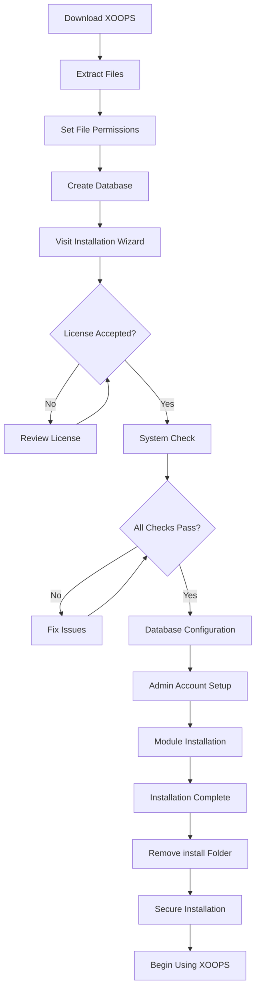

# Πλήρης XOOPS Οδηγός εγκατάστασης

Αυτός ο οδηγός παρέχει μια ολοκληρωμένη περιγραφή για την εγκατάσταση του XOOPS από την αρχή χρησιμοποιώντας τον οδηγό εγκατάστασης.

## Προαπαιτούμενα

Πριν ξεκινήσετε την εγκατάσταση, βεβαιωθείτε ότι έχετε:

- Πρόσβαση στον διακομιστή ιστού σας μέσω FTP ή SSH
- Πρόσβαση διαχειριστή στον διακομιστή της βάσης δεδομένων σας
- Ένα καταχωρημένο όνομα τομέα
- Επαληθεύτηκαν οι απαιτήσεις διακομιστή
- Διαθέσιμα εργαλεία δημιουργίας αντιγράφων ασφαλείας

## Διαδικασία εγκατάστασης



## Βήμα-βήμα εγκατάσταση

## # Βήμα 1: Λήψη XOOPS

Κάντε λήψη της πιο πρόσφατης έκδοσης από το [https://XOOPS.org/](https://xoops.org/):

```bash
# Using wget
wget https://xoops.org/download/xoops-2.5.8.zip

# Using curl
curl -O https://xoops.org/download/xoops-2.5.8.zip
```

## # Βήμα 2: Εξαγωγή αρχείων

Εξαγάγετε το αρχείο XOOPS στη ρίζα ιστού σας:

```bash
# Navigate to web root
cd /var/www/html

# Extract XOOPS
unzip xoops-2.5.8.zip

# Rename folder (optional, but recommended)
mv xoops-2.5.8 xoops
cd xoops
```

## # Βήμα 3: Ορισμός δικαιωμάτων αρχείων

Ορίστε τα κατάλληλα δικαιώματα για τους καταλόγους XOOPS:

```bash
# Make directories writable (755 for dirs, 644 for files)
find . -type d -exec chmod 755 {} \;
find . -type f -exec chmod 644 {} \;

# Make specific directories writable by web server
chmod 777 uploads/
chmod 777 templates_c/
chmod 777 var/
chmod 777 cache/

# Secure mainfile.php after installation
chmod 644 mainfile.php
```

## # Βήμα 4: Δημιουργία βάσης δεδομένων

Δημιουργήστε μια νέα βάση δεδομένων για το XOOPS χρησιμοποιώντας MySQL:

```sql
-- Create database
CREATE DATABASE xoops_db CHARACTER SET utf8mb4 COLLATE utf8mb4_unicode_ci;

-- Create user
CREATE USER 'xoops_user'@'localhost' IDENTIFIED BY 'secure_password_here';

-- Grant privileges
GRANT ALL PRIVILEGES ON xoops_db.* TO 'xoops_user'@'localhost';
FLUSH PRIVILEGES;
```

Ή χρησιμοποιώντας phpMyAdmin:

1. Συνδεθείτε στο phpMyAdmin
2. Κάντε κλικ στην καρτέλα "Βάσεις δεδομένων".
3. Εισαγάγετε το όνομα της βάσης δεδομένων: `xoops_db`
4. Επιλέξτε τη συρραφή "utf8mb4_unicode_ci".
5. Κάντε κλικ στο "Δημιουργία"
6. Δημιουργήστε έναν χρήστη με το ίδιο όνομα με τη βάση δεδομένων
7. Παραχωρήστε όλα τα προνόμια

## # Βήμα 5: Εκτελέστε τον Οδηγό εγκατάστασης

Ανοίξτε το πρόγραμμα περιήγησής σας και μεταβείτε σε:

```
http://your-domain.com/xoops/install/
```

### # Φάση ελέγχου συστήματος

Ο οδηγός ελέγχει τη διαμόρφωση του διακομιστή σας:

- Έκδοση PHP >= 5.6.0
- MySQL/MariaDB διαθέσιμο
- Απαιτούμενες επεκτάσεις PHP (GD, PDO, κ.λπ.)
- Δικαιώματα καταλόγου
- Συνδεσιμότητα βάσεων δεδομένων

**Εάν οι έλεγχοι αποτύχουν:**

Δείτε την ενότητα #Common-Installation-Issues για λύσεις.

### # Διαμόρφωση βάσης δεδομένων

Εισαγάγετε τα διαπιστευτήρια της βάσης δεδομένων σας:

```
Database Host: localhost
Database Name: xoops_db
Database User: xoops_user
Database Password: [your_secure_password]
Table Prefix: xoops_
```

**Σημαντικές σημειώσεις:**
- Εάν ο κεντρικός υπολογιστής της βάσης δεδομένων σας διαφέρει από τον localhost (π.χ. απομακρυσμένος διακομιστής), εισαγάγετε το σωστό όνομα κεντρικού υπολογιστή
- Το πρόθεμα πίνακα βοηθάει εάν εκτελούνται πολλαπλές παρουσίες XOOPS σε μία βάση δεδομένων
- Χρησιμοποιήστε έναν ισχυρό κωδικό πρόσβασης με ανάμεικτα πεζά, αριθμούς και σύμβολα

### # Ρύθμιση λογαριασμού διαχειριστή

Δημιουργήστε τον λογαριασμό διαχειριστή σας:

```
Admin Username: admin (or choose custom)
Admin Email: admin@your-domain.com
Admin Password: [strong_unique_password]
Confirm Password: [repeat_password]
```

**Βέλτιστες πρακτικές:**
- Χρησιμοποιήστε ένα μοναδικό όνομα χρήστη, όχι "διαχειριστής"
- Χρησιμοποιήστε έναν κωδικό πρόσβασης με 16+ χαρακτήρες
- Αποθηκεύστε τα διαπιστευτήρια σε έναν ασφαλή διαχειριστή κωδικών πρόσβασης
- Μην κοινοποιείτε ποτέ διαπιστευτήρια διαχειριστή

### # Εγκατάσταση μονάδας

Επιλέξτε προεπιλεγμένες μονάδες για εγκατάσταση:

- **Μονάδα συστήματος** (απαιτείται) - Λειτουργία πυρήνα XOOPS
- **Μονάδα χρήστη** (απαιτείται) - Διαχείριση χρηστών
- **Μονάδα προφίλ** (συνιστάται) - Προφίλ χρηστών
- Ενότητα **PM (Ιδιωτικό μήνυμα) ** (συνιστάται) - Εσωτερικά μηνύματα
- **Μονάδα WF-Channel** (προαιρετικό) - Διαχείριση περιεχομένου

Επιλέξτε όλες τις προτεινόμενες μονάδες για πλήρη εγκατάσταση.

## # Βήμα 6: Ολοκληρωμένη εγκατάσταση

Μετά από όλα τα βήματα, θα δείτε μια οθόνη επιβεβαίωσης:

```
Installation Complete!

Your XOOPS installation is ready to use.
Admin Panel: http://your-domain.com/xoops/admin/
User Panel: http://your-domain.com/xoops/
```

## # Βήμα 7: Ασφαλίστε την εγκατάστασή σας

### # Κατάργηση φακέλου εγκατάστασης

```bash
# Remove the install directory (CRITICAL for security)
rm -rf /var/www/html/xoops/install/

# Or rename it
mv /var/www/html/xoops/install/ /var/www/html/xoops/install.bak
```

**WARNING:** Μην αφήνετε ποτέ τον φάκελο εγκατάστασης προσβάσιμο στην παραγωγή!

### # Ασφαλής mainfile.php

```bash
# Make mainfile.php read-only
chmod 644 /var/www/html/xoops/mainfile.php

# Set ownership
chown www-data:www-data /var/www/html/xoops/mainfile.php
```

### # Ορισμός κατάλληλων δικαιωμάτων αρχείων

```bash
# Recommended production permissions
find . -type f -name "*.php" -exec chmod 644 {} \;
find . -type d -exec chmod 755 {} \;

# Writable directories for web server
chmod 777 uploads/ var/ cache/ templates_c/
```

### # Ενεργοποίηση HTTPS/SSL

Διαμορφώστε το SSL στον διακομιστή ιστού σας (nginx ή Apache).

**Για Apache:**
```apache
<VirtualHost *:443>
    ServerName your-domain.com
    DocumentRoot /var/www/html/xoops

    SSLEngine on
    SSLCertificateFile /etc/ssl/certs/your-cert.crt
    SSLCertificateKeyFile /etc/ssl/private/your-key.key

    # Force HTTPS redirect
    <IfModule mod_rewrite.c>
        RewriteEngine On
        RewriteCond %{HTTPS} off
        RewriteRule ^(.*)$ https://%{HTTP_HOST}%{REQUEST_URI} [L,R=301]
    </IfModule>
</VirtualHost>
```

## Διαμόρφωση μετά την εγκατάσταση

## # 1. Πρόσβαση στον Πίνακα Διαχειριστή

Πλοηγηθείτε σε:
```
http://your-domain.com/xoops/admin/
```

Συνδεθείτε με τα διαπιστευτήρια διαχειριστή σας.

## # 2. Διαμορφώστε τις βασικές ρυθμίσεις

Διαμορφώστε τα ακόλουθα:

- Όνομα και περιγραφή τοποθεσίας
- Διεύθυνση email διαχειριστή
- Μορφή ζώνης ώρας και ημερομηνίας
- Βελτιστοποίηση μηχανών αναζήτησης

## # 3. Δοκιμαστική εγκατάσταση

- [ ] Επισκεφτείτε την αρχική σελίδα
- [ ] Ελέγξτε το φορτίο των μονάδων
- [ ] Επαληθεύστε τις εργασίες εγγραφής χρήστη
- [ ] Δοκιμάστε τις λειτουργίες του πίνακα διαχείρισης
- [ ] Επιβεβαιώστε ότι λειτουργεί SSL/HTTPS

## # 4. Προγραμματίστε τη δημιουργία αντιγράφων ασφαλείας

Ρύθμιση αυτόματων αντιγράφων ασφαλείας:

```bash
# Create backup script (backup.sh)
#!/bin/bash
DATE=$(date +%Y%m%d_%H%M%S)
BACKUP_DIR="/backups/xoops"
XOOPS_DIR="/var/www/html/xoops"

# Backup database
mysqldump -u xoops_user -p[password] xoops_db > $BACKUP_DIR/db_$DATE.sql

# Backup files
tar -czf $BACKUP_DIR/files_$DATE.tar.gz $XOOPS_DIR

echo "Backup completed: $DATE"
```

Πρόγραμμα με cron:
```bash
# Daily backup at 2 AM
0 2 * * * /usr/local/bin/backup.sh
```

## Συνήθη προβλήματα εγκατάστασης

## # Θέμα: Σφάλματα άρνησης άδειας

**Σύμπτωμα:** "Δεν επιτρέπεται η άδεια" κατά τη μεταφόρτωση ή τη δημιουργία αρχείων

**Λύση:**
```bash
# Check web server user
ps aux | grep apache  # For Apache
ps aux | grep nginx   # For Nginx

# Fix permissions (replace www-data with your web server user)
chown -R www-data:www-data /var/www/html/xoops
chmod -R 755 /var/www/html/xoops
chmod 777 uploads/ var/ cache/ templates_c/
```

## # Πρόβλημα: Η σύνδεση της βάσης δεδομένων απέτυχε

**Σύμπτωμα:** "Δεν είναι δυνατή η σύνδεση με διακομιστή βάσης δεδομένων"

**Λύση:**
1. Επαληθεύστε τα διαπιστευτήρια βάσης δεδομένων στον οδηγό εγκατάστασης
2. Ελέγξτε ότι το MySQL/MariaDB εκτελείται:
   
```bash
   service mysql status  # or mariadb
   
```
3. Βεβαιωθείτε ότι υπάρχει βάση δεδομένων:
   
```sql
   SHOW DATABASES;
   
```
4. Δοκιμάστε τη σύνδεση από τη γραμμή εντολών:
   
```bash
   mysql -h localhost -u xoops_user -p xoops_db
   
```

## # Θέμα: Λευκή Λευκή οθόνη

**Σύμπτωμα:** Η επίσκεψη στο XOOPS δείχνει κενή σελίδα

**Λύση:**
1. Ελέγξτε τα αρχεία καταγραφής σφαλμάτων PHP:
   
```bash
   tail -f /var/log/apache2/error.log
   
```
2. Ενεργοποιήστε τη λειτουργία εντοπισμού σφαλμάτων στο mainfile.php:
   
```php
   define('XOOPS_DEBUG', 1);
   
```
3. Ελέγξτε τα δικαιώματα αρχείων στο κύριο αρχείο.php and config files
4. Επαληθεύστε PHP-MySQL extension is installed

## # Πρόβλημα: Δεν είναι δυνατή η εγγραφή στον Κατάλογο μεταφορτώσεων

**Σύμπτωμα:** Η λειτουργία μεταφόρτωσης αποτυγχάνει, "Δεν είναι δυνατή η εγγραφή σε μεταφορτώσεις/"

**Λύση:**
```bash
# Check current permissions
ls -la uploads/

# Fix permissions
chmod 777 uploads/
chown www-data:www-data uploads/

# For specific files
chmod 644 uploads/*
```

## # Θέμα: PHP Λείπουν επεκτάσεις

**Σύμπτωμα:** Ο έλεγχος συστήματος αποτυγχάνει με τις επεκτάσεις που λείπουν (GD, MySQL, κ.λπ.)

**Λύση (Ubuntu/Debian):**
```bash
# Install PHP GD library
apt-get install php-gd

# Install PHP MySQL support
apt-get install php-mysql

# Restart web server
systemctl restart apache2  # or nginx
```

**Λύση (CentOS/RHEL):**
```bash
# Install PHP GD library
yum install php-gd

# Install PHP MySQL support
yum install php-mysql

# Restart web server
systemctl restart httpd
```

## # Θέμα: Αργή διαδικασία εγκατάστασης

**Σύμπτωμα:** Ο οδηγός εγκατάστασης λήγει ή εκτελείται πολύ αργά

**Λύση:**
1. Αυξήστε το χρονικό όριο PHP στο php.ini:
   
```ini
   max_execution_time = 300  # 5 minutes
   
```
2. Αύξηση MySQL max_allowed_packet:
   
```sql
   SET GLOBAL max_allowed_packet = 256M;
   
```
3. Ελέγξτε τους πόρους του διακομιστή:
   
```bash
   free -h  # Check RAM
   df -h    # Check disk space
   
```

## # Πρόβλημα: Ο πίνακας διαχειριστή δεν είναι προσβάσιμος

**Σύμπτωμα:** Δεν είναι δυνατή η πρόσβαση στον πίνακα διαχείρισης μετά την εγκατάσταση

**Λύση:**
1. Βεβαιωθείτε ότι ο χρήστης διαχειριστή υπάρχει στη βάση δεδομένων:
   
```sql
   SELECT * FROM xoops_users WHERE uid = 1;
   
```
2. Εκκαθαρίστε την προσωρινή μνήμη και τα cookie του προγράμματος περιήγησης
3. Ελέγξτε εάν ο φάκελος συνεδριών είναι εγγράψιμος:
   
```bash
   chmod 777 var/
   
```
4. Βεβαιωθείτε ότι οι κανόνες htaccess δεν αποκλείουν την πρόσβαση διαχειριστή

## Λίστα ελέγχου επαλήθευσης

Μετά την εγκατάσταση, επαληθεύστε:

- [x] XOOPS η αρχική σελίδα φορτώνεται σωστά
- [x] Ο πίνακας διαχείρισης είναι προσβάσιμος στο /XOOPS/admin/
- [x] SSL/HTTPS λειτουργεί
- [x] Ο φάκελος εγκατάστασης έχει αφαιρεθεί ή δεν είναι προσβάσιμος
- [x] Τα δικαιώματα αρχείων είναι ασφαλή (644 για αρχεία, 755 για dir)
- [x] Έχουν προγραμματιστεί τα αντίγραφα ασφαλείας της βάσης δεδομένων
- [x] Οι μονάδες φορτώνονται χωρίς σφάλματα
- [x] Το σύστημα εγγραφής χρηστών λειτουργεί
- [x] Η λειτουργία μεταφόρτωσης αρχείων λειτουργεί
- [x] Οι ειδοποιήσεις μέσω email αποστέλλονται σωστά

## Επόμενα βήματα

Μόλις ολοκληρωθεί η εγκατάσταση:

1. Διαβάστε τον οδηγό βασικής διαμόρφωσης
2. Ασφαλίστε την εγκατάστασή σας
3. Εξερευνήστε τον πίνακα διαχείρισης
4. Εγκαταστήστε πρόσθετες μονάδες
5. Ρυθμίστε ομάδες χρηστών και δικαιώματα

---

**Ετικέτες:** #εγκατάσταση #ρύθμιση #ξεκινώντας #αντιμετώπιση προβλημάτων

**Σχετικά άρθρα:**
- Απαιτήσεις διακομιστή
- Αναβάθμιση-XOOPS
- ../Configuration/Security-Configuration
