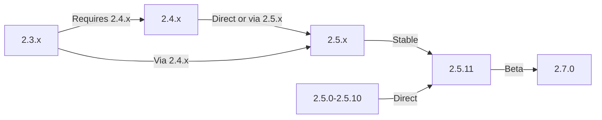

Αυτός ο οδηγός καλύπτει την αναβάθμιση του XOOPS από παλαιότερες εκδόσεις στην πιο πρόσφατη έκδοση, διατηρώντας παράλληλα τα δεδομένα και τις προσαρμογές σας.

> **Πληροφορίες έκδοσης**
> - **Σταθερό:** XOOPS 2.5.11
> - **Beta:** XOOPS 2.7.0 (δοκιμή)
> - **Μέλλον:** XOOPS 4.0 (σε ανάπτυξη - βλ. Χάρτη πορείας)

## Λίστα ελέγχου πριν από την αναβάθμιση

Πριν ξεκινήσετε την αναβάθμιση, επαληθεύστε:

- [ ] Τεκμηριωμένη τρέχουσα έκδοση XOOPS
- [ ] Προσδιορίστηκε η έκδοση στόχου XOOPS
- [ ] Ολοκληρώθηκε το πλήρες αντίγραφο ασφαλείας του συστήματος
- [ ] Επαληθεύτηκε το αντίγραφο ασφαλείας της βάσης δεδομένων
- [ ] Η λίστα εγκατεστημένων μονάδων καταγράφηκε
- [ ] Τεκμηριώνονται προσαρμοσμένες τροποποιήσεις
- [ ] Διαθέσιμο περιβάλλον δοκιμής
- [ ] Ελέγχθηκε η διαδρομή αναβάθμισης (ορισμένες εκδόσεις παραλείπουν τις ενδιάμεσες εκδόσεις)
- [ ] Επαληθεύτηκαν οι πόροι διακομιστή (αρκετός χώρος στο δίσκο, μνήμη)
- [ ] Ενεργοποιήθηκε η λειτουργία συντήρησης

## Οδηγός διαδρομής αναβάθμισης

Διαφορετικές διαδρομές αναβάθμισης ανάλογα με την τρέχουσα έκδοση:



**Σημαντικό:** Μην παραλείπετε ποτέ τις κύριες εκδόσεις. Αν γίνεται αναβάθμιση από 2.3.x, αναβαθμίστε πρώτα σε 2.4.x και μετά σε 2.5.x.

## Βήμα 1: Ολοκληρώστε τη δημιουργία αντιγράφων ασφαλείας συστήματος

## # Δημιουργία αντιγράφων ασφαλείας βάσης δεδομένων

Χρησιμοποιήστε mysqldump to backup the database:

```bash
# Full database backup
mysqldump -u xoops_user -p xoops_db > /backups/xoops_db_backup_$(date +%Y%m%d_%H%M%S).sql

# Compressed backup
mysqldump -u xoops_user -p xoops_db | gzip > /backups/xoops_db_backup_$(date +%Y%m%d_%H%M%S).sql.gz
```

Ή χρησιμοποιώντας phpMyAdmin:

1. Επιλέξτε τη βάση δεδομένων σας XOOPS
2. Κάντε κλικ στην καρτέλα "Εξαγωγή".
3. Επιλέξτε μορφή "SQL".
4. Επιλέξτε "Αποθήκευση ως αρχείου"
5. Κάντε κλικ στο "Μετάβαση"

Επαλήθευση αρχείου αντιγράφου ασφαλείας:

```bash
# Check backup size
ls -lh /backups/xoops_db_backup*.sql

# Verify backup integrity (uncompressed)
head -20 /backups/xoops_db_backup_*.sql

# Verify compressed backup
zcat /backups/xoops_db_backup_*.sql.gz | head -20
```

## # Δημιουργία αντιγράφων ασφαλείας συστήματος αρχείων

Δημιουργία αντιγράφων ασφαλείας όλων των XOOPS αρχείων:

```bash
# Compressed file backup
tar -czf /backups/xoops_files_$(date +%Y%m%d_%H%M%S).tar.gz /var/www/html/xoops

# Uncompressed (faster, requires more disk space)
tar -cf /backups/xoops_files_$(date +%Y%m%d_%H%M%S).tar /var/www/html/xoops

# Show backup progress
tar -czf /backups/xoops_files_$(date +%Y%m%d_%H%M%S).tar.gz --verbose /var/www/html/xoops | tail
```

Αποθηκεύστε τα αντίγραφα ασφαλείας με ασφάλεια:

```bash
# Secure backup storage
chmod 600 /backups/xoops_*
ls -lah /backups/

# Optional: Copy to remote storage
scp /backups/xoops_* user@backup-server:/secure/backups/
```

## # Δοκιμή επαναφοράς αντιγράφων ασφαλείας

**CRITICAL:** Πάντα να δοκιμάζετε τις εργασίες δημιουργίας αντιγράφων ασφαλείας:

```bash
# Verify tar archive contents
tar -tzf /backups/xoops_files_*.tar.gz | head -20

# Extract to test location
mkdir /tmp/restore_test
cd /tmp/restore_test
tar -xzf /backups/xoops_files_*.tar.gz

# Verify key files exist
ls -la xoops/mainfile.php
ls -la xoops/install/
```

## Βήμα 2: Ενεργοποιήστε τη λειτουργία συντήρησης

Αποτρέψτε την πρόσβαση των χρηστών στον ιστότοπο κατά την αναβάθμιση:

## # Επιλογή 1: XOOPS Πίνακας διαχειριστή

1. Συνδεθείτε στον πίνακα διαχείρισης
2. Μεταβείτε στο Σύστημα > Συντήρηση
3. Ενεργοποιήστε τη "Λειτουργία συντήρησης ιστότοπου"
4. Ορίστε το μήνυμα συντήρησης
5. Αποθήκευση

## # Επιλογή 2: Μη αυτόματη λειτουργία συντήρησης

Δημιουργήστε ένα αρχείο συντήρησης στο web root:

```html
<!-- /var/www/html/maintenance.html -->
<!DOCTYPE html>
<html>
<head>
    <title>Under Maintenance</title>
    <style>
        body { font-family: Arial; text-align: center; padding: 50px; }
        h1 { color: #333; }
        p { color: #666; margin: 20px 0; }
    </style>
</head>
<body>
    <h1>Site Under Maintenance</h1>
    <p>We're currently upgrading our site.</p>
    <p>Expected time: approximately 30 minutes.</p>
    <p>Thank you for your patience!</p>
</body>
</html>
```

Διαμόρφωση του Apache για εμφάνιση της σελίδας συντήρησης:

```apache
# In .htaccess or vhost config
ErrorDocument 503 /maintenance.html

# Redirect all traffic to maintenance page
<IfModule mod_rewrite.c>
    RewriteEngine On
    RewriteCond %{REMOTE_ADDR} !^192\.168\.1\.100$  # Your IP
    RewriteRule ^(.*)$ - [R=503,L]
</IfModule>
```

## Βήμα 3: Λήψη νέας έκδοσης

Κατεβάστε το XOOPS από τον επίσημο ιστότοπο:

```bash
# Download latest version
cd /tmp
wget https://xoops.org/download/xoops-2.5.8.zip

# Verify checksum (if provided)
sha256sum xoops-2.5.8.zip
# Compare with official SHA256 hash

# Extract to temporary location
unzip xoops-2.5.8.zip
cd xoops-2.5.8
```

## Βήμα 4: Προετοιμασία αρχείου προ-αναβάθμισης

## # Προσδιορισμός προσαρμοσμένων τροποποιήσεων

Ελέγξτε για προσαρμοσμένα βασικά αρχεία:

```bash
# Look for modified files (files with newer mtime)
find /var/www/html/xoops -type f -newer /var/www/html/xoops/install.php

# Check for custom themes
ls /var/www/html/xoops/themes/
# Note any custom themes

# Check for custom modules
ls /var/www/html/xoops/modules/
# Note any custom modules created by you
```

## # Τρέχουσα κατάσταση εγγράφου

Δημιουργήστε μια αναφορά αναβάθμισης:

```bash
cat > /tmp/upgrade_report.txt << EOF
=== XOOPS Upgrade Report ===
Date: $(date)
Current Version: 2.5.6
Target Version: 2.5.8

=== Installed Modules ===
$(ls /var/www/html/xoops/modules/)

=== Custom Modifications ===
[Document any custom theme or module modifications]

=== Themes ===
$(ls /var/www/html/xoops/themes/)

=== Plugin Status ===
[List any custom code modifications]

EOF
```

## Βήμα 5: Συγχώνευση νέων αρχείων με την τρέχουσα εγκατάσταση

## # Στρατηγική: Διατήρηση προσαρμοσμένων αρχείων

Αντικαταστήστε τα βασικά αρχεία XOOPS αλλά διατηρήστε:
- `mainfile.php` (διαμόρφωση της βάσης δεδομένων σας)
- Προσαρμοσμένα θέματα στο `themes/`
- Προσαρμοσμένες μονάδες στο `modules/`
- Μεταφορτώσεις χρηστών στο `uploads/`
- Δεδομένα τοποθεσίας στο `var/`

## # Μη αυτόματη διαδικασία συγχώνευσης

```bash
# Set variables
XOOPS_OLD="/var/www/html/xoops"
XOOPS_NEW="/tmp/xoops-2.5.8"
BACKUP="/backups/pre-upgrade"

# Create pre-upgrade backup in place
mkdir -p $BACKUP
cp -r $XOOPS_OLD/* $BACKUP/

# Copy new files (but preserve sensitive files)
# Copy everything except protected directories
rsync -av --exclude='mainfile.php' \
    --exclude='modules/custom*' \
    --exclude='themes/custom*' \
    --exclude='uploads' \
    --exclude='var' \
    --exclude='cache' \
    --exclude='templates_c' \
    $XOOPS_NEW/ $XOOPS_OLD/

# Verify critical files preserved
ls -la $XOOPS_OLD/mainfile.php
```

## # Χρήση αναβάθμισης.php (If Available)

Ορισμένες εκδόσεις XOOPS περιλαμβάνουν αυτοματοποιημένη δέσμη ενεργειών αναβάθμισης:

```bash
# Copy new files with installer
cp -r /tmp/xoops-2.5.8/* /var/www/html/xoops/

# Run upgrade wizard
# Visit: http://your-domain.com/xoops/upgrade/
```

## # Δικαιώματα αρχείου μετά τη συγχώνευση

Επαναφέρετε τα σωστά δικαιώματα:

```bash
# Set ownership
chown -R www-data:www-data /var/www/html/xoops

# Set directory permissions
find /var/www/html/xoops -type d -exec chmod 755 {} \;

# Set file permissions
find /var/www/html/xoops -type f -exec chmod 644 {} \;

# Make writable directories
chmod 777 /var/www/html/xoops/cache
chmod 777 /var/www/html/xoops/templates_c
chmod 777 /var/www/html/xoops/uploads
chmod 777 /var/www/html/xoops/var

# Secure mainfile.php
chmod 644 /var/www/html/xoops/mainfile.php
```

## Βήμα 6: Μεταφορά βάσης δεδομένων

## # Ελέγξτε τις αλλαγές στη βάση δεδομένων

Ελέγξτε τις σημειώσεις έκδοσης XOOPS για αλλαγές στη δομή της βάσης δεδομένων:

```bash
# Extract and review SQL migration files
find /tmp/xoops-2.5.8 -name "*.sql" -type f
# Document all .sql files found
```

## # Εκτελέστε ενημερώσεις βάσης δεδομένων

## # Επιλογή 1: Αυτοματοποιημένη ενημέρωση (εάν υπάρχει)

Χρησιμοποιήστε τον πίνακα διαχείρισης:

1. Συνδεθείτε στον διαχειριστή
2. Μεταβείτε στο **Σύστημα > Βάση δεδομένων**
3. Κάντε κλικ στο "Έλεγχος ενημερώσεων"
4. Ελέγξτε τις αλλαγές που εκκρεμούν
5. Κάντε κλικ στην "Εφαρμογή ενημερώσεων"

## # Επιλογή 2: Μη αυτόματες ενημερώσεις βάσης δεδομένων

Εκτελέστε αρχεία μετεγκατάστασης SQL:

```bash
# Connect to database
mysql -u xoops_user -p xoops_db

# View pending changes (varies by version)
SELECT * FROM xoops_config WHERE conf_name LIKE '%version%';

# Run migration scripts manually if needed
SOURCE /tmp/xoops-2.5.8/migrate_2.5.6_to_2.5.8.sql;
```

## # Επαλήθευση βάσης δεδομένων

Επαληθεύστε την ακεραιότητα της βάσης δεδομένων μετά την ενημέρωση:

```sql
-- Check database consistency
REPAIR TABLE xoops_users;
OPTIMIZE TABLE xoops_users;

-- Verify key tables exist
SHOW TABLES LIKE 'xoops_%';

-- Check row counts (should increase or stay same)
SELECT COUNT(*) FROM xoops_users;
SELECT COUNT(*) FROM xoops_posts;
```

## Βήμα 7: Επαληθεύστε την αναβάθμιση

## # Έλεγχος αρχικής σελίδας

Επισκεφτείτε την αρχική σας σελίδα XOOPS:

```
http://your-domain.com/xoops/
```

Αναμενόμενο: Η σελίδα φορτώνεται χωρίς σφάλματα, εμφανίζεται σωστά

## # Έλεγχος πίνακα διαχειριστή

Πρόσβαση διαχειριστή:

```
http://your-domain.com/xoops/admin/
```

Επαλήθευση:
- [ ] Φορτώνει τον πίνακα διαχείρισης
- [ ] Έργα πλοήγησης
- [ ] Ο πίνακας εργαλείων εμφανίζεται σωστά
- [ ] Δεν υπάρχουν σφάλματα βάσης δεδομένων στα αρχεία καταγραφής

## # Επαλήθευση ενότητας

Ελέγξτε τις εγκατεστημένες μονάδες:

1. Μεταβείτε στο **Modules > Modules** στο admin
2. Επαληθεύστε ότι όλες οι μονάδες είναι ακόμα εγκατεστημένες
3. Ελέγξτε για τυχόν μηνύματα σφάλματος
4. Ενεργοποιήστε τυχόν λειτουργικές μονάδες που ήταν απενεργοποιημένες

## # Έλεγχος αρχείου καταγραφής

Ελέγξτε τα αρχεία καταγραφής συστήματος για σφάλματα:

```bash
# Check web server error log
tail -50 /var/log/apache2/error.log

# Check PHP error log
tail -50 /var/log/php_errors.log

# Check XOOPS system log (if available)
# In admin panel: System > Logs
```

## # Δοκιμή βασικών λειτουργιών

- [ ] Ο χρήστης login/logout λειτουργεί
- [ ] Η εγγραφή χρήστη λειτουργεί
- [ ] Λειτουργίες αποστολής αρχείων
- [ ] Αποστολή ειδοποιήσεων μέσω email
- [ ] Η λειτουργία αναζήτησης λειτουργεί
- [ ] Λειτουργίες διαχειριστή
- [ ] Η λειτουργικότητα της μονάδας είναι άθικτη

## Βήμα 8: Εκκαθάριση μετά την αναβάθμιση

## # Κατάργηση προσωρινών αρχείων

```bash
# Remove extraction directory
rm -rf /tmp/xoops-2.5.8

# Clear template cache (safe to delete)
rm -rf /var/www/html/xoops/templates_c/*

# Clear site cache
rm -rf /var/www/html/xoops/cache/*
```

## # Κατάργηση λειτουργίας συντήρησης

Ενεργοποιήστε ξανά την κανονική πρόσβαση στον ιστότοπο:

```apache
# Remove maintenance mode redirect from .htaccess
# Or delete maintenance.html file
rm /var/www/html/maintenance.html
```

## # Ενημέρωση τεκμηρίωσης

Ενημερώστε τις σημειώσεις αναβάθμισής σας:

```bash
# Document successful upgrade
cat >> /tmp/upgrade_report.txt << EOF

=== Upgrade Results ===
Status: SUCCESS
Upgrade Date: $(date)
New Version: 2.5.8
Duration: [time in minutes]

Post-Upgrade Tests:
- [x] Homepage loads
- [x] Admin panel accessible
- [x] Modules functional
- [x] User registration works
- [x] Database optimized

EOF
```

## Αναβαθμίσεις αντιμετώπισης προβλημάτων

## # Θέμα: Κενή λευκή οθόνη μετά την αναβάθμιση

**Σύμπτωμα:** Η αρχική σελίδα δεν δείχνει τίποτα

**Λύση:**
```bash
# Check PHP errors
tail -f /var/log/apache2/error.log

# Enable debug mode temporarily
echo "define('XOOPS_DEBUG', 1);" >> /var/www/html/xoops/mainfile.php

# Check file permissions
ls -la /var/www/html/xoops/mainfile.php

# Restore from backup if needed
cp /backups/xoops_files_*.tar.gz /tmp/
cd /tmp && tar -xzf xoops_files_*.tar.gz
```

## # Πρόβλημα: Σφάλμα σύνδεσης βάσης δεδομένων

**Σύμπτωμα:** Μήνυμα "Δεν είναι δυνατή η σύνδεση στη βάση δεδομένων".

**Λύση:**
```bash
# Verify database credentials in mainfile.php
grep -i "database\|host\|user" /var/www/html/xoops/mainfile.php

# Test connection
mysql -h localhost -u xoops_user -p xoops_db -e "SELECT 1"

# Check MySQL status
systemctl status mysql

# Verify database still exists
mysql -u xoops_user -p -e "SHOW DATABASES" | grep xoops
```

## # Πρόβλημα: Ο πίνακας διαχειριστή δεν είναι προσβάσιμος

**Σύμπτωμα:** Δεν είναι δυνατή η πρόσβαση στο /XOOPS/admin/

**Λύση:**
```bash
# Check .htaccess rules
cat /var/www/html/xoops/.htaccess

# Verify admin files exist
ls -la /var/www/html/xoops/admin/

# Check mod_rewrite enabled
apache2ctl -M | grep rewrite

# Restart web server
systemctl restart apache2
```

## # Πρόβλημα: Οι μονάδες δεν φορτώνονται

**Σύμπτωμα:** Οι μονάδες εμφανίζουν σφάλματα ή είναι απενεργοποιημένες

**Λύση:**
```bash
# Verify module files exist
ls /var/www/html/xoops/modules/

# Check module permissions
ls -la /var/www/html/xoops/modules/*/

# Check module configuration in database
mysql -u xoops_user -p xoops_db -e "SELECT * FROM xoops_modules WHERE module_status = 0"

# Reactivate modules in admin panel
# System > Modules > Click module > Update Status
```

## # Θέμα: Σφάλματα άρνησης άδειας

**Σύμπτωμα:** "Δεν επιτρέπεται η άδεια" κατά τη μεταφόρτωση ή την αποθήκευση

**Λύση:**
```bash
# Check file ownership
ls -la /var/www/html/xoops/ | head -20

# Fix ownership
chown -R www-data:www-data /var/www/html/xoops

# Fix directory permissions
find /var/www/html/xoops -type d -exec chmod 755 {} \;

# Make cache/uploads writable
chmod 777 /var/www/html/xoops/cache
chmod 777 /var/www/html/xoops/templates_c
chmod 777 /var/www/html/xoops/uploads
chmod 777 /var/www/html/xoops/var
```

## # Θέμα: Αργή φόρτωση σελίδας

**Σύμπτωμα:** Οι σελίδες φορτώνονται πολύ αργά μετά την αναβάθμιση

**Λύση:**
```bash
# Clear all caches
rm -rf /var/www/html/xoops/cache/*
rm -rf /var/www/html/xoops/templates_c/*

# Optimize database
mysql -u xoops_user -p xoops_db << EOF
OPTIMIZE TABLE xoops_users;
OPTIMIZE TABLE xoops_posts;
OPTIMIZE TABLE xoops_config;
ANALYZE TABLE xoops_users;
EOF

# Check PHP error log for warnings
grep -i "deprecated\|warning" /var/log/php_errors.log | tail -20

# Increase PHP memory/execution time temporarily
# Edit php.ini:
memory_limit = 256M
max_execution_time = 300
```

## Διαδικασία επαναφοράς

Εάν η αναβάθμιση αποτύχει σοβαρά, επαναφέρετε από το αντίγραφο ασφαλείας:

## # Επαναφορά βάσης δεδομένων

```bash
# Restore from backup
mysql -u xoops_user -p xoops_db < /backups/xoops_db_backup_YYYYMMDD_HHMMSS.sql

# Or from compressed backup
gunzip < /backups/xoops_db_backup_YYYYMMDD_HHMMSS.sql.gz | mysql -u xoops_user -p xoops_db

# Verify restoration
mysql -u xoops_user -p xoops_db -e "SELECT COUNT(*) FROM xoops_users"
```

## # Επαναφορά συστήματος αρχείων

```bash
# Stop web server
systemctl stop apache2

# Remove current installation
rm -rf /var/www/html/xoops/*

# Extract backup
cd /var/www/html
tar -xzf /backups/xoops_files_YYYYMMDD_HHMMSS.tar.gz

# Fix permissions
chown -R www-data:www-data xoops/
find xoops -type d -exec chmod 755 {} \;
find xoops -type f -exec chmod 644 {} \;
chmod 777 xoops/cache xoops/templates_c xoops/uploads xoops/var

# Start web server
systemctl start apache2

# Verify restoration
# Visit http://your-domain.com/xoops/
```

## Λίστα ελέγχου επαλήθευσης αναβάθμισης

Μετά την ολοκλήρωση της αναβάθμισης, επαληθεύστε:

- Η έκδοση [ ] XOOPS ενημερώθηκε (ελέγξτε admin > Πληροφορίες συστήματος)
- [ ] Η αρχική σελίδα φορτώνεται χωρίς σφάλματα
- [ ] Όλες οι μονάδες λειτουργούν
- [ ] Η σύνδεση χρήστη λειτουργεί
- [ ] Προσβάσιμος πίνακας διαχείρισης
- [ ] Οι μεταφορτώσεις αρχείων λειτουργούν
- [ ] Οι ειδοποιήσεις μέσω email λειτουργούν
- [ ] Επαληθεύτηκε η ακεραιότητα της βάσης δεδομένων
- [ ] Τα δικαιώματα αρχείου είναι σωστά
- [ ] Η λειτουργία συντήρησης καταργήθηκε
- [ ] Τα αντίγραφα ασφαλείας ασφαλίστηκαν και δοκιμάστηκαν
- [ ] Αποδεκτές επιδόσεις
- [ ] SSL/HTTPS λειτουργεί
- [ ] Δεν υπάρχουν μηνύματα σφάλματος στα αρχεία καταγραφής

## Επόμενα βήματα

Μετά την επιτυχή αναβάθμιση:

1. Ενημερώστε τυχόν προσαρμοσμένες μονάδες στις πιο πρόσφατες εκδόσεις
2. Ελέγξτε τις σημειώσεις έκδοσης για λειτουργίες που έχουν καταργηθεί
3. Εξετάστε το ενδεχόμενο βελτιστοποίησης της απόδοσης
4. Ενημερώστε τις ρυθμίσεις ασφαλείας
5. Δοκιμάστε σχολαστικά όλες τις λειτουργίες
6. Διατηρήστε τα αρχεία αντιγράφων ασφαλείας ασφαλή

---

**Ετικέτες:** #αναβάθμιση #συντήρηση #αντίγραφο ασφαλείας #βάση δεδομένων-μεταφορά

**Σχετικά άρθρα:**
- ../../06-Publisher-Module/User-Guide/Installation
- Απαιτήσεις διακομιστή
- ../Configuration/Basic-Configuration
- ../Configuration/Security-Configuration
