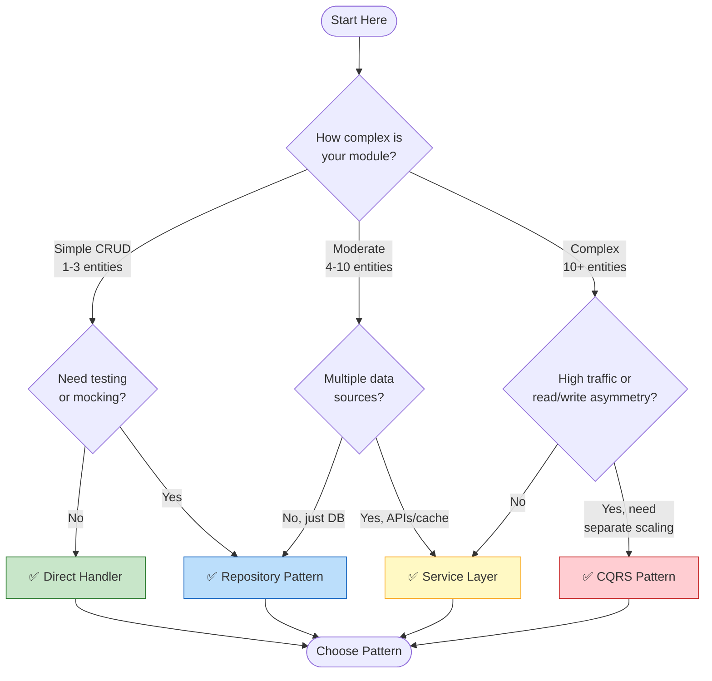
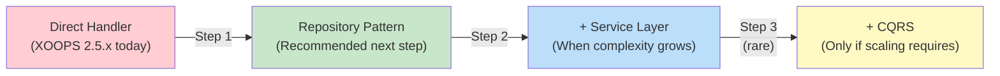

<span class="version-badge version-25x">2.5.x ✅</span> <span class="version-badge version-40x">4.0.x ✅</span>

> **Ποιο μοτίβο να χρησιμοποιήσω;** Αυτό το δέντρο αποφάσεων σάς βοηθά να επιλέξετε ανάμεσα σε άμεσους χειριστές, Μοτίβο αποθετηρίου, Επίπεδο υπηρεσίας και CQRS.

---

## Δέντρο γρήγορης απόφασης



---

## Σύγκριση προτύπων

| Κριτήρια | Άμεσος χειριστής | Αποθετήριο | Επίπεδο υπηρεσίας | CQRS |
|----------|---------------|------------|--------------|------|
| **Πολυπλοκότητα** | ⭐ | ⭐⭐ | ⭐⭐⭐ | ⭐⭐⭐⭐⭐ |
| **Δοκιμαστικότητα** | ❌ Σκληρό | ✅ Καλό | ✅ Εξαιρετικό | ✅ Εξαιρετικό |
| **Ευελιξία** | ❌ Χαμηλό | ✅ Μεσαία | ✅ Υψηλό | ✅ Πολύ ψηλά |
| **XOOPS 2.5.x** | ✅ Εγγενής | ✅ Έργα | ✅ Έργα | ⚠️ Συγκρότημα |
| **XOOPS 4,0** | ⚠️ Καταργήθηκε | ✅ Προτείνεται | ✅ Προτείνεται | ✅ Για ζυγαριά |
| **Μέγεθος ομάδας** | 1 dev | 1-3 προγραμματιστές | 2-5 προγραμματιστές | 5+ προγραμματιστές |
| **Συντήρηση** | ❌ Ανώτερο | ✅ Μέτρια | ✅ Κάτω | ⚠️ Απαιτεί τεχνογνωσία |

---

## Πότε να χρησιμοποιήσετε κάθε μοτίβο

## # ✅ Άμεσος χειριστής (`XoopsPersistableObjectHandler`)

**Το καλύτερο για:** Απλές ενότητες, γρήγορα πρωτότυπα, εκμάθηση XOOPS

```php
// Simple and direct - good for small modules
$handler = xoops_getModuleHandler('article', 'news');
$articles = $handler->getObjects(new Criteria('status', 1));
```

**Επιλέξτε αυτό όταν:**
- Δημιουργία απλής ενότητας με 1-3 πίνακες βάσεων δεδομένων
- Δημιουργία ενός γρήγορου πρωτοτύπου
- Είστε ο μόνος προγραμματιστής και δεν χρειάζεστε δοκιμές
- Η ενότητα δεν θα αναπτυχθεί σημαντικά

**Περιορισμοί:**
- Δύσκολη μονάδα δοκιμής (παγκόσμια εξάρτηση)
- Σφιχτή σύζευξη στο επίπεδο βάσης δεδομένων XOOPS
- Η επιχειρηματική λογική τείνει να διαρρέει στους ελεγκτές

---

## # ✅ Μοτίβο αποθετηρίου

**Το καλύτερο για:** τις περισσότερες ενότητες, ομάδες που θέλουν δυνατότητα δοκιμής

```php
// Abstraction allows mocking for tests
interface ArticleRepositoryInterface {
    public function findPublished(): array;
    public function save(Article $article): void;
}

class XoopsArticleRepository implements ArticleRepositoryInterface {
    private $handler;

    public function __construct() {
        $this->handler = xoops_getModuleHandler('article', 'news');
    }

    public function findPublished(): array {
        return $this->handler->getObjects(new Criteria('status', 1));
    }
}
```

**Επιλέξτε αυτό όταν:**
- Θέλετε να γράψετε δοκιμές μονάδας
- Μπορείτε να αλλάξετε τις πηγές δεδομένων αργότερα (DB → API)
- Συνεργασία με 2+ προγραμματιστές
- Κατασκευή ενοτήτων για διανομή

**Διαδρομή αναβάθμισης:** Αυτό είναι το προτεινόμενο μοτίβο για την προετοιμασία XOOPS 4.0.

---

## # ✅ Επίπεδο υπηρεσιών

**Το καλύτερο για:** Ενότητες με πολύπλοκη επιχειρηματική λογική

```php
// Service coordinates multiple repositories and contains business rules
class ArticlePublicationService {
    public function __construct(
        private ArticleRepositoryInterface $articles,
        private NotificationServiceInterface $notifications,
        private CacheInterface $cache
    ) {}

    public function publish(int $articleId): void {
        $article = $this->articles->find($articleId);
        $article->setStatus('published');
        $article->setPublishedAt(new DateTime());

        $this->articles->save($article);
        $this->notifications->notifySubscribers($article);
        $this->cache->invalidate("article:{$articleId}");
    }
}
```

**Επιλέξτε αυτό όταν:**
- Οι λειτουργίες καλύπτουν πολλαπλές πηγές δεδομένων
- Οι επιχειρηματικοί κανόνες είναι περίπλοκοι
- Χρειάζεστε διαχείριση συναλλαγών
- Πολλά μέρη της εφαρμογής κάνουν το ίδιο πράγμα

**Διαδρομή αναβάθμισης:** Συνδυάστε με το Repository για μια στιβαρή αρχιτεκτονική.

---

## # ⚠️ CQRS (Διαχωρισμός ευθύνης ερωτήματος εντολών)

**Το καλύτερο για:** Ενότητες υψηλής κλίμακας με ασυμμετρία read/write

```php
// Commands modify state
class PublishArticleCommand {
    public function __construct(
        public readonly int $articleId,
        public readonly int $publisherId
    ) {}
}

// Queries read state (can use denormalized read models)
class GetPublishedArticlesQuery {
    public function __construct(
        public readonly int $limit = 10
    ) {}
}
```

**Επιλέξτε αυτό όταν:**
- Οι αναγνώσεις είναι πολύ περισσότερες από τις γραπτές (100:1 ή περισσότερες)
- Χρειάζεστε διαφορετική κλίμακα για ανάγνωση και εγγραφή
- Σύνθετες απαιτήσεις reporting/analytics
- Η προμήθεια εκδηλώσεων θα ωφελούσε τον τομέα σας

**Προειδοποίηση:** CQRS προσθέτει σημαντική πολυπλοκότητα. Οι περισσότερες μονάδες XOOPS δεν το χρειάζονται.

---

## Συνιστώμενη διαδρομή αναβάθμισης



## # Βήμα 1: Αναδίπλωση Handlers σε αποθετήρια (2-4 ώρες)

1. Δημιουργήστε μια διεπαφή για τις ανάγκες πρόσβασης στα δεδομένα σας
2. Εφαρμόστε το χρησιμοποιώντας τον υπάρχοντα χειριστή
3. Εισαγάγετε το αποθετήριο αντί να καλέσετε απευθείας το `xoops_getModuleHandler()`

## # Βήμα 2: Προσθήκη επιπέδου υπηρεσίας όταν χρειάζεται (1-2 ημέρες)

1. Όταν εμφανίζεται η επιχειρηματική λογική στους ελεγκτές, κάντε εξαγωγή σε μια Υπηρεσία
2. Η υπηρεσία χρησιμοποιεί αποθετήρια, όχι απευθείας χειριστές
3. Τα χειριστήρια γίνονται λεπτά (διαδρομή → σέρβις → απόκριση)

## # Βήμα 3: Σκεφτείτε το CQRS Μόνο εάν (σπάνιο)

1. Έχετε εκατομμύρια αναγνώσεις την ημέρα
2. Τα μοντέλα ανάγνωσης και εγγραφής διαφέρουν σημαντικά
3. Χρειάζεστε προμήθεια συμβάντων για ίχνη ελέγχου
4. Έχετε μια ομάδα με εμπειρία με CQRS

---

## Κάρτα γρήγορης αναφοράς

| Ερώτηση | Απάντηση |
|----------|--------|
| **"Χρειάζομαι απλώς save/load δεδομένα"** | Άμεσος χειριστής |
| **"Θέλω να γράψω τεστ"** | Μοτίβο αποθετηρίου |
| **"Έχω πολύπλοκους επιχειρηματικούς κανόνες"** | Επίπεδο υπηρεσίας |
| **"Πρέπει να κλιμακώσω τις αναγνώσεις ξεχωριστά"** | CQRS |
| **"Ετοιμάζομαι για το XOOPS 4.0"** | Αποθετήριο + Επίπεδο υπηρεσίας |

---

## Σχετική τεκμηρίωση

- [Οδηγός μοτίβων αποθετηρίου](Patterns/Repository-Pattern.md)
- [Service Layer Pattern Guide](Patterns/Service-Layer-Pattern.md)
- [CQRS Οδηγός μοτίβων](../07-XOOPS-4.0/Implementation-Guides/CQRS-Pattern-Guide.md) *(για προχωρημένους)*
- [Σύμβαση υβριδικής λειτουργίας](../07-XOOPS-4.0/Specifications/Hybrid-Mode-Contract.md)

---

# patterns #data-access #decision-tree #best-practices #XOOPS
