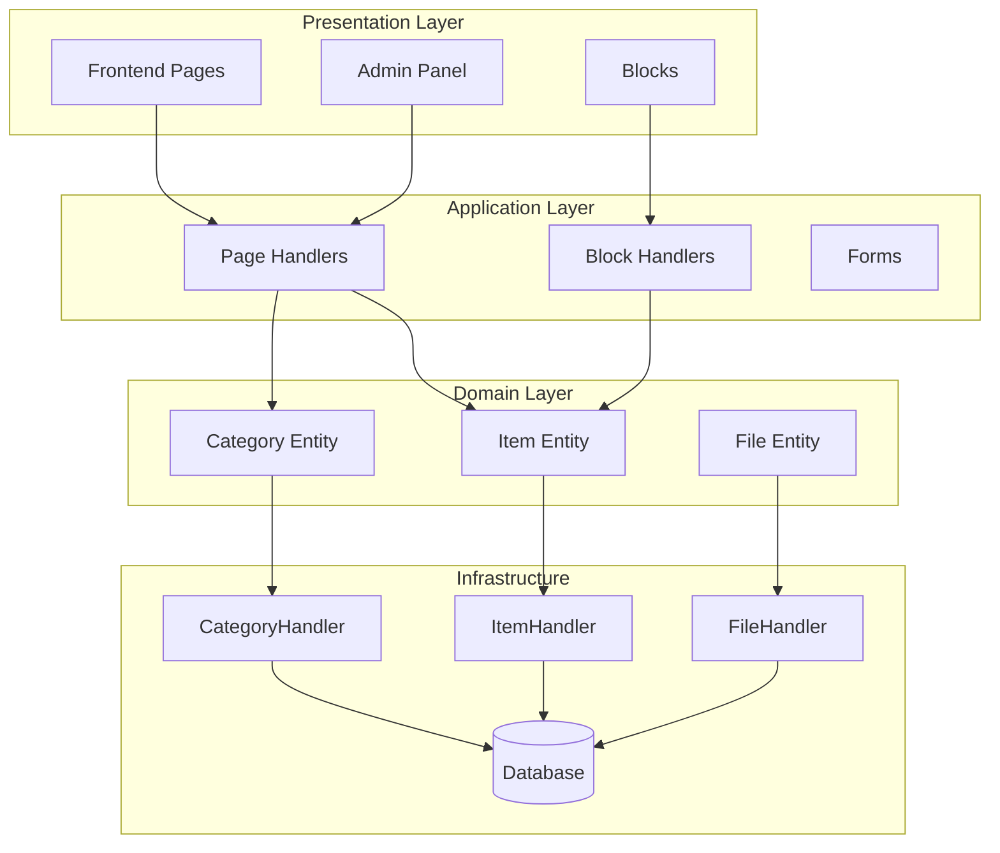
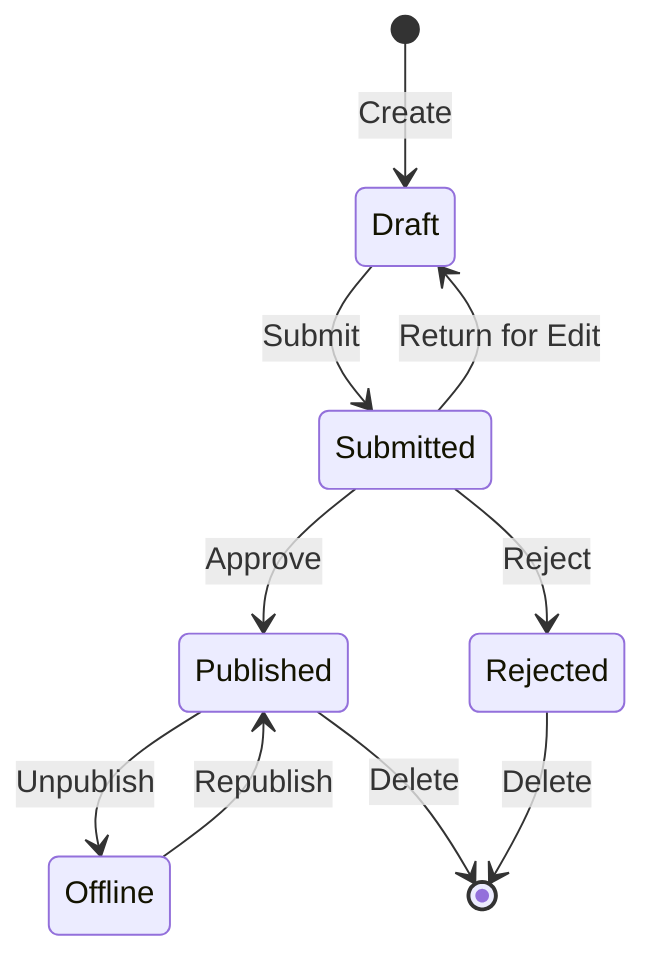

## Επισκόπηση

Αυτό το έγγραφο παρέχει μια τεχνική ανάλυση της αρχιτεκτονικής της ενότητας Publisher, των μοτίβων και των λεπτομερειών υλοποίησης. Χρησιμοποιήστε το ως αναφορά για να κατανοήσετε πώς είναι δομημένο ένα δομοστοιχείο ποιότητας παραγωγής XOOPS.

## Επισκόπηση Αρχιτεκτονικής



## Δομή καταλόγου

```
publisher/
├── admin/
│   ├── index.php           # Admin dashboard
│   ├── item.php            # Article management
│   ├── category.php        # Category management
│   ├── permission.php      # Permissions
│   ├── file.php            # File manager
│   └── menu.php            # Admin menu
├── assets/
│   ├── css/
│   ├── js/
│   └── images/
├── class/
│   ├── Category.php        # Category entity
│   ├── CategoryHandler.php # Category data access
│   ├── Item.php            # Article entity
│   ├── ItemHandler.php     # Article data access
│   ├── File.php            # File attachment
│   ├── FileHandler.php     # File data access
│   ├── Form/               # Form classes
│   ├── Common/             # Utilities
│   └── Helper.php          # Module helper
├── include/
│   ├── common.php          # Initialization
│   ├── functions.php       # Utility functions
│   ├── oninstall.php       # Install hooks
│   ├── onupdate.php        # Update hooks
│   └── search.php          # Search integration
├── language/
├── templates/
├── sql/
└── xoops_version.php
```

## Ανάλυση οντοτήτων

## # Στοιχείο (Άρθρο) Οντότητα

```php
class Item extends \XoopsObject
{
    // Fields
    public function initVar(): void
    {
        $this->initVar('itemid', XOBJ_DTYPE_INT, null, false);
        $this->initVar('categoryid', XOBJ_DTYPE_INT, 0, false);
        $this->initVar('title', XOBJ_DTYPE_TXTBOX, '', true);
        $this->initVar('subtitle', XOBJ_DTYPE_TXTBOX, '');
        $this->initVar('summary', XOBJ_DTYPE_TXTAREA, '');
        $this->initVar('body', XOBJ_DTYPE_TXTAREA, '', true);
        $this->initVar('uid', XOBJ_DTYPE_INT, 0);
        $this->initVar('status', XOBJ_DTYPE_INT, 0);
        $this->initVar('datesub', XOBJ_DTYPE_INT, time());
        // ... more fields
    }

    // Business methods
    public function isPublished(): bool
    {
        return $this->getVar('status') == _PUBLISHER_STATUS_PUBLISHED;
    }

    public function canEdit(int $userId): bool
    {
        return $this->getVar('uid') == $userId
            || $this->isAdmin($userId);
    }
}
```

## # Μοτίβο χειριστή

```php
class ItemHandler extends \XoopsPersistableObjectHandler
{
    public function __construct(\XoopsDatabase $db)
    {
        parent::__construct(
            $db,
            'publisher_items',
            Item::class,
            'itemid',
            'title'
        );
    }

    public function getPublishedItems(int $limit = 10): array
    {
        $criteria = new \CriteriaCompo();
        $criteria->add(new \Criteria('status', _PUBLISHER_STATUS_PUBLISHED));
        $criteria->setSort('datesub');
        $criteria->setOrder('DESC');
        $criteria->setLimit($limit);

        return $this->getObjects($criteria);
    }
}
```

## Σύστημα αδειών

## # Τύποι αδειών

| Άδεια | Περιγραφή |
|------------|-------------|
| `publisher_view` | Προβολή category/articles |
| `publisher_submit` | Υποβολή νέων άρθρων |
| `publisher_approve` | Αυτόματη έγκριση υποβολών |
| `publisher_moderate` | Έλεγχος εκκρεμών άρθρων |
| `publisher_global` | Καθολικές άδειες λειτουργικών μονάδων |

## # Έλεγχος άδειας

```php
class PermissionHandler
{
    public function isGranted(string $permission, int $categoryId): bool
    {
        $userId = $GLOBALS['xoopsUser']?->uid() ?? 0;
        $groups = $this->getUserGroups($userId);

        return $this->grouppermHandler->checkRight(
            $permission,
            $categoryId,
            $groups,
            $this->helper->getModule()->mid()
        );
    }
}
```

## Καταστάσεις ροής εργασίας



## Δομή προτύπου

## # Πρότυπα διεπαφής

| Πρότυπο | Σκοπός |
|----------|---------|
| `publisher_index.tpl` | Αρχική σελίδα ενότητας |
| `publisher_item.tpl` | Ενιαίο άρθρο |
| `publisher_category.tpl` | Καταχώριση κατηγορίας |
| `publisher_submit.tpl` | Έντυπο υποβολής |
| `publisher_search.tpl` | Αποτελέσματα αναζήτησης |

## # Αποκλεισμός προτύπων

| Πρότυπο | Σκοπός |
|----------|---------|
| `publisher_block_latest.tpl` | Πρόσφατα άρθρα |
| `publisher_block_spotlight.tpl` | Επιλεγμένο άρθρο |
| `publisher_block_category.tpl` | Μενού κατηγορίας |

## Χρησιμοποιούνται βασικά μοτίβα

1. **Μοτίβο χειριστή** - Ενθυλάκωση πρόσβασης δεδομένων
2. **Αντικείμενο τιμής** - Σταθερές κατάστασης
3. **Μέθοδος προτύπου** - Δημιουργία φόρμας
4. **Στρατηγική** - Διαφορετικοί τρόποι εμφάνισης
5. **Παρατηρητής** - Ειδοποιήσεις για συμβάντα

## Μαθήματα για Ανάπτυξη Ενοτήτων

1. Χρησιμοποιήστε το XoopsPersistableObjectHandler για το CRUD
2. Εφαρμογή αναλυτικών αδειών
3. Διαχωρίστε την παρουσίαση από τη λογική
4. Χρησιμοποιήστε τα κριτήρια για ερωτήματα
5. Υποστήριξη πολλαπλών καταστάσεων περιεχομένου
6. Ενσωματώστε το σύστημα ειδοποιήσεων XOOPS

## Σχετική τεκμηρίωση

- Δημιουργία-Άρθρα - Διαχείριση άρθρων
- Διαχείριση-Κατηγορίες - Σύστημα Κατηγοριών
- Άδειες-Ρύθμιση - Διαμόρφωση αδειών
- Developer-Guide/Hooks-and-Events - Σημεία επέκτασης
