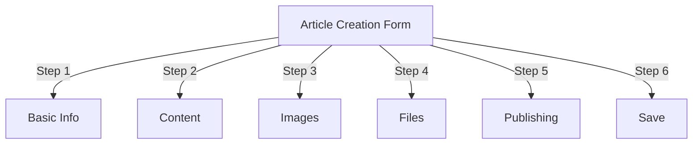
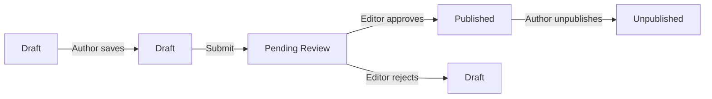
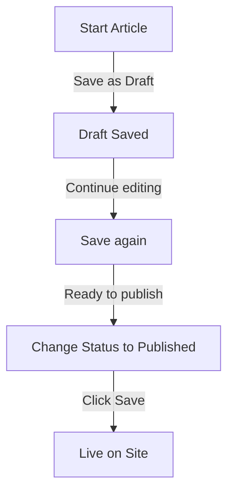

# Δημιουργία άρθρων στον Publisher

> Οδηγός βήμα προς βήμα για τη δημιουργία, την επεξεργασία, τη μορφοποίηση και τη δημοσίευση άρθρων στη μονάδα Publisher.

---

## Πρόσβαση στη Διαχείριση άρθρων

## # Πλοήγηση πίνακα διαχειριστή

```
Admin Panel
└── Modules
    └── Publisher
        └── Articles
            ├── Create New
            ├── Edit
            ├── Delete
            └── Publish
```

## # Το ταχύτερο μονοπάτι

1. Συνδεθείτε ως **Διαχειριστής**
2. Κάντε κλικ στο **Modules** στη γραμμή διαχειριστή
3. Βρείτε τον **Εκδότη**
4. Κάντε κλικ στον σύνδεσμο **Διαχειριστής**
5. Κάντε κλικ στο **Άρθρα** στο αριστερό μενού
6. Κάντε κλικ στο κουμπί **Προσθήκη άρθρου**

---

## Φόρμα δημιουργίας άρθρου

## # Βασικές πληροφορίες

Όταν δημιουργείτε ένα νέο άρθρο, συμπληρώστε τις παρακάτω ενότητες:



---

## Βήμα 1: Βασικές πληροφορίες

## # Υποχρεωτικά πεδία

### # Τίτλος άρθρου

```
Field: Title
Type: Text input (required)
Max length: 255 characters
Example: "Top 5 Tips for Better Photography"
```

**Οδηγίες:**
- Περιγραφικό και συγκεκριμένο
- Συμπεριλάβετε λέξεις-κλειδιά για SEO
- Αποφύγετε ALL CAPS
- Κρατήστε λιγότερους από 60 χαρακτήρες για καλύτερη εμφάνιση

### # Επιλέξτε Κατηγορία

```
Field: Category
Type: Dropdown (required)
Options: List of created categories
Example: Photography > Tutorials
```

**Συμβουλές:**
- Διαθέσιμες γονικές και υποκατηγορίες
- Επιλέξτε την πιο σχετική κατηγορία
- Μόνο μία κατηγορία ανά άρθρο
- Μπορεί να αλλάξει αργότερα

### # Υπότιτλος άρθρου (Προαιρετικό)

```
Field: Subtitle
Type: Text input (optional)
Max length: 255 characters
Example: "Learn photography fundamentals in 5 easy steps"
```

**Χρήση για:**
- Συνοπτική επικεφαλίδα
- Κείμενο teaser
- Εκτεταμένος τίτλος

## # Περιγραφή άρθρου

### # Σύντομη περιγραφή

```
Field: Short Description
Type: Textarea (optional)
Max length: 500 characters
```

**Σκοπός:**
- Κείμενο προεπισκόπησης άρθρου
- Εμφανίζεται στη λίστα κατηγοριών
- Χρησιμοποιείται στα αποτελέσματα αναζήτησης
- Μετα-περιγραφή για SEO

**Παράδειγμα:**
```
"Discover essential photography techniques that will transform your photos
from ordinary to extraordinary. This comprehensive guide covers composition,
lighting, and exposure settings."
```

### # Πλήρες περιεχόμενο

```
Field: Article Body
Type: WYSIWYG Editor (required)
Max length: Unlimited
Format: HTML
```

Η κύρια περιοχή περιεχομένου του άρθρου με επεξεργασία εμπλουτισμένου κειμένου.

---

## Βήμα 2: Μορφοποίηση περιεχομένου

## # Χρήση του επεξεργαστή WYSIWYG

### # Μορφοποίηση κειμένου

```
Bold:           Ctrl+B or click [B] button
Italic:         Ctrl+I or click [I] button
Underline:      Ctrl+U or click [U] button
Strikethrough:  Alt+Shift+D or click [S] button
Subscript:      Ctrl+, (comma)
Superscript:    Ctrl+. (period)
```

### # Δομή επικεφαλίδας

Δημιουργία κατάλληλης ιεραρχίας εγγράφων:

```html
<h1>Article Title</h1>      <!-- Use once at top -->
<h2>Main Section</h2>        <!-- For major sections -->
<h3>Subsection</h3>          <!-- For subtopics -->
<h4>Sub-subsection</h4>      <!-- For details -->
```

**Στο πρόγραμμα επεξεργασίας:**
- Κάντε κλικ στο αναπτυσσόμενο μενού **Μορφή**
- Επιλέξτε επίπεδο επικεφαλίδας (H1-H6)
- Πληκτρολογήστε την επικεφαλίδα σας

### # Λίστες

**Μη ταξινομημένη λίστα (κουκκίδες):**

```markdown
• Point one
• Point two
• Point three
```

Βήματα στον επεξεργαστή:
1. Κάντε κλικ στο κουμπί [≡] Λίστα κουκκίδων
2. Πληκτρολογήστε κάθε σημείο
3. Πατήστε Enter για το επόμενο στοιχείο
4. Πατήστε το Backspace δύο φορές για να τερματίσετε τη λίστα

**Λίστα παραγγελίας (αριθμημένη):**

```markdown
1. First step
2. Second step
3. Third step
```

Βήματα στον επεξεργαστή:
1. Κάντε κλικ στο κουμπί [1.] Αριθμημένη λίστα
2. Πληκτρολογήστε κάθε στοιχείο
3. Πατήστε Enter για το επόμενο
4. Πατήστε το Backspace δύο φορές για να τελειώσετε

**Ένθετες λίστες:**

```markdown
1. Main point
   a. Sub-point
   b. Sub-point
2. Next point
```

Βήματα:
1. Δημιουργήστε την πρώτη λίστα
2. Πατήστε Tab για εσοχή
3. Δημιουργήστε ένθετα αντικείμενα
4. Πατήστε Shift+Tab για outdent

### # Σύνδεσμοι

**Προσθήκη υπερσυνδέσμου:**

1. Επιλέξτε κείμενο για σύνδεση
2. Κάντε κλικ στο κουμπί **[👉] Σύνδεσμος**
3. Εισαγάγετε URL: `https://example.com`
4. Προαιρετικά: Προσθέστε title/target
5. Κάντε κλικ στο **Εισαγωγή συνδέσμου**

**Κατάργηση συνδέσμου:**

1. Κάντε κλικ στο συνδεδεμένο κείμενο
2. Κάντε κλικ στο κουμπί **[👉] Κατάργηση συνδέσμου**

### # Κωδικός & Εισαγωγικά

**Μπλοκ απόσπασμα:**

```
"This is an important quote from an expert"
- Attribution
```

Βήματα:
1. Πληκτρολογήστε κείμενο προσφοράς
2. Κάντε κλικ στο κουμπί **[❝] Blockquote**
3. Το κείμενο έχει εσοχές και στυλ

**Μπλοκ κωδικού:**

```python
def hello_world():
    print("Hello, World!")
```

Βήματα:
1. Κάντε κλικ στο **Μορφή → Κωδικός**
2. Επικόλληση κώδικα
3. Επιλέξτε γλώσσα (προαιρετικό)
4. Εμφανίζεται κώδικας με επισήμανση σύνταξης

---

## Βήμα 3: Προσθήκη εικόνων

## # Επιλεγμένη εικόνα (Εικόνα ήρωα)

```
Field: Featured Image / Main Image
Type: Image upload
Format: JPG, PNG, GIF, WebP
Max size: 5 MB
Recommended: 600x400 px
```

**Για μεταφόρτωση:**

1. Κάντε κλικ στο κουμπί **Μεταφόρτωση εικόνας**
2. Επιλέξτε εικόνα από υπολογιστή
3. Crop/resize εάν χρειάζεται
4. Κάντε κλικ στο **Χρήση αυτής της εικόνας**

**Τοποθέτηση εικόνας:**
- Εμφανίζεται στην κορυφή του άρθρου
- Χρησιμοποιείται σε καταχωρίσεις κατηγοριών
- Εμφανίζεται στο αρχείο
- Χρησιμοποιείται για κοινή χρήση μέσων κοινωνικής δικτύωσης

## # Ενσωματωμένες εικόνες

Εισαγάγετε εικόνες μέσα στο κείμενο του άρθρου:

1. Τοποθετήστε τον κέρσορα στο πρόγραμμα επεξεργασίας όπου πρέπει να πάει η εικόνα
2. Κάντε κλικ στο κουμπί **[🖼️] Εικόνα** στη γραμμή εργαλείων
3. Επιλέξτε μεταφόρτωση:
   - Ανεβάστε νέα εικόνα
   - Επιλέξτε από τη συλλογή
   - Εισαγάγετε την εικόνα URL
4. Διαμόρφωση:
   
```
   Image Size:
   - Width: 300-600 px
   - Height: Auto (maintains ratio)
   - Alignment: Left/Center/Right
   
```
5. Κάντε κλικ στην **Εισαγωγή εικόνας**

**Τύλιξη κειμένου γύρω από εικόνα:**

Στο πρόγραμμα επεξεργασίας μετά την εισαγωγή:

```html
<!-- Image floats left, text wraps around -->

```

## # Συλλογή εικόνων

Δημιουργία συλλογής πολλών εικόνων:

1. Κάντε κλικ στο κουμπί **Συλλογή** (εάν υπάρχει)
2. Μεταφορτώστε πολλές εικόνες:
   - Ένα μόνο κλικ: Προσθήκη ενός
   - Μεταφορά και απόθεση: Προσθήκη πολλών
3. Τακτοποιήστε τη σειρά σύροντας
4. Ορίστε λεζάντες για κάθε εικόνα
5. Κάντε κλικ στο **Δημιουργία συλλογής**

---

## Βήμα 4: Επισύναψη αρχείων

## # Προσθήκη συνημμένων αρχείων

```
Field: File Attachments
Type: File upload (multiple allowed)
Supported: PDF, DOC, XLS, ZIP, etc.
Max per file: 10 MB
Max per article: 5 files
```

**Για επισύναψη:**

1. Κάντε κλικ στο κουμπί **Προσθήκη αρχείου**
2. Επιλέξτε αρχείο από υπολογιστή
3. Προαιρετικό: Προσθήκη περιγραφής αρχείου
4. Κάντε κλικ στην επιλογή **Επισύναψη αρχείου**
5. Επαναλάβετε για πολλά αρχεία

**Παραδείγματα αρχείων:**
- PDF οδηγοί
- Υπολογιστικά φύλλα Excel
- Έγγραφα Word
- ZIP αρχεία
- Πηγαίος κώδικας

## # Διαχείριση συνημμένων αρχείων

**Επεξεργασία αρχείου:**

1. Κάντε κλικ στο όνομα αρχείου
2. Επεξεργασία περιγραφής
3. Κάντε κλικ στο **Αποθήκευση**

**Διαγραφή αρχείου:**

1. Βρείτε το αρχείο στη λίστα
2. Κάντε κλικ στο εικονίδιο **[×] Διαγραφή**
3. Επιβεβαιώστε τη διαγραφή

---

## Βήμα 5: Δημοσίευση & Κατάσταση

## # Κατάσταση άρθρου

```
Field: Status
Type: Dropdown
Options:
  - Draft: Not published, only author sees
  - Pending: Waiting for approval
  - Published: Live on site
  - Archived: Old content
  - Unpublished: Was published, now hidden
```

**Ροή εργασιών κατάστασης:**



## # Επιλογές δημοσίευσης

### # Δημοσίευση Αμέσως

```
Status: Published
Start Date: Today (auto-filled)
End Date: (leave blank for no expiration)
```

### # Πρόγραμμα για αργότερα

```
Status: Scheduled
Start Date: Future date/time
Example: February 15, 2024 at 9:00 AM
```

Το άρθρο θα δημοσιευτεί αυτόματα σε καθορισμένη ώρα.

### # Ορισμός λήξης

```
Enable Expiration: Yes
Expiration Date: Future date
Action: Archive/Hide/Delete
Example: April 1, 2024 (article auto-archives)
```

## # Επιλογές ορατότητας

```yaml
Show Article:
  - Display on front page: Yes/No
  - Show in category: Yes/No
  - Include in search: Yes/No
  - Include in recent articles: Yes/No

Featured Article:
  - Mark as featured: Yes/No
  - Featured section position: (number)
```

---

## Βήμα 6: SEO & Μεταδεδομένα

## # SEO Ρυθμίσεις

```
Field: SEO Settings (Expand section)
```

### # Meta Description

```
Field: Meta Description
Type: Text (160 characters recommended)
Used by: Search engines, social media

Example:
"Learn photography fundamentals in 5 easy steps.
Discover composition, lighting, and exposure techniques."
```

### # Meta Λέξεις-κλειδιά

```
Field: Meta Keywords
Type: Comma-separated list
Max: 5-10 keywords

Example: Photography, Tutorial, Composition, Lighting, Exposure
```

### # URL γυμνοσάλιαγκος

```
Field: URL Slug (auto-generated from title)
Type: Text
Format: lowercase, hyphens, no spaces

Auto: "top-5-tips-for-better-photography"
Edit: Change before publishing
```

### # Ανοίξτε τις ετικέτες γραφήματος

Δημιουργείται αυτόματα από πληροφορίες άρθρου:
- Τίτλος
- Περιγραφή
- Επιλεγμένη εικόνα
- Άρθρο URL
- Ημερομηνία δημοσίευσης

Χρησιμοποιείται από Facebook, LinkedIn, WhatsApp κ.λπ.

---

## Βήμα 7: Σχόλια και αλληλεπίδραση

## # Ρυθμίσεις σχολίων

```yaml
Allow Comments:
  - Enable: Yes/No
  - Default: Inherit from preferences
  - Override: Specific to this article

Moderate Comments:
  - Require approval: Yes/No
  - Default: Inherit from preferences
```

## # Ρυθμίσεις αξιολόγησης

```yaml
Allow Ratings:
  - Enable: Yes/No
  - Scale: 5 stars (default)
  - Show average: Yes/No
  - Show count: Yes/No
```

---

## Βήμα 8: Προηγμένες επιλογές

## # Συγγραφέας & Byline

```
Field: Author
Type: Dropdown
Default: Current user
Options: All users with author permission

Display:
  - Show author name: Yes/No
  - Show author bio: Yes/No
  - Show author avatar: Yes/No
```

## # Επεξεργασία κλειδώματος

```
Field: Edit Lock
Purpose: Prevent accidental changes

Lock Article:
  - Locked: Yes/No
  - Lock reason: "Final version"
  - Unlock date: (optional)
```

## # Ιστορικό αναθεωρήσεων

Αυτόματες αποθηκευμένες εκδόσεις του άρθρου:

```
View Revisions:
  - Click "Revision History"
  - Shows all saved versions
  - Compare versions
  - Restore previous version
```

---

## Αποθήκευση και δημοσίευση

## # Αποθήκευση ροής εργασίας



## # Αποθήκευση άρθρου

**Αυτόματη αποθήκευση:**
- Ενεργοποιείται κάθε 60 δευτερόλεπτα
- Αποθηκεύεται αυτόματα ως πρόχειρο
- Εμφανίζει "Τελευταία αποθήκευση: πριν από 2 λεπτά"

**Μη αυτόματη αποθήκευση:**
- Κάντε κλικ στο **Αποθήκευση & Συνέχεια** για να συνεχίσετε την επεξεργασία
- Κάντε κλικ στο **Αποθήκευση & Προβολή** για να δείτε τη δημοσιευμένη έκδοση
- Κάντε κλικ στο **Αποθήκευση** για αποθήκευση και κλείσιμο

## # Δημοσίευση άρθρου

1. Ορισμός **Κατάσταση**: Δημοσιεύτηκε
2. Ορίστε **Ημερομηνία έναρξης**: Τώρα (ή μελλοντική ημερομηνία)
3. Κάντε κλικ στην επιλογή **Αποθήκευση** ή **Δημοσίευση**
4. Εμφανίζεται το μήνυμα επιβεβαίωσης
5. Το άρθρο είναι ζωντανό (ή προγραμματισμένο)

---

## Επεξεργασία υπαρχόντων άρθρων

## # Πρόσβαση στον επεξεργαστή άρθρου

1. Μεταβείτε στο **Διαχειριστής → Εκδότης → Άρθρα**
2. Βρείτε το άρθρο στη λίστα
3. Κάντε κλικ στο **Επεξεργασία** icon/button
4. Κάντε αλλαγές
5. Κάντε κλικ στο **Αποθήκευση**

## # Μαζική επεξεργασία

Επεξεργαστείτε πολλά άρθρα ταυτόχρονα:

```
1. Go to Articles list
2. Select articles (checkboxes)
3. Choose "Bulk Edit" from dropdown
4. Change selected field
5. Click "Update All"

Available for:
  - Status
  - Category
  - Featured (Yes/No)
  - Author
```

## # Προεπισκόπηση άρθρου

Πριν από τη δημοσίευση:

1. Κάντε κλικ στο κουμπί **Προεπισκόπηση**
2. Προβολή όπως θα δουν οι αναγνώστες
3. Ελέγξτε τη μορφοποίηση
4. Δοκιμή συνδέσμων
5. Επιστρέψτε στο πρόγραμμα επεξεργασίας για προσαρμογή

---

## Διαχείριση άρθρου

## # Προβολή όλων των άρθρων

**Προβολή λίστας άρθρων:**

```
Admin → Publisher → Articles

Columns:
  - Title
  - Category
  - Author
  - Status
  - Created date
  - Modified date
  - Actions (Edit, Delete, Preview)

Sorting:
  - By title (A-Z)
  - By date (newest/oldest)
  - By status (Published/Draft)
  - By category
```

## # Φιλτράρισμα άρθρων

```
Filter Options:
  - By category
  - By status
  - By author
  - By date range
  - Search by title

Example: Show all "Draft" articles by "John" in "News" category
```

## # Διαγραφή άρθρου

**Απαλή διαγραφή (Συνιστάται):**

1. Αλλαγή **Κατάσταση**: Μη δημοσιευμένο
2. Κάντε κλικ στο **Αποθήκευση**
3. Το άρθρο κρύφτηκε αλλά δεν διαγράφηκε
4. Μπορεί να αποκατασταθεί αργότερα

**Σκληρή διαγραφή:**

1. Επιλέξτε άρθρο στη λίστα
2. Κάντε κλικ στο κουμπί **Διαγραφή**
3. Επιβεβαιώστε τη διαγραφή
4. Το άρθρο αφαιρέθηκε οριστικά

---

## Βέλτιστες πρακτικές περιεχομένου

## # Γράψιμο ποιοτικών άρθρων

```
Structure:
  ✓ Compelling title
  ✓ Clear subtitle/description
  ✓ Engaging opening paragraph
  ✓ Logical sections with headers
  ✓ Supporting visuals
  ✓ Conclusion/summary
  ✓ Call-to-action

Length:
  - Blog posts: 500-2000 words
  - News: 300-800 words
  - Guides: 2000-5000 words
  - Minimum: 300 words
```

## # SEO Βελτιστοποίηση

```
Title Optimization:
  ✓ Include primary keyword
  ✓ Keep under 60 characters
  ✓ Put keyword near beginning
  ✓ Be descriptive and specific

Content Optimization:
  ✓ Use headings (H1, H2, H3)
  ✓ Include keyword in heading
  ✓ Use bold for important terms
  ✓ Add descriptive links
  ✓ Include images with alt text

Meta Description:
  ✓ Include primary keyword
  ✓ 155-160 characters
  ✓ Action-oriented
  ✓ Unique per article
```

## # Συμβουλές μορφοποίησης

```
Readability:
  ✓ Short paragraphs (2-4 sentences)
  ✓ Bullet points for lists
  ✓ Subheadings every 300 words
  ✓ Generous whitespace
  ✓ Line breaks between sections

Visual Appeal:
  ✓ Featured image at top
  ✓ Inline images in content
  ✓ Alt text on all images
  ✓ Code blocks for technical
  ✓ Blockquotes for emphasis
```

---

## Συντομεύσεις πληκτρολογίου

## # Συντομεύσεις προγράμματος επεξεργασίας

```
Bold:               Ctrl+B
Italic:             Ctrl+I
Underline:          Ctrl+U
Link:               Ctrl+K
Save Draft:         Ctrl+S
```

## # Συντομεύσεις κειμένου

```
-- →  (dash to em dash)
... → … (three dots to ellipsis)
(c) → © (copyright)
(r) → ® (registered)
(tm) → ™ (trademark)
```

---

## Κοινές εργασίες

## # Αντιγραφή άρθρου

1. Ανοιχτό άρθρο
2. Κάντε κλικ στο κουμπί **Διπλότυπο** ή **Κλωνοποίηση**
3. Το άρθρο αντιγράφηκε ως προσχέδιο
4. Επεξεργαστείτε τον τίτλο και το περιεχόμενο
5. Δημοσίευση

## # Πρόγραμμα άρθρου

1. Δημιουργία άρθρου
2. Ορίστε **Ημερομηνία έναρξης**: Μέλλον date/time
3. Ορισμός **Κατάσταση**: Δημοσιεύτηκε
4. Κάντε κλικ στο **Αποθήκευση**
5. Το άρθρο δημοσιεύεται αυτόματα

## # Μαζική δημοσίευση

1. Δημιουργήστε άρθρα ως προσχέδια
2. Ορίστε ημερομηνίες δημοσίευσης
3. Τα άρθρα δημοσιεύονται αυτόματα σε προγραμματισμένες ώρες
4. Παρακολούθηση από την προβολή "Προγραμματισμένη".

## # Μετακίνηση μεταξύ κατηγοριών

1. Επεξεργασία άρθρου
2. Αλλάξτε το αναπτυσσόμενο μενού **Κατηγορία**
3. Κάντε κλικ στο **Αποθήκευση**
4. Το άρθρο εμφανίζεται στη νέα κατηγορία

---

## Αντιμετώπιση προβλημάτων

## # Πρόβλημα: Δεν είναι δυνατή η αποθήκευση του άρθρου

**Λύση:**
```
1. Check form for required fields
2. Verify category is selected
3. Check PHP memory limit
4. Try saving as draft first
5. Clear browser cache
```

## # Πρόβλημα: Οι εικόνες δεν εμφανίζονται

**Λύση:**
```
1. Verify image upload succeeded
2. Check image file format (JPG, PNG)
3. Verify image path in database
4. Check upload directory permissions
5. Try re-uploading image
```

## # Πρόβλημα: Η γραμμή εργαλείων επεξεργασίας δεν εμφανίζεται

**Λύση:**
```
1. Clear browser cache
2. Try different browser
3. Disable browser extensions
4. Check JavaScript console for errors
5. Verify editor plugin installed
```

## # Πρόβλημα: Το άρθρο δεν δημοσιεύεται

**Λύση:**
```
1. Verify Status = "Published"
2. Check Start Date is today or earlier
3. Verify permissions allow publishing
4. Check category is published
5. Clear module cache
```

---

## Σχετικοί οδηγοί

- Οδηγός διαμόρφωσης
- Διαχείριση Κατηγορίας
- Ρύθμιση άδειας
- Προσαρμοσμένα πρότυπα

---

## Επόμενα βήματα

- Δημιουργήστε το πρώτο σας άρθρο
- Ρύθμιση Κατηγοριών
- Διαμόρφωση δικαιωμάτων
- Εξετάστε την προσαρμογή προτύπου

---

# εκδότης #άρθρα #περιεχόμενο #δημιουργία #μορφοποίηση #επεξεργασία #XOOPS
