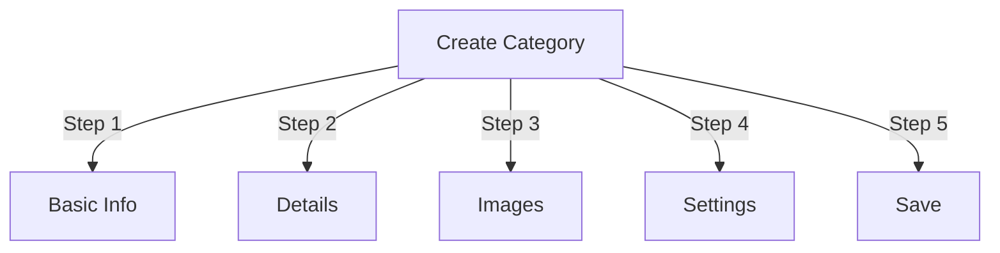

# Διαχείριση κατηγοριών στον Publisher

> Πλήρης οδηγός για τη δημιουργία, την οργάνωση ιεραρχιών και τη διαχείριση κατηγοριών στη λειτουργική μονάδα Publisher.

---

## Βασικά Κατηγορία

## # Τι είναι οι κατηγορίες;

Οι κατηγορίες οργανώνουν τα άρθρα σε λογικές ομάδες:

```
Example Structure:

  News (Main Category)
    ├── Technology
    ├── Sports
    └── Entertainment

  Tutorials (Main Category)
    ├── Photography
    │   ├── Basics
    │   └── Advanced
    └── Writing
        └── Blogging
```

## # Πλεονεκτήματα της καλής δομής κατηγορίας

```
✓ Better user navigation
✓ Organized content
✓ Improved SEO
✓ Easier content management
✓ Better editorial workflow
```

---

## Πρόσβαση στη Διαχείριση κατηγορίας

## # Πλοήγηση πίνακα διαχειριστή

```
Admin Panel
└── Modules
    └── Publisher
        └── Categories
            ├── Create New
            ├── Edit
            ├── Delete
            ├── Permissions
            └── Organize
```

## # Γρήγορη πρόσβαση

1. Συνδεθείτε ως **Διαχειριστής**
2. Μεταβείτε στο **Διαχειριστής → Ενότητες**
3. Κάντε κλικ στο **Εκδότης → Διαχειριστής**
4. Κάντε κλικ στο **Κατηγορίες** στο αριστερό μενού

---

## Δημιουργία Κατηγοριών

## # Φόρμα δημιουργίας κατηγορίας



## # Βήμα 1: Βασικές πληροφορίες

### # Όνομα κατηγορίας

```
Field: Category Name
Type: Text input (required)
Max length: 100 characters
Uniqueness: Should be unique
Example: "Photography"
```

**Οδηγίες:**
- Περιγραφικό και ενικό ή πληθυντικό με συνέπεια
- Με κεφαλαία σωστά
- Αποφύγετε τους ειδικούς χαρακτήρες
- Κρατήστε αρκετά σύντομο

### # Περιγραφή κατηγορίας

```
Field: Description
Type: Textarea (optional)
Max length: 500 characters
Used in: Category listing pages, category blocks
```

**Σκοπός:**
- Εξηγεί το περιεχόμενο της κατηγορίας
- Εμφανίζεται πάνω από τα άρθρα της κατηγορίας
- Βοηθά τους χρήστες να κατανοήσουν το εύρος
- Χρησιμοποιείται για μετα-περιγραφή SEO

**Παράδειγμα:**
```
"Photography tips, tutorials, and inspiration for
all skill levels. From composition basics to advanced
lighting techniques, master your craft."
```

## # Βήμα 2: Γονική κατηγορία

### # Δημιουργία Ιεραρχίας

```
Field: Parent Category
Type: Dropdown
Options: None (root), or existing categories
```

**Παραδείγματα ιεραρχίας:**

```
Flat Structure:
  News
  Tutorials
  Reviews

Nested Structure:
  News
    Technology
    Business
    Sports
  Tutorials
    Photography
      Basics
      Advanced
    Writing
```

**Δημιουργία Υποκατηγορίας:**

1. Κάντε κλικ στο αναπτυσσόμενο μενού **Γονική κατηγορία**
2. Επιλέξτε γονέα (π.χ. "Ειδήσεις")
3. Συμπληρώστε το όνομα της κατηγορίας
4. Αποθήκευση
5. Η νέα κατηγορία εμφανίζεται ως παιδί

## # Βήμα 3: Εικόνα κατηγορίας

### # Μεταφόρτωση εικόνας κατηγορίας

```
Field: Category Image
Type: Image upload (optional)
Format: JPG, PNG, GIF, WebP
Max size: 5 MB
Recommended: 300x200 px (or your theme size)
```

**Για μεταφόρτωση:**

1. Κάντε κλικ στο κουμπί **Μεταφόρτωση εικόνας**
2. Επιλέξτε εικόνα από υπολογιστή
3. Crop/resize εάν χρειάζεται
4. Κάντε κλικ στο **Χρήση αυτής της εικόνας**

**Πού χρησιμοποιείται:**
- Σελίδα καταχώρισης κατηγορίας
- Κεφαλίδα μπλοκ κατηγορίας
- Ψωμί (μερικά θέματα)
- Κοινή χρήση μέσων κοινωνικής δικτύωσης

## # Βήμα 4: Ρυθμίσεις κατηγορίας

### # Ρυθμίσεις οθόνης

```yaml
Status:
  - Enabled: Yes/No
  - Hidden: Yes/No (hidden from menus, still accessible)

Display Options:
  - Show description: Yes/No
  - Show image: Yes/No
  - Show article count: Yes/No
  - Show subcategories: Yes/No

Layout:
  - Items per page: 10-50
  - Display order: Date/Title/Author
  - Display direction: Ascending/Descending
```

### # Δικαιώματα κατηγορίας

```yaml
Who Can View:
  - Anonymous: Yes/No
  - Registered: Yes/No
  - Specific groups: Configure per group

Who Can Submit:
  - Registered: Yes/No
  - Specific groups: Configure per group
  - Author must have: "submit articles" permission
```

## # Βήμα 5: SEO Ρυθμίσεις

### # Meta Tags

```
Field: Meta Description
Type: Text (160 characters)
Purpose: Search engine description

Field: Meta Keywords
Type: Comma-separated list
Example: photography, tutorials, tips, techniques
```

### # URL Διαμόρφωση

```
Field: URL Slug
Type: Text
Auto-generated from category name
Example: "photography" from "Photography"
Can be customized before saving
```

## # Αποθήκευση κατηγορίας

1. Συμπληρώστε όλα τα απαιτούμενα πεδία:
   - Όνομα κατηγορίας ✓
   - Περιγραφή (συνιστάται)
2. Προαιρετικά: Μεταφόρτωση εικόνας, ορίστε SEO
3. Κάντε κλικ στην επιλογή **Αποθήκευση κατηγορίας**
4. Εμφανίζεται το μήνυμα επιβεβαίωσης
5. Η κατηγορία είναι πλέον διαθέσιμη

---

## Ιεραρχία κατηγορίας

## # Δημιουργία ένθετης δομής

```
Step-by-step example: Create News → Technology subcategory

1. Go to Categories admin
2. Click "Add Category"
3. Name: "News"
4. Parent: (leave blank - this is root)
5. Save
6. Click "Add Category" again
7. Name: "Technology"
8. Parent: "News" (select from dropdown)
9. Save
```

## # Προβολή δέντρου ιεραρχίας

```
Categories view shows tree structure:

📁 News
  📄 Technology
  📄 Sports
  📄 Entertainment
📁 Tutorials
  📄 Photography
    📄 Basics
    📄 Advanced
  📄 Writing
```

Κάντε κλικ στην επέκταση των βελών στις υποκατηγορίες show/hide.

## # Αναδιοργάνωση κατηγοριών

### # Μετακίνηση κατηγορίας

1. Μεταβείτε στη λίστα Κατηγορίες
2. Κάντε κλικ στο **Επεξεργασία** στην κατηγορία
3. Αλλαγή **Γονικής Κατηγορίας**
4. Κάντε κλικ στο **Αποθήκευση**
5. Η κατηγορία μεταφέρθηκε σε νέα θέση

### # Αναπαραγγελία κατηγοριών

Εάν είναι διαθέσιμο, χρησιμοποιήστε μεταφορά και απόθεση:

1. Μεταβείτε στη λίστα Κατηγορίες
2. Κάντε κλικ και σύρετε την κατηγορία
3. Πτώση σε νέα θέση
4. Η παραγγελία αποθηκεύεται αυτόματα

### # Διαγραφή κατηγορίας

**Επιλογή 1: Soft Delete (Απόκρυψη)**

1. Επεξεργασία κατηγορίας
2. Ορισμός **Κατάσταση**: Απενεργοποιημένο
3. Κάντε κλικ στο **Αποθήκευση**
4. Η κατηγορία είναι κρυφή αλλά δεν έχει διαγραφεί

**Επιλογή 2: Σκληρή διαγραφή**

1. Μεταβείτε στη λίστα Κατηγορίες
2. Κάντε κλικ στο **Διαγραφή** στην κατηγορία
3. Επιλέξτε ενέργεια για άρθρα:
   
```
   ☐ Move articles to parent category
   ☐ Move articles to root (News)
   ☐ Delete all articles in category
   
```
4. Επιβεβαιώστε τη διαγραφή

---

## Λειτουργίες κατηγορίας

## # Επεξεργασία κατηγορίας

1. Μεταβείτε στο **Διαχειριστής → Εκδότης → Κατηγορίες**
2. Κάντε κλικ στο **Επεξεργασία** στην κατηγορία
3. Τροποποίηση πεδίων:
   - Όνομα
   - Περιγραφή
   - Κατηγορία γονέα
   - Εικόνα
   - Ρυθμίσεις
4. Κάντε κλικ στο **Αποθήκευση**

## # Επεξεργασία δικαιωμάτων κατηγορίας

1. Μεταβείτε στις Κατηγορίες
2. Κάντε κλικ στο **Δικαιώματα** στην κατηγορία (ή κάντε κλικ στην κατηγορία και μετά κάντε κλικ στην επιλογή Δικαιώματα)
3. Διαμόρφωση ομάδων:

```
For each group:
  ☐ View articles in this category
  ☐ Submit articles to this category
  ☐ Edit own articles
  ☐ Edit all articles
  ☐ Approve/Moderate articles
  ☐ Manage category
```

4. Κάντε κλικ στην επιλογή **Αποθήκευση δικαιωμάτων**

## # Ορισμός εικόνας κατηγορίας

**Μεταφόρτωση νέας εικόνας:**

1. Επεξεργασία κατηγορίας
2. Κάντε κλικ στο **Αλλαγή εικόνας**
3. Μεταφορτώστε ή επιλέξτε εικόνα
4. Crop/resize
5. Κάντε κλικ στο **Χρήση εικόνας**
6. Κάντε κλικ στην επιλογή **Αποθήκευση κατηγορίας**

**Κατάργηση εικόνας:**

1. Επεξεργασία κατηγορίας
2. Κάντε κλικ στο **Κατάργηση εικόνας** (αν υπάρχει)
3. Κάντε κλικ στην επιλογή **Αποθήκευση κατηγορίας**

---

## Δικαιώματα κατηγορίας

## # Πίνακας δικαιωμάτων

```
                 Anonymous  Registered  Editor  Admin
View category        ✓         ✓         ✓       ✓
Submit article       ✗         ✓         ✓       ✓
Edit own article     ✗         ✓         ✓       ✓
Edit all articles    ✗         ✗         ✓       ✓
Moderate articles    ✗         ✗         ✓       ✓
Manage category      ✗         ✗         ✗       ✓
```

## # Ορίστε δικαιώματα σε επίπεδο κατηγορίας

### # Έλεγχος πρόσβασης ανά κατηγορία

1. Μεταβείτε στη λίστα **Κατηγορίες**
2. Επιλέξτε μια κατηγορία
3. Κάντε κλικ στο **Δικαιώματα**
4. Για κάθε ομάδα, επιλέξτε δικαιώματα:

```
Example: News category
  Anonymous:   View only
  Registered:  Submit articles
  Editors:     Approve articles
  Admins:      Full control
```

5. Κάντε κλικ στο **Αποθήκευση**

### # Δικαιώματα επιπέδου πεδίου

Ελέγξτε ποια πεδία φόρμας μπορούν οι χρήστες see/edit:

```
Example: Limit field visibility for Registered users

Registered users can see/edit:
  ✓ Title
  ✓ Description
  ✓ Content
  ✗ Author (auto-set to current user)
  ✗ Scheduled date (only editors)
  ✗ Featured (only admins)
```

**Διαμόρφωση σε:**
- Δικαιώματα κατηγορίας
- Αναζητήστε την ενότητα "Ορατότητα πεδίου".

---

## Βέλτιστες πρακτικές για κατηγορίες

## # Δομή κατηγορίας

```
✓ Keep hierarchy 2-3 levels deep
✗ Don't create too many top-level categories
✗ Don't create categories with one article

✓ Use consistent naming (plural or singular)
✗ Don't use vague names ("Stuff", "Other")

✓ Create categories for articles that exist
✗ Don't create empty categories in advance
```

## # Οδηγίες ονομασίας

```
Good names:
  "Photography"
  "Web Development"
  "Travel Tips"
  "Business News"

Avoid:
  "Articles" (too vague)
  "Content" (redundant)
  "News&Updates" (inconsistent)
  "PHOTOGRAPHY STUFF" (formatting)
```

## # Συμβουλές οργάνωσης

```
By Topic:
  News
    Technology
    Sports
    Entertainment

By Type:
  Tutorials
    Video
    Text
    Interactive

By Audience:
  For Beginners
  For Experts
  Case Studies

Geographic:
  North America
    United States
    Canada
  Europe
```

---

## Μπλοκ κατηγορίας

## # Αποκλεισμός κατηγορίας εκδότη

Εμφάνιση καταχωρίσεων κατηγοριών στον ιστότοπό σας:

1. Μεταβείτε στο **Διαχειριστής → Αποκλεισμοί**
2. Βρείτε **Εκδότη - Κατηγορίες**
3. Κάντε κλικ στο **Επεξεργασία**
4. Διαμόρφωση:

```
Block Title: "News Categories"
Show subcategories: Yes/No
Show article count: Yes/No
Height: (pixels or auto)
```

5. Κάντε κλικ στο **Αποθήκευση**

## # Αποκλεισμός άρθρων κατηγορίας

Εμφάνιση πιο πρόσφατων άρθρων από συγκεκριμένη κατηγορία:

1. Μεταβείτε στο **Διαχειριστής → Αποκλεισμοί**
2. Βρείτε **Εκδότη - Άρθρα Κατηγορίας**
3. Κάντε κλικ στο **Επεξεργασία**
4. Επιλέξτε:

```
Category: News (or specific category)
Number of articles: 5
Show images: Yes/No
Show description: Yes/No
```

5. Κάντε κλικ στο **Αποθήκευση**

---

## Κατηγορία Analytics

## # Προβολή στατιστικών κατηγοριών

Από τις κατηγορίες διαχειριστής:

```
Each category shows:
  - Total articles: 45
  - Published: 42
  - Draft: 2
  - Pending approval: 1
  - Total views: 5,234
  - Latest article: 2 hours ago
```

## # Προβολή επισκεψιμότητας κατηγορίας

Εάν είναι ενεργοποιημένα τα αναλυτικά στοιχεία:

1. Κάντε κλικ στο όνομα κατηγορίας
2. Κάντε κλικ στην καρτέλα **Στατιστικά στοιχεία**
3. Προβολή:
   - Προβολές σελίδας
   - Δημοφιλή άρθρα
   - Κυκλοφοριακές τάσεις
   - Όροι αναζήτησης που χρησιμοποιούνται

---

## Πρότυπα κατηγορίας

## # Προσαρμογή εμφάνισης κατηγορίας

Εάν χρησιμοποιείτε προσαρμοσμένα πρότυπα, κάθε κατηγορία μπορεί να παρακάμψει:

```
publisher_category.tpl
  ├── Category header
  ├── Category description
  ├── Category image
  ├── Article listing
  └── Pagination
```

**Για προσαρμογή:**

1. Αντιγράψτε το αρχείο προτύπου
2. Τροποποίηση HTML/CSS
3. Εκχώρηση κατηγορίας στο admin
4. Η κατηγορία χρησιμοποιεί προσαρμοσμένο πρότυπο

---

## Κοινές εργασίες

## # Δημιουργία Ιεραρχίας Ειδήσεων

```
Admin → Publisher → Categories
1. Create "News" (parent)
2. Create "Technology" (parent: News)
3. Create "Sports" (parent: News)
4. Create "Entertainment" (parent: News)
```

## # Μετακινήστε άρθρα μεταξύ κατηγοριών

1. Μεταβείτε στο **Άρθρα** admin
2. Επιλέξτε άρθρα (πλαίσια ελέγχου)
3. Επιλέξτε **"Αλλαγή κατηγορίας"** από το αναπτυσσόμενο μενού μαζικών ενεργειών
4. Επιλέξτε νέα κατηγορία
5. Κάντε κλικ στο **Ενημέρωση όλων**

## # Απόκρυψη κατηγορίας χωρίς διαγραφή

1. Επεξεργασία κατηγορίας
2. Ορίστε **Κατάσταση**: Disabled/Hidden
3. Αποθήκευση
4. Η κατηγορία δεν εμφανίζεται στα μενού (εξακολουθεί να είναι προσβάσιμη μέσω URL)

## # Δημιουργία κατηγορίας για πρόχειρα

```
Best Practice:

Create "In Review" category
  ├── Purpose: Articles awaiting approval
  ├── Permissions: Hidden from public
  ├── Only admins/editors can see
  ├── Move articles here until approved
  └── Move to "News" when published
```

---

## Import/Export Κατηγορίες

## # Κατηγορίες εξαγωγής

Εάν είναι διαθέσιμο:

1. Μεταβείτε στο **Κατηγορίες** admin
2. Κάντε κλικ στο **Εξαγωγή**
3. Επιλέξτε μορφή: CSV/JSON/XML
4. Λήψη αρχείου
5. Το αντίγραφο ασφαλείας αποθηκεύτηκε

## # Κατηγορίες εισαγωγής

Εάν είναι διαθέσιμο:

1. Προετοιμάστε αρχείο με κατηγορίες
2. Μεταβείτε στο **Κατηγορίες** admin
3. Κάντε κλικ στο **Εισαγωγή**
4. Μεταφόρτωση αρχείου
5. Επιλέξτε στρατηγική ενημέρωσης:
   - Δημιουργία μόνο νέων
   - Ενημέρωση υπάρχουσας
   - Αντικαταστήστε όλα
6. Κάντε κλικ στο **Εισαγωγή**

---

## Κατηγορίες αντιμετώπισης προβλημάτων

## # Πρόβλημα: Δεν εμφανίζονται υποκατηγορίες

**Λύση:**
```
1. Verify parent category status is "Enabled"
2. Check permissions allow viewing
3. Verify subcategories have status "Enabled"
4. Clear cache: Admin → Tools → Clear Cache
5. Check theme shows subcategories
```

## # Πρόβλημα: Δεν είναι δυνατή η διαγραφή της κατηγορίας

**Λύση:**
```
1. Category must have no articles
2. Move or delete articles first:
   Admin → Articles
   Select articles in category
   Change category to another
3. Then delete empty category
4. Or choose "move articles" option when deleting
```

## # Πρόβλημα: Η εικόνα της κατηγορίας δεν εμφανίζεται

**Λύση:**
```
1. Verify image uploaded successfully
2. Check image file format (JPG, PNG)
3. Verify upload directory permissions
4. Check theme displays category images
5. Try re-uploading image
6. Clear browser cache
```

## # Πρόβλημα: Τα δικαιώματα δεν ισχύουν

**Λύση:**
```
1. Check group permissions in Category
2. Check global Publisher permissions
3. Check user belongs to configured group
4. Clear session cache
5. Log out and log back in
6. Check permission modules installed
```

---

## Λίστα ελέγχου βέλτιστων πρακτικών κατηγορίας

Πριν από την ανάπτυξη κατηγοριών:

- [ ] Η ιεραρχία έχει βάθος 2-3 επιπέδων
- [ ] Κάθε κατηγορία έχει 5+ άρθρα
- [ ] Τα ονόματα των κατηγοριών είναι συνεπή
- [ ] Τα δικαιώματα είναι κατάλληλα
- [ ] Οι εικόνες κατηγορίας έχουν βελτιστοποιηθεί
- [ ] Οι περιγραφές είναι πλήρεις
- [ ] SEO συμπληρωμένα μεταδεδομένα
- [ ] Οι διευθύνσεις URL είναι φιλικές
- [ ] Κατηγορίες που δοκιμάστηκαν στο front-end
- [ ] Η τεκμηρίωση ενημερώθηκε

---

## Σχετικοί οδηγοί

- Δημιουργία άρθρου
- Διαχείριση αδειών
- Διαμόρφωση μονάδας
- Οδηγός εγκατάστασης

---

## Επόμενα βήματα

- Δημιουργία άρθρων σε κατηγορίες
- Διαμόρφωση δικαιωμάτων
- Προσαρμογή με προσαρμοσμένα πρότυπα

---

# εκδότης #κατηγορίες #οργανισμός #ιεραρχία #διαχείριση #XOOPS
