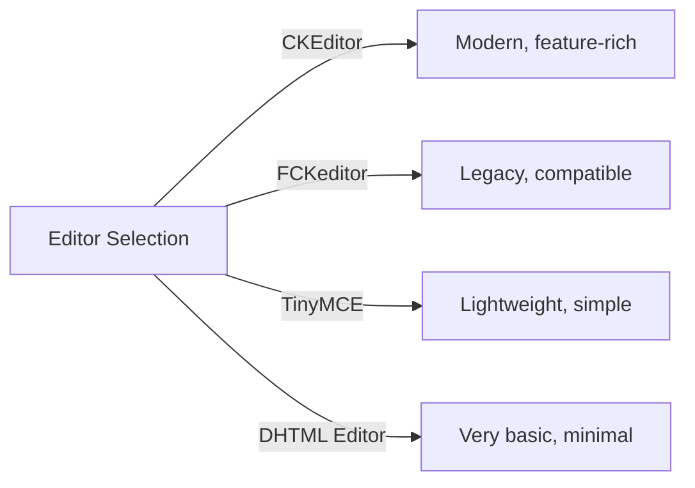
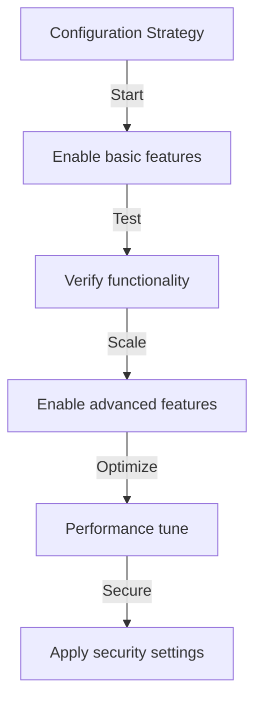

# Βασική διαμόρφωση Publisher

> Διαμορφώστε τις ρυθμίσεις της μονάδας Publisher, τις προτιμήσεις και τις γενικές επιλογές για την εγκατάστασή σας XOOPS.

---

## Πρόσβαση στις ρυθμίσεις παραμέτρων

## # Πλοήγηση πίνακα διαχειριστή

```
XOOPS Admin Panel
└── Modules
    └── Publisher
        ├── Preferences
        ├── Settings
        └── Configuration
```

1. Συνδεθείτε ως **Διαχειριστής**
2. Μεταβείτε στο **Πίνακας Διαχειριστή → Ενότητες**
3. Βρείτε την ενότητα **Publisher**
4. Κάντε κλικ στο σύνδεσμο **Προτιμήσεις** ή **Διαχειριστής**

---

## Γενικές ρυθμίσεις

## # Διαμόρφωση πρόσβασης

```
Admin Panel → Modules → Publisher
```

Κάντε κλικ στο **εικονίδιο με το γρανάζι** ή στο **Ρυθμίσεις** για αυτές τις επιλογές:

### # Επιλογές εμφάνισης

| Ρύθμιση | Επιλογές | Προεπιλογή | Περιγραφή |
|---------|---------|---------|-------------|
| **Στοιχεία ανά σελίδα** | 5-50 | 10 | Άρθρα που εμφανίζονται σε λίστες |
| **Εμφάνιση φρυγανιάς** | Yes/No | Ναι | Εμφάνιση διαδρομής πλοήγησης |
| **Χρήση σελιδοποίησης** | Yes/No | Ναι | Σελιδοποίηση μεγάλων λιστών |
| **Εμφάνιση ημερομηνίας** | Yes/No | Ναι | Εμφάνιση ημερομηνίας άρθρου |
| **Εμφάνιση κατηγορίας** | Yes/No | Ναι | Εμφάνιση κατηγορίας άρθρου |
| **Εμφάνιση συγγραφέα** | Yes/No | Ναι | Εμφάνιση συγγραφέα άρθρου |
| **Εμφάνιση προβολών** | Yes/No | Ναι | Εμφάνιση αριθμού προβολών άρθρου |

**Παράδειγμα διαμόρφωσης:**

```yaml
Items Per Page: 15
Show Breadcrumb: Yes
Use Paging: Yes
Show Date: Yes
Show Category: Yes
Show Author: Yes
Show Views: Yes
```

### # Επιλογές συγγραφέα

| Ρύθμιση | Προεπιλογή | Περιγραφή |
|---------|---------|-------------|
| **Εμφάνιση ονόματος συγγραφέα** | Ναι | Εμφάνιση πραγματικού ονόματος ή ονόματος χρήστη |
| **Χρήση ονόματος χρήστη** | Όχι | Εμφάνιση ονόματος χρήστη αντί ονόματος |
| **Εμφάνιση email συγγραφέα** | Όχι | Εμφάνιση email επικοινωνίας συγγραφέα |
| **Εμφάνιση avatar συγγραφέα** | Ναι | Εμφάνιση avatar χρήστη |

---

## Διαμόρφωση επεξεργαστή

## # Επιλέξτε WYSIWYG Επεξεργαστής

Ο Publisher υποστηρίζει πολλούς επεξεργαστές:

### # Διαθέσιμοι συντάκτες



## # CKEditor (Συνιστάται)

**Το καλύτερο για:** τους περισσότερους χρήστες, σύγχρονα προγράμματα περιήγησης, πλήρεις δυνατότητες

1. Μεταβείτε στις **Προτιμήσεις**
2. Ρύθμιση **Editor**: CKEditor
3. Διαμόρφωση επιλογών:

```
Editor: CKEditor 4.x
Toolbar: Full
Height: 400px
Width: 100%
Remove plugins: []
Add plugins: [mathjax, codesnippet]
```

## # Επεξεργαστής FCK

**Το καλύτερο για:** Συμβατότητα, παλαιότερα συστήματα

```
Editor: FCKeditor
Toolbar: Default
Custom config: (optional)
```

## # TinyMCE

**Το καλύτερο για:** Ελάχιστο αποτύπωμα, βασική επεξεργασία

```
Editor: TinyMCE
Plugins: [paste, table, link, image]
Toolbar: minimal
```

---

## Ρυθμίσεις αρχείου και μεταφόρτωσης

## # Διαμόρφωση καταλόγων μεταφόρτωσης

```
Admin → Publisher → Preferences → Upload Settings
```

### # Ρυθμίσεις τύπου αρχείου

```yaml
Allowed File Types:
  Images:
    - jpg
    - jpeg
    - gif
    - png
    - webp
  Documents:
    - pdf
    - doc
    - docx
    - xls
    - xlsx
    - ppt
    - pptx
  Archives:
    - zip
    - rar
    - 7z
  Media:
    - mp3
    - mp4
    - webm
    - mov
```

### # Όρια μεγέθους αρχείου

| Τύπος αρχείου | Μέγιστο μέγεθος | Σημειώσεις |
|-----------|----------|-------|
| **Εικόνες** | 5 MB | Ανά αρχείο εικόνας |
| **Έγγραφα** | 10 MB | PDF, Αρχεία Office |
| **ΜΜΕ** | 50 MB | Video/audio αρχεία |
| **Όλα τα αρχεία** | 100 MB | Σύνολο ανά μεταφόρτωση |

**Διαμόρφωση:**

```
Max Image Upload Size: 5 MB
Max Document Upload Size: 10 MB
Max Media Upload Size: 50 MB
Total Upload Size: 100 MB
Max Files per Article: 5
```

## # Αλλαγή μεγέθους εικόνας

Ο Publisher αλλάζει αυτόματα το μέγεθος των εικόνων για συνέπεια:

```yaml
Thumbnail Size:
  Width: 150
  Height: 150
  Mode: Crop/Resize

Category Image Size:
  Width: 300
  Height: 200
  Mode: Resize

Article Featured Image:
  Width: 600
  Height: 400
  Mode: Resize
```

---

## Ρυθμίσεις σχολίων και αλληλεπίδρασης

## # Διαμόρφωση σχολίων

```
Preferences → Comments Section
```

### # Επιλογές σχολίων

```yaml
Allow Comments:
  - Enabled: Yes/No
  - Default: Yes
  - Per-article override: Yes

Comment Moderation:
  - Moderate comments: Yes/No
  - Moderate guest comments only: Yes/No
  - Spam filter: Enabled
  - Max comments per day: (unlimited)

Comment Display:
  - Display format: Threaded/Flat
  - Comments per page: 10
  - Date format: Full date/Time ago
  - Show comment count: Yes/No
```

## # Διαμόρφωση αξιολογήσεων

```yaml
Allow Ratings:
  - Enabled: Yes/No
  - Default: Yes
  - Per-article override: Yes

Rating Options:
  - Rating scale: 5 stars (default)
  - Allow user to rate own: No
  - Show average rating: Yes
  - Show rating count: Yes
```

---

## SEO & URL Ρυθμίσεις

## # Βελτιστοποίηση μηχανών αναζήτησης

```
Preferences → SEO Settings
```

### # URL Διαμόρφωση

```yaml
SEO URLs:
  - Enabled: No (set to Yes for SEO URLs)
  - URL rewriting: None/Apache mod_rewrite/IIS rewrite

URL Format:
  - Category: /category/news
  - Article: /article/welcome-to-site
  - Archive: /archive/2024/01

Meta Description:
  - Auto-generate: Yes
  - Max length: 160 characters

Meta Keywords:
  - Auto-generate: Yes
  - From: Article tags, title
```

## # Ενεργοποίηση διευθύνσεων URL SEO (Σύνθετες)

**Προαπαιτούμενα:**
- Apache με ενεργοποιημένο το `mod_rewrite`
- Η υποστήριξη `.htaccess` ενεργοποιήθηκε

**Βήματα διαμόρφωσης:**

1. Μεταβείτε στις **Προτιμήσεις → SEO Ρυθμίσεις**
2. Ορίστε **SEO URL**: Ναι
3. Ορίστε **URL Επανεγγραφή**: Apache mod_rewrite
4. Βεβαιωθείτε ότι το αρχείο `.htaccess` υπάρχει στον φάκελο Publisher

**.htaccess Διαμόρφωση:**

```apache
<IfModule mod_rewrite.c>
    RewriteEngine On
    RewriteBase /modules/publisher/

    # Category rewrites
    RewriteRule ^category/([0-9]+)-(.*)\.html$ index.php?op=showcategory&categoryid=$1 [L,QSA]

    # Article rewrites
    RewriteRule ^article/([0-9]+)-(.*)\.html$ index.php?op=showitem&itemid=$1 [L,QSA]

    # Archive rewrites
    RewriteRule ^archive/([0-9]+)/([0-9]+)/$ index.php?op=archive&year=$1&month=$2 [L,QSA]
</IfModule>
```

---

## Cache & Performance

## # Διαμόρφωση προσωρινής αποθήκευσης

```
Preferences → Cache Settings
```

```yaml
Enable Caching:
  - Enabled: Yes
  - Cache type: File (or Memcache)

Cache Lifetime:
  - Category lists: 3600 seconds (1 hour)
  - Article lists: 1800 seconds (30 minutes)
  - Single article: 7200 seconds (2 hours)
  - Recent articles block: 900 seconds (15 minutes)

Cache Clear:
  - Manual clear: Available in admin
  - Auto-clear on article save: Yes
  - Clear on category change: Yes
```

## # Εκκαθάριση προσωρινής μνήμης

**Μη αυτόματη εκκαθάριση προσωρινής μνήμης:**

1. Μεταβείτε στο **Διαχειριστής → Εκδότης → Εργαλεία**
2. Κάντε κλικ στο **Clear Cache**
3. Επιλέξτε τύπους προσωρινής μνήμης για διαγραφή:
   - [ ] Προσωρινή μνήμη κατηγορίας
   - [ ] Κρυφή μνήμη άρθρου
   - [ ] Αποκλεισμός κρυφής μνήμης
   - [ ] Όλη η προσωρινή μνήμη
4. Κάντε κλικ στο **Διαγραφή επιλεγμένων**

**Γραμμή εντολών:**

```bash
# Clear all Publisher cache
php /path/to/xoops/admin/cache_manage.php publisher

# Or directly delete cache files
rm -rf /path/to/xoops/var/cache/publisher/*
```

---

## Ειδοποίηση και ροή εργασίας

## # Ειδοποιήσεις μέσω email

```
Preferences → Notifications
```

```yaml
Notify Admin on New Article:
  - Enabled: Yes
  - Recipient: Admin email
  - Include summary: Yes

Notify Moderators:
  - Enabled: Yes
  - On new submission: Yes
  - On pending articles: Yes

Notify Author:
  - On approval: Yes
  - On rejection: Yes
  - On comment: No (optional)
```

## # Ροή εργασιών υποβολής

```yaml
Require Approval:
  - Enabled: Yes
  - Editor approval: Yes
  - Admin approval: No

Draft Save:
  - Auto-save interval: 60 seconds
  - Save local versions: Yes
  - Revision history: Last 5 versions
```

---

## Ρυθμίσεις περιεχομένου

## # Προεπιλογές δημοσίευσης

```
Preferences → Content Settings
```

```yaml
Default Article Status:
  - Draft/Published: Draft
  - Featured by default: No
  - Auto-publish time: None

Default Visibility:
  - Public/Private: Public
  - Show on front page: Yes
  - Show in categories: Yes

Scheduled Publishing:
  - Enabled: Yes
  - Allow per-article: Yes

Content Expiration:
  - Enabled: No
  - Auto-archive old: No
  - Archive after days: (unlimited)
```

## # WYSIWYG Επιλογές περιεχομένου

```yaml
Allow HTML:
  - In articles: Yes
  - In comments: No

Allow Embedded Media:
  - Videos (iframe): Yes
  - Images: Yes
  - Plugins: No

Content Filtering:
  - Strip tags: No
  - XSS filter: Yes (recommended)
```

---

## Ρυθμίσεις μηχανών αναζήτησης

## # Διαμόρφωση ενσωμάτωσης αναζήτησης

```
Preferences → Search Settings
```

```yaml
Enable Article Indexing:
  - Include in site search: Yes
  - Index type: Full text/Title only

Search Options:
  - Search in titles: Yes
  - Search in content: Yes
  - Search in comments: Yes

Meta Tags:
  - Auto generate: Yes
  - OG tags (social): Yes
  - Twitter cards: Yes
```

---

## Προηγμένες ρυθμίσεις

## # Λειτουργία εντοπισμού σφαλμάτων (μόνο για ανάπτυξη)

```
Preferences → Advanced
```

```yaml
Debug Mode:
  - Enabled: No (only for development!)

Development Features:
  - Show SQL queries: No
  - Log errors: Yes
  - Error email: admin@example.com
```

## # Βελτιστοποίηση βάσης δεδομένων

```
Admin → Tools → Optimize Database
```

```bash
# Manual optimization
mysql> OPTIMIZE TABLE publisher_items;
mysql> OPTIMIZE TABLE publisher_categories;
mysql> OPTIMIZE TABLE publisher_comments;
```

---

## Προσαρμογή ενότητας

## # Πρότυπα θεμάτων

```
Preferences → Display → Templates
```

Επιλέξτε σύνολο προτύπων:
- Προεπιλογή
- Κλασικό
- Μοντέρνο
- Σκοτεινό
- Προσαρμοσμένο

Κάθε πρότυπο ελέγχει:
- Διάταξη άρθρου
- Καταχώριση κατηγορίας
- Εμφάνιση αρχείου
- Εμφάνιση σχολίων

---

## Συμβουλές διαμόρφωσης

## # Βέλτιστες πρακτικές



1. **Ξεκινήστε απλά** - Ενεργοποιήστε πρώτα τις βασικές λειτουργίες
2. **Δοκιμάστε κάθε αλλαγή** - Επαληθεύστε πριν προχωρήσετε
3. **Ενεργοποίηση προσωρινής αποθήκευσης** - Βελτιώνει την απόδοση
4. **Πρώτα δημιουργία αντιγράφων ασφαλείας** - Εξαγωγή ρυθμίσεων πριν από σημαντικές αλλαγές
5. **Μητρώα παρακολούθησης** - Ελέγχετε τακτικά τα αρχεία καταγραφής σφαλμάτων

## # Βελτιστοποίηση απόδοσης

```yaml
For Better Performance:
  - Enable caching: Yes
  - Cache lifetime: 3600 seconds
  - Limit items per page: 10-15
  - Compress images: Yes
  - Minify CSS/JS: Yes (if available)
```

## # Σκληρότητα ασφαλείας

```yaml
For Better Security:
  - Moderate comments: Yes
  - Disable HTML in comments: Yes
  - XSS filtering: Yes
  - File type whitelist: Strict
  - Max upload size: Reasonable limit
```

---

## Export/Import Ρυθμίσεις

## # Διαμόρφωση αντιγράφων ασφαλείας

```
Admin → Tools → Export Settings
```

**Για δημιουργία αντιγράφων ασφαλείας της τρέχουσας διαμόρφωσης:**

1. Κάντε κλικ στην επιλογή **Εξαγωγή διαμόρφωσης**
2. Αποθηκεύστε το ληφθέν αρχείο `.cfg`
3. Αποθηκεύστε σε ασφαλή τοποθεσία

**Για επαναφορά:**

1. Κάντε κλικ στο **Εισαγωγή διαμόρφωσης**
2. Επιλέξτε `.cfg` αρχείο
3. Κάντε κλικ στο **Επαναφορά**

---

## Σχετικοί οδηγοί διαμόρφωσης

- Διαχείριση Κατηγορίας
- Δημιουργία άρθρου
- Διαμόρφωση άδειας
- Οδηγός εγκατάστασης

---

## Διαμόρφωση αντιμετώπισης προβλημάτων

## # Οι ρυθμίσεις δεν αποθηκεύονται

**Λύση:**
1. Ελέγξτε τα δικαιώματα καταλόγου στο `/var/config/`
2. Επαληθεύστε την πρόσβαση εγγραφής PHP
3. Ελέγξτε το αρχείο καταγραφής σφαλμάτων PHP για προβλήματα
4. Εκκαθαρίστε την προσωρινή μνήμη του προγράμματος περιήγησης και δοκιμάστε ξανά

## # Δεν εμφανίζεται ο επεξεργαστής

**Λύση:**
1. Βεβαιωθείτε ότι έχει εγκατασταθεί η προσθήκη του προγράμματος επεξεργασίας
2. Ελέγξτε τη διαμόρφωση του επεξεργαστή XOOPS
3. Δοκιμάστε διαφορετική επιλογή επεξεργασίας
4. Ελέγξτε την κονσόλα του προγράμματος περιήγησης για σφάλματα JavaScript

## # Θέματα απόδοσης

**Λύση:**
1. Ενεργοποιήστε την προσωρινή αποθήκευση
2. Μειώστε τα στοιχεία ανά σελίδα
3. Συμπίεση εικόνων
4. Ελέγξτε τη βελτιστοποίηση της βάσης δεδομένων
5. Ελέγξτε το αργό αρχείο καταγραφής ερωτημάτων

---

## Επόμενα βήματα

- Διαμόρφωση δικαιωμάτων ομάδας
- Δημιουργήστε το πρώτο σας άρθρο
- Ρύθμιση Κατηγοριών
- Ελέγξτε τα προσαρμοσμένα πρότυπα

---

# publisher #configuration #preferences #settings #XOOPS
