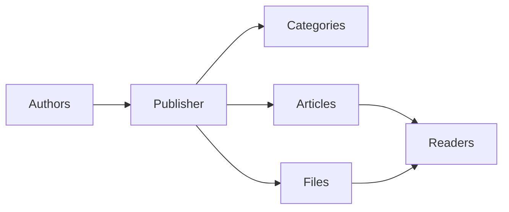
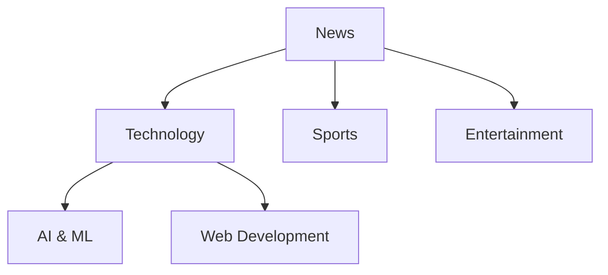
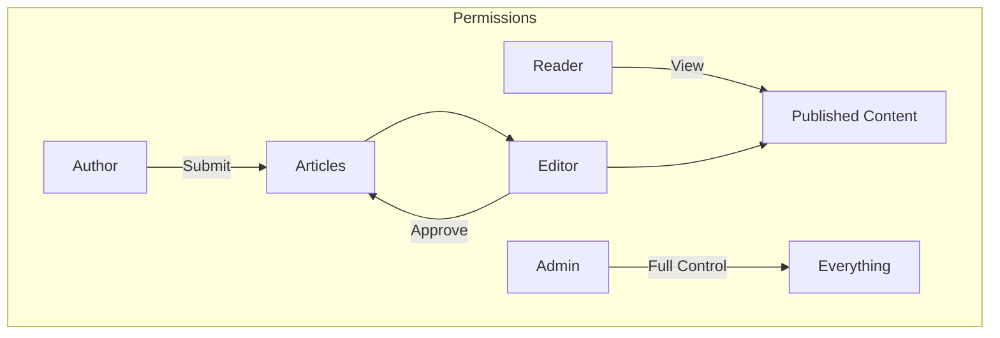
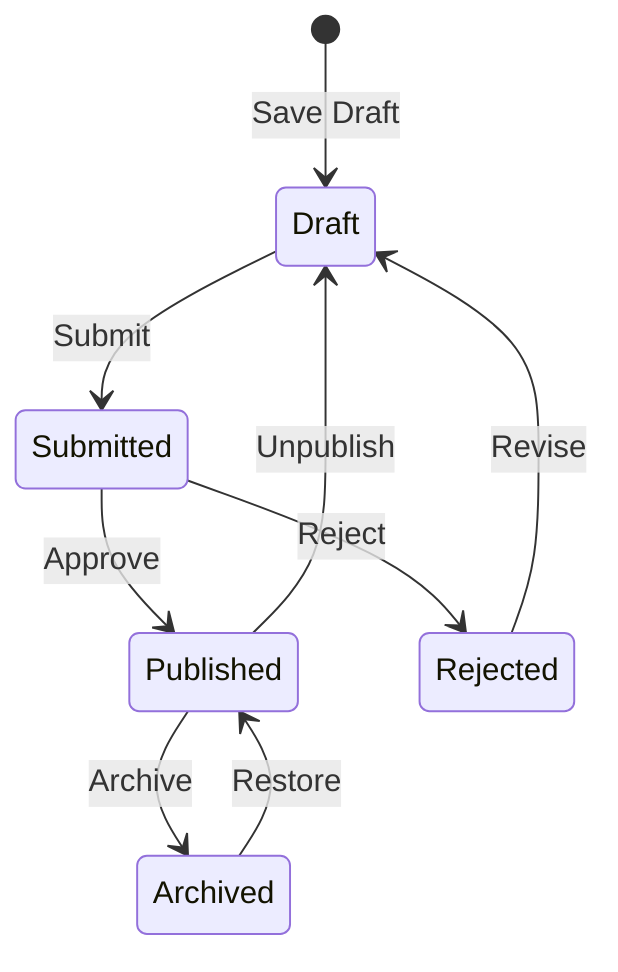

# Ξεκινώντας με τον Publisher

> Ένας βήμα προς βήμα οδηγός για τη ρύθμιση και τη χρήση της ενότητας Publisher news/blog.

---

## Τι είναι ο Publisher;

Ο Publisher είναι η κορυφαία ενότητα διαχείρισης περιεχομένου για το XOOPS, σχεδιασμένη για:

- **Ειδήσεις** - Δημοσιεύστε άρθρα με κατηγορίες
- **Ιστολόγια** - Προσωπικό ή πολυσυγγραφικό ιστολόγιο``
- **Τεκμηρίωση** - Οργανωμένες βάσεις γνώσεων
- **Πύλες περιεχομένου** - Μικτό περιεχόμενο μέσων



---

## Γρήγορη εγκατάσταση

## # Βήμα 1: Εγκατάσταση του Publisher

1. Λήψη από το [GitHub](https://github.com/XoopsModules25x/publisher)
2. Μεταφόρτωση στο `modules/publisher/`
3. Μεταβείτε στο Admin → Modules → Install

## # Βήμα 2: Δημιουργία Κατηγοριών



1. Διαχειριστής → Εκδότης → Κατηγορίες
2. Κάντε κλικ στο "Προσθήκη κατηγορίας"
3. Συμπληρώστε:
   - **Όνομα**: Όνομα κατηγορίας
   - **Περιγραφή**: Τι περιέχει αυτή η κατηγορία
   - **Εικόνα**: Προαιρετική εικόνα κατηγορίας
4. Ορίστε δικαιώματα (ποιος μπορεί να submit/view)
5. Αποθήκευση

## # Βήμα 3: Διαμόρφωση ρυθμίσεων

1. Διαχειριστής → Εκδότης → Προτιμήσεις
2. Βασικές ρυθμίσεις για διαμόρφωση:

| Ρύθμιση | Συνιστάται | Περιγραφή |
|---------|-------------|-------------|
| Στοιχεία ανά σελίδα | 10-20 | Άρθρα στο ευρετήριο |
| Συντάκτης | TinyMCE/CKEditor | Επεξεργαστής εμπλουτισμένου κειμένου |
| Επιτρέπονται αξιολογήσεις | Ναι | Σχόλια αναγνωστών |
| Επιτρέπονται σχόλια | Ναι | Συζητήσεις |
| Αυτόματη έγκριση | Όχι | Συντακτικό έλεγχο |

## # Βήμα 4: Δημιουργήστε το πρώτο σας άρθρο

1. Κύριο μενού → Εκδότης → Υποβολή άρθρου
2. Συμπληρώστε τη φόρμα:
   - **Τίτλος**: Επικεφαλίδα άρθρου
   - **Κατηγορία**: Όπου ανήκει
   - **Σύνοψη**: Σύντομη περιγραφή
   - **Σώμα**: Πλήρες περιεχόμενο του άρθρου
3. Προσθέστε προαιρετικά στοιχεία:
   - Επιλεγμένη εικόνα
   - Συνημμένα αρχεία
   - Ρυθμίσεις SEO
4. Υποβολή για έλεγχο ή δημοσίευση

---

## Ρόλοι χρήστη



## # Αναγνώστης
- Προβολή δημοσιευμένων άρθρων
- Βαθμολογήστε και σχολιάστε
- Αναζήτηση περιεχομένου

## # Συγγραφέας
- Υποβολή νέων άρθρων
- Επεξεργασία δικών άρθρων
- Επισύναψη αρχείων

## # Συντάκτης
- Approve/reject υποβολές
- Επεξεργαστείτε οποιοδήποτε άρθρο
- Διαχείριση κατηγοριών

## # Διαχειριστής
- Πλήρης έλεγχος μονάδας
- Διαμόρφωση ρυθμίσεων
- Διαχείριση δικαιωμάτων

---

## Συγγραφή άρθρων

## # Συντάκτης άρθρου

```
┌─────────────────────────────────────────────────────┐
│ Title: [Your Article Title                        ] │
├─────────────────────────────────────────────────────┤
│ Category: [Select Category          ▼]              │
├─────────────────────────────────────────────────────┤
│ Summary:                                            │
│ ┌─────────────────────────────────────────────────┐ │
│ │ Brief description shown in listings...          │ │
│ └─────────────────────────────────────────────────┘ │
├─────────────────────────────────────────────────────┤
│ Body:                                               │
│ ┌─────────────────────────────────────────────────┐ │
│ │ [B] [I] [U] [Link] [Image] [Code]               │ │
│ ├─────────────────────────────────────────────────┤ │
│ │                                                  │ │
│ │ Full article content goes here...               │ │
│ │                                                  │ │
│ └─────────────────────────────────────────────────┘ │
├─────────────────────────────────────────────────────┤
│ [Submit] [Preview] [Save Draft]                     │
└─────────────────────────────────────────────────────┘
```

## # Βέλτιστες πρακτικές

1. ** Συναρπαστικοί τίτλοι ** - Σαφείς, συναρπαστικοί τίτλοι
2. **Καλές περιλήψεις** - Δελεάστε τους αναγνώστες να κάνουν κλικ
3. **Δομημένο περιεχόμενο** - Χρησιμοποιήστε επικεφαλίδες, λίστες, εικόνες
4. **Σωστή κατηγοριοποίηση** - Βοηθήστε τους αναγνώστες να βρουν περιεχόμενο
5. **SEO βελτιστοποίηση** - Λέξεις-κλειδιά στον τίτλο και το περιεχόμενο

---

## Διαχείριση περιεχομένου

## # Ροή κατάστασης άρθρου



## # Περιγραφές κατάστασης

| Κατάσταση | Περιγραφή |
|--------|-------------|
| Σχέδιο | Εργασίες σε εξέλιξη |
| Υποβλήθηκε | Αναμονή αναθεώρησης |
| Δημοσιεύτηκε | Ζωντανά στον ιστότοπο |
| Λήξη | Προηγούμενη ημερομηνία λήξης |
| Απορρίφθηκε | Χρειάζεται αναθεώρηση |
| Αρχειοθετημένο | Καταργήθηκε από τις λίστες |

---

## Πλοήγηση

## # Πρόσβαση στον εκδότη

- **Κύριο μενού** → Εκδότης
- ** Απευθείας URL**: `yoursite.com/modules/publisher/`

## # Βασικές σελίδες

| Σελίδα | URL | Σκοπός |
|------|-----|---------|
| Ευρετήριο | `/modules/publisher/` | Καταχωρίσεις άρθρων |
| Κατηγορία | `/modules/publisher/category.php?id=X` | Άρθρα κατηγορίας |
| Άρθρο | `/modules/publisher/item.php?itemid=X` | Ενιαίο άρθρο |
| Υποβολή | `/modules/publisher/submit.php` | Νέο άρθρο |
| Αναζήτηση | `/modules/publisher/search.php` | Εύρεση άρθρων |

---

## Μπλοκ

Ο Publisher παρέχει πολλά μπλοκ για τον ιστότοπό σας:

## # Πρόσφατα άρθρα
Εμφανίζει τα τελευταία δημοσιευμένα άρθρα

## # Μενού κατηγορίας
Πλοήγηση ανά κατηγορία

## # Δημοφιλή άρθρα
Περιεχόμενο με τις περισσότερες προβολές

## # Τυχαίο άρθρο
Προβάλετε τυχαίο περιεχόμενο

## # Spotlight
Επιλεγμένα άρθρα

---

## Σχετική τεκμηρίωση

- Δημιουργία και επεξεργασία άρθρων
- Διαχείριση Κατηγοριών
- Επέκταση εκδότη

---

# XOOPS #publisher #user-guide #getting-started #cms
