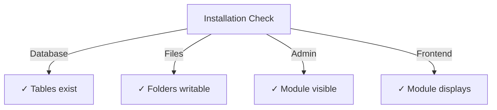

# Οδηγός εγκατάστασης Publisher

> Πλήρεις οδηγίες για την εγκατάσταση και τη διαμόρφωση της μονάδας Publisher για το XOOPS CMS.

---

## Απαιτήσεις συστήματος

## # Ελάχιστες απαιτήσεις

| Απαίτηση | Έκδοση | Σημειώσεις |
|-------------|---------|-------|
| XOOPS | 2.5.10+ | Πλατφόρμα πυρήνα CMS |
| PHP | 7,1+ | PHP 8.x συνιστάται |
| MySQL | 5.7+ | Database server |
| Διακομιστής Ιστού | Apache/Nginx | Με υποστήριξη επανεγγραφής |

## # PHP Επεκτάσεις

```
- PDO (PHP Data Objects)
- pdo_mysql or mysqli
- mb_string (multibyte strings)
- curl (for external content)
- json
- gd (image processing)
```

## # Χώρος στο δίσκο

- **Αρχεία μονάδας**: ~5 MB
- **Κατάλογος προσωρινής μνήμης**: Συνιστάται 50+ MB
- **Κατάλογος μεταφόρτωσης**: Όπως απαιτείται για περιεχόμενο

---

## Λίστα ελέγχου προεγκατάστασης

Πριν εγκαταστήσετε τον Publisher, επαληθεύστε:

- Ο πυρήνας [ ] XOOPS έχει εγκατασταθεί και εκτελείται
- [ ] Ο λογαριασμός διαχειριστή έχει δικαιώματα διαχείρισης λειτουργικών μονάδων
- [ ] Δημιουργήθηκε αντίγραφο ασφαλείας βάσης δεδομένων
- [ ] Τα δικαιώματα αρχείων επιτρέπουν την πρόσβαση εγγραφής στον κατάλογο `/modules/`
- [ ] PHP το όριο μνήμης είναι τουλάχιστον 128 MB
- [ ] Τα όρια μεγέθους μεταφόρτωσης αρχείων είναι κατάλληλα (ελάχιστο 10 MB)

---

## Βήματα εγκατάστασης

## # Βήμα 1: Λήψη του Publisher

### # Επιλογή Α: Από το GitHub (Συνιστάται)

```bash
# Navigate to modules directory
cd /path/to/xoops/htdocs/modules/

# Clone the repository
git clone https://github.com/XoopsModules25x/publisher.git

# Verify download
ls -la publisher/
```

### # Επιλογή Β: Μη αυτόματη λήψη

1. Επισκεφτείτε το [GitHub Publisher Releases](https://github.com/XoopsModules25x/publisher/releases)
2. Κάντε λήψη του πιο πρόσφατου αρχείου `.zip`
3. Εξαγωγή στο `modules/publisher/`

## # Βήμα 2: Ορισμός δικαιωμάτων αρχείων

```bash
# Set proper ownership
chown -R www-data:www-data /path/to/xoops/htdocs/modules/publisher

# Set directory permissions (755)
find publisher -type d -exec chmod 755 {} \;

# Set file permissions (644)
find publisher -type f -exec chmod 644 {} \;

# Make scripts executable
chmod 755 publisher/admin/index.php
chmod 755 publisher/index.php
```

## # Βήμα 3: Εγκατάσταση μέσω XOOPS Διαχειριστής

1. Συνδεθείτε στο **XOOPS Πίνακας Διαχειριστή** ως διαχειριστής
2. Μεταβείτε στο **Σύστημα → Ενότητες**
3. Κάντε κλικ στο **Install Module**
4. Βρείτε τον **Publisher** στη λίστα
5. Κάντε κλικ στο κουμπί **Εγκατάσταση**
6. Περιμένετε να ολοκληρωθεί η εγκατάσταση (εμφανίζει δημιουργημένους πίνακες βάσης δεδομένων)

```
Installation Progress:
✓ Tables created
✓ Configuration initialized
✓ Permissions set
✓ Cache cleared
Installation Complete!
```

---

## Αρχική ρύθμιση

## # Βήμα 1: Πρόσβαση στο Publisher Admin

1. Μεταβείτε στο **Πίνακας διαχειριστή → Ενότητες**
2. Βρείτε την ενότητα **Publisher**
3. Κάντε κλικ στον σύνδεσμο **Διαχειριστής**
4. Βρίσκεστε τώρα στη Διαχείριση εκδοτών

## # Βήμα 2: Διαμόρφωση προτιμήσεων μονάδας

1. Κάντε κλικ στο **Προτιμήσεις** στο αριστερό μενού
2. Διαμορφώστε τις βασικές ρυθμίσεις:

```
General Settings:
- Editor: Select your WYSIWYG editor
- Items per page: 10
- Show breadcrumb: Yes
- Allow comments: Yes
- Allow ratings: Yes

SEO Settings:
- SEO URLs: No (enable later if needed)
- URL rewriting: None

Upload Settings:
- Max upload size: 5 MB
- Allowed file types: jpg, png, gif, pdf, doc, docx
```

3. Κάντε κλικ στο **Αποθήκευση ρυθμίσεων**

## # Βήμα 3: Δημιουργία πρώτης κατηγορίας

1. Κάντε κλικ στο **Κατηγορίες** στο αριστερό μενού
2. Κάντε κλικ στο **Προσθήκη κατηγορίας**
3. Συμπληρώστε τη φόρμα:

```
Category Name: News
Description: Latest news and updates
Image: (optional) Upload category image
Parent Category: (leave blank for top-level)
Status: Enabled
```

4. Κάντε κλικ στην επιλογή **Αποθήκευση κατηγορίας**

## # Βήμα 4: Επαληθεύστε την εγκατάσταση

Ελέγξτε αυτούς τους δείκτες:



### # Έλεγχος βάσης δεδομένων

```bash
mysql -u xoops_user -p xoops_database
mysql> SHOW TABLES LIKE 'publisher%';

# Should show tables:
# - publisher_categories
# - publisher_items
# - publisher_comments
# - publisher_files
```

### # Έλεγχος μπροστινού μέρους

1. Επισκεφτείτε την αρχική σας σελίδα XOOPS
2. Αναζητήστε το μπλοκ **Publisher** ή **News**
3. Θα πρέπει να εμφανίζει πρόσφατα άρθρα

---

## Διαμόρφωση μετά την εγκατάσταση

## # Επιλογή εκδότη

Ο Publisher υποστηρίζει πολλούς επεξεργαστές WYSIWYG:

| Συντάκτης | Πλεονεκτήματα | Μειονεκτήματα |
|--------|------|------|
| FCKeditor | Πλούσιο σε χαρακτηριστικά | Παλιότερο, μεγαλύτερο |
| CKEditor | Σύγχρονο πρότυπο | Πολυπλοκότητα διαμόρφωσης |
| TinyMCE | Ελαφρύ | Περιορισμένα χαρακτηριστικά |
| DHTML Επεξεργαστής | Βασικό | Πολύ βασικό |

**Για αλλαγή προγράμματος επεξεργασίας:**

1. Μεταβείτε στις **Προτιμήσεις**
2. Μεταβείτε στη ρύθμιση **Editor**
3. Επιλέξτε από το αναπτυσσόμενο μενού
4. Αποθηκεύστε και δοκιμάστε

## # Ρύθμιση καταλόγου μεταφόρτωσης

```bash
# Create upload directories
mkdir -p /path/to/xoops/uploads/publisher/
mkdir -p /path/to/xoops/uploads/publisher/categories/
mkdir -p /path/to/xoops/uploads/publisher/images/
mkdir -p /path/to/xoops/uploads/publisher/files/

# Set permissions
chmod 755 /path/to/xoops/uploads/publisher/
chmod 755 /path/to/xoops/uploads/publisher/*
```

## # Διαμόρφωση μεγεθών εικόνας

Στις Προτιμήσεις, ορίστε μεγέθη μικρογραφιών:

```
Category image size: 300 x 200 px
Article image size: 600 x 400 px
Thumbnail size: 150 x 100 px
```

---

## Βήματα μετά την εγκατάσταση

## # 1. Ορίστε δικαιώματα ομάδας

1. Μεταβείτε στο **Δικαιώματα** στο μενού διαχειριστή
2. Διαμορφώστε την πρόσβαση για ομάδες:
   - Ανώνυμος: Προβολή μόνο
   - Εγγεγραμμένοι Χρήστες: Υποβολή άρθρων
   - Συντάκτες: Approve/edit άρθρα
   - Διαχειριστές: Πλήρης πρόσβαση

## # 2. Διαμόρφωση ορατότητας μονάδας

1. Μεταβείτε στο **Blocks** στο XOOPS admin
2. Βρείτε μπλοκ Publisher:
   - Εκδότης - Τελευταία άρθρα
   - Εκδότης - Κατηγορίες
   - Εκδότης - Αρχεία
3. Διαμορφώστε την ορατότητα μπλοκ ανά σελίδα

## # 3. Εισαγωγή δοκιμαστικού περιεχομένου (Προαιρετικό)

Για δοκιμή, εισαγάγετε δείγματα άρθρων:

1. Μεταβείτε στο **Διαχειριστής εκδότη → Εισαγωγή**
2. Επιλέξτε **Δείγμα περιεχομένου**
3. Κάντε κλικ στο **Εισαγωγή**

## # 4. Ενεργοποίηση διευθύνσεων URL SEO (Προαιρετικό)

Για διευθύνσεις URL φιλικές προς την αναζήτηση:

1. Μεταβείτε στις **Προτιμήσεις**
2. Ορίστε **SEO URL**: Ναι
3. Ενεργοποιήστε την επανεγγραφή **.htaccess**
4. Βεβαιωθείτε ότι το αρχείο `.htaccess` υπάρχει στον φάκελο Publisher

```apache
# .htaccess example
<IfModule mod_rewrite.c>
    RewriteEngine On
    RewriteBase /modules/publisher/
    RewriteRule ^category/([0-9]+)-(.*)\.html$ index.php?op=showcategory&categoryid=$1 [L]
    RewriteRule ^article/([0-9]+)-(.*)\.html$ index.php?op=showitem&itemid=$1 [L]
</IfModule>
```

---

## Αντιμετώπιση προβλημάτων Εγκατάσταση

## # Πρόβλημα: Η μονάδα δεν εμφανίζεται στον διαχειριστή

**Λύση:**
```bash
# Check file permissions
ls -la /path/to/xoops/modules/publisher/

# Check xoops_version.php exists
ls /path/to/xoops/modules/publisher/xoops_version.php

# Verify PHP syntax
php -l /path/to/xoops/modules/publisher/xoops_version.php
```

## # Πρόβλημα: Δεν δημιουργήθηκαν πίνακες βάσεων δεδομένων

**Λύση:**
1. Ελέγξτε MySQL user has CREATE TABLE privilege
2. Ελέγξτε το αρχείο καταγραφής σφαλμάτων βάσης δεδομένων:
   
```bash
   mysql> SHOW WARNINGS;
   
```
3. Μη αυτόματη εισαγωγή SQL:
   
```bash
   mysql -u user -p database < modules/publisher/sql/mysql.sql
   
```

## # Πρόβλημα: Η μεταφόρτωση του αρχείου αποτυγχάνει

**Λύση:**
```bash
# Check directory exists and is writable
stat /path/to/xoops/uploads/publisher/

# Fix permissions
chmod 777 /path/to/xoops/uploads/publisher/

# Verify PHP settings
php -i | grep upload_max_filesize
```

## # Πρόβλημα: Σφάλματα "Η σελίδα δεν βρέθηκε".

**Λύση:**
1. Ελέγξτε ότι υπάρχει αρχείο `.htaccess`
2. Βεβαιωθείτε ότι το Apache `mod_rewrite` είναι ενεργοποιημένο:
   
```bash
   a2enmod rewrite
   systemctl restart apache2
   
```
3. Ελέγξτε το `AllowOverride All` στο Apache config

---

## Αναβάθμιση από προηγούμενες εκδόσεις

## # Από τον Publisher 1.x σε 2.x

1. **Τρέχουσα εγκατάσταση αντιγράφων ασφαλείας:**
   
```bash
   cp -r modules/publisher/ modules/publisher-backup/
   mysqldump -u user -p database > publisher-backup.sql
   
```

2. **Λήψη Publisher 2.x**

3. **Αντικατάσταση αρχείων:**
   
```bash
   rm -rf modules/publisher/
   unzip publisher-2.0.zip -d modules/
   
```

4. **Εκτέλεση ενημέρωσης:**
   - Μεταβείτε στο **Διαχειριστής → Εκδότης → Ενημέρωση**
   - Κάντε κλικ στο **Ενημέρωση βάσης δεδομένων**
   - Περιμένετε να ολοκληρωθεί

5. **Επαλήθευση:**
   - Ελέγξτε σωστά την εμφάνιση όλων των άρθρων
   - Επαληθεύστε ότι τα δικαιώματα είναι άθικτα
   - Δοκιμή μεταφορτώσεων αρχείων

---

## Θέματα ασφαλείας

## # Δικαιώματα αρχείου

```
- Core files: 644 (readable by web server)
- Directories: 755 (browseable by web server)
- Upload directories: 755 or 777
- Config files: 600 (not readable by web)
```

## # Απενεργοποιήστε την άμεση πρόσβαση σε ευαίσθητα αρχεία

Δημιουργήστε `.htaccess` στους καταλόγους μεταφόρτωσης:

```apache
<FilesMatch "\.(php|phtml|php3|php4|php5|phtml)$">
    Deny from all
</FilesMatch>
```

## # Ασφάλεια βάσης δεδομένων

```bash
# Use strong password
ALTER USER 'publisher_user'@'localhost' IDENTIFIED BY 'strong_password_here';

# Grant minimal permissions
GRANT SELECT, INSERT, UPDATE, DELETE ON publisher_db.* TO 'publisher_user'@'localhost';
FLUSH PRIVILEGES;
```

---

## Λίστα ελέγχου επαλήθευσης

Μετά την εγκατάσταση, επαληθεύστε:

- [ ] Η μονάδα εμφανίζεται στη λίστα λειτουργικών μονάδων διαχειριστή
- [ ] Μπορεί να έχει πρόσβαση στην ενότητα διαχειριστή του Publisher
- [ ] Μπορεί να δημιουργήσει κατηγορίες
- [ ] Μπορεί να δημιουργήσει άρθρα
- [ ] Τα άρθρα εμφανίζονται στο front-end
- [ ] Οι μεταφορτώσεις αρχείων λειτουργούν
- [ ] Οι εικόνες εμφανίζονται σωστά
- [ ] Τα δικαιώματα εφαρμόζονται σωστά
- [ ] Δημιουργήθηκαν πίνακες βάσεων δεδομένων
- [ ] Ο κατάλογος της προσωρινής μνήμης είναι εγγράψιμος

---

## Επόμενα βήματα

Μετά την επιτυχή εγκατάσταση:

1. Διαβάστε τον Οδηγό βασικής διαμόρφωσης
2. Δημιουργήστε το πρώτο σας άρθρο
3. Ρυθμίστε τα δικαιώματα ομάδας
4. Επανεξέταση Διαχείριση Κατηγορίας

---

## Υποστήριξη & Πόροι

- **Ζητήματα GitHub**: [Ζητήματα εκδότη](https://github.com/XoopsModules25x/publisher/issues)
- **XOOPS Φόρουμ**: [Υποστήριξη Κοινότητας](https://www.xoops.org/modules/newbb/)
- **GitHub Wiki**: [Βοήθεια εγκατάστασης](https://github.com/XoopsModules25x/publisher/wiki)

---

# publisher #installation #setup #XOOPS #module #configuration
