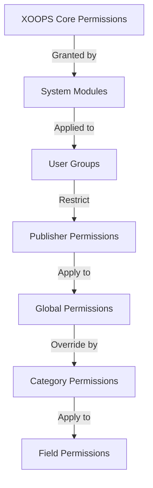

# Ρύθμιση δικαιωμάτων εκδότη

> Πλήρης οδηγός για τη διαμόρφωση των δικαιωμάτων ομάδας, τον έλεγχο πρόσβασης και τη διαχείριση της πρόσβασης χρηστών στον Publisher.

---

## Βασικά δικαιώματα

## # Τι είναι τα δικαιώματα;

Τα δικαιώματα ελέγχουν τι μπορούν να κάνουν διαφορετικές ομάδες χρηστών στον Publisher:

```
Who can:
  - View articles
  - Submit articles
  - Edit articles
  - Approve articles
  - Manage categories
  - Configure settings
```

## # Επίπεδα άδειας

```
Anonymous
  └── View published articles only

Registered Users
  ├── View articles
  ├── Submit articles (pending approval)
  └── Edit own articles

Editors/Moderators
  ├── All registered permissions
  ├── Approve articles
  ├── Edit all articles
  └── Manage some categories

Administrators
  └── Full access to everything
```

---

## Διαχείριση δικαιωμάτων πρόσβασης

## # Μεταβείτε στα δικαιώματα

```
Admin Panel
└── Modules
    └── Publisher
        ├── Permissions
        ├── Category Permissions
        └── Group Management
```

## # Γρήγορη πρόσβαση

1. Συνδεθείτε ως **Διαχειριστής**
2. Μεταβείτε στο **Διαχειριστής → Ενότητες**
3. Κάντε κλικ στο **Εκδότης → Διαχειριστής**
4. Κάντε κλικ στο **Δικαιώματα** στο αριστερό μενού

---

## Καθολικές άδειες

## # Δικαιώματα επιπέδου μονάδας

Ελέγξτε την πρόσβαση στη λειτουργική μονάδα και τις δυνατότητες του Publisher:

```
Permissions configuration view:
┌─────────────────────────────────────┐
│ Permission             │ Anon │ Reg │ Editor │ Admin │
├────────────────────────┼──────┼─────┼────────┼───────┤
│ View articles          │  ✓   │  ✓  │   ✓    │  ✓   │
│ Submit articles        │  ✗   │  ✓  │   ✓    │  ✓   │
│ Edit own articles      │  ✗   │  ✓  │   ✓    │  ✓   │
│ Edit all articles      │  ✗   │  ✗  │   ✓    │  ✓   │
│ Approve articles       │  ✗   │  ✗  │   ✓    │  ✓   │
│ Manage categories      │  ✗   │  ✗  │   ✗    │  ✓   │
│ Access admin panel     │  ✗   │  ✗  │   ✓    │  ✓   │
└─────────────────────────────────────┘
```

## # Περιγραφές αδειών

| Άδεια | Χρήστες | Επίδραση |
|------------|-------|--------|
| **Προβολή άρθρων** | Όλες οι ομάδες | Μπορεί να δει δημοσιευμένα άρθρα στο front-end |
| **Υποβολή άρθρων** | Εγγεγραμμένος+ | Μπορεί να δημιουργήσει νέα άρθρα (εκκρεμεί έγκριση) |
| **Επεξεργασία δικών άρθρων** | Εγγεγραμμένος+ | Μπορούν να edit/delete δικά τους άρθρα |
| **Επεξεργασία όλων των άρθρων** | Editors+ | Μπορεί να επεξεργαστεί τα άρθρα οποιουδήποτε χρήστη |
| **Διαγραφή δικών άρθρων** | Εγγεγραμμένος+ | Μπορούν να διαγράψουν τα δικά τους αδημοσίευτα άρθρα |
| **Διαγραφή όλων των άρθρων** | Editors+ | Μπορεί να διαγράψει οποιοδήποτε άρθρο |
| **Έγκριση άρθρων** | Editors+ | Μπορεί να δημοσιεύσει εκκρεμή άρθρα |
| **Διαχείριση κατηγοριών** | Διαχειριστές | Δημιουργία, επεξεργασία, διαγραφή κατηγοριών |
| **Πρόσβαση διαχειριστή** | Editors+ | Πρόσβαση στη διεπαφή διαχειριστή |

---

## Διαμόρφωση καθολικών δικαιωμάτων

## # Βήμα 1: Πρόσβαση στις ρυθμίσεις δικαιωμάτων

1. Μεταβείτε στο **Διαχειριστής → Ενότητες**
2. Βρείτε τον **Εκδότη**
3. Κάντε κλικ στην επιλογή **Δικαιώματα** (ή σύνδεσμος Διαχειριστής και μετά Δικαιώματα)
4. Βλέπετε τη μήτρα δικαιωμάτων

## # Βήμα 2: Ορίστε δικαιώματα ομάδας

Για κάθε ομάδα, διαμορφώστε τι μπορεί να κάνει:

### # Ανώνυμοι χρήστες

```yaml
Anonymous Group Permissions:
  View articles: ✓ YES
  Submit articles: ✗ NO
  Edit articles: ✗ NO
  Delete articles: ✗ NO
  Approve articles: ✗ NO
  Manage categories: ✗ NO
  Admin access: ✗ NO

Result: Anonymous users can only view published content
```

### # Εγγεγραμμένοι Χρήστες

```yaml
Registered Group Permissions:
  View articles: ✓ YES
  Submit articles: ✓ YES (with approval required)
  Edit own articles: ✓ YES
  Edit all articles: ✗ NO
  Delete own articles: ✓ YES (drafts only)
  Delete all articles: ✗ NO
  Approve articles: ✗ NO
  Manage categories: ✗ NO
  Admin access: ✗ NO

Result: Registered users can contribute content after approval
```

### # Ομάδα συντακτών

```yaml
Editors Group Permissions:
  View articles: ✓ YES
  Submit articles: ✓ YES
  Edit own articles: ✓ YES
  Edit all articles: ✓ YES
  Delete own articles: ✓ YES
  Delete all articles: ✓ YES
  Approve articles: ✓ YES
  Manage categories: ✓ LIMITED
  Admin access: ✓ YES
  Configure settings: ✗ NO

Result: Editors manage content but not settings
```

### # Διαχειριστές

```yaml
Admins Group Permissions:
  ✓ FULL ACCESS to all features

  - All editor permissions
  - Manage all categories
  - Configure all settings
  - Manage permissions
  - Install/uninstall
```

## # Βήμα 3: Αποθήκευση δικαιωμάτων

1. Διαμορφώστε τα δικαιώματα κάθε ομάδας
2. Επιλέξτε τα πλαίσια για επιτρεπόμενες ενέργειες
3. Καταργήστε την επιλογή των πλαισίων για απορριφθείσες ενέργειες
4. Κάντε κλικ στην επιλογή **Αποθήκευση δικαιωμάτων**
5. Εμφανίζεται το μήνυμα επιβεβαίωσης

---

## Δικαιώματα επιπέδου κατηγορίας

## # Ορισμός πρόσβασης κατηγορίας

Ελέγξτε ποιος μπορεί να view/submit σε συγκεκριμένες κατηγορίες:

```
Admin → Publisher → Categories
→ Select category → Permissions
```

## # Πίνακας δικαιωμάτων κατηγορίας

```
                 Anonymous  Registered  Editor  Admin
View category        ✓         ✓         ✓       ✓
Submit to category   ✗         ✓         ✓       ✓
Edit own in category ✗         ✓         ✓       ✓
Edit all in category ✗         ✗         ✓       ✓
Approve in category  ✗         ✗         ✓       ✓
Manage category      ✗         ✗         ✗       ✓
```

## # Διαμόρφωση δικαιωμάτων κατηγορίας

1. Μεταβείτε στο **Κατηγορίες** admin
2. Βρείτε την κατηγορία
3. Κάντε κλικ στο κουμπί **Δικαιώματα**
4. Για κάθε ομάδα, επιλέξτε:
   - [ ] Προβολή αυτής της κατηγορίας
   - [ ] Υποβολή άρθρων
   - [ ] Επεξεργασία δικών άρθρων
   - [ ] Επεξεργασία όλων των άρθρων
   - [ ] Έγκριση άρθρων
   - [ ] Διαχείριση κατηγορίας
5. Κάντε κλικ στο **Αποθήκευση**

## # Παραδείγματα αδειών κατηγορίας

### # Κατηγορία Δημόσιων Ειδήσεων

```
Anonymous: View only
Registered: View + Submit (pending approval)
Editors: Approve + Edit
Admins: Full control
```

### # Κατηγορία εσωτερικών ενημερώσεων

```
Anonymous: No access
Registered: View only
Editors: Submit + Approve
Admins: Full control
```

### # Κατηγορία ιστολογίου επισκεπτών

```
Anonymous: View only
Registered: Submit (pending approval)
Editors: Approve
Admins: Full control
```

---

## Δικαιώματα επιπέδου πεδίου

## # Ορατότητα πεδίου φόρμας ελέγχου

Περιορίστε τα πεδία φόρμας που μπορούν οι χρήστες see/edit:

```
Admin → Publisher → Permissions → Fields
```

## # Επιλογές πεδίου

```yaml
Visible Fields for Registered Users:
  ✓ Title
  ✓ Description
  ✓ Content (body)
  ✓ Featured image
  ✓ Category
  ✓ Tags
  ✗ Author (auto-set)
  ✗ Publication date (editors only)
  ✗ Scheduled date (editors only)
  ✗ Featured flag (editors only)
  ✗ Permissions (admins only)
```

## # Παραδείγματα

### # Περιορισμένη υποβολή για εγγεγραμμένη

Οι εγγεγραμμένοι χρήστες βλέπουν λιγότερες επιλογές:

```
Available fields:
  - Title ✓
  - Description ✓
  - Content ✓
  - Featured image ✓
  - Category ✓

Hidden fields:
  - Author (auto-current user)
  - Publication date (editors decide)
  - Scheduled date (admins only)
  - Featured status (editors choose)
```

### # Πλήρη φόρμα για συντάκτες

Οι συντάκτες βλέπουν όλες τις επιλογές:

```
Available fields:
  - All basic fields
  - All metadata
  - Author selection ✓
  - Publication date/time ✓
  - Scheduled date ✓
  - Featured status ✓
  - Expiration date ✓
  - Permissions ✓
```

---

## Διαμόρφωση ομάδας χρηστών

## # Δημιουργία προσαρμοσμένης ομάδας

1. Μεταβείτε στο **Διαχειριστής → Χρήστες → Ομάδες**
2. Κάντε κλικ στο **Δημιουργία ομάδας**
3. Εισαγάγετε τα στοιχεία της ομάδας:

```
Group Name: "Community Bloggers"
Group Description: "Users who contribute blog content"
Type: Regular group
```

4. Κάντε κλικ στην επιλογή **Αποθήκευση ομάδας**
5. Επιστρέψτε στα δικαιώματα του Publisher
6. Ορίστε δικαιώματα για νέα ομάδα

## # Παραδείγματα ομάδας

```
Suggested Groups for Publisher:

Group: Contributors
  - Regular members who submit articles
  - Can edit own articles
  - Cannot approve articles

Group: Reviewers
  - Can see submitted articles
  - Can approve/reject articles
  - Cannot delete others' articles

Group: Editors
  - Can edit any article
  - Can approve articles
  - Can moderate comments
  - Can manage some categories

Group: Publishers
  - Can edit any article
  - Can publish directly (no approval)
  - Can manage all categories
  - Can configure settings
```

---

## Ιεραρχίες αδειών

## # Ροή αδειών



## # Άδεια Κληρονομιάς

```
Base: Global module permissions
  ↓
Category: Overrides for specific categories
  ↓
Field: Further restricts available fields
  ↓
User: Has permission if ALL levels allow
```

**Παράδειγμα:**

```
User wants to edit article:
1. User group must have "edit articles" permission (global)
2. Category must allow editing (category level)
3. Field restrictions must allow (if applicable)
4. User must be author OR editor (for own vs all)

If ANY level denies → Permission denied
```

---

## Δικαιώματα ροής εργασίας έγκρισης

## # Διαμόρφωση έγκρισης υποβολής

Ελέγξτε εάν τα άρθρα χρειάζονται έγκριση:

```
Admin → Publisher → Preferences → Workflow
```

### # Επιλογές έγκρισης

```yaml
Submission Workflow:
  Require Approval: Yes

  For Registered Users:
    - New articles: Draft (pending approval)
    - Editors must approve
    - User can edit while pending
    - After approval: User can still edit

  For Editors:
    - New articles: Publish directly (optional)
    - Skip approval queue
    - Or always require approval
```

### # Διαμόρφωση ανά ομάδα

1. Μεταβείτε στις Προτιμήσεις
2. Βρείτε τη "Ροή εργασιών υποβολής"
3. Για κάθε ομάδα, ορίστε:

```
Group: Registered Users
  Require approval: ✓ YES
  Default status: Draft
  Can modify while pending: ✓ YES

Group: Editors
  Require approval: ✗ NO
  Default status: Published
  Can modify published: ✓ YES
```

4. Κάντε κλικ στο **Αποθήκευση**

---

## Μέτρια άρθρα

## # Έγκριση άρθρων σε εκκρεμότητα

Για χρήστες με άδεια "έγκριση άρθρων":

1. Μεταβείτε στο **Διαχειριστής → Εκδότης → Άρθρα**
2. Φιλτράρισμα κατά **Κατάσταση**: Σε εκκρεμότητα
3. Κάντε κλικ στο άρθρο για αναθεώρηση
4. Ελέγξτε την ποιότητα του περιεχομένου
5. Ορισμός **Κατάσταση**: Δημοσιεύτηκε
6. Προαιρετικά: Προσθήκη σημειώσεων σύνταξης
7. Κάντε κλικ στο **Αποθήκευση**

## # Απόρριψη άρθρων

Εάν το άρθρο δεν πληροί τα πρότυπα:

1. Ανοιχτό άρθρο
2. Ορισμός **Κατάσταση**: Πρόχειρο
3. Προσθέστε τον λόγο απόρριψης (σε σχόλιο ή email)
4. Κάντε κλικ στο **Αποθήκευση**
5. Στείλτε μήνυμα στον συγγραφέα εξηγώντας την απόρριψη

## # Εποπτεία σχολίων

Εάν εποπτεύετε σχόλια:

1. Μεταβείτε στο **Διαχειριστής → Εκδότης → Σχόλια**
2. Φιλτράρισμα κατά **Κατάσταση**: Σε εκκρεμότητα
3. Ελέγξτε το σχόλιο
4. Επιλογές:
   - Έγκριση: Κάντε κλικ στο **Έγκριση**
   - Απόρριψη: Κάντε κλικ στο **Διαγραφή**
   - Επεξεργασία: Κάντε κλικ στο **Επεξεργασία**, διόρθωση, αποθήκευση
5. Κάντε κλικ στο **Αποθήκευση**

---

## Διαχείριση πρόσβασης χρήστη

## # Προβολή ομάδων χρηστών

Δείτε ποιοι χρήστες ανήκουν σε ομάδες:

```
Admin → Users → User Groups

For each user:
  - Primary group (one)
  - Secondary groups (multiple)

Permissions apply from all groups (union)
```

## # Προσθήκη χρήστη στην ομάδα

1. Μεταβείτε στο **Διαχειριστής → Χρήστες**
2. Εύρεση χρήστη
3. Κάντε κλικ στο **Επεξεργασία**
4. Στην ενότητα **Ομάδες**, επιλέξτε ομάδες για προσθήκη
5. Κάντε κλικ στο **Αποθήκευση**

## # Αλλαγή δικαιωμάτων χρήστη

Για μεμονωμένους χρήστες (αν υποστηρίζεται):

1. Μεταβείτε στο User admin
2. Εύρεση χρήστη
3. Κάντε κλικ στο **Επεξεργασία**
4. Αναζητήστε την παράκαμψη μεμονωμένων δικαιωμάτων
5. Ρυθμίστε τις παραμέτρους όπως απαιτείται
6. Κάντε κλικ στο **Αποθήκευση**

---

## Κοινά σενάρια άδειας

## # Σενάριο 1: Ανοίξτε το ιστολόγιο

Επιτρέψτε σε οποιονδήποτε να υποβάλει:

```
Anonymous: View
Registered: Submit, edit own, delete own
Editors: Approve, edit all, delete all
Admins: Full control

Result: Open community blog
```

## # Σενάριο 2: Εποπτευόμενος ιστότοπος ειδήσεων

Αυστηρή διαδικασία έγκρισης:

```
Anonymous: View only
Registered: Cannot submit
Editors: Submit, approve others
Admins: Full control

Result: Only approved professionals publish
```

## # Σενάριο 3: Ιστολόγιο προσωπικού

Οι εργαζόμενοι μπορούν να συνεισφέρουν:

```
Create group: "Staff"
Anonymous: View
Registered: View only (non-staff)
Staff: Submit, edit own, publish directly
Admins: Full control

Result: Staff-authored blog
```

## # Σενάριο 4: Πολλαπλές κατηγορίες με διαφορετικούς επεξεργαστές

Διαφορετικοί συντάκτες για διαφορετικές κατηγορίες:

```
News category:
  Editors group A: Full control

Reviews category:
  Editors group B: Full control

Tutorials category:
  Editors group C: Full control

Result: Decentralized editorial control
```

---

## Δοκιμή άδειας

## # Επαλήθευση αδειών λειτουργίας

1. Δημιουργήστε δοκιμαστικό χρήστη σε κάθε ομάδα
2. Συνδεθείτε ως κάθε δοκιμαστικός χρήστης
3. Προσπαθήστε να:
   - Προβολή άρθρων
   - Υποβολή άρθρου (θα πρέπει να δημιουργηθεί προσχέδιο εάν επιτρέπεται)
   - Επεξεργασία άρθρου (δικό και άλλα)
   - Διαγραφή άρθρου
   - Πρόσβαση στον πίνακα διαχείρισης
   - Κατηγορίες πρόσβασης

4. Βεβαιωθείτε ότι τα αποτελέσματα ταιριάζουν με τα αναμενόμενα δικαιώματα

## # Συνήθεις Δοκιμασίες

```
Test Case 1: Anonymous user
  [ ] Can view published articles: ✓
  [ ] Cannot submit articles: ✓
  [ ] Cannot access admin: ✓

Test Case 2: Registered user
  [ ] Can submit articles: ✓
  [ ] Articles go to Draft: ✓
  [ ] Can edit own article: ✓
  [ ] Cannot edit others: ✓
  [ ] Cannot access admin: ✓

Test Case 3: Editor
  [ ] Can approve articles: ✓
  [ ] Can edit any article: ✓
  [ ] Can access admin: ✓
  [ ] Cannot delete all: ✓ (or ✓ if allowed)

Test Case 4: Admin
  [ ] Can do everything: ✓
```

---

## Δικαιώματα αντιμετώπισης προβλημάτων

## # Πρόβλημα: Ο χρήστης δεν μπορεί να υποβάλει άρθρα

**Έλεγχος:**
```
1. User group has "submit articles" permission
   Admin → Publisher → Permissions

2. User belongs to allowed group
   Admin → Users → Edit user → Groups

3. Category allows submission from user's group
   Admin → Publisher → Categories → Permissions

4. User is registered (not anonymous)
```

**Διάλυμα:**
```bash
1. Verify registered user group has submission permission
2. Add user to appropriate group
3. Check category permissions
4. Clear user session cache
```

## # Πρόβλημα: Ο επεξεργαστής δεν μπορεί να εγκρίνει άρθρα

**Έλεγχος:**
```
1. Editor group has "approve articles" permission
2. Articles exist with "Pending" status
3. Editor is in correct group
4. Category allows approval from editor's group
```

**Διάλυμα:**
```bash
1. Go to Permissions, check "approve articles" is checked for editor group
2. Create test article, set to Draft
3. Try to approve as editor
4. Check error messages in system log
```

## # Πρόβλημα: Μπορεί να δει άρθρα αλλά δεν έχει πρόσβαση στην κατηγορία

**Έλεγχος:**
```
1. Category is not disabled/hidden
2. Category permissions allow viewing
3. User's group is permitted to view category
4. Category is published
```

**Διάλυμα:**
```bash
1. Go to Categories, check category status is "Enabled"
2. Check category permissions are set
3. Add user's group to category view permission
```

## # Πρόβλημα: Τα δικαιώματα άλλαξαν αλλά δεν ισχύουν

**Λύση:**
```bash
1. Clear cache: Admin → Tools → Clear Cache
2. Clear session: Logout and login again
3. Check system log for errors
4. Verify permissions actually saved
5. Try different browser/incognito window
```

---

## Άδεια δημιουργίας αντιγράφων ασφαλείας και εξαγωγής

## # Δικαιώματα εξαγωγής

Ορισμένα συστήματα επιτρέπουν την εξαγωγή:

1. Μεταβείτε στο **Διαχειριστής → Εκδότης → Εργαλεία**
2. Κάντε κλικ στο **Εξαγωγή Δικαιωμάτων**
3. Αποθηκεύστε το αρχείο `.xml ` ή `.json`
4. Διατηρήστε ως εφεδρικό

## # Δικαιώματα εισαγωγής

Επαναφορά από αντίγραφο ασφαλείας:

1. Μεταβείτε στο **Διαχειριστής → Εκδότης → Εργαλεία**
2. Κάντε κλικ στο **Δικαιώματα εισαγωγής**
3. Επιλέξτε αρχείο αντιγράφου ασφαλείας
4. Ελέγξτε τις αλλαγές
5. Κάντε κλικ στο **Εισαγωγή**

---

## Βέλτιστες πρακτικές

## # Λίστα ελέγχου ρύθμισης παραμέτρων άδειας

- [ ] Αποφασίστε για τις ομάδες χρηστών
- [ ] Εκχωρήστε ξεκάθαρα ονόματα σε ομάδες
- [ ] Ορίστε βασικά δικαιώματα για κάθε ομάδα
- [ ] Δοκιμάστε κάθε επίπεδο άδειας
- [ ] Δομή άδειας εγγράφου
- [ ] Δημιουργία ροής εργασιών έγκρισης
- [ ] Εκπαιδεύστε τους συντάκτες στη μετριοπάθεια
- [ ] Παρακολούθηση χρήσης αδειών
- [ ] Επισκόπηση των αδειών ανά τρίμηνο
- [ ] Ρυθμίσεις άδειας δημιουργίας αντιγράφων ασφαλείας

## # Βέλτιστες πρακτικές ασφάλειας

```
✓ Principle of Least Privilege
  - Grant minimum necessary permissions

✓ Role-Based Access
  - Use groups for roles (editor, moderator, etc)

✓ Audit Permissions
  - Review who has what access

✓ Separate Duties
  - Submitter, approver, publisher are different

✓ Regular Review
  - Check permissions quarterly
  - Remove access when users leave
  - Update for new requirements
```

---

## Σχετικοί οδηγοί

- Δημιουργία άρθρων
- Διαχείριση Κατηγοριών
- Βασική διαμόρφωση
- Εγκατάσταση

---

## Επόμενα βήματα

- Ρυθμίστε τα δικαιώματα για τη ροή εργασίας σας
- Δημιουργήστε άρθρα με τα κατάλληλα δικαιώματα
- Διαμόρφωση Κατηγοριών με δικαιώματα
- Εκπαιδεύστε τους χρήστες στη δημιουργία άρθρου

---

# publisher #permissions #groups #access-control #security #moderation #XOOPS
