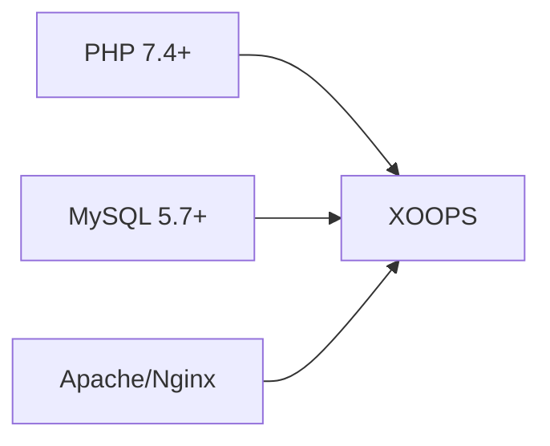
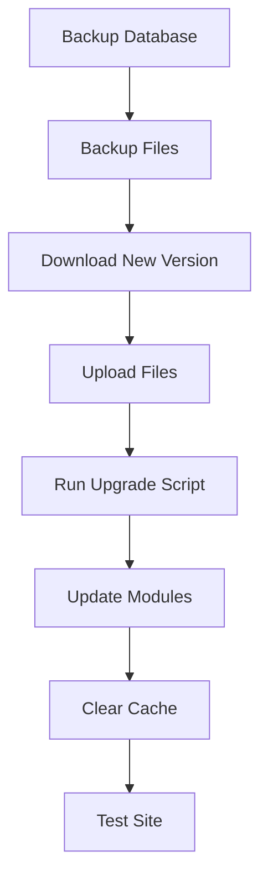

> Συνήθεις ερωτήσεις και απαντήσεις σχετικά με την εγκατάσταση του XOOPS.

---

## Προεγκατάσταση

## # Ε: Ποιες είναι οι ελάχιστες απαιτήσεις διακομιστή;

**Α:** XOOPS 2.5.x απαιτεί:
- PHP 7,4 ή υψηλότερο (PHP 8,x συνιστάται)
- MySQL 5.7+ or MariaDB 10.3+
- Apache με mod_rewrite ή Nginx
- Όριο μνήμης τουλάχιστον 64MB PHP (συνιστάται 128MB+)



## # Ε: Μπορώ να εγκαταστήσω το XOOPS σε κοινόχρηστη φιλοξενία;

**Α:** Ναι, το XOOPS λειτουργεί καλά στα περισσότερα κοινόχρηστα προγράμματα φιλοξενίας που πληρούν τις απαιτήσεις. Ελέγξτε ότι ο οικοδεσπότης σας παρέχει:
- PHP με απαιτούμενες επεκτάσεις (mysqli, gd, curl, json, mbstring)
- MySQL database access
- Δυνατότητα αποστολής αρχείων
- Υποστήριξη .htaccess (για Apache)

## # Ε: Ποιες επεκτάσεις PHP απαιτούνται;

**Α:** Απαιτούμενες επεκτάσεις:
- `mysqli` - Συνδεσιμότητα βάσης δεδομένων
- `gd` - Επεξεργασία εικόνας
- `json` - JSON χειρισμός
- `mbstring` - Υποστήριξη συμβολοσειρών πολλαπλών byte

Συνιστάται:
- `curl` - Εξωτερικές κλήσεις API
- `zip` - Εγκατάσταση μονάδας
- `intl` - Διεθνοποίηση

---

## Διαδικασία εγκατάστασης

## # Ε: Ο οδηγός εγκατάστασης εμφανίζει μια κενή σελίδα

**Α:** Αυτό είναι συνήθως ένα σφάλμα PHP. Δοκιμάστε:

1. Ενεργοποιήστε προσωρινά την εμφάνιση σφαλμάτων:
```php
// Add to htdocs/install/index.php at the top
error_reporting(E_ALL);
ini_set('display_errors', 1);
```

2. Ελέγξτε το αρχείο καταγραφής σφαλμάτων PHP
3. Επαληθεύστε τη συμβατότητα της έκδοσης PHP
4. Βεβαιωθείτε ότι έχουν φορτωθεί όλες οι απαιτούμενες επεκτάσεις

## # Ε: Λαμβάνω "Δεν μπορώ να γράψω στο mainfile.php"

**Α:** Ορίστε δικαιώματα εγγραφής πριν από την εγκατάσταση:

```bash
chmod 666 mainfile.php
# After installation, secure it:
chmod 444 mainfile.php
```

## # Ε: Δεν δημιουργούνται πίνακες βάσεων δεδομένων

**Α:** Έλεγχος:

1. MySQL user has CREATE TABLE privileges:
```sql
GRANT ALL PRIVILEGES ON xoopsdb.* TO 'xoopsuser'@'localhost';
FLUSH PRIVILEGES;
```

2. Υπάρχει βάση δεδομένων:
```sql
CREATE DATABASE xoopsdb CHARACTER SET utf8mb4 COLLATE utf8mb4_unicode_ci;
```

3. Διαπιστευτήρια στις ρυθμίσεις βάσης δεδομένων αντιστοίχισης οδηγού

## # Ε: Η εγκατάσταση ολοκληρώθηκε αλλά ο ιστότοπος εμφανίζει σφάλματα

**Α:** Συνήθεις επιδιορθώσεις μετά την εγκατάσταση:

1. Καταργήστε ή μετονομάστε τον κατάλογο εγκατάστασης:
```bash
mv htdocs/install htdocs/install.bak
```

2. Ορίστε τα κατάλληλα δικαιώματα:
```bash
chmod -R 755 htdocs/
chmod -R 777 xoops_data/
chmod 444 mainfile.php
```

3. Εκκαθάριση προσωρινής μνήμης:
```bash
rm -rf xoops_data/caches/smarty_cache/*
rm -rf xoops_data/caches/smarty_compile/*
```

---

## Διαμόρφωση

## # Ε: Πού βρίσκεται το αρχείο διαμόρφωσης;

**Α:** Η κύρια διαμόρφωση είναι στο `mainfile.php` στη ρίζα XOOPS. Βασικές ρυθμίσεις:

```php
define('XOOPS_ROOT_PATH', '/path/to/htdocs');
define('XOOPS_VAR_PATH', '/path/to/xoops_data');
define('XOOPS_URL', 'https://yoursite.com');
define('XOOPS_DB_HOST', 'localhost');
define('XOOPS_DB_USER', 'username');
define('XOOPS_DB_PASS', 'password');
define('XOOPS_DB_NAME', 'database');
define('XOOPS_DB_PREFIX', 'xoops');
```

## # Ε: Πώς μπορώ να αλλάξω τον ιστότοπο URL;

**Α:** Επεξεργασία `mainfile.php`:

```php
define('XOOPS_URL', 'https://newdomain.com');
```

Στη συνέχεια, διαγράψτε την προσωρινή μνήμη και ενημερώστε τυχόν URL με σκληρό κώδικα στη βάση δεδομένων.

## # Ε: Πώς μπορώ να μετακινήσω το XOOPS σε διαφορετικό κατάλογο;

**Α:**

1. Μετακινήστε τα αρχεία σε νέα θέση
2. Ενημερώστε τις διαδρομές στο `mainfile.php`:
```php
define('XOOPS_ROOT_PATH', '/new/path/to/htdocs');
define('XOOPS_VAR_PATH', '/new/path/to/xoops_data');
```
3. Ενημερώστε τη βάση δεδομένων εάν χρειάζεται
4. Διαγράψτε όλες τις κρυφές μνήμες

---

## Αναβαθμίσεις

## # Ε: Πώς μπορώ να αναβαθμίσω το XOOPS;

**ΕΝΑ:**



1. **Δημιουργία αντιγράφων ασφαλείας όλων** (βάση δεδομένων + αρχεία)
2. Κάντε λήψη της νέας έκδοσης XOOPS
3. Ανεβάστε αρχεία (μην αντικαταστήσετε το `mainfile.php`)
4. Εκτελέστε το `htdocs/upgrade/` εάν παρέχεται
5. Ενημερώστε τις ενότητες μέσω του πίνακα διαχείρισης
6. Διαγράψτε όλες τις κρυφές μνήμες
7. Δοκιμάστε σχολαστικά

## # Ε: Μπορώ να παραλείψω εκδόσεις κατά την αναβάθμιση;

**Α:** Γενικά όχι. Κάντε διαδοχική αναβάθμιση μέσω των μεγάλων εκδόσεων για να διασφαλίσετε ότι οι μετεγκαταστάσεις της βάσης δεδομένων εκτελούνται σωστά. Ελέγξτε τις σημειώσεις έκδοσης για συγκεκριμένες οδηγίες.

## # Ε: Οι μονάδες μου σταμάτησαν να λειτουργούν μετά την αναβάθμιση

**Α:**

1. Ελέγξτε τη συμβατότητα της μονάδας με τη νέα έκδοση XOOPS
2. Ενημερώστε τις ενότητες στις πιο πρόσφατες εκδόσεις
3. Αναγέννηση προτύπων: Διαχειριστής → Σύστημα → Συντήρηση → Πρότυπα
4. Διαγράψτε όλες τις κρυφές μνήμες
5. Ελέγξτε τα αρχεία καταγραφής σφαλμάτων PHP για συγκεκριμένα σφάλματα

---

## Αντιμετώπιση προβλημάτων

## # Ε: Ξέχασα τον κωδικό πρόσβασης διαχειριστή

**Α:** Επαναφορά μέσω βάσης δεδομένων:

```sql
-- Generate new password hash
UPDATE xoops_users
SET pass = MD5('newpassword')
WHERE uname = 'admin';
```

Εναλλακτικά, χρησιμοποιήστε τη δυνατότητα επαναφοράς κωδικού πρόσβασης εάν έχει διαμορφωθεί το email.

## # Ε: Ο ιστότοπος είναι πολύ αργός μετά την εγκατάσταση

**Α:**

1. Ενεργοποιήστε την προσωρινή αποθήκευση στο Διαχειριστής → Σύστημα → Προτιμήσεις
2. Βελτιστοποίηση βάσης δεδομένων:
```sql
OPTIMIZE TABLE xoops_session;
OPTIMIZE TABLE xoops_online;
```
3. Ελέγξτε για αργά ερωτήματα στη λειτουργία εντοπισμού σφαλμάτων
4. Ενεργοποιήστε το PHP OpCache

## # Ε: Οι εικόνες/CSS δεν φορτώνονται

**Α:**

1. Ελέγξτε τα δικαιώματα αρχείων (644 για αρχεία, 755 για καταλόγους)
2. Βεβαιωθείτε ότι το `XOOPS_URL ` είναι σωστό στο ` mainfile.php`
3. Ελέγξτε .htaccess για διενέξεις επανεγγραφής
4. Ελέγξτε την κονσόλα του προγράμματος περιήγησης για σφάλματα 404

---

## Σχετική τεκμηρίωση

- Οδηγός εγκατάστασης
- Βασική διαμόρφωση
- Λευκή οθόνη του θανάτου

---

# XOOPS #faq #εγκατάσταση #αντιμετώπιση προβλημάτων
