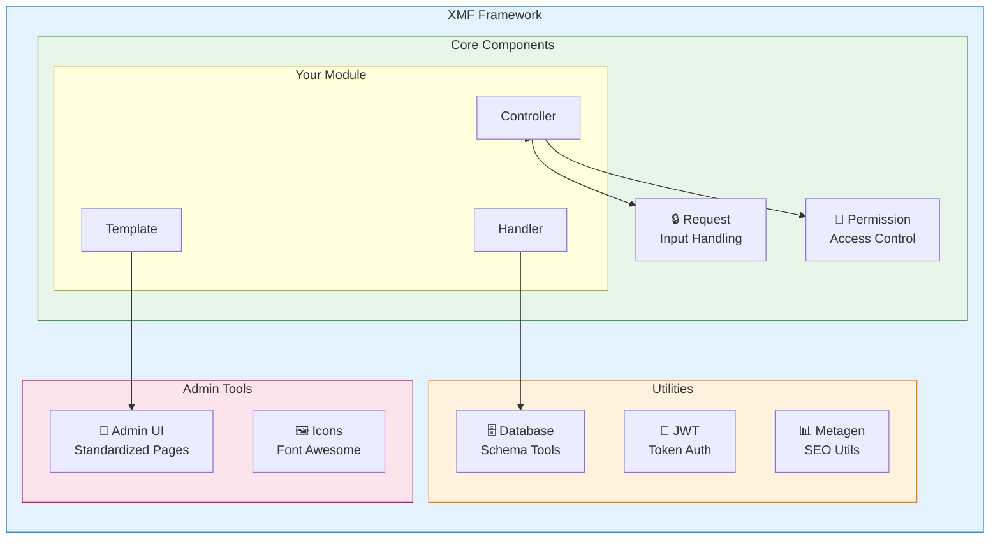
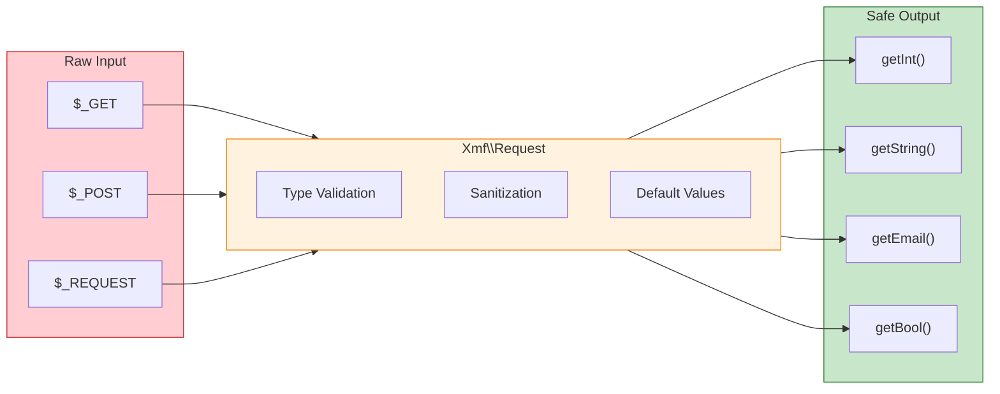

<span class="version-badge version-25x">2.5.x ✅</span> <span class="version-badge version-40x">4.0.x ✅</span>

:::tip[Η γέφυρα στο σύγχρονο XOOPS]
Το XMF λειτουργεί σε **και XOOPS 2.5.x και XOOPS 4.0.x**. Είναι ο προτεινόμενος τρόπος για να εκσυγχρονίσετε τις ενότητες σας σήμερα ενώ προετοιμάζεστε για το XOOPS 4.0. Το XMF παρέχει PSR-4 αυτόματη φόρτωση, χώρους ονομάτων και βοηθούς που εξομαλύνουν τη μετάβαση.
:::

Το **XOOPS Module Framework (XMF)** είναι μια ισχυρή βιβλιοθήκη που έχει σχεδιαστεί για να απλοποιεί και να τυποποιεί την ανάπτυξη λειτουργικών μονάδων XOOPS. Το XMF παρέχει σύγχρονες πρακτικές PHP, συμπεριλαμβανομένων χώρων ονομάτων, αυτόματης φόρτωσης και ένα ολοκληρωμένο σύνολο βοηθητικών κλάσεων που μειώνουν τον κώδικα λέβητα και βελτιώνουν τη συντηρησιμότητα.

## Τι είναι το XMF;

Το XMF είναι μια συλλογή κλάσεων και βοηθητικών προγραμμάτων που παρέχουν:

- **Σύγχρονη PHP Υποστήριξη** - Πλήρης υποστήριξη χώρου ονομάτων με αυτόματη φόρτωση PSR-4
- **Διαχείριση αιτημάτων** - Ασφαλής επικύρωση εισόδου και απολύμανση
- **Βοηθοί ενότητας** - Απλοποιημένη πρόσβαση σε διαμορφώσεις και αντικείμενα λειτουργικών μονάδων
- **Σύστημα αδειών** - Εύχρηστη διαχείριση αδειών
- **Βοηθητικά προγράμματα βάσης δεδομένων** - Εργαλεία μετεγκατάστασης σχήματος και διαχείρισης πινάκων
- **JWT Υποστήριξη** - JSON Εφαρμογή Web Token για ασφαλή έλεγχο ταυτότητας
- **Δημιουργία μεταδεδομένων** - SEO και βοηθητικά προγράμματα εξαγωγής περιεχομένου
- **Διασύνδεση διαχειριστή** - Τυποποιημένες σελίδες διαχείρισης λειτουργικών μονάδων

## # XMF Επισκόπηση στοιχείων



## Βασικά χαρακτηριστικά

## # Χώροι ονομάτων και αυτόματη φόρτωση

Όλες οι κλάσεις XMF βρίσκονται στον χώρο ονομάτων `XMF`. Οι τάξεις φορτώνονται αυτόματα όταν αναφέρονται - δεν απαιτείται εγχειρίδιο.

```php
use Xmf\Request;
use Xmf\Module\Helper;

// Classes load automatically when used
$input = Request::getString('input', '');
$helper = Helper::getHelper('mymodule');
```

## # Ασφαλής χειρισμός αιτημάτων

Η [Request class](../05-XMF-Framework/Basics/XMF-Request.md) παρέχει πρόσβαση με ασφάλεια τύπου σε δεδομένα αιτήματος HTTP με ενσωματωμένη απολύμανση:



```php
use Xmf\Request;

$id = Request::getInt('id', 0);
$name = Request::getString('name', '');
$email = Request::getEmail('email', '');
```

## # Σύστημα βοήθειας ενότητας

Το [Module Helper](../05-XMF-Framework/Basics/XMF-Module-Helper.md) παρέχει εύκολη πρόσβαση σε λειτουργίες που σχετίζονται με την ενότητα:

```php
$helper = \Xmf\Module\Helper::getHelper('mymodule');

// Access module configuration
$configValue = $helper->getConfig('setting_name', 'default');

// Get module object
$module = $helper->getModule();

// Access handlers
$handler = $helper->getHandler('items');
```

## # Διαχείριση δικαιωμάτων

Το [Permission-Helper](../05-XMF-Framework/Recipes/Permission-Helper.md) απλοποιεί τον χειρισμό αδειών XOOPS:

```php
$permHelper = new \Xmf\Module\Helper\Permission();

// Check user permission
if ($permHelper->checkPermission('view', $itemId)) {
    // User has permission
}
```

## Δομή τεκμηρίωσης

## # Βασικά

- [Getting-Started-with-XMF](../05-XMF-Framework/Basics/Getting-Started-with-XMF.md) - Εγκατάσταση και βασική χρήση
- [XMF-Request](../05-XMF-Framework/Basics/XMF-Request.md) - Διαχείριση αιτημάτων και επικύρωση εισόδου
- [XMF-Module-Helper](../05-XMF-Framework/Basics/XMF-Module-Helper.md) - Χρήση της βοηθητικής ενότητας

## # Συνταγές

- [Permission-Helper](../05-XMF-Framework/Recipes/Permission-Helper.md) - Εργασία με δικαιώματα
- [Module-Admin-Pages](../05-XMF-Framework/Recipes/Module-Admin-Pages.md) - Δημιουργία τυποποιημένων διεπαφών διαχειριστή

## # Αναφορά

- [JWT](../05-XMF-Framework/Reference/JWT.md) - JSON Υλοποίηση Web Token
- [Βάση δεδομένων](../05-XMF-Framework/Reference/Database.md) - Βοηθητικά προγράμματα βάσεων δεδομένων και διαχείριση σχημάτων
- [Metagen](Reference/Metagen.md) - Μεταδεδομένα και SEO βοηθητικά προγράμματα

## Απαιτήσεις

- XOOPS 2.5.8 ή μεταγενέστερη
- PHP 7.2 ή μεταγενέστερη (συνιστάται PHP 8.x)

## Εγκατάσταση

Το XMF περιλαμβάνεται με το XOOPS 2.5.8 και νεότερες εκδόσεις. Για παλαιότερες εκδόσεις ή μη αυτόματη εγκατάσταση:

1. Κατεβάστε το πακέτο XMF από το αποθετήριο XOOPS
2. Εξαγωγή στον κατάλογό σας XOOPS `/class/XMF/`
3. Η αυτόματη φόρτωση θα χειριστεί αυτόματα τη φόρτωση της τάξης

## Παράδειγμα γρήγορης εκκίνησης

Ακολουθεί ένα πλήρες παράδειγμα που δείχνει κοινά μοτίβα χρήσης XMF:

```php
<?php
use Xmf\Request;
use Xmf\Module\Helper;
use Xmf\Module\Helper\Permission;

// Get module helper
$helper = Helper::getHelper('mymodule');

// Get configuration values
$itemsPerPage = $helper->getConfig('items_per_page', 10);

// Handle request input
$op = Request::getCmd('op', 'list');
$id = Request::getInt('id', 0);

// Check permissions
$permHelper = new Permission();
if (!$permHelper->checkPermission('view', $id)) {
    redirect_header('index.php', 3, 'Access denied');
}

// Process based on operation
switch ($op) {
    case 'view':
        $handler = $helper->getHandler('items');
        $item = $handler->get($id);
        // ... display item
        break;
    case 'list':
    default:
        // ... list items
        break;
}
```

## Πόροι

- [XMF Αποθετήριο GitHub](https://github.com/XOOPS/XMF)
- [XOOPS Ιστότοπος έργου](https://xoops.org)

---

# XMF #XOOPS #framework #php #module-development
