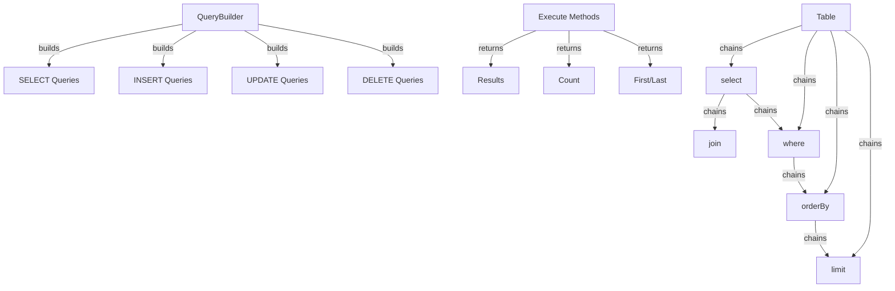

XOOPS בונה שאילתות מספק ממשק מודרני ושוטף לבניית שאילתות SQL. זה עוזר למנוע הזרקת SQL, משפר את הקריאות ומספק הפשטת מסד נתונים עבור מערכות מסד נתונים מרובות.

## ארכיטקטורת בונה שאילתות

## Class QueryBuilder

מחלקת בוני השאילתות הראשית עם ממשק שוטף.

### סקירת כיתה
```php
namespace Xoops\Database;

class QueryBuilder
{
    protected string $table = '';
    protected string $type = 'SELECT';
    protected array $selects = [];
    protected array $joins = [];
    protected array $wheres = [];
    protected array $orders = [];
    protected int $limit = 0;
    protected int $offset = 0;
    protected array $bindings = [];
}
```
### שיטות סטטיות

#### טבלה

יוצר בונה שאילתות חדש לטבלה.
```php
public static function table(string $table): QueryBuilder
```
**פרמטרים:**

| פרמטר | הקלד | תיאור |
|-----------|------|------------|
| `$table` | מחרוזת | שם טבלה (עם או בלי קידומת) |

**החזרות:** `QueryBuilder` - מופע של בונה שאילתות

**דוגמה:**
```php
$query = QueryBuilder::table('users');
$query = QueryBuilder::table('xoops_users'); // With prefix
```
## SELECT שאילתות

### בחר

מציין עמודות לבחירה.
```php
public function select(...$columns): self
```
**פרמטרים:**

| פרמטר | הקלד | תיאור |
|-----------|------|------------|
| `...$columns` | מערך | שמות עמודות או ביטויים |

**החזרות:** `self` - לשרשור שיטות

**דוגמה:**
```php
// Simple select
QueryBuilder::table('users')
    ->select('id', 'username', 'email')
    ->get();

// Select with aliases
QueryBuilder::table('users')
    ->select('id as user_id', 'username as name')
    ->get();

// Select all columns
QueryBuilder::table('users')
    ->select('*')
    ->get();

// Select with expressions
QueryBuilder::table('orders')
    ->select('id', 'COUNT(*) as total_items')
    ->groupBy('id')
    ->get();
```
### איפה

מוסיף מצב של WHERE.
```php
public function where(string $column, string $operator = '=', mixed $value = null): self
```
**פרמטרים:**

| פרמטר | הקלד | תיאור |
|-----------|------|------------|
| `$column` | מחרוזת | שם עמודה |
| `$operator` | מחרוזת | אופרטור השוואה |
| `$value` | מעורב | ערך להשוואה |

**החזרות:** `self` - לשרשור שיטות

**מפעילים:**

| מפעיל | תיאור | דוגמה |
|--------|-------------|--------|
| `=` | שווה | `->where('status', '=', 'active')` |
| `!=` או `<>` | לא שווה | `->where('status', '!=', 'deleted')` |
| `>` | גדול מ | `->where('price', '>', 100)` |
| `<` | פחות מ | `->where('price', '<', 100)` |
| `>=` | גדול או שווה | `->where('age', '>=', 18)` |
| `<=` | פחות או שווה | `->where('age', '<=', 65)` |
| `LIKE` | התאמת דפוס | `->where('name', 'LIKE', '%john%')` |
| `IN` | ברשימה | `->where('status', 'IN', ['active', 'pending'])` |
| `NOT IN` | לא ברשימה | `->where('id', 'NOT IN', [1, 2, 3])` |
| `BETWEEN` | טווח | `->where('age', 'BETWEEN', [18, 65])` |
| `IS NULL` | הוא ריק | `->where('deleted_at', 'IS NULL')` |
| `IS NOT NULL` | לא ריק | `->where('deleted_at', 'IS NOT NULL')` |

**דוּגמָה:**
```php
// Single condition
QueryBuilder::table('users')
    ->select('*')
    ->where('status', '=', 'active')
    ->get();

// Multiple conditions (AND)
QueryBuilder::table('users')
    ->select('*')
    ->where('status', '=', 'active')
    ->where('age', '>=', 18)
    ->get();

// IN operator
QueryBuilder::table('products')
    ->select('*')
    ->where('category_id', 'IN', [1, 2, 3])
    ->get();

// LIKE operator
QueryBuilder::table('users')
    ->select('*')
    ->where('email', 'LIKE', '%@example.com')
    ->get();

// NULL check
QueryBuilder::table('users')
    ->select('*')
    ->where('deleted_at', 'IS NULL')
    ->get();
```
### או איפה

מוסיף תנאי OR.
```php
public function orWhere(string $column, string $operator = '=', mixed $value = null): self
```
**דוּגמָה:**
```php
QueryBuilder::table('users')
    ->select('*')
    ->where('status', '=', 'active')
    ->orWhere('premium', '=', 1)
    ->get();
    // SELECT * FROM users WHERE status = 'active' OR premium = 1
```
### whereIn / whereNotIn

שיטות נוחות עבור IN/NOT IN.
```php
public function whereIn(string $column, array $values): self
public function whereNotIn(string $column, array $values): self
```
**דוּגמָה:**
```php
QueryBuilder::table('posts')
    ->select('*')
    ->whereIn('status', ['published', 'scheduled'])
    ->get();

QueryBuilder::table('comments')
    ->select('*')
    ->whereNotIn('spam_score', [8, 9, 10])
    ->get();
```
### whereNull / whereNotNull

שיטות נוחות לצ'קים NULL.
```php
public function whereNull(string $column): self
public function whereNotNull(string $column): self
```
**דוּגמָה:**
```php
QueryBuilder::table('users')
    ->select('*')
    ->whereNotNull('verified_at')
    ->get();
```
### איפה שבין

בודק אם הערך נמצא בין שני ערכים.
```php
public function whereBetween(string $column, array $values): self
```
**דוּגמָה:**
```php
QueryBuilder::table('products')
    ->select('*')
    ->whereBetween('price', [10, 100])
    ->get();

QueryBuilder::table('orders')
    ->select('*')
    ->whereBetween('created_at', ['2024-01-01', '2024-12-31'])
    ->get();
```
### הצטרף

מוסיף INNER JOIN.
```php
public function join(
    string $table,
    string $first,
    string $operator = '=',
    string $second = null
): self
```
**דוּגמָה:**
```php
QueryBuilder::table('posts')
    ->select('posts.*', 'users.username', 'categories.name')
    ->join('users', 'posts.user_id', '=', 'users.id')
    ->join('categories', 'posts.category_id', '=', 'categories.id')
    ->where('posts.published', '=', 1)
    ->get();
```
### leftJoin / rightJoin

סוגי הצטרפות חלופיים.
```php
public function leftJoin(
    string $table,
    string $first,
    string $operator = '=',
    string $second = null
): self

public function rightJoin(
    string $table,
    string $first,
    string $operator = '=',
    string $second = null
): self
```
**דוּגמָה:**
```php
QueryBuilder::table('users')
    ->select('users.*', 'COUNT(posts.id) as post_count')
    ->leftJoin('posts', 'users.id', '=', 'posts.user_id')
    ->groupBy('users.id')
    ->get();
```
### group By

מקבץ תוצאות לפי עמודות.
```php
public function groupBy(...$columns): self
```
**דוּגמָה:**
```php
QueryBuilder::table('orders')
    ->select('user_id', 'COUNT(*) as order_count', 'SUM(total) as total_spent')
    ->groupBy('user_id')
    ->get();

QueryBuilder::table('sales')
    ->select('department', 'region', 'SUM(amount) as total')
    ->groupBy('department', 'region')
    ->get();
```
### שיש

מוסיף מצב של HAVING.
```php
public function having(string $column, string $operator = '=', mixed $value = null): self
```
**דוּגמָה:**
```php
QueryBuilder::table('orders')
    ->select('user_id', 'COUNT(*) as order_count')
    ->groupBy('user_id')
    ->having('order_count', '>', 5)
    ->get();
```
### סדר לפי

תוצאות הזמנות.
```php
public function orderBy(string $column, string $direction = 'ASC'): self
```
**פרמטרים:**

| פרמטר | הקלד | תיאור |
|-----------|------|------------|
| `$column` | מחרוזת | עמודה להזמנה לפי |
| `$direction` | מחרוזת | `ASC` או `DESC` |

**דוּגמָה:**
```php
// Single order
QueryBuilder::table('users')
    ->select('*')
    ->orderBy('created_at', 'DESC')
    ->get();

// Multiple orders
QueryBuilder::table('posts')
    ->select('*')
    ->orderBy('category_id', 'ASC')
    ->orderBy('created_at', 'DESC')
    ->get();

// Random order
QueryBuilder::table('quotes')
    ->select('*')
    ->orderBy('RAND()')
    ->get();
```
### מגבלה / היסט

מגביל ומקזז תוצאות.
```php
public function limit(int $limit): self
public function offset(int $offset): self
```
**דוּגמָה:**
```php
// Simple limit
QueryBuilder::table('posts')
    ->select('*')
    ->limit(10)
    ->get();

// Pagination
$page = 2;
$perPage = 20;
$offset = ($page - 1) * $perPage;

QueryBuilder::table('posts')
    ->select('*')
    ->limit($perPage)
    ->offset($offset)
    ->get();
```
## שיטות ביצוע

### לקבל

מבצע שאילתה ומחזיר את כל התוצאות.
```php
public function get(): array
```
**החזרות:** `array` - מערך שורות תוצאות

**דוגמה:**
```php
$users = QueryBuilder::table('users')
    ->select('id', 'username', 'email')
    ->where('status', '=', 'active')
    ->orderBy('username')
    ->get();

foreach ($users as $user) {
    echo $user['username'] . ' (' . $user['email'] . ')' . "\n";
}
```
### ראשון

מקבל את התוצאה הראשונה.
```php
public function first(): ?array
```
**החזרות:** `?array` - שורה ראשונה או ריק

**דוגמה:**
```php
$user = QueryBuilder::table('users')
    ->select('*')
    ->where('id', '=', 123)
    ->first();

if ($user) {
    echo 'Found: ' . $user['username'];
}
```
### אחרון

מקבל את התוצאה האחרונה.
```php
public function last(): ?array
```
**דוּגמָה:**
```php
$latestPost = QueryBuilder::table('posts')
    ->select('*')
    ->orderBy('created_at', 'DESC')
    ->last();
```
### ספירה

מקבל את ספירת התוצאות.
```php
public function count(): int
```
**החזרות:** `int` - מספר שורות

**דוגמה:**
```php
$activeUsers = QueryBuilder::table('users')
    ->where('status', '=', 'active')
    ->count();

echo "Active users: $activeUsers";
```
### קיים

בודק אם השאילתה מחזירה תוצאות.
```php
public function exists(): bool
```
**החזרות:** `bool` - נכון אם קיימות תוצאות

**דוגמה:**
```php
if (QueryBuilder::table('users')->where('email', '=', 'test@example.com')->exists()) {
    echo 'User already exists';
}
```
### מצטבר

מקבל ערכים מצטברים.
```php
public function aggregate(string $function, string $column): mixed
```
**דוּגמָה:**
```php
$maxPrice = QueryBuilder::table('products')
    ->aggregate('MAX', 'price');

$avgAge = QueryBuilder::table('users')
    ->aggregate('AVG', 'age');

$totalSales = QueryBuilder::table('orders')
    ->aggregate('SUM', 'total');
```
## INSERT שאילתות

### הוסף

מוסיף שורה.
```php
public function insert(array $values): bool
```
**דוּגמָה:**
```php
QueryBuilder::table('users')->insert([
    'username' => 'john',
    'email' => 'john@example.com',
    'password' => password_hash('secret', PASSWORD_BCRYPT),
    'created_at' => date('Y-m-d H:i:s')
]);
```
### הוסף רבים

מוסיף שורות מרובות.
```php
public function insertMany(array $rows): bool
```
**דוּגמָה:**
```php
QueryBuilder::table('log_entries')->insertMany([
    ['action' => 'login', 'user_id' => 1, 'timestamp' => time()],
    ['action' => 'logout', 'user_id' => 2, 'timestamp' => time()],
    ['action' => 'update', 'user_id' => 3, 'timestamp' => time()]
]);
```
## UPDATE שאילתות

### עדכון

מעדכן שורות.
```php
public function update(array $values): int
```
**החזרות:** `int` - מספר השורות המושפעות

**דוגמה:**
```php
// Update single user
QueryBuilder::table('users')
    ->where('id', '=', 123)
    ->update([
        'email' => 'newemail@example.com',
        'updated_at' => date('Y-m-d H:i:s')
    ]);

// Update multiple rows
QueryBuilder::table('posts')
    ->where('status', '=', 'draft')
    ->where('created_at', '<', date('Y-m-d', strtotime('-30 days')))
    ->update([
        'status' => 'archived'
    ]);
```
### הגדלה / הקטנה

מגדיל או מקטין עמודה.
```php
public function increment(string $column, int $amount = 1): int
public function decrement(string $column, int $amount = 1): int
```
**דוּגמָה:**
```php
// Increment view count
QueryBuilder::table('posts')
    ->where('id', '=', 123)
    ->increment('views');

// Decrement stock
QueryBuilder::table('products')
    ->where('id', '=', 456)
    ->decrement('stock', 5);
```
## DELETE שאילתות

### למחוק

מוחק שורות.
```php
public function delete(): int
```
**החזרות:** `int` - מספר שורות שנמחקו

**דוגמה:**
```php
// Delete single record
QueryBuilder::table('comments')
    ->where('id', '=', 789)
    ->delete();

// Delete multiple records
QueryBuilder::table('log_entries')
    ->where('created_at', '<', date('Y-m-d', strtotime('-30 days')))
    ->delete();
```
### לקטוע

מוחק את כל השורות מהטבלה.
```php
public function truncate(): bool
```
**דוּגמָה:**
```php
// Clear all sessions
QueryBuilder::table('sessions')->truncate();
```
## תכונות מתקדמות

### ביטויים גולמיים
```php
QueryBuilder::table('products')
    ->select('id', 'name', QueryBuilder::raw('price * quantity as total'))
    ->get();
```
### שאילתות משנה
```php
$recentPostIds = QueryBuilder::table('posts')
    ->select('id')
    ->where('created_at', '>', date('Y-m-d', strtotime('-7 days')))
    ->toSql();

$comments = QueryBuilder::table('comments')
    ->select('*')
    ->whereIn('post_id', $recentPostIds)
    ->get();
```
### השגת SQL
```php
public function toSql(): string
```
**דוּגמָה:**
```php
$sql = QueryBuilder::table('users')
    ->select('id', 'username')
    ->where('status', '=', 'active')
    ->toSql();

echo $sql;
// SELECT id, username FROM xoops_users WHERE status = ?
```
## דוגמאות מלאות

### בחירה מורכבת עם חיבורים
```php
<?php
/**
 * Get posts with author and category info
 */

$posts = QueryBuilder::table('posts')
    ->select(
        'posts.id',
        'posts.title',
        'posts.content',
        'posts.created_at',
        'users.username as author',
        'categories.name as category'
    )
    ->join('users', 'posts.user_id', '=', 'users.id')
    ->join('categories', 'posts.category_id', '=', 'categories.id')
    ->where('posts.published', '=', 1)
    ->orderBy('posts.created_at', 'DESC')
    ->limit(10)
    ->get();

foreach ($posts as $post) {
    echo '<article>';
    echo '<h2>' . htmlspecialchars($post['title']) . '</h2>';
    echo '<p class="meta">By ' . htmlspecialchars($post['author']) . ' in ' . htmlspecialchars($post['category']) . '</p>';
    echo '<p>' . htmlspecialchars($post['content']) . '</p>';
    echo '</article>';
}
```
### עימוד עם QueryBuilder
```php
<?php
/**
 * Paginated results
 */

$page = isset($_GET['page']) ? (int)$_GET['page'] : 1;
$perPage = 20;
$offset = ($page - 1) * $perPage;

// Get total count
$total = QueryBuilder::table('articles')
    ->where('status', '=', 'published')
    ->count();

// Get page results
$articles = QueryBuilder::table('articles')
    ->select('*')
    ->where('status', '=', 'published')
    ->orderBy('created_at', 'DESC')
    ->limit($perPage)
    ->offset($offset)
    ->get();

// Calculate pagination
$pages = ceil($total / $perPage);

// Display results
foreach ($articles as $article) {
    echo '<div class="article">' . htmlspecialchars($article['title']) . '</div>';
}

// Display pagination links
if ($pages > 1) {
    echo '<nav class="pagination">';
    for ($i = 1; $i <= $pages; $i++) {
        if ($i == $page) {
            echo '<span class="current">' . $i . '</span>';
        } else {
            echo '<a href="?page=' . $i . '">' . $i . '</a>';
        }
    }
    echo '</nav>';
}
```
### ניתוח נתונים עם אגרגטים
```php
<?php
/**
 * Sales analysis
 */

// Total sales by region
$regionSales = QueryBuilder::table('orders')
    ->select('region', QueryBuilder::raw('SUM(total) as total_sales'), QueryBuilder::raw('COUNT(*) as order_count'))
    ->groupBy('region')
    ->orderBy('total_sales', 'DESC')
    ->get();

foreach ($regionSales as $region) {
    echo $region['region'] . ': $' . number_format($region['total_sales'], 2) . ' (' . $region['order_count'] . ' orders)' . "\n";
}

// Average order value
$avgOrderValue = QueryBuilder::table('orders')
    ->aggregate('AVG', 'total');

echo 'Average order value: $' . number_format($avgOrderValue, 2);
```
## שיטות עבודה מומלצות

1. **השתמש בשאילתות עם פרמטרים** - QueryBuilder מטפל בכריכת פרמטרים באופן אוטומטי
2. **שיטות שרשרת** - מינוף ממשק שוטף לקוד קריא
3. **בדוק SQL פלט** - השתמש ב-`toSql()` כדי לאמת שאילתות שנוצרו
4. **השתמש באינדקסים** - ודא שעמודות עם שאילתות תכופות מתווספות לאינדקס
5. **הגבלת תוצאות** - השתמש תמיד ב-`limit()` עבור מערכי נתונים גדולים
6. **השתמש במצטברים** - תן למסד הנתונים לעשות counting/summing במקום PHP
7. **Escape Output** - יציאה תמיד מהנתונים המוצגים עם `htmlspecialchars()`
8. **ביצועי אינדקס** - עקוב אחר שאילתות איטיות ובצע אופטימיזציה בהתאם

## תיעוד קשור

- XoopsDatabase - שכבת מסד נתונים וחיבורים
- קריטריונים - מערכת שאילתות מבוססת קריטריונים מדור קודם
- ../Core/XoopsObject - התמדה של אובייקט נתונים
- ../Module/Module-System - פעולות מסד נתונים של מודול

---

*ראה גם: [XOOPS מסד נתונים API](https://github.com/XOOPS/XoopsCore27/tree/master/htdocs/class)*