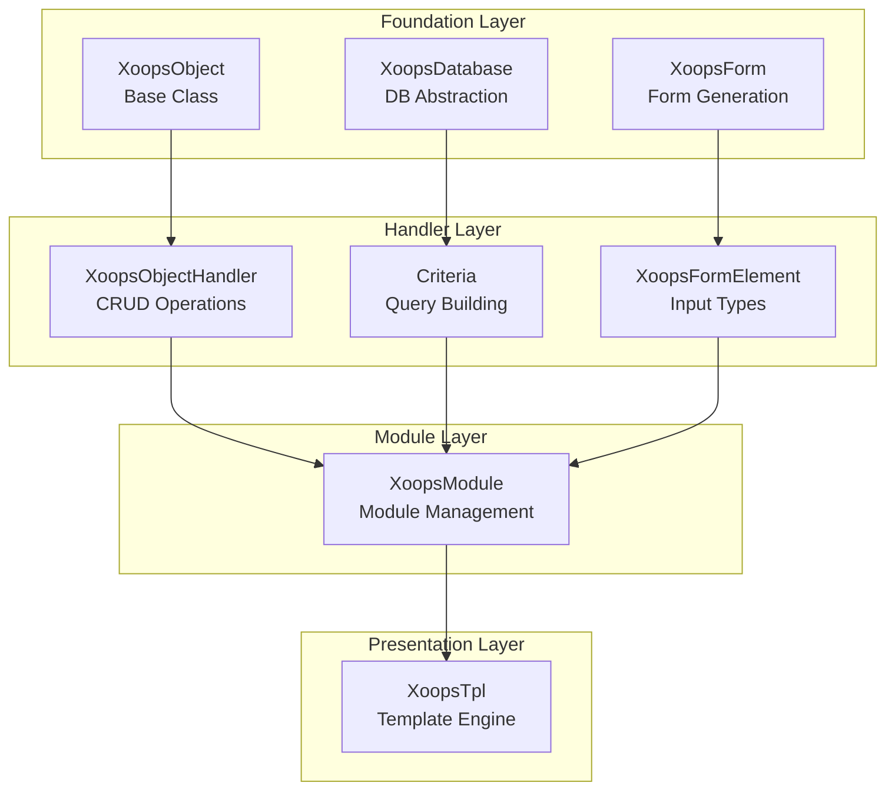
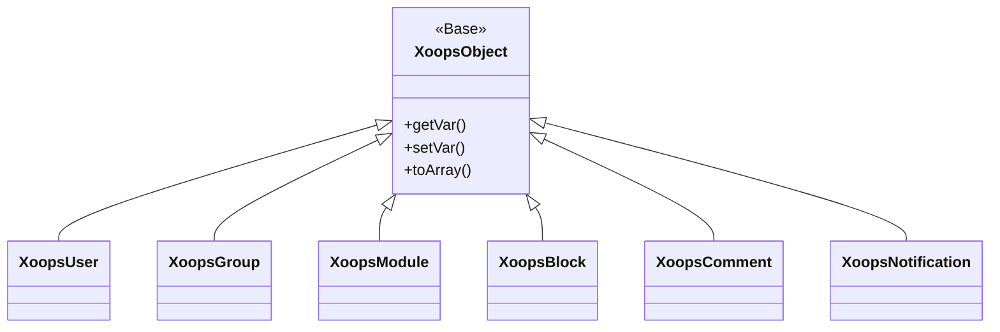
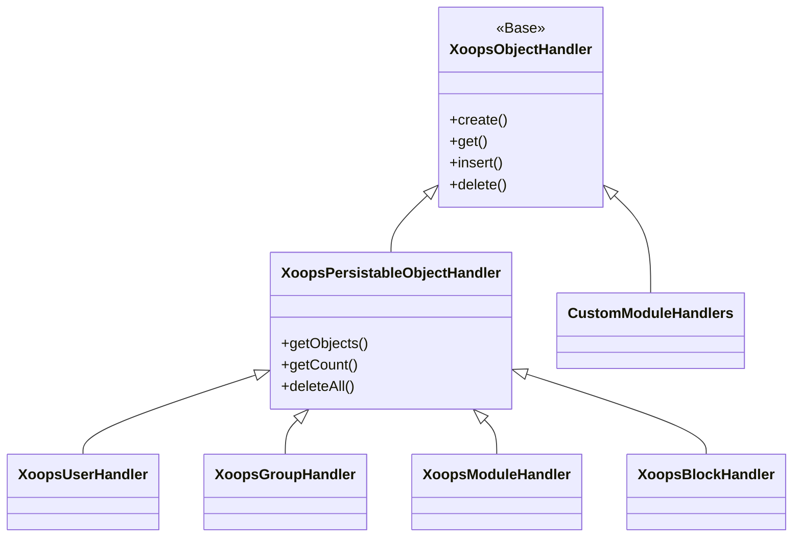
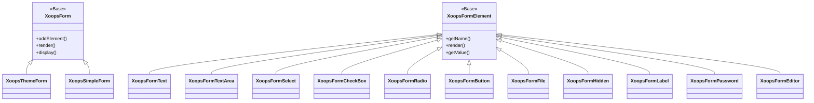

ברוכים הבאים לתיעוד העזר המקיף XOOPS API. סעיף זה מספק תיעוד מפורט עבור כל מחלקות הליבה, השיטות והמערכות המרכיבות את XOOPS מערכת ניהול התוכן.

## סקירה כללית

XOOPS API מאורגנת במספר תת-מערכות עיקריות, שכל אחת אחראית להיבט ספציפי של הפונקציונליות CMS. הבנת APIs אלה חיונית לפיתוח מודולים, ערכות נושא והרחבות עבור XOOPS.

## API מדורים

### שיעורי ליבה

מחלקות הבסיס שכל שאר הרכיבים XOOPS בונים עליהם.

| תיעוד | תיאור |
|-------------|--------|
| XoopsObject | מחלקה בסיס לכל אובייקטי הנתונים ב-XOOPS |
| XoopsObjectHandler | דפוס מטפל לפעולות CRUD |

### שכבת מסד נתונים

כלי עזר להפשטת מסדי נתונים ובניית שאילתות.

| תיעוד | תיאור |
|-------------|--------|
| XoopsDatabase | שכבת הפשטת מסד נתונים |
| מערכת קריטריונים | קריטריונים ותנאים של שאילתה |
| QueryBuilder | בניין שאילתות שוטף מודרני |

### מערכת טפסים

HTML יצירת טופס ואימות.

| תיעוד | תיאור |
|-------------|--------|
| XoopsForm | מיכל טופס ועיבוד |
| רכיבי טופס | כל סוגי רכיבי הטופס הזמינים |

### שיעורי ליבה

רכיבי מערכת ושירותי ליבה.

| תיעוד | תיאור |
|-------------|--------|
| חוגי ליבה | ליבת מערכת ורכיבי ליבה |

### מערכת מודול

ניהול מודול ומחזור חיים.

| תיעוד | תיאור |
|-------------|--------|
| מערכת מודול | טעינת מודול, התקנה וניהול |

### מערכת תבניות

Smarty שילוב תבנית.

| תיעוד | תיאור |
|-------------|--------|
| מערכת תבניות | Smarty אינטגרציה וניהול תבניות |

### מערכת משתמש

ניהול ואימות משתמשים.

| תיעוד | תיאור |
|-------------|--------|
| מערכת משתמש | חשבונות משתמש, קבוצות והרשאות |

## סקירה כללית של אדריכלות

## היררכיית מעמדות

### מודל אובייקט

### דגם מטפל

### מודל טופס

## דפוסי עיצוב

ה- XOOPS API מיישם מספר דפוסי עיצוב ידועים:

### דפוס יחיד
משמש לשירותים גלובליים כמו חיבורי מסד נתונים ומופעי מיכל.
```php
$db = XoopsDatabase::getInstance();
$container = XoopsContainer::getInstance();
```
### תבנית מפעל
מטפלי אובייקטים יוצרים אובייקטי תחום באופן עקבי.
```php
$handler = xoops_getHandler('user');
$user = $handler->create();
```
### דפוס מורכב
טפסים מכילים רכיבי טופס מרובים; קריטריונים יכולים להכיל קריטריונים מקוננים.
```php
$criteria = new CriteriaCompo();
$criteria->add(new Criteria('status', 1));
$criteria->add(new CriteriaCompo(...)); // Nested
```
### תבנית צופה
מערכת האירועים מאפשרת צימוד רופף בין מודולים.
```php
$dispatcher->addListener('module.news.article_published', $callback);
```
## דוגמאות להתחלה מהירה

### יצירה ושמירה של אובייקט
```php
// Get the handler
$handler = xoops_getHandler('user');

// Create a new object
$user = $handler->create();
$user->setVar('uname', 'newuser');
$user->setVar('email', 'user@example.com');

// Save to database
$handler->insert($user);
```
### שאילתה עם קריטריונים
```php
// Build criteria
$criteria = new CriteriaCompo();
$criteria->add(new Criteria('level', 0, '>'));
$criteria->setSort('uname');
$criteria->setOrder('ASC');
$criteria->setLimit(10);

// Get objects
$handler = xoops_getHandler('user');
$users = $handler->getObjects($criteria);
```
### יצירת טופס
```php
$form = new XoopsThemeForm('User Profile', 'userform', 'save.php', 'post', true);
$form->addElement(new XoopsFormText('Username', 'uname', 50, 255, $user->getVar('uname')));
$form->addElement(new XoopsFormTextArea('Bio', 'bio', $user->getVar('bio')));
$form->addElement(new XoopsFormButton('', 'submit', _SUBMIT, 'submit'));
echo $form->render();
```
## API כנסים

### מוסכמות שמות

| הקלד | אמנה | דוגמה |
|------|--------|--------|
| חוגים | PascalCase | `XoopsUser`, `CriteriaCompo` |
| שיטות | camelCase | `getVar()`, `setVar()` |
| נכסים | camelCase (מוגן) | `$_vars`, `$_handler` |
| קבועים | UPPER_SNAKE_CASE | `XOBJ_DTYPE_INT` |
| טבלאות מסד נתונים | נרתיק_נחש | `users`, `groups_users_link` |

### סוגי נתונים

XOOPS מגדיר סוגי נתונים סטנדרטיים עבור משתני אובייקט:

| קבוע | הקלד | תיאור |
|--------|------|--------|
| `XOBJ_DTYPE_TXTBOX` | מחרוזת | קלט טקסט (מחטא) |
| `XOBJ_DTYPE_TXTAREA` | מחרוזת | תוכן אזורי טקסט |
| `XOBJ_DTYPE_INT` | מספר שלם | ערכים מספריים |
| `XOBJ_DTYPE_URL` | מחרוזת | URL אימות |
| `XOBJ_DTYPE_EMAIL` | מחרוזת | אימות דוא"ל |
| `XOBJ_DTYPE_ARRAY` | מערך | מערכים סדרתיים |
| `XOBJ_DTYPE_OTHER` | מעורב | טיפול מותאם אישית |
| `XOBJ_DTYPE_SOURCE` | מחרוזת | קוד מקור (חיטוי מינימלי) |
| `XOBJ_DTYPE_STIME` | מספר שלם | חותמת זמן קצרה |
| `XOBJ_DTYPE_MTIME` | מספר שלם | חותמת זמן בינונית |
| `XOBJ_DTYPE_LTIME` | מספר שלם | חותמת זמן ארוכה |

## שיטות אימות

API תומך במספר שיטות אימות:

### API אימות מפתח
```
X-API-Key: your-api-key
```
### OAuth Bearer Token
```
Authorization: Bearer your-oauth-token
```
### אימות מבוסס הפעלה
משתמש בסשן XOOPS קיים כאשר הוא מחובר.

## REST API נקודות קצה

כאשר REST API מופעל:

| נקודת קצה | שיטה | תיאור |
|--------|--------|----------------|
| `/api.php/rest/users` | GET | רשימת משתמשים |
| `/api.php/rest/users/{id}` | GET | קבל משתמש לפי זיהוי |
| `/api.php/rest/users` | POST | צור משתמש |
| `/api.php/rest/users/{id}` | PUT | עדכן משתמש |
| `/api.php/rest/users/{id}` | DELETE | מחק משתמש |
| `/api.php/rest/modules` | GET | רשימת מודולים |

## תיעוד קשור

- מדריך לפיתוח מודול
- מדריך לפיתוח נושאים
- תצורת מערכת
- שיטות עבודה מומלצות לאבטחה

## היסטוריית גרסאות

| גרסה | שינויים |
|--------|--------|
| 2.5.11 | שחרור יציב נוכחי |
| 2.5.10 | נוספה GraphQL API תמיכה |
| 2.5.9 | מערכת קריטריונים משופרת |
| 2.5.8 | PSR-4 תמיכה בטעינה אוטומטית |

---

*תיעוד זה הוא חלק ממאגר הידע XOOPS. לעדכונים האחרונים, בקר במאגר [XOOPS GitHub](https://github.com/XOOPS).*