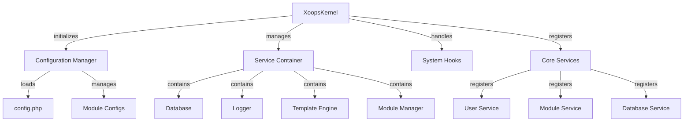

הקרנל XOOPS מספק את המסגרת הבסיסית לאתחול של המערכת, ניהול תצורות, טיפול באירועי מערכת ואספקת כלי עזר ליבה. שיעורים אלה מהווים את עמוד השדרה של היישום XOOPS.

## ארכיטקטורת מערכת

## XoopsKernel שיעור

מחלקת הקרנל הראשית המאתחלת ומנהלת את מערכת XOOPS.

### סקירת כיתה
```php
namespace Xoops;

class XoopsKernel
{
    private static ?XoopsKernel $instance = null;
    protected ServiceContainer $services;
    protected ConfigurationManager $config;
    protected array $modules = [];
    protected bool $isLoaded = false;
}
```
### קונסטרוקטור
```php
private function __construct()
```
בנאי פרטי אוכף דפוס יחיד.

### getInstance

מאחזר את מופע ליבת הסינגלטון.
```php
public static function getInstance(): XoopsKernel
```
**מחזירות:** `XoopsKernel` - מופע ליבת הסינגלטון

**דוגמה:**
```php
$kernel = XoopsKernel::getInstance();
```
### תהליך אתחול

תהליך האתחול של הליבה מבצע את השלבים הבאים:

1. **אתחול** - הגדר מטפלי שגיאות, הגדר קבועים
2. **תצורה** - טען קבצי תצורה
3. **רישום שירות** - רישום שירותי ליבה
4. **זיהוי מודולים** - סרוק וזיהוי מודולים פעילים
5. **אתחול מסד נתונים** - התחבר למסד נתונים
6. **ניקוי** - היכונו לטיפול בבקשות
```php
public function boot(): void
```
**דוּגמָה:**
```php
$kernel = XoopsKernel::getInstance();
$kernel->boot();
```
### שיטות מיכל שירות

#### registerService

רושם שירות במיכל השירות.
```php
public function registerService(
    string $name,
    callable|object $definition
): void
```
**פרמטרים:**

| פרמטר | הקלד | תיאור |
|-----------|------|------------|
| `$name` | מחרוזת | מזהה שירות |
| `$definition` | ניתן להתקשר\|אובייקט | מפעל שירות או מופע |

**דוּגמָה:**
```php
$kernel->registerService('custom.handler', function($c) {
    return new CustomHandler();
});
```
#### getService

מאחזר שירות רשום.
```php
public function getService(string $name): mixed
```
**פרמטרים:**

| פרמטר | הקלד | תיאור |
|-----------|------|------------|
| `$name` | מחרוזת | מזהה שירות |

**החזרות:** `mixed` - השירות המבוקש

**דוגמה:**
```php
$database = $kernel->getService('database');
$logger = $kernel->getService('logger');
```
#### hasService

בודק אם שירות רשום.
```php
public function hasService(string $name): bool
```
**דוּגמָה:**
```php
if ($kernel->hasService('cache')) {
    $cache = $kernel->getService('cache');
}
```
## מנהל תצורה

מנהל את תצורת האפליקציה והגדרות המודול.

### סקירת כיתה
```php
namespace Xoops\Core;

class ConfigurationManager
{
    protected array $config = [];
    protected array $defaults = [];
    protected string $configPath;
}
```
### שיטות

#### טען

טוען תצורה מקובץ או מערך.
```php
public function load(string|array $source): void
```
**פרמטרים:**

| פרמטר | הקלד | תיאור |
|-----------|------|------------|
| `$source` | מחרוזת\|מערך | נתיב קובץ תצורה או מערך |

**דוּגמָה:**
```php
$config = $kernel->getService('config');
$config->load(XOOPS_ROOT_PATH . '/include/config.php');
$config->load(['sitename' => 'My Site', 'admin_email' => 'admin@example.com']);
```
#### לקבל

מאחזר ערך תצורה.
```php
public function get(string $key, mixed $default = null): mixed
```
**פרמטרים:**

| פרמטר | הקלד | תיאור |
|-----------|------|------------|
| `$key` | מחרוזת | מפתח תצורה (סימון נקודה) |
| `$default` | מעורב | ערך ברירת מחדל אם לא נמצא |

**החזרות:** `mixed` - ערך תצורה

**דוגמה:**
```php
$siteName = $config->get('sitename');
$adminEmail = $config->get('admin.email', 'admin@example.com');
```
#### מוגדר

מגדיר ערך תצורה.
```php
public function set(string $key, mixed $value): void
```
**פרמטרים:**

| פרמטר | הקלד | תיאור |
|-----------|------|------------|
| `$key` | מחרוזת | מפתח תצורה |
| `$value` | מעורב | ערך תצורה |

**דוּגמָה:**
```php
$config->set('sitename', 'New Site Name');
$config->set('features.cache_enabled', true);
```
#### getModuleConfig

מקבל תצורה עבור מודול ספציפי.
```php
public function getModuleConfig(
    string $moduleName
): array
```
**פרמטרים:**

| פרמטר | הקלד | תיאור |
|-----------|------|------------|
| `$moduleName` | מחרוזת | שם ספריית מודול |

**החזרות:** `array` - מערך תצורת מודול

**דוגמה:**
```php
$publisherConfig = $config->getModuleConfig('publisher');
```
## ווי מערכת

ווי מערכת מאפשרים למודולים ותוספים להפעיל קוד בנקודות ספציפיות במחזור החיים של האפליקציה.

### כיתת HookManager
```php
namespace Xoops\Core;

class HookManager
{
    protected array $hooks = [];
    protected array $listeners = [];
}
```
### שיטות

#### addHook

רושם נקודת הוק.
```php
public function addHook(string $name): void
```
**פרמטרים:**

| פרמטר | הקלד | תיאור |
|-----------|------|------------|
| `$name` | מחרוזת | מזהה הוק |

**דוּגמָה:**
```php
$hooks = $kernel->getService('hooks');
$hooks->addHook('system.startup');
$hooks->addHook('user.login');
$hooks->addHook('module.install');
```
#### תקשיבו

מצרף מאזין להוק.
```php
public function listen(
    string $hookName,
    callable $callback,
    int $priority = 10
): void
```
**פרמטרים:**

| פרמטר | הקלד | תיאור |
|-----------|------|------------|
| `$hookName` | מחרוזת | מזהה הוק |
| `$callback` | ניתן להתקשר | פונקציה לביצוע |
| `$priority` | int | עדיפות ביצוע (ריצות גבוהות יותר תחילה) |

**דוּגמָה:**
```php
$hooks->listen('user.login', function($user) {
    error_log('User ' . $user->uname . ' logged in');
}, 10);

$hooks->listen('module.install', function($module) {
    // Custom module installation logic
    echo "Installing " . $module->getName();
}, 5);
```
#### טריגר

מבצע את כל המאזינים להוק.
```php
public function trigger(
    string $hookName,
    mixed $arguments = null
): array
```
**פרמטרים:**

| פרמטר | הקלד | תיאור |
|-----------|------|------------|
| `$hookName` | מחרוזת | מזהה הוק |
| `$arguments` | מעורב | נתונים להעביר למאזינים |

**החזרות:** `array` - תוצאות מכל המאזינים

**דוגמה:**
```php
$results = $hooks->trigger('system.startup');
$results = $hooks->trigger('user.created', $newUser);
```
## סקירה כללית של שירותי ליבה

הקרנל רושם מספר שירותי ליבה במהלך האתחול:

| שירות | כיתה | מטרה |
|--------|--------|--------|
| `database` | XoopsDatabase | שכבת הפשטת מסד נתונים |
| `config` | ConfigurationManager | ניהול תצורה |
| `logger` | לוגר | רישום יישומים |
| `template` | XoopsTpl | מנוע תבנית |
| `user` | מנהל משתמשים | שירות ניהול משתמשים |
| `module` | ModuleManager | ניהול מודול |
| `cache` | CacheManager | שכבת cache |
| `hooks` | HookManager | מערכת ווים לאירועים |

## דוגמה מלאה לשימוש
```php
<?php
/**
 * Custom module boot process utilizing kernel
 */

// Get kernel instance
$kernel = XoopsKernel::getInstance();

// Boot the system
$kernel->boot();

// Get services
$config = $kernel->getService('config');
$database = $kernel->getService('database');
$logger = $kernel->getService('logger');
$hooks = $kernel->getService('hooks');

// Access configuration
$siteName = $config->get('sitename');
$adminEmail = $config->get('admin.email');

// Register module-specific hooks
$hooks->listen('user.login', function($user) {
    // Log user login
    $logger->info('User login: ' . $user->uname);

    // Track in database
    $database->query(
        'INSERT INTO ' . $database->prefix('event_log') .
        ' (type, user_id, message, timestamp) VALUES (?, ?, ?, ?)',
        ['login', $user->uid(), 'User login', time()]
    );
});

$hooks->listen('module.install', function($module) {
    $logger->info('Module installed: ' . $module->getName());
});

// Trigger hooks
$hooks->trigger('system.startup');

// Use database service
$result = $database->query(
    'SELECT * FROM ' . $database->prefix('users') .
    ' LIMIT 10'
);

while ($row = $database->fetchArray($result)) {
    echo "User: " . htmlspecialchars($row['uname']) . "\n";
}

// Register custom service
$kernel->registerService('custom.repository', function($c) {
    return new CustomRepository($c->getService('database'));
});

// Later access custom service
$repo = $kernel->getService('custom.repository');
```
## קבועי ליבה

הקרנל מגדיר מספר קבועים חשובים במהלך האתחול:
```php
// System paths
define('XOOPS_ROOT_PATH', '/var/www/xoops');
define('XOOPS_HTDOCS_PATH', XOOPS_ROOT_PATH . '/htdocs');
define('XOOPS_MODULES_PATH', XOOPS_ROOT_PATH . '/htdocs/modules');
define('XOOPS_THEMES_PATH', XOOPS_ROOT_PATH . '/htdocs/themes');

// Web paths
define('XOOPS_URL', 'http://example.com');
define('XOOPS_HTDOCS_URL', XOOPS_URL . '/htdocs');

// Database
define('XOOPS_DB_PREFIX', 'xoops_');
```
## טיפול בשגיאות

הקרנל מגדיר מטפלי שגיאות במהלך האתחול:
```php
// Set custom error handler
set_error_handler(function($errno, $errstr, $errfile, $errline) {
    $kernel->getService('logger')->error(
        "Error: $errstr in $errfile:$errline"
    );
});

// Set exception handler
set_exception_handler(function($exception) {
    $kernel->getService('logger')->critical(
        "Exception: " . $exception->getMessage()
    );
});
```
## שיטות עבודה מומלצות

1. **אתחול בודד** - התקשר `boot()` פעם אחת בלבד במהלך הפעלת האפליקציה
2. **השתמש ב-Service Container** - רישום ואחזר שירותים דרך הקרנל
3. **טיפול בהוקס מוקדם** - רשום מאזיני הוק לפני הפעלתם
4. **יומן אירועים חשובים** - השתמש בשירות לוגר לצורך איתור באגים
5. **תצורת cache** - טען תצורה פעם אחת ועשה שימוש חוזר
6. **טיפול בשגיאות** - הגדר תמיד מטפלי שגיאות לפני עיבוד בקשות

## תיעוד קשור

- ../Module/Module-System - מערכת מודול ומחזור חיים
- ../Template/Template-System - שילוב מנוע תבניות
- ../User/User-System - אימות וניהול משתמשים
- ../Database/XoopsDatabase - שכבת מסד נתונים

---

*ראה גם: [XOOPS מקור ליבה](https://github.com/XOOPS/XoopsCore27/tree/master/htdocs/class)*