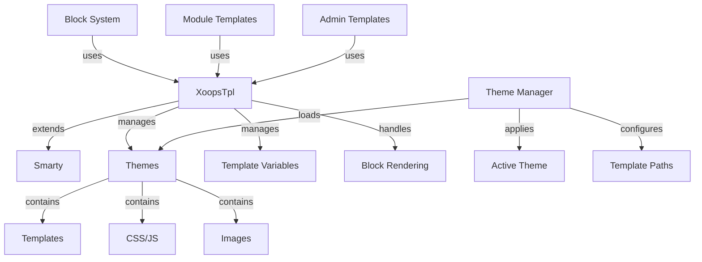

מערכת התבניות XOOPS בנויה על מנוע התבניות החזק Smarty, המספקת דרך גמישה וניתנת להרחבה להפרדה בין היגיון מצגת להיגיון עסקי. הוא מנהל ערכות נושא, עיבוד תבניות, הקצאת משתנים ויצירת תוכן דינמי.

## ארכיטקטורת תבניות

## XoopsTpl שיעור

מחלקת מנוע התבנית העיקרית המשתרעת Smarty.

### סקירת כיתה
```php
namespace Xoops\Core;

class XoopsTpl extends Smarty
{
    protected array $vars = [];
    protected string $currentTheme = '';
    protected array $blocks = [];
    protected bool $isAdmin = false;
}
```
### הארכת Smarty
```php
use Xoops\Core\XoopsTpl;

class XoopsTpl extends Smarty
{
    private static ?XoopsTpl $instance = null;

    private function __construct()
    {
        parent::__construct();
        $this->configureDirectories();
        $this->registerPlugins();
    }

    public static function getInstance(): XoopsTpl
    {
        if (!isset(self::$instance)) {
            self::$instance = new self();
        }
        return self::$instance;
    }
}
```
### שיטות ליבה

#### getInstance

מקבל את מופע תבנית הסינגלטון.
```php
public static function getInstance(): XoopsTpl
```
**החזרות:** `XoopsTpl` - מופע Singleton

**דוגמה:**
```php
$xoopsTpl = XoopsTpl::getInstance();
```
#### להקצות

מקצה משתנה לתבנית.
```php
public function assign(
    string|array $tplVar,
    mixed $value = null
): void
```
**פרמטרים:**

| פרמטר | הקלד | תיאור |
|-----------|------|------------|
| `$tplVar` | מחרוזת\|מערך | שם משתנה או מערך אסוציאטיבי |
| `$value` | מעורב | ערך משתנה |

**דוּגמָה:**
```php
$xoopsTpl->assign('page_title', 'Welcome');
$xoopsTpl->assign('user_name', 'John Doe');

// Multiple assignments
$xoopsTpl->assign([
    'items' => $items,
    'total_count' => count($items),
    'show_pagination' => true
]);
```
#### appendAssign

מוסיף ערכים למשתני מערך תבניות.
```php
public function appendAssign(
    string $tplVar,
    mixed $value
): void
```
**פרמטרים:**

| פרמטר | הקלד | תיאור |
|-----------|------|------------|
| `$tplVar` | מחרוזת | שם משתנה |
| `$value` | מעורב | ערך להוספת |

**דוּגמָה:**
```php
$xoopsTpl->assign('breadcrumbs', ['Home']);
$xoopsTpl->appendAssign('breadcrumbs', 'Blog');
$xoopsTpl->appendAssign('breadcrumbs', 'Posts');
// breadcrumbs = ['Home', 'Blog', 'Posts']
```
#### getAssignedVars

מקבל את כל משתני התבנית שהוקצו.
```php
public function getAssignedVars(): array
```
**החזרות:** `array` - משתנים מוקצים

**דוגמה:**
```php
$vars = $xoopsTpl->getAssignedVars();
foreach ($vars as $name => $value) {
    echo "$name = " . var_export($value, true) . "\n";
}
```
#### תצוגה

מעבד תבנית ומוציא לדפדפן.
```php
public function display(
    string $resource,
    string|array $cache_id = null,
    string $compile_id = null,
    object $parent = null
): void
```
**פרמטרים:**

| פרמטר | הקלד | תיאור |
|-----------|------|------------|
| `$resource` | מחרוזת | נתיב קובץ תבנית |
| `$cache_id` | מחרוזת\|מערך | מזהה cache |
| `$compile_id` | מחרוזת | מזהה הידור |
| `$parent` | חפץ | אובייקט תבנית אב |

**דוּגמָה:**
```php
$xoopsTpl->assign('page_title', 'Home');
$xoopsTpl->display('user:index.tpl');

// With absolute path
$xoopsTpl->display(XOOPS_ROOT_PATH . '/templates/user/index.tpl');
```
#### אחזור

מעבד תבנית ומחזיר כמחרוזת.
```php
public function fetch(
    string $resource,
    string|array $cache_id = null,
    string $compile_id = null,
    object $parent = null
): string
```
**החזרות:** `string` - תוכן תבנית מעובד

**דוגמה:**
```php
$xoopsTpl->assign('message', 'Hello World');
$html = $xoopsTpl->fetch('user:message.tpl');
echo $html;

// Use for email templates
$emailContent = $xoopsTpl->fetch('mail:notification.tpl');
mail($to, $subject, $emailContent);
```
#### טען נושא

טוען ערכת נושא ספציפי.
```php
public function loadTheme(string $themeName): bool
```
**פרמטרים:**

| פרמטר | הקלד | תיאור |
|-----------|------|------------|
| `$themeName` | מחרוזת | שם ספריית ערכות נושא |

**החזרות:** `bool` - נכון לגבי הצלחה

**דוגמה:**
```php
if ($xoopsTpl->loadTheme('bluemoon')) {
    echo "Theme loaded successfully";
}
```
#### getCurrentTheme

מקבל את השם של ערכת הנושא הפעילה כעת.
```php
public function getCurrentTheme(): string
```
**החזרות:** `string` - שם ערכת הנושא

**דוגמה:**
```php
$currentTheme = $xoopsTpl->getCurrentTheme();
echo "Active theme: $currentTheme";
```
#### setOutputFilter

מוסיף מסנן פלט לעיבוד פלט תבנית.
```php
public function setOutputFilter(string $function): void
```
**פרמטרים:**

| פרמטר | הקלד | תיאור |
|-----------|------|------------|
| `$function` | מחרוזת | שם פונקציית סינון |

**דוּגמָה:**
```php
// Remove whitespace from output
$xoopsTpl->setOutputFilter('trim');

// Custom filter
function my_output_filter($output) {
    // Minify HTML
    $output = preg_replace('/\s+/', ' ', $output);
    return trim($output);
}
$xoopsTpl->setOutputFilter('my_output_filter');
```
#### registerPlugin

רושם תוסף Smarty מותאם אישית.
```php
public function registerPlugin(
    string $type,
    string $name,
    callable $callback
): void
```
**פרמטרים:**

| פרמטר | הקלד | תיאור |
|-----------|------|------------|
| `$type` | מחרוזת | סוג הפלאגין (משנה, בלוק, פונקציה) |
| `$name` | מחרוזת | שם תוסף |
| `$callback` | ניתן להתקשר | פונקציית callback |

**דוּגמָה:**
```php
// Register custom modifier
$xoopsTpl->registerPlugin('modifier', 'markdown', function($text) {
    return markdown_parse($text);
});

// Use in template: {$content|markdown}

// Register custom block tag
$xoopsTpl->registerPlugin('block', 'permission', function($params, $content, $smarty, &$repeat) {
    if ($repeat) return;

    // Check permission
    if (has_permission($params['name'])) {
        return $content;
    }
    return '';
});

// Use in template: {permission name="admin"}...{/permission}
```
## מערכת ערכות נושא

### מבנה נושא

מבנה ספריות נושא רגיל XOOPS:
```
bluemoon/
├── style.css              # Main stylesheet
├── admin.css              # Admin stylesheet
├── theme.html             # Main page template
├── admin.html             # Admin page template
├── blocks/                # Block templates
│   ├── block_left.tpl
│   └── block_right.tpl
├── modules/               # Module templates
│   ├── publisher/
│   │   ├── index.tpl
│   │   └── item.tpl
│   └── news/
│       └── index.tpl
├── images/                # Theme images
│   ├── logo.png
│   └── banner.png
├── js/                    # Theme JavaScript
│   └── script.js
└── readme.txt             # Theme documentation
```
### כיתת מנהל נושאים
```php
namespace Xoops\Core\Theme;

class ThemeManager
{
    protected array $themes = [];
    protected string $activeTheme = '';
    protected string $themeDirectory = '';

    public function getActiveTheme(): string {}
    public function setActiveTheme(string $theme): bool {}
    public function getThemeList(): array {}
    public function themeExists(string $name): bool {}
}
```
## משתני תבנית

### משתנים גלובליים סטנדרטיים

XOOPS מקצה באופן אוטומטי מספר משתני תבנית גלובליים:

| משתנה | הקלד | תיאור |
|--------|------|--------|
| `$xoops_url` | מחרוזת | XOOPS התקנה URL |
| `$xoops_user` | XoopsUser\|null | אובייקט משתמש נוכחי |
| `$xoops_uname` | מחרוזת | שם משתמש נוכחי |
| `$xoops_isadmin` | bool | המשתמש הוא אדמין |
| `$xoops_banner` | מחרוזת | באנר HTML |
| `$xoops_notification` | מחרוזת | סימון הודעות |
| `$xoops_version` | מחרוזת | XOOPS גרסה |

### משתנים ספציפיים לבלוק

בעת עיבוד בלוקים:

| משתנה | הקלד | תיאור |
|--------|------|--------|
| `$block` | מערך | חסום מידע |
| `$block.title` | מחרוזת | כותרת בלוק |
| `$block.content` | מחרוזת | חסום תוכן |
| `$block.id` | int | מזהה חסום |
| `$block.module` | מחרוזת | שם המודול |

### משתני תבנית מודול

מודולים בדרך כלל מקצים:

| משתנה | הקלד | תיאור |
|--------|------|--------|
| `$module_name` | מחרוזת | שם תצוגה של מודול |
| `$module_dir` | מחרוזת | ספריית מודול |
| `$xoops_module_header` | מחרוזת | מודול CSS/JS |

## Smarty תצורה

### נפוצים Smarty משנה

| משנה | תיאור | דוגמה |
|--------|-------------|--------|
| `capitalize` | האות הראשונה | `{$title\|capitalize}` |
| `count_characters` | ספירת תווים | `{$text\|count_characters}` |
| `date_format` | עיצוב חותמת זמן | `{$timestamp\|date_format:'%Y-%m-%d'}` |
| `escape` | בריחה תווים מיוחדים | `{$html\|escape:'html'}` |
| `nl2br` | המר שורות חדשות ל-`<br>` | `{$text\|nl2br}` |
| `strip_tags` | הסר תגיות HTML | `{$content\|strip_tags}` |
| `truncate` | הגבל אורך מחרוזת | `{$text\|truncate:100}` |
| `upper` | המר לאותיות רישיות | `{$name\|upper}` |
| `lower` | המר לאותיות קטנות | `{$name\|lower}` |

### מבני בקרה
```smarty
{* If statement *}
{if $user->isAdmin()}
    <p>Admin content</p>
{else}
    <p>User content</p>
{/if}

{* For loop *}
{foreach $items as $item}
    <div class="item">{$item.title}</div>
{/foreach}

{* For loop with counter *}
{foreach $items as $item name=item_loop}
    {$smarty.foreach.item_loop.iteration}: {$item.title}
{/foreach}

{* While loop *}
{while $condition}
    <!-- content -->
{/while}

{* Switch statement *}
{switch $status}
    {case 'draft'}<span class="draft">Draft</span>{break}
    {case 'published'}<span class="published">Published</span>{break}
    {default}<span class="unknown">Unknown</span>
{/switch}
```
## דוגמה מלאה לתבנית

### PHP קוד
```php
<?php
/**
 * Module Article List Page
 */

include __DIR__ . '/include/common.inc.php';

$xoopsTpl = XoopsTpl::getInstance();

// Check if module is active
$module = xoops_getModuleByDirname('articles');
if (!$module) {
    redirect_header(XOOPS_URL, 3, 'Module not found');
}

// Get item handler
$itemHandler = xoops_getModuleHandler('item', 'articles');

// Get pagination parameters
$page = !empty($_GET['page']) ? (int)$_GET['page'] : 1;
$perPage = $module->getConfig('items_per_page') ?: 10;
$offset = ($page - 1) * $perPage;

// Build criteria
$criteria = new CriteriaCompo();
$criteria->add(new Criteria('status', 1));
$criteria->setSort('published', 'DESC');
$criteria->setLimit($perPage);
$criteria->setStart($offset);

// Fetch items
$items = $itemHandler->getObjects($criteria);
$total = $itemHandler->getCount(new Criteria('status', 1));

// Calculate pagination
$pages = ceil($total / $perPage);

// Assign template variables
$xoopsTpl->assign([
    'module_name' => $module->getName(),
    'items' => $items,
    'total_items' => $total,
    'current_page' => $page,
    'total_pages' => $pages,
    'items_per_page' => $perPage,
    'show_pagination' => $pages > 1
]);

// Add breadcrumbs
$xoopsTpl->assign('xoops_breadcrumbs', [
    ['url' => XOOPS_URL, 'title' => 'Home'],
    ['url' => $module->getUrl(), 'title' => $module->getName()],
    ['title' => 'Articles']
]);

// Display template
$xoopsTpl->display($module->getPath() . '/templates/user/list.tpl');
```
### קובץ תבנית (list.tpl)
```smarty
<div id="articles-list">
    <h1>{$module_name|escape}</h1>

    {if $items}
        <div class="articles-container">
            {foreach $items as $item}
                <article class="article-item">
                    <header>
                        <h2>
                            <a href="{$item.url|escape}">
                                {$item.title|escape}
                            </a>
                        </h2>
                        <div class="meta">
                            <span class="author">By {$item.author|escape}</span>
                            <span class="date">
                                {$item.published|date_format:'%B %d, %Y'}
                            </span>
                        </div>
                    </header>

                    <div class="content">
                        <p>{$item.summary|truncate:150}</p>
                    </div>

                    <footer>
                        <a href="{$item.url|escape}" class="read-more">
                            Read More »
                        </a>
                    </footer>
                </article>
            {/foreach}
        </div>

        {* Pagination *}
        {if $show_pagination}
            <nav class="pagination">
                {if $current_page > 1}
                    <a href="?page=1" class="first">« First</a>
                    <a href="?page={$current_page - 1}" class="prev">‹ Previous</a>
                {/if}

                {for $i=1 to $total_pages}
                    {if $i == $current_page}
                        <span class="current">{$i}</span>
                    {else}
                        <a href="?page={$i}">{$i}</a>
                    {/if}
                {/for}

                {if $current_page < $total_pages}
                    <a href="?page={$current_page + 1}" class="next">Next ›</a>
                    <a href="?page={$total_pages}" class="last">Last »</a>
                {/if}
            </nav>
        {/if}
    {else}
        <p class="no-items">No articles found.</p>
    {/if}
</div>
```
## פונקציות מותאמות אישית Smarty

### יצירת פונקציית בלוק מותאם אישית
```php
<?php
/**
 * Custom Smarty block function for permission checking
 */

function smarty_block_permission($params, $content, $smarty, &$repeat)
{
    if ($repeat) return;

    if (!isset($params['name'])) {
        return 'Permission name required';
    }

    $permName = $params['name'];
    $user = $GLOBALS['xoopsUser'];

    // Check if user has permission
    if ($user && $user->isAdmin()) {
        return $content;
    }

    if ($user && check_user_permission($user->uid(), $permName)) {
        return $content;
    }

    return '';
}
```
הרשמה והשתמש ב:
```php
$xoopsTpl->registerPlugin('block', 'permission', 'smarty_block_permission');
```
תבנית:
```smarty
{permission name="edit_articles"}
    <button>Edit Article</button>
{/permission}
```
## שיטות עבודה מומלצות

1. **Escape User Content** - השתמש תמיד ב-`|escape` עבור תוכן שנוצר על ידי משתמשים
2. **השתמש בנתיבי תבנית** - תבניות התייחסות ביחס לנושא
3. **הפרד לוגיקה ממצגת** - שמור על היגיון מורכב ב-PHP
4. **תבניות cache** - אפשר שמירת cache של תבנית בייצור
5. **השתמש במתנים בצורה נכונה** - החל מסננים מתאימים להקשר
6. **ארגון בלוקים** - הצב תבניות בלוקים בספרייה ייעודית
7. **משתני מסמך** - תיעוד כל משתני התבנית ב-PHP

## תיעוד קשור

- ../Module/Module-System - מערכת מודולים וווים
- ../Kernel/Kernel-Classes - ליבה ותצורה
- ../Core/XoopsObject - מחלקת אובייקט בסיס

---

*ראה גם: [Smarty תיעוד](https://www.smarty.net/docs) | [XOOPS תבנית API](https://github.com/XOOPS/XoopsCore27/tree/master/htdocs/class)*