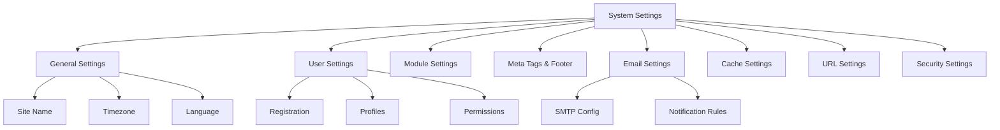

# XOOPS הגדרות מערכת

מדריך זה מכסה את הגדרות המערכת המלאות הזמינות בפאנל הניהול XOOPS, מאורגן לפי קטגוריות.

## ארכיטקטורת הגדרות מערכת

## גישה להגדרות המערכת

### מיקום

**פאנל ניהול > מערכת > העדפות**

או נווט ישירות:
```
http://your-domain.com/xoops/admin/index.php?fct=preferences
```
### דרישות הרשאה

- רק מנהלי אתרים (מנהלי אתרים) יכולים לגשת להגדרות המערכת
- שינויים משפיעים על כל האתר
- רוב השינויים נכנסים לתוקף באופן מיידי

## הגדרות כלליות

התצורה הבסיסית עבור התקנת XOOPS שלך.

### מידע בסיסי
```
Site Name: [Your Site Name]
Default Description: [Brief description of your site]
Site Slogan: [Catchy slogan]
Admin Email: admin@your-domain.com
Webmaster Name: Administrator Name
Webmaster Email: admin@your-domain.com
```
### הגדרות מראה
```
Default Theme: [Select theme]
Default Language: English (or preferred language)
Items Per Page: 15 (typically 10-25)
Words in Snippet: 25 (for search results)
Theme Upload Permission: Disabled (security)
```
### הגדרות אזוריות
```
Default Timezone: [Your timezone]
Date Format: %Y-%m-%d (YYYY-MM-DD format)
Time Format: %H:%M:%S (HH:MM:SS format)
Daylight Saving Time: [Auto/Manual/None]
```
**טבלת פורמט אזור זמן:**

| אזור | אזור זמן | UTC קיזוז |
|---|---|---|
| ארה"ב מזרח | America/New_York | -5 / -4 |
| מרכז ארה"ב | America/Chicago | -6 / -5 |
| הר ארה"ב | America/Denver | -7 / -6 |
| ארה"ב האוקיינוס ​​השקט | America/Los_Angeles | -8 / -7 |
| UK/London | Europe/London | 0 / +1 |
| France/Germany | Europe/Paris | +1 / +2 |
| יפן | Asia/Tokyo | +9 |
| סין | Asia/Shanghai | +8 |
| Australia/Sydney | Australia/Sydney | +10 / +11 |

### תצורת חיפוש
```
Enable Search: Yes
Search Admin Pages: Yes/No
Search Archives: Yes
Default Search Type: All / Pages only
Words Excluded from Search: [Comma-separated list]
```
**מילים נפוצות שאינן נכללות:** ה, a, an, ו, או, אבל, ב, ב, ב, ליד, אל, מ

## הגדרות משתמש

שליטה בהתנהגות חשבון המשתמש ובתהליך הרישום.

### רישום משתמש
```
Allow User Registration: Yes/No
Registration Type:
  ☐ Auto-activate (Instant access)
  ☐ Admin approval (Admin must approve)
  ☐ Email verification (User must verify email)

Notification to Users: Yes/No
User Email Verification: Required/Optional
```
### תצורת משתמש חדשה
```
Auto-login New Users: Yes/No
Assign Default User Group: Yes
Default User Group: [Select group]
Create User Avatar: Yes/No
Initial User Avatar: [Select default]
```
### הגדרות פרופיל משתמש
```
Allow User Profiles: Yes
Show Member List: Yes
Show User Statistics: Yes
Show Last Online Time: Yes
Allow User Avatar: Yes
Avatar Max File Size: 100KB
Avatar Dimensions: 100x100 pixels
```
### הגדרות דוא"ל של משתמש
```
Allow Users to Hide Email: Yes
Show Email on Profile: Yes
Notification Email Interval: Immediately/Daily/Weekly/Never
```
### מעקב אחר פעילות משתמשים
```
Track User Activity: Yes
Log User Logins: Yes
Log Failed Logins: Yes
Track IP Address: Yes
Clear Activity Logs Older Than: 90 days
```
### מגבלות חשבון
```
Allow Duplicate Email: No
Minimum Username Length: 3 characters
Maximum Username Length: 15 characters
Minimum Password Length: 6 characters
Require Special Characters: Yes
Require Numbers: Yes
Password Expiration: 90 days (or Never)
Accounts Inactive Days to Delete: 365 days
```
## הגדרות מודול

הגדר התנהגות מודול בודד.

### אפשרויות מודול נפוצות

עבור כל מודול מותקן, אתה יכול להגדיר:
```
Module Status: Active/Inactive
Display in Menu: Yes/No
Module Weight: [1-999] (higher = lower in display)
Homepage Default: This module shows when visiting /
Admin Access: [Allowed user groups]
User Access: [Allowed user groups]
```
### הגדרות מודול מערכת
```
Show Homepage as: Portal / Module / Static Page
Default Homepage Module: [Select module]
Show Footer Menu: Yes
Footer Color: [Color selector]
Show System Stats: Yes
Show Memory Usage: Yes
```
### תצורה לכל מודול

לכל מודול יכולות להיות הגדרות ספציפיות למודול:

**דוגמה - מודול עמוד:**
```
Enable Comments: Yes/No
Moderate Comments: Yes/No
Comments Per Page: 10
Enable Ratings: Yes
Allow Anonymous Ratings: Yes
```
**דוגמה - מודול משתמש:**
```
Avatar Upload Folder: ./uploads/
Maximum Upload Size: 100KB
Allow File Upload: Yes
Allowed File Types: jpg, gif, png
```
גישה להגדרות ספציפיות למודול:
- **ניהול > מודולים > [שם מודול] > העדפות**

## מטא תגים והגדרות SEO

הגדר מטא תגים עבור אופטימיזציה למנועי חיפוש.

### מטא תגיות גלובליות
```
Meta Keywords: xoops, cms, content management system
Meta Description: A powerful content management system for building dynamic websites
Meta Author: Your Name
Meta Copyright: Copyright 2025, Your Company
Meta Robots: index, follow
Meta Revisit: 30 days
```
### שיטות עבודה מומלצות למטא תג

| תג | מטרה | המלצה |
|---|---|---|
| מילות מפתח | מונחי חיפוש | 5-10 מילות מפתח רלוונטיות, מופרדות בפסיק |
| תיאור | חפש רישום | 150-160 תווים |
| מחבר | יוצר העמוד | השם או החברה שלך |
| זכויות יוצרים | משפטי | הודעת זכויות היוצרים שלך |
| רובוטים | הוראות סורק | אינדקס, עקוב (אפשר הוספה לאינדקס) |

### הגדרות כותרת תחתונה
```
Show Footer: Yes
Footer Color: Dark/Light
Footer Background: [Color code]
Footer Text: [HTML allowed]
Additional Footer Links: [URL and text pairs]
```
**כותרת תחתונה לדוגמה HTML:**
```html
<p>Copyright &copy; 2025 Your Company. All rights reserved.</p>
<p><a href="/privacy">Privacy Policy</a> | <a href="/terms">Terms of Use</a></p>
```
### מטא תגיות חברתיות (גרף פתוח)
```
Enable Open Graph: Yes
Facebook App ID: [App ID]
Twitter Card Type: summary / summary_large_image / player
Default Share Image: [Image URL]
```
## הגדרות דוא"ל

הגדר מערכת מסירה והודעות דוא"ל.

### שיטת משלוח דוא"ל
```
Use SMTP: Yes/No

If SMTP:
  SMTP Host: smtp.gmail.com
  SMTP Port: 587 (TLS) or 465 (SSL)
  SMTP Security: TLS / SSL / None
  SMTP Username: [email@example.com]
  SMTP Password: [password]
  SMTP Authentication: Yes/No
  SMTP Timeout: 10 seconds

If PHP mail():
  Sendmail Path: /usr/sbin/sendmail -t -i
```
### תצורת דוא"ל
```
From Address: noreply@your-domain.com
From Name: Your Site Name
Reply-To Address: support@your-domain.com
BCC Admin Emails: Yes/No
```
### הגדרות התראות
```
Send Welcome Email: Yes/No
Welcome Email Subject: Welcome to [Site Name]
Welcome Email Body: [Custom message]

Send Password Reset Email: Yes/No
Include Random Password: Yes/No
Token Expiration: 24 hours
```
### הודעות מנהל
```
Notify Admin on Registration: Yes
Notify Admin on Comments: Yes
Notify Admin on Submissions: Yes
Notify Admin on Errors: Yes
```
### התראות משתמש
```
Notify User on Registration: Yes
Notify User on Comments: Yes
Notify User on Private Messages: Yes
Allow Users to Disable Notifications: Yes
Default Notification Frequency: Immediately
```
### תבניות דוא"ל

התאם אישית הודעות דוא"ל בלוח הניהול:

**נתיב:** מערכת > תבניות דוא"ל

תבניות זמינות:
- רישום משתמש
- איפוס סיסמה
- הודעת תגובה
- הודעה פרטית
- התראות מערכת
- אימיילים ספציפיים למודול

## הגדרות cache

מטב את הביצועים באמצעות שמירה בcache.

### תצורת cache
```
Enable Caching: Yes/No
Cache Type:
  ☐ File Cache
  ☐ APCu (Alternative PHP Cache)
  ☐ Memcache (Distributed caching)
  ☐ Redis (Advanced caching)

Cache Lifetime: 3600 seconds (1 hour)
```
### אפשרויות cache לפי סוג

**cache קבצים:**
```
Cache Directory: /var/www/html/xoops/cache/
Clear Interval: Daily
Maximum Cache Files: 1000
```
**cache APCu:**
```
Memory Allocation: 128MB
Fragmentation Level: Low
```
**Memcache/Redis:**
```
Server Host: localhost
Server Port: 11211 (Memcache) / 6379 (Redis)
Persistent Connection: Yes
```
### מה נשמר בcache
```
Cache Module Lists: Yes
Cache Configuration Data: Yes
Cache Template Data: Yes
Cache User Session Data: Yes
Cache Search Results: Yes
Cache Database Queries: Yes
Cache RSS Feeds: Yes
Cache Images: Yes
```
## URL הגדרות

הגדר URL שכתוב ועיצוב מחדש.

### ידידותי URL הגדרות
```
Enable Friendly URLs: Yes/No
Friendly URL Type:
  ☐ Path Info: /page/about
  ☐ Query String: /index.php?p=about

Trailing Slash: Include / Omit
URL Case: Lower case / Case sensitive
```
### URL שכתוב חוקים
```
.htaccess Rules: [Display current]
Nginx Rules: [Display current if Nginx]
IIS Rules: [Display current if IIS]
```
## הגדרות אבטחה

שליטה בתצורה הקשורה לאבטחה.

### אבטחת סיסמאות
```
Password Policy:
  ☐ Require uppercase letters
  ☐ Require lowercase letters
  ☐ Require numbers
  ☐ Require special characters

Minimum Password Length: 8 characters
Password Expiration: 90 days
Password History: Remember last 5 passwords
Force Password Change: On next login
```
### אבטחת כניסה
```
Lock Account After Failed Attempts: 5 attempts
Lock Duration: 15 minutes
Log All Login Attempts: Yes
Log Failed Logins: Yes
Admin Login Alert: Send email on admin login
Two-Factor Authentication: Disabled/Enabled
```
### אבטחת העלאת קבצים
```
Allow File Uploads: Yes/No
Maximum File Size: 128MB
Allowed File Types: jpg, gif, png, pdf, zip, doc, docx
Scan Uploads for Malware: Yes (if available)
Quarantine Suspicious Files: Yes
```
### אבטחת הפעלה
```
Session Management: Database/Files
Session Timeout: 1800 seconds (30 min)
Session Cookie Lifetime: 0 (until browser closes)
Secure Cookie: Yes (HTTPS only)
HTTP Only Cookie: Yes (prevent JavaScript access)
```
### CORS הגדרות
```
Allow Cross-Origin Requests: No
Allowed Origins: [List domains]
Allow Credentials: No
Allowed Methods: GET, POST
```
## הגדרות מתקדמות

אפשרויות תצורה נוספות למשתמשים מתקדמים.

### מצב ניפוי באגים
```
Debug Mode: Disabled/Enabled
Log Level: Error / Warning / Info / Debug
Debug Log File: /var/log/xoops_debug.log
Display Errors: Disabled (production)
```
### כוונון ביצועים
```
Optimize Database Queries: Yes
Use Query Cache: Yes
Compress Output: Yes
Minify CSS/JavaScript: Yes
Lazy Load Images: Yes
```
### הגדרות תוכן
```
Allow HTML in Posts: Yes/No
Allowed HTML Tags: [Configure]
Strip Harmful Code: Yes
Allow Embed: Yes/No
Content Moderation: Automatic/Manual
Spam Detection: Yes
```
## הגדרות Export/Import

### הגדרות גיבוי

ייצוא הגדרות נוכחיות:

**לוח ניהול > מערכת > כלים > הגדרות ייצוא**
```bash
# Settings exported as JSON file
# Download and store securely
```
### שחזר הגדרות

ייבא הגדרות שיוצאו בעבר:

**לוח ניהול > מערכת > כלים > הגדרות ייבוא**
```bash
# Upload JSON file
# Verify changes before confirming
```
## היררכיית תצורה

XOOPS היררכיית הגדרות (מלמעלה למטה - ניצחונות במשחק הראשון):
```
1. mainfile.php (Constants)
2. Module-specific config
3. Admin System Settings
4. Theme configuration
5. User preferences (for user-specific settings)
```
## הגדרות סקריפט גיבוי

צור גיבוי של ההגדרות הנוכחיות:
```php
<?php
// Backup script: /var/www/html/xoops/backup-settings.php
require_once __DIR__ . '/mainfile.php';

$config_handler = xoops_getHandler('config');
$configs = $config_handler->getConfigs();

$backup = [
    'exported_date' => date('Y-m-d H:i:s'),
    'xoops_version' => XOOPS_VERSION,
    'php_version' => PHP_VERSION,
    'settings' => []
];

foreach ($configs as $config) {
    $backup['settings'][$config->getVar('conf_name')] = [
        'value' => $config->getVar('conf_value'),
        'description' => $config->getVar('conf_desc'),
        'type' => $config->getVar('conf_type'),
    ];
}

// Save to JSON file
file_put_contents(
    '/backups/xoops_settings_' . date('YmdHis') . '.json',
    json_encode($backup, JSON_PRETTY_PRINT)
);

echo "Settings backed up successfully!";
?>
```
## שינויים נפוצים בהגדרות

### שנה את שם האתר

1. ניהול > מערכת > העדפות > הגדרות כלליות
2. שנה את "שם האתר"
3. לחץ על "שמור"

### Enable/Disable הרשמה

1. ניהול > מערכת > העדפות > הגדרות משתמש
2. החלף את האפשרות "אפשר רישום משתמש"
3. בחר סוג רישום
4. לחץ על "שמור"

### שנה את ערכת ברירת המחדל

1. ניהול > מערכת > העדפות > הגדרות כלליות
2. בחר "נושא ברירת מחדל"
3. לחץ על "שמור"
4. נקה את הcache כדי שהשינויים ייכנסו לתוקף

### עדכן אימייל ליצירת קשר

1. ניהול > מערכת > העדפות > הגדרות כלליות
2. שנה את "אימייל מנהל מערכת"
3. שנה את "אימייל מנהל האתר"
4. לחץ על "שמור"

## רשימת רשימת אימות

לאחר הגדרת הגדרות המערכת, ודא:

- [ ] שם האתר מוצג כהלכה
- [ ] אזור הזמן מציג את השעה הנכונה
- [ ] הודעות דוא"ל נשלחות כראוי
- [ ] רישום משתמש פועל כפי שהוגדר
- [ ] דף הבית מציג את ברירת המחדל שנבחרה
- [ ] פונקציונליות החיפוש עובדת
- [ ] cache משפר את זמן טעינת העמוד
- [ ] עבודה ידידותית URLs (אם מופעל)
- [ ] מטא תגים מופיעים במקור הדף
- [ ] הודעות מנהל התקבלו
- [ ] הגדרות אבטחה נאכפות

## הגדרות פתרון בעיות

### הגדרות לא נשמרות

**פתרון:**
```bash
# Check file permissions on config directory
chmod 755 /var/www/html/xoops/var/

# Verify database writable
# Try saving again in admin panel
```
### שינויים לא נכנסים לתוקף

**פתרון:**
```bash
# Clear cache
rm -rf /var/www/html/xoops/cache/*
rm -rf /var/www/html/xoops/templates_c/*

# If still not working, restart web server
systemctl restart apache2
```
### אימייל לא נשלח

**פתרון:**
1. אמת את אישורי SMTP בהגדרות האימייל
2. בדוק עם כפתור "שלח דואר אלקטרוני לבדיקה".
3. בדוק יומני שגיאה
4. נסה להשתמש ב-PHP mail() במקום SMTP

## השלבים הבאים

לאחר הגדרת הגדרות המערכת:

1. הגדר את הגדרות האבטחה
2. ייעול ביצועים
3. חקור את תכונות פאנל הניהול
4. הגדר ניהול משתמשים

---

**תגים:** #system-settings #configuration #preferences #admin-panel

**מאמרים קשורים:**
- ../../06-Publisher-Module/User-Guide/Basic-Configuration
- אבטחה-תצורה
- ביצועים-אופטימיזציה
- ../First-Steps/Admin-Panel-Overview