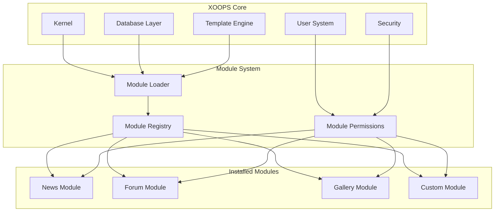
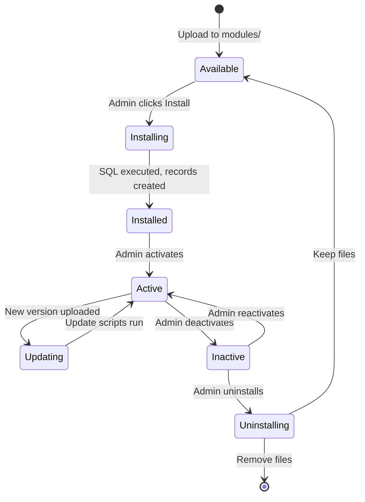

# ADR-001: ארכיטקטורה מודולרית

> שיא החלטות אדריכלות עבור פילוסופיית העיצוב המודולרי המרכזי של XOOPS.

---

## סטטוס

**התקבלה** - החלטה יסודית מאז הקמת XOOPS

---

## הקשר

XOOPS (מערכת eXtensible Object-Oriented Portal) הייתה זקוקה לארכיטקטורה שת:

1. אפשר למפתחי צד שלישי להרחיב את הפונקציונליות
2. אפשר למנהלי אתרים להתאים אישית ללא קידוד
3. תמיכה בפיתוח עצמאי ועדכונים
4. לספק בידוד בין תכונות שונות
5. קנה מידה מבלוגים פשוטים לפורטלים מורכבים

נוף CMS המוקדמות של שנות ה-2000 הציע מערכות מונוליטיות שקשה היה להתאים ולהרחיב אותן.

---

## דיאגרמת החלטה



---

## החלטה

ניישם **ארכיטקטורה מודולרית** שבה:

### 1. ליבה מספקת תשתית
- הפשטת מסדי נתונים
- אימות משתמש והרשאות
- עיבוד תבנית (Smarty)
- כלי אבטחה
- יצירת טפסים
- כלי עזר נפוצים

### 2. המודולים הם עצמאיים
כל מודול:
- יש מבנה ספריות משלו
- מכיל מחלקות משלו, תבניות, SQL
- מגדיר את התצורה שלו
- יכול להיות installed/uninstalled באופן עצמאי
- יש מעקב אחר גרסאות

### 3. מבנה מודול סטנדרטי
```
modules/modulename/
├── admin/                  # Admin interface
│   ├── index.php
│   └── menu.php
├── class/                  # PHP classes
├── include/                # Include files
├── language/               # Translations
├── sql/                    # Database schema
├── templates/              # Smarty templates
├── blocks/                 # Block definitions
├── xoops_version.php       # Module manifest
├── index.php               # Entry point
└── header.php              # Module bootstrap
```

### 4. מניפסט מודול (xoops_version.php)
```php
<?php
$modversion['name']        = 'Module Name';
$modversion['version']     = '1.0.0';
$modversion['description'] = 'Module description';
$modversion['dirname']     = basename(__DIR__);
$modversion['hasMain']     = 1;
$modversion['hasAdmin']    = 1;
$modversion['sqlfile']['mysql'] = 'sql/mysql.sql';
$modversion['tables']      = ['modulename_table1'];
$modversion['templates']   = [...];
$modversion['config']      = [...];
$modversion['blocks']      = [...];
```

### 5. תקשורת מודול
- דרך הליבה APIs (מטפלים, אירועים)
- קשרי מסד נתונים
- ווי טעינה מראש
- שירותים משותפים

---

## מחזור חיים של מודול



---

## השלכות

### חיובי

1. **ניתן להרחבה**: אלפי מודולים שנוצרו על ידי הקהילה
2. **עצמאות**: ניתן לפתח מודולים בנפרד
3. **גמישות**: אתרים יכולים לערבב ולהתאים תכונות
4. **תחזוקה**: עדכונים אינם משפיעים על מודולים אחרים
5. **שוק**: מערכת אקולוגית של מודול הופיעה
6. **עקומת למידה**: מפתחים לומדים דפוס אחד

### שלילי

1. **תקורה**: לכל מודול יש עלות אתחול
2. **כפול**: ייתכן שקוד נפוץ יחזור על עצמו
3. **שילוב**: תכונות חוצות מודולים זקוקות לתכנון קפדני
4. **גירסאות**: נדרש ניהול תאימות מודול
5. **שונות איכות**: איכות המודול של צד שלישי משתנה

### ניטרלי

1. **מסד נתונים**: כל מודול מנהל את הטבלאות שלו
2. **תבניות**: ערכת הנושא חייבת להכיל מודולים שונים
3. **עדכונים**: הליבה והמודולים מתעדכנים באופן עצמאי

---

## נשקלו חלופות

### 1. אדריכלות מונוליתית
**נדחה** - נוקשה מדי, קשה להתאמה אישית

### 2. ארכיטקטורת תוסף (בסגנון וורדפרס)
**אומץ חלקית** - בלוקים וטעינות מראש מספקים ווים דמויי פלאגין בתוך מודולים

### 3. ארכיטקטורת רכיבים (בסגנון ג'ומלה)
**נדחה** - מורכב יותר, פחות ידידותי למפתחים

### 4. שירותי מיקרו
**לא רלוונטי** - מורכב מדי לעידן אירוח משותף

---

## החלטות קשורות

- ADR-002: גישה למסד נתונים מונחה עצמים
- ADR-003: מנוע תבנית Smarty
- ADR-005: מערכת הרשאות

---

## הפניות

- XOOPS היסטוריית פרויקטים
- PHP דפוסי ארכיטקטורת יישומים
- CMS מחקרי השוואה (2001-2005)

---

#xoops #architecture #adr #modules #design-decision
