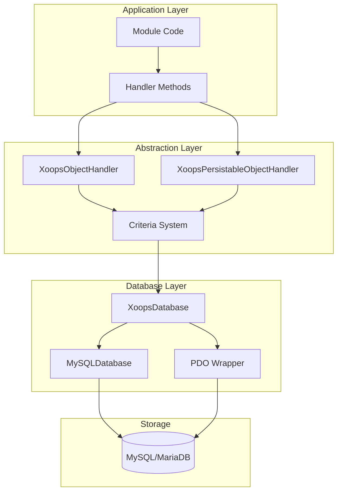
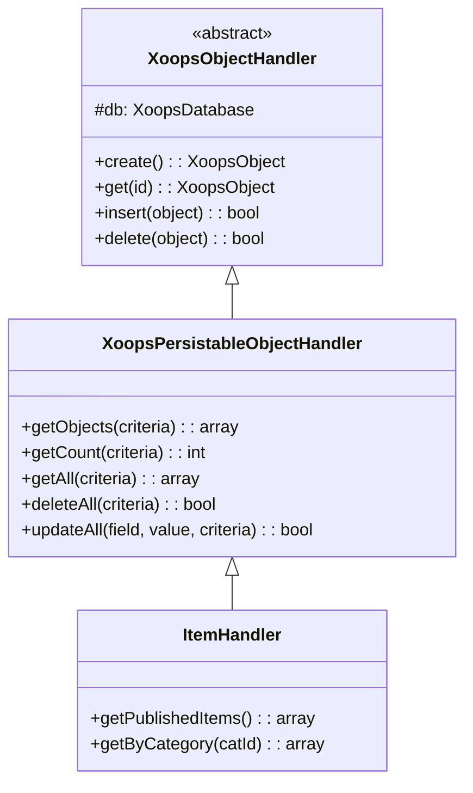
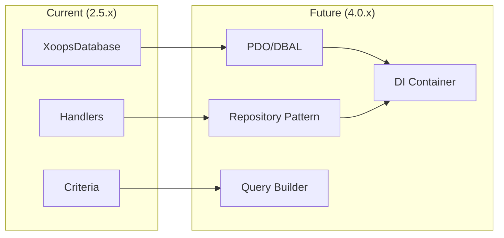

# ADR-002: הפשטת מסד נתונים

> רשומת החלטת אדריכלות עבור דפוס הגישה למסד נתונים מונחה עצמים של XOOPS.

---

## סטטוס

**מקובל** - דפוס ליבה מאז XOOPS 2.0

---

## הקשר

XOOPS נזקק לאסטרטגיית אינטראקציה של מסד נתונים שת:

1. תחביר SQL הספציפי למסד נתונים
2. ספק פעולות CRUD עקביות בכל המודולים
3. אפשר חיטוי נתונים ובריחה אוטומטיים
4. תמכו בשינויים עתידיים במנוע מסד הנתונים
5. פשט את הפעולות הנפוצות עבור מפתחים

החלופות היו:
- SQL גולמי בכל בסיס הקוד
- מלא ORM (דוקטרינה, רהוטה)
- הפשטה קלת משקל מותאמת אישית

---

## דיאגרמת החלטה



---

## החלטה

ניישם **דפוס מטפל** עם:

### 1. XoopsObject - מיכל נתונים

כל ישות נתונים מרחיבה את XoopsObject:

```php
class Item extends XoopsObject
{
    public function __construct()
    {
        $this->initVar('id', XOBJ_DTYPE_INT, null, false);
        $this->initVar('title', XOBJ_DTYPE_TXTBOX, '', true, 255);
        $this->initVar('content', XOBJ_DTYPE_TXTAREA, '', false);
        $this->initVar('status', XOBJ_DTYPE_INT, 0, false);
    }
}
```

### 2. מטפל - מנהל תפעול

לכל אובייקט יש מטפל מתאים:

```php
class ItemHandler extends XoopsPersistableObjectHandler
{
    public function __construct($db)
    {
        parent::__construct($db, 'mymodule_items', Item::class, 'id', 'title');
    }

    // CRUD methods inherited:
    // - create(), get(), insert(), delete()
    // - getObjects(), getCount(), getAll()
}
```

### 3. קריטריונים - בונה שאילתות

תנאי שאילתה מונחה עצמים:

```php
$criteria = new CriteriaCompo();
$criteria->add(new Criteria('status', 1));
$criteria->add(new Criteria('created', time() - 86400, '>='));
$criteria->setSort('created');
$criteria->setOrder('DESC');
$criteria->setLimit(10);

$items = $handler->getObjects($criteria);
```

---

## קבועי סוג נתונים

```php
// Variable types with automatic sanitization
XOBJ_DTYPE_INT       // Integer
XOBJ_DTYPE_TXTBOX    // Single-line text (escaped)
XOBJ_DTYPE_TXTAREA   // Multi-line text (escaped)
XOBJ_DTYPE_EMAIL     // Email validation
XOBJ_DTYPE_URL       // URL validation
XOBJ_DTYPE_ARRAY     // Serialized array
XOBJ_DTYPE_OTHER     // No processing
XOBJ_DTYPE_FLOAT     // Floating point
```

---

## ירושה של מטפל



---

## השלכות

### חיובי

1. **עקביות**: כל המודולים משתמשים באותם דפוסים
2. **אבטחה**: בריחה אוטומטית מונעת הזרקת SQL
3. **פשטות**: פעולות נפוצות דורשות קוד מינימלי
4. **תחזוקה**: שינויים בשכבת מסד הנתונים אינם משפיעים על מודולים
5. **יכולת בדיקה**: ניתן ללעוג למטפלים לצורך בדיקה

### שלילי

1. **ביצועים**: הפשטה נוספת
2. **מורכבות**: עקומת למידה למפתחים חדשים
3. **הגבלות**: שאילתות מורכבות עשויות להזדקק ל-SQL גולמי
4. **בעיה N+1**: אין טעינה נלהבת מובנית

### הקלות

- **ביצועים**: שמור אובייקטים שנגישים אליהם לעתים קרובות
- **שאילתות מורכבות**: אפשר SQL גולמי בעת הצורך
- **N+1**: השתמש ב-getAll() עם קריטריונים מתאימים

---

## אבולוציה ל-XOOPS 4.0



תוכניות XOOPS 4.0:
- דוקטרינה DBAL להפשטת מסד נתונים
- דפוס מאגר מחליף מטפלים
- בונה שאילתות לשאילתות מורכבות
- אינטגרציה מלאה של מיכל PSR-11

---

## דוגמאות קוד

### בסיסי CRUD

```php
$helper = Helper::getInstance();
$handler = $helper->getHandler('Item');

// Create
$item = $handler->create();
$item->setVar('title', 'New Item');
$handler->insert($item);

// Read
$item = $handler->get($id);
$title = $item->getVar('title');

// Update
$item->setVar('title', 'Updated Title');
$handler->insert($item);

// Delete
$handler->delete($item);
```

### שאילתה מורכבת

```php
$criteria = new CriteriaCompo();
$criteria->add(new Criteria('status', 'published'));
$criteria->add(new Criteria('category_id', '(1,2,3)', 'IN'));
$criteria->add(new Criteria('created', strtotime('-30 days'), '>='));
$criteria->setSort('views');
$criteria->setOrder('DESC');
$criteria->setLimit(10);
$criteria->setStart(0);

$items = $handler->getObjects($criteria);
$total = $handler->getCount($criteria);
```

---

## החלטות קשורות

- ADR-001: ארכיטקטורה מודולרית
- ADR-003: מנוע תבנית Smarty

---

## הפניות

- מרטין פאולר - דפוסי ארכיטקטורת יישומים ארגוניים
- מושגי עיצוב מבוססי תחום
- דפוסי רשומה פעילה לעומת נתונים ממפה

---

#xoops #architecture #adr #database #handler #design-decision
