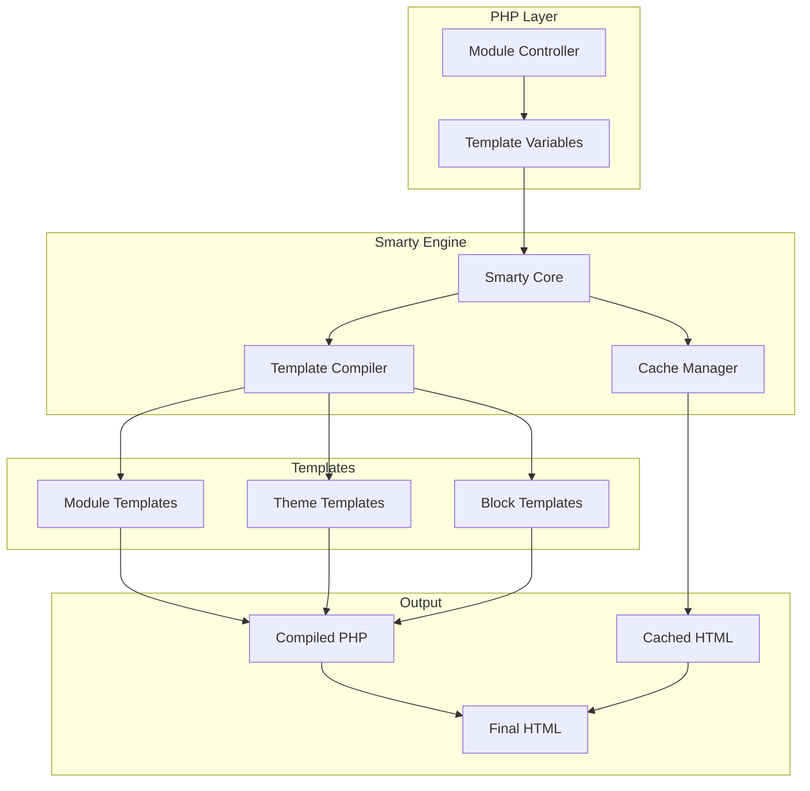
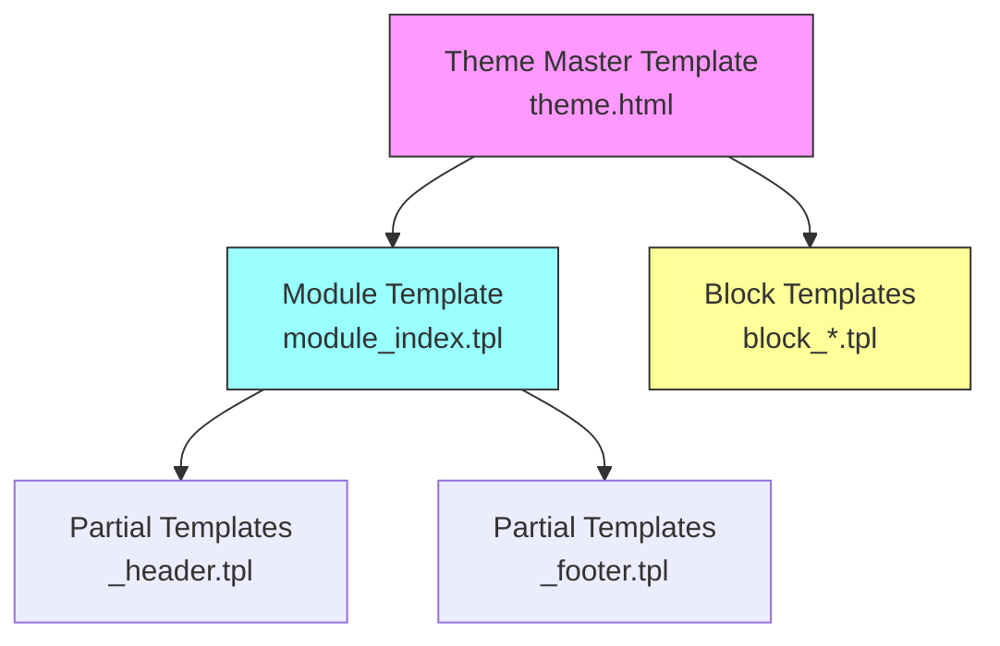
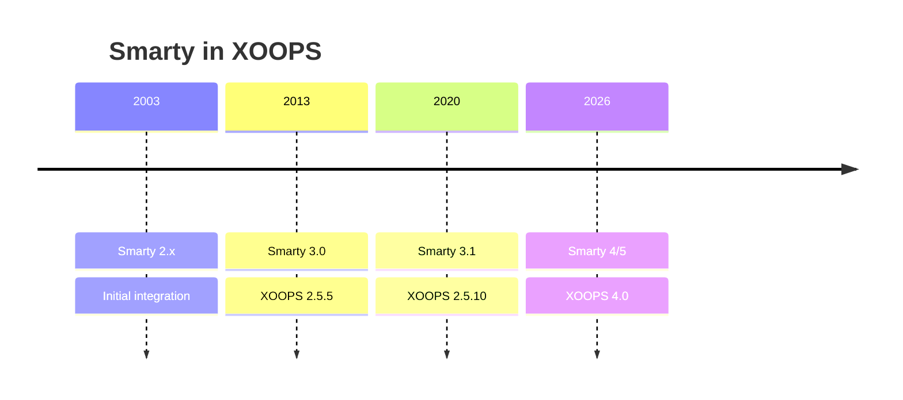

# ADR-003: מנוע תבנית (Smarty)

> תיעוד החלטות אדריכלות לאימוץ של XOOPS של מנוע התבנית Smarty.

---

## סטטוס

**התקבלה** - החלטת ליבה מאז XOOPS 2.0

**מתפתח** - הגירה ל-Smarty 4/5 מתוכננת עבור XOOPS 4.0

---

## הקשר

XOOPS היה זקוק לפתרון תבנית שיעשה:

1. הפרד מצגת מהיגיון עסקי
2. אפשר למעצבי ערכות נושא לעבוד ללא ידע של PHP
3. תומך בירושה של תבנית וכולל
4. ספק cache לביצועים
5. אפשר תבניות הניתנות להתאמה אישית של המשתמש
6. תמכו בבינאום

---

## דיאגרמת החלטה

---

## החלטה

אנו נשתמש ב-**Smarty** כמנוע התבנית כי:

### 1. הפרדת חששות
```php
// PHP (Controller) - Business logic
$items = $itemHandler->getPublishedItems();
$xoopsTpl->assign('items', $items);

// Smarty (View) - Presentation
// templates/items.tpl
```

```smarty
{* Smarty template - No PHP logic *}
<{foreach item=item from=$items}>
    <article>
        <h2><{$item.title}></h2>
        <p><{$item.summary}></p>
    </article>
<{/foreach}>
```
### 2. XOOPS תוחמים

XOOPS משתמשת ב-`<{` וב-`}>` במקום `{` `}` הרגילה:
```smarty
{* Standard Smarty *}
{$variable}

{* XOOPS Smarty - Avoids JavaScript conflicts *}
<{$variable}>
```
### 3. היררכיית תבניות

### 4. אחסון תבניות

- **מסד נתונים**: תבניות מותאמות אישית המאוחסנות ליכולת החזרה
- **מערכת קבצים**: תבניות מקוריות בספריות המודולים
- **cache**: תבניות הידור לביצועים

---

## Smarty תצורה
```php
// XOOPS Smarty initialization
$xoopsTpl = new XoopsTpl();

// Custom delimiters
$xoopsTpl->left_delim = '<{';
$xoopsTpl->right_delim = '}>';

// Caching
$xoopsTpl->caching = XOOPS_TEMPLATE_CACHE;
$xoopsTpl->cache_lifetime = 3600;

// Security
$xoopsTpl->security_policy = new Smarty_Security($xoopsTpl);
$xoopsTpl->security_policy->php_functions = [];
$xoopsTpl->security_policy->php_modifiers = ['escape', 'count'];
```
---

## נעשה שימוש בתכונות התבנית

### משתנים
```smarty
{* Simple variable *}
<{$title}>

{* Object property *}
<{$item.title}>

{* With modifier *}
<{$content|truncate:200:'...'}>

{* Escaped output *}
<{$userInput|escape:'html'}>
```
### מבני בקרה
```smarty
{* Conditional *}
<{if $isAdmin}>
    <a href="admin.php">Admin</a>
<{elseif $isUser}>
    <a href="profile.php">Profile</a>
<{else}>
    <a href="login.php">Login</a>
<{/if}>

{* Loop *}
<{foreach item=item from=$items name=itemloop}>
    <{$smarty.foreach.itemloop.index}>: <{$item.title}>
<{/foreach}>
```
### כולל
```smarty
{* Include another template *}
<{include file="db:mymodule_header.tpl"}>

{* Include with variables *}
<{include file="db:mymodule_item.tpl" item=$currentItem}>

{* Include from theme *}
<{include file="file:$theme_path/partials/sidebar.tpl"}>
```
---

## השלכות

### חיובי

1. **ידידותי למעצב**: תחביר דמוי HTML
2. **Caching**: cache מובנה של תבנית
3. **אבטחה**: PHP בידוד קוד
4. **גמישות**: משנה, פונקציות, תוספים
5. **התאמה אישית**: משתמשים יכולים לשנות תבניות
6. **קהילה**: מערכת אקולוגית גדולה Smarty

### שלילי

1. **עקומת למידה**: תחביר Smarty-specific
2. **תקורה**: נדרש שלב הידור
3. **ניפוי באגים**: שגיאות תבנית יכולות להיות סתמיות
4. **בעיות גירסה**: שינויים חוזרים בין גרסאות

### הקלות

- **למידה**: תיעוד מקיף
- **ביצועים**: cache אגרסיבי
- **ניפוי באגים**: קונסולת ניפוי באגים, הודעות שגיאה ברורות
- **גרסאות**: שכבת תאימות ב-XOOPS

---

## היסטוריית גרסאות

---

## הגירה: Smarty 3 ל-4/5

### שינויים שוברים
```smarty
{* Smarty 3 - Deprecated *}
<{php}>echo date('Y');<{/php}>

{* Smarty 4+ - Use modifiers or assign from PHP *}
<{$current_year}>

{* Smarty 3 - {section} deprecated *}
<{section name=i loop=$items}>
    <{$items[i].title}>
<{/section}>

{* Smarty 4+ - Use {foreach} *}
<{foreach $items as $item}>
    <{$item.title}>
<{/foreach}>
```
### שכבת תאימות

XOOPS מספקת שכבת תאימות למעברים חלקים:
```php
// XoopsTpl extends Smarty with compatibility methods
class XoopsTpl extends Smarty
{
    public function assign($tpl_var, $value = null)
    {
        // Handles both Smarty 3 and 4 syntax
        return parent::assign($tpl_var, $value);
    }
}
```
---

## נשקלו חלופות

### 1. זרד
**יתרונות**: מערכת אקולוגית מודרנית סימפונית
**חסרונות**: תחביר שונה, מאמץ הגירה
**החלטה**: אופציה עתידית אפשרית עבור XOOPS 3.x

### 2. להב (Laravel)
**יתרונות**: תחביר נקי, פופולרי
**חסרונות**: ספציפי ל-Laravel
**החלטה**: לא מתאים לשימוש עצמאי

### 3. Native PHP תבניות
**יתרונות**: אין עקומת למידה, מהר
**חסרונות**: סיכוני אבטחה, ללא הפרדה
**החלטה**: נדחתה בשל תחזוקה

---

## החלטות קשורות

- ADR-001: אדריכלות מודולרית
- ADR-002: הפשטת מסד נתונים

---

## הפניות

- Smarty תיעוד: https://www.smarty.net/docs/en/
- XOOPS מדריך מערכת תבנית
- MVC דפוס ביישומי אינטרנט

---

#xoops #architecture #adr #smarty #templates #design-decision