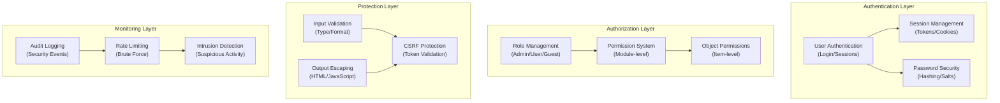

# ADR-004: ארכיטקטורת מערכת אבטחה

> ארכיטקטורת אבטחה מקיפה עבור XOOPS CMS הגנה מפני איומים מודרניים.

---

## סטטוס

**מקובל** - שכבת אבטחה ליבה מאז XOOPS 2.5

---

## הקשר

### הצהרת בעיה

XOOPS זקוקה למערכת אבטחה חזקה ש:

1. **מגן מפני פרצות אינטרנט נפוצות** (OWASP 10 המובילים)
2. **מספק בקרת הרשאות מפורטת** בין המודולים
3. **מאפשר אימות משתמש מאובטח** עם סטנדרטים מודרניים
4. **מונע פרצות נתונים** וגישה לא מורשית
5. **תומך בבקרת גישה מרובת רמות** (מנהל, מנחה, משתמש, אורח)
6. **משתלב עם כל המודולים** בצורה חלקה

### איומים נוכחיים

התקפות אינטרנט מודרניות כוללות:

- **SQL הזרקה** - זדוני SQL בקלט המשתמש
- **XSS (סקריפטים חוצי אתרים)** - הוזרק JavaScript בדפים
- **CSRF (זיוף בקשות חוצות אתרים)** - שליחת טפסים לא מורשים
- **עקיפת אימות** - טיפול חלש session/password
- **עקיפת הרשאה** - הסלמה של הרשאות
- **חשיפה לנתונים** - נתונים רגישים ב-URLs, ביומנים או במטמונים

### XOOPS דרישות אבטחה

1. אימות משתמש וניהול הפעלה
2. בקרת גישה מבוססת תפקידים (RBAC)
3. מערכת הרשאות למודולים ואובייקטים
4. אימות קלט ויציאת פלט
5. הגנה מפני התקפות נפוצות
6. רישום ביקורת של אירועי אבטחה
7. טיפול מאובטח בסיסמאות
8. הגנת אסימון CSRF

---

## החלטה

### ארכיטקטורת אבטחה ליבה

---

## רכיבי אבטחה

### 1. מערכת אימות

**תהליך התחברות משתמש:**
```php
<?php
// 1. Validate credentials
$user = $userHandler->findByLogin($username);
if (!$user || !password_verify($password, $user->getVar('pass'))) {
    throw new AuthenticationException('Invalid credentials');
}

// 2. Check if account is active
if (!$user->getVar('uactive')) {
    throw new AuthenticationException('Account inactive');
}

// 3. Create secure session
session_regenerate_id(true);
$_SESSION['uid'] = $user->getVar('uid');
$_SESSION['token'] = bin2hex(random_bytes(32));
$_SESSION['created'] = time();

// 4. Log the login
$this->auditLog('USER_LOGIN', $user->getVar('uid'));
```
**אבטחת סיסמא:**
```php
<?php
// Use password_hash (not MD5 or SHA1)
$hashed = password_hash($password, PASSWORD_BCRYPT, [
    'cost' => 12, // High cost = slow brute force
]);

// Verify password
if (!password_verify($inputPassword, $hashed)) {
    throw new Exception('Invalid password');
}

// Rehash if algorithm or cost changed
if (password_needs_rehash($hashed, PASSWORD_BCRYPT, ['cost' => 12])) {
    $newHash = password_hash($password, PASSWORD_BCRYPT, ['cost' => 12]);
    $user->setVar('pass', $newHash);
    $userHandler->insert($user);
}
```
### 2. ניהול מפגשים

**טיפול בסשן מאובטח:**
```php
<?php
// Session configuration
ini_set('session.cookie_httponly', true);  // No JS access
ini_set('session.cookie_secure', true);     // HTTPS only
ini_set('session.cookie_samesite', 'Strict'); // CSRF protection
ini_set('session.gc_maxlifetime', 3600);   // 1 hour timeout
ini_set('session.sid_length', 64);         // 64-char session ID

// Validate session
function validateSession() {
    // Check timeout
    if (time() - $_SESSION['created'] > 3600) {
        session_destroy();
        throw new SessionExpiredException();
    }

    // Validate user agent (prevent session hijacking)
    if ($_SESSION['user_agent'] !== $_SERVER['HTTP_USER_AGENT']) {
        throw new SessionInvalidException();
    }

    // Validate IP (optional, can be too strict)
    if (!in_array($_SERVER['REMOTE_ADDR'], $_SESSION['ips'])) {
        $_SESSION['ips'][] = $_SERVER['REMOTE_ADDR'];
    }
}
```
### 3. הרשאה (RBAC)

**בקרת גישה מבוססת תפקידים:**
```php
<?php
class XoopsUser {
    public function hasPermission(string $permissionName): bool
    {
        // Get user groups
        $groups = $this->getGroups();

        // Check if any group has permission
        foreach ($groups as $groupId) {
            if ($this->checkGroupPermission($groupId, $permissionName)) {
                return true;
            }
        }

        return false;
    }

    /**
     * User groups and their permissions
     * Admin: Full access
     * Moderator: Content management
     * User: Create own content
     * Guest: Read-only access
     */
    private function checkGroupPermission(int $groupId, string $permission): bool
    {
        $permissions = [
            1 => ['admin_access'],                 // Admin group
            2 => ['moderate_content', 'edit_own'], // Moderator group
            3 => ['create_content', 'edit_own'],   // User group
            4 => [],                               // Guest group (no permissions)
        ];

        return in_array($permission, $permissions[$groupId] ?? []);
    }
}
```
### 4. אימות קלט

**מנע SQL שגיאות הזרקה וסוג:**
```php
<?php
// Always use prepared statements
$sql = 'SELECT * FROM users WHERE id = ?';
$result = $db->query($sql, [$userId]); // ✅ Safe

// Input validation
function validateUserInput(array $data): array
{
    return [
        'email' => filter_var($data['email'] ?? '', FILTER_VALIDATE_EMAIL),
        'age' => filter_var($data['age'] ?? 0, FILTER_VALIDATE_INT),
        'website' => filter_var($data['website'] ?? '', FILTER_VALIDATE_URL),
        'title' => substr(trim($data['title'] ?? ''), 0, 255),
    ];
}

// XOOPS Safe Input class
$safe = \Xmf\Request::getHtmlRequest('var_name', '');
$int = \Xmf\Request::getInt('page', 1);
```
### 5. פלט בריחה

**מנע XSS התקפות:**
```php
<?php
// In PHP templates
echo htmlspecialchars($userInput, ENT_QUOTES, 'UTF-8');

// In Smarty templates (automatic escaping)
<{$user_input}>  {* Escaped by default *}
<{$html|escape:false}>  {* Only when needed *}

// JavaScript context
<script>
var message = "<{$userMessage|escape:'javascript'}>";
</script>

// URL context
<a href="<{$url|escape:'url'}>">Link</a>
```
### 6. CSRF הגנה

**מניעת זיוף בקשות חוצות אתרים:**
```php
<?php
// Generate CSRF token
session_start();
if (empty($_SESSION['csrf_token'])) {
    $_SESSION['csrf_token'] = bin2hex(random_bytes(32));
}

// In forms
<form method="POST">
    <input type="hidden" name="csrf_token" value="<{$csrf_token}>">
    <button type="submit">Submit</button>
</form>

// Validate token
if ($_SERVER['REQUEST_METHOD'] === 'POST') {
    if (hash_equals($_SESSION['csrf_token'], $_POST['csrf_token'] ?? '')) {
        // Process form
    } else {
        throw new InvalidTokenException('CSRF token invalid');
    }
}
```
---

## השלכות

### השפעות חיוביות

1. **הגנה מקיפה** - מכסה שיעורי פגיעות עיקריים
2. **שכבות אבטחה** - שכבות הגנה מרובות
3. **גמיש RBAC** - בקרת הרשאות עדינה
4. **שביל ביקורת** - מעקב אחר אירועי אבטחה
5. **תקן תעשייתי** - מתאים להמלצות OWASP
6. **שילוב מודול** - קל לשימוש מודולים באבטחה APIs

### אפקטים שליליים

1. **מורכבות** - דרושים יותר קוד ותצורה
2. **ביצועים** - Hashing ואימות מוסיפים תקורה
3. **חווית משתמש** - אבטחה לפעמים לא נוחה
4. **תחזוקה** - דורש עדכוני אבטחה שוטפים
5. **נדרשת הכשרה** - על המפתחים לפעול לפי הנהלים

### סיכונים והפחתות

| סיכון | חומרה | הקלה |
|------|--------|--------|
| המפתח מתעלם מאבטחה | גבוה | סקירת קוד, הדרכת אבטחה |
| נקודות תורפה חדשות התגלו | בינוני | ביקורות אבטחה סדירות, עדכונים |
| השפעה על הביצועים | נמוך | מטב נתיבים חמים, שמירה בcache |
| הרשאות מורכבות מדי | בינוני | תיעוד ברור, דוגמאות |

---

## שיטות עבודה מומלצות לאבטחה

### למפתחי מודולים
```php
<?php
// ✅ DO: Use prepared statements
$result = $db->prepare('SELECT * FROM table WHERE id = ?')->execute([$id]);

// ❌ DON'T: Concatenate queries
$result = $db->query("SELECT * FROM table WHERE id = $id");

// ✅ DO: Escape output
echo htmlspecialchars($user_input, ENT_QUOTES, 'UTF-8');

// ❌ DON'T: Output raw user data
echo $user_input;

// ✅ DO: Check permissions
if (!$user->hasPermission('edit_content')) {
    throw new PermissionException();
}

// ❌ DON'T: Trust user roles directly
if ($_POST['is_admin']) {
    // Make user admin - SECURITY HOLE!
}

// ✅ DO: Validate input types
$page = (int)$_GET['page'];

// ❌ DON'T: Use untrusted values directly
$sql .= " LIMIT " . $_GET['limit'];
```
---

## נשקלו חלופות

### OAuth/OpenID התחבר

**מדוע לא נבחר בהתחלה:** מורכב מדי עבור סביבת אירוח משותפת, אבל טוב לשילוב עתידי עם מערכות אישור חיצוניות.

### אימות דו-גורמי (2FA)

**סטטוס:** מתקבל כהרחבה, לא דרישת ליבה, ראה ADR-006

### HTTP-עוגיות הפעלה בלבד

**סטטוס:** מיושם - מונע JavaScript גישה לנתוני הפעלה

---

## החלטות קשורות

- ADR-001: ארכיטקטורה מודולרית - מודולים מיישמים אבטחה
- ADR-005: מערכת הרשאות מודול
- ADR-006: אימות דו-גורמי (עתיד)

---

## הפניות

### תקני אבטחה

- [OWASP 10 המובילים](https://owasp.org/www-project-top-ten/)
- [NIST מסגרת אבטחת סייבר](https://www.nist.gov/cyberframework)
- [CWE 25 המובילים](https://cwe.mitre.org/top25/)

### PHP אבטחה

- [PHP מדריך אבטחה](https://www.php.net/manual/en/security.php)
- [password_hash() תיעוד](https://www.php.net/manual/en/function.password-hash.php)
- [אבטחת הפעלה](https://www.php.net/manual/en/session.security.php)

### כלים

- [OWASP ZAP](https://www.zaproxy.org/) - בדיקות אבטחה
- [Snyk](https://snyk.io/) - סריקת פגיעות
- [SonarQube](https://www.sonarqube.org/) - איכות קוד

---

## רשימת רשימת יישום

- [ ] מערכת אימות משתמש
- [ ] ניהול מפגשים
- [ ] גיבוב סיסמה (bcrypt)
- [ ] בקרת גישה מבוססת תפקידים
- [ ] הרשאות מודול
- [ ] מסגרת אימות קלט
- [ ] פליטת פלט (PHP + Smarty)
- [ ] CSRF הגנת אסימונים
- [ ] רישום ביקורת אבטחה
- [ ] הגבלת תעריף
- [ ] כותרות אבטחה

---

## היסטוריית גרסאות

| גרסה | תאריך | שינויים |
|--------|-------|--------|
| 1.0.0 | 2024-01-28 | מסמך ראשוני |

---

#xoops #adr #אבטחה #ארכיטקטורה #אימות #הרשאה #rbac