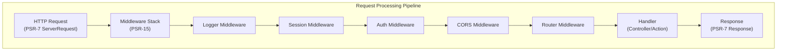

# ADR-005: PSR-15 דפוס תוכנה בינונית עבור XOOPS 4.0

> אמץ את PSR-15 HTTP מטפלי בקשות שרת (תוכנה בינונית) לשיפור צינור עיבוד הבקשות.

:::זהירות[XOOPS 4.0 הצעה — לא זמין ב-2.5.x]
ADR זה מתאר **ארכיטקטורה מוצעת עבור XOOPS 4.0**. תוכנת האמצע PSR-15 **לא זמינה ב-XOOPS 2.5.x**. מודולי 2.5.x נוכחיים משתמשים בדפוס בקר הדף עם אתחול `mainfile.php`. ראה ארכיטקטורת XOOPS עבור מחזור החיים הנוכחי של הבקשה.
:::

---

## סטטוס

**מוצע** - בהערכה עבור מהדורת XOOPS 4.0

---

## הקשר

### גישה נוכחית

XOOPS 2.5 משתמש בגישה מונוליטית לטיפול בבקשות:

```php
// Current: Sequential processing
require_once 'mainfile.php';
// → Kernel initialization
// → User authentication
// → Module loading
// → Page rendering

// All in one flow, mixed concerns
```

### בעיות בגישה הנוכחית

1. **דאגות מעורבות** - אימות, רישום, ניתוב הכל שלובים זה בזה
2. **קשה לבדיקה** - שלבי עיבוד בקשה בודדים קשים לבדיקה יחידה
3. **קשה להאריך** - ניתן לחבר מודולים רק דרך preload/events
4. **הפרדה גרועה** - לוגיקה של עיבוד בקשות מפוזרת בכל בסיס הקוד
5. **לא ניתן לחיבור** - לא ניתן לשרשר או לסדר מחדש שלבי עיבוד בקלות

### מהי תוכנת הביניים PSR-15?

PSR-15 מגדיר ממשק סטנדרטי עבור תוכנת האמצע HTTP:

```php
<?php
interface RequestHandlerInterface {
    public function handle(ServerRequestInterface $request): ResponseInterface;
}

interface MiddlewareInterface {
    public function process(
        ServerRequestInterface $request,
        RequestHandlerInterface $handler
    ): ResponseInterface;
}
```

**שרשרת תוכנת האמצע:**

```
Request
  ↓
[Logger] → logs request
  ↓
[Auth] → validates user session
  ↓
[CORS] → checks cross-origin
  ↓
[Router] → dispatches to handler
  ↓
[Handler] → generates response
  ↓
Response
```

---

## החלטה

### אמץ את PSR-15 ערימת תוכנות ביניים עבור XOOPS 4.0

הטמעו צינור עיבוד בקשות מבוסס תוכנת ביניים בהתאם לתקן PSR-15.

### סקירת אדריכלות



### רכיבי תוכנת אמצעית ליבה

#### 1. תוכנת יישום (שכבת ליבה)

```php
<?php
declare(strict_types=1);

namespace XoopsCore;

use Psr\Http\Message\ResponseInterface;
use Psr\Http\Message\ServerRequestInterface;
use Psr\Http\Server\MiddlewareInterface;
use Psr\Http\Server\RequestHandlerInterface;

class SessionMiddleware implements MiddlewareInterface
{
    public function process(
        ServerRequestInterface $request,
        RequestHandlerInterface $handler
    ): ResponseInterface {
        // 1. Retrieve session (or start new)
        $sessionId = $request->getCookieParams()['PHPSESSID'] ?? null;
        $session = $this->sessionManager->load($sessionId);

        // 2. Attach session to request
        $request = $request->withAttribute('session', $session);

        // 3. Pass to next middleware
        $response = $handler->handle($request);

        // 4. Set session cookie if needed
        if ($session->isModified()) {
            $response = $response->withAddedHeader(
                'Set-Cookie',
                'PHPSESSID=' . $session->getId() . '; HttpOnly; SameSite=Strict'
            );
        }

        return $response;
    }
}
```

#### 2. תוכנת אימות אימות

```php
<?php
class AuthMiddleware implements MiddlewareInterface
{
    public function process(
        ServerRequestInterface $request,
        RequestHandlerInterface $handler
    ): ResponseInterface {
        // Get session from previous middleware
        $session = $request->getAttribute('session');

        // Authenticate user from session
        $user = $this->authenticate($session);

        // Attach user to request
        $request = $request->withAttribute('user', $user);

        return $handler->handle($request);
    }

    private function authenticate(?Session $session): User
    {
        if ($session && $session->has('uid')) {
            return $this->userRepository->findById($session->get('uid'));
        }

        return new AnonymousUser();
    }
}
```

#### 3. תוכנת הרשאה

```php
<?php
class AuthorizationMiddleware implements MiddlewareInterface
{
    public function __construct(private AuthorizationChecker $checker)
    {
    }

    public function process(
        ServerRequestInterface $request,
        RequestHandlerInterface $handler
    ): ResponseInterface {
        $user = $request->getAttribute('user');
        $route = $request->getAttribute('route');

        // Check if user has permission for this route
        if (!$this->checker->isGranted($user, $route)) {
            return new JsonResponse(
                ['error' => 'Unauthorized'],
                403
            );
        }

        return $handler->handle($request);
    }
}
```

#### 4. תוכנת ביניים של מודול

```php
<?php
// Modules can provide their own middleware
class PublisherAccessMiddleware implements MiddlewareInterface
{
    public function process(
        ServerRequestInterface $request,
        RequestHandlerInterface $handler
    ): ResponseInterface {
        $user = $request->getAttribute('user');

        // Module-specific access control
        if (!$user->hasPermission('publisher_view')) {
            return new HtmlResponse('Access denied', 403);
        }

        return $handler->handle($request);
    }
}
```

### דוגמה ליישום

```php
<?php
// bootstrap.php - Application setup

use Psr\Http\Message\ServerRequestInterface;
use Psr\Http\Server\RequestHandlerInterface;
use Xoops\Core\Middleware\{
    LoggerMiddleware,
    SessionMiddleware,
    AuthMiddleware,
    CorsMiddleware,
    ErrorHandlingMiddleware
};

// Create middleware pipeline
$middlewareStack = [
    // 1. Error handling (outermost)
    new ErrorHandlingMiddleware(),

    // 2. Logging
    new LoggerMiddleware($logger),

    // 3. CORS handling
    new CorsMiddleware($corsConfig),

    // 4. Session management
    new SessionMiddleware($sessionManager),

    // 5. Authentication
    new AuthMiddleware($userRepository),

    // 6. Authorization
    new AuthorizationMiddleware($authChecker),

    // 7. Routing and dispatching
    new RoutingMiddleware($router),

    // 8. Module middleware (dynamic)
    ...$this->loadModuleMiddleware(),
];

// Process request through middleware stack
$request = ServerRequestFactory::fromGlobals();
$dispatcher = new MiddlewareDispatcher($middlewareStack);
$response = $dispatcher->dispatch($request);

// Send response
http_response_code($response->getStatusCode());
foreach ($response->getHeaders() as $name => $values) {
    foreach ($values as $value) {
        header("$name: $value", false);
    }
}
echo $response->getBody();
```

### שילוב מודול

מודולים יכולים לספק תוכנת ביניים:

```php
<?php
// Publisher module - xoops_version.php

$modversion['middleware'] = [
    'PublisherAccessMiddleware' => true,      // Auto-load
    'PublisherLogMiddleware' => true,
];

// Or custom:
$modversion['middleware_factory'] = function() {
    return [
        new PublisherCacheMiddleware(),
        new PublisherPermissionMiddleware(),
    ];
};
```

---

## השלכות

### השפעות חיוביות

1. **הפרדת חששות** - כל תווך מטפל באחריות אחת
2. **יכולת בדיקה** - קל לבדיקת יחידה של רכיבי תווך נפרדים
3. **יכולת חיבור** - ניתן לערבב ולסדר מחדש את תוכנת הביניים
4. **תואם לתקנים** - משתמש בתקנים PSR-15 ו-PSR-7
5. **הרחבה** - מודולים יכולים להוסיף בקלות תוכנת ביניים מותאמת אישית
6. **ניפוי באגים** - נקה זרימת בקשה דרך הצינור
7. **ביצועים** - יכול לייעל שכבות תווך ספציפיות
8. ** יכולת פעולה הדדית** - יכול להשתמש בתוכנת האמצע PSR-15 של צד שלישי

### אפקטים שליליים

1. **עקומת למידה** - על מפתחים להבין PSR-15
2. **על ביצועים** - עוד קריאות פונקציה בצנרת
3. **מורכבות** - יותר חלקים נעים מגישה מונוליטית
4. **מאמץ הגירה** - מצריך שחזור קוד קיים
5. **תלות** - דורש ספריית PSR-7 HTTP

### סיכונים והפחתות

| סיכון | חומרה | הקלה |
|------|--------|--------|
| רשתות תווך מורכבות | בינוני | תיעוד ברור, דוגמאות |
| ירידה בביצועים | בינוני | Benchmark, אופטימיזציה של נתיבים חמים |
| שימוש לרעה של מפתחים | בינוני | סקירת קוד, מדריך שיטות עבודה מומלצות |
| שינויי מעבר הגירה | גבוה | תקופת פירוק, עוזרים |
| בעיות בהזמנה של תוכנת אמצעית | בינוני | נקה גרף תלות |

---

## תוכנית יישום

### שלב 1: יסוד (רבעון 2 2026)

- [ ] יישם את PSR-7 HTTP עטיפת הודעות
- [ ] צור MiddlewareDispatcher
- [ ] הטמעת תוכנת ביניים ליבה (הפעלה, אישור)
- [ ] עדכן את הקרנל כדי להשתמש בתוכנת ביניים

### שלב 2: אינטגרציה (Q3 2026)

- [ ] העבר פונקציונליות קיימת לתווך
- [ ] הוסף תמיכה בתווך מודול
- [ ] צור כלי עזר לבדיקת תוכנות ביניים
- [ ] כתוב תיעוד מקיף

### שלב 3: הגירה (רבעון 4 2026)

- [ ] ספק שכבת תאימות לקוד ישן
- [ ] מודולי עזרה מתעדכנים לתוכנה חדשה
- [ ] מיטוב ביצועים
- [ ] ביקורת אבטחה

### שלב 4: שחרור (רבעון 1 2027)

- [ ] מהדורת XOOPS 4.0 עם תוכנת ביניים
- [ ] הוצא משימוש מערכת preload/hook הישנה
- [ ] משוב ועדכונים מהקהילה

---

## קריטריוני הצלחה

- [ ] כל פונקציונליות הליבה הועברו לתוכנת ביניים
- [ ] 90%+ כיסוי בדיקה עבור תוכנת ביניים
- [ ] תיעוד מלא עם דוגמאות
- [ ] ביצועים בטווח של 10% מהגרסה הקודמת
- [ ] מודולים משתמשים בהצלחה במערכת תווך חדשה
- [ ] שיעור אימוץ בקהילה >80%

---

## שיטות עבודה מומלצות לתוכנה בינונית

### תעשה

- שמור על מיקוד בתווך (אחריות יחידה)
- השתמש בחוסר שינוי (צור request/response) חדש
- טפל בשגיאות בחן
- תלות במסמכים
- הוסף רמזים לסוג
- כתיבת בדיקות לתווך
- השתמש בממשקי PSR-15 סטנדרטיים

### אל תעשה

- אל תשנה אובייקטים משותפים של request/response
- אל תיגש ישירות לגלובליים
- אל תיצור תלות בסדר התווך
- אל תתפוס את כל החריגים
- אל תערבבו היגיון עסקי עם תווך
- אל תגרום לתווך לעשות יותר מדי

---

## דוגמאות

### תוכנת ביניים מותאמת אישית

```php
<?php
// Example: Rate limiting middleware

use Psr\Http\Message\ResponseInterface;
use Psr\Http\Message\ServerRequestInterface;
use Psr\Http\Server\MiddlewareInterface;
use Psr\Http\Server\RequestHandlerInterface;

class RateLimitMiddleware implements MiddlewareInterface
{
    public function __construct(
        private RateLimiter $limiter,
        private int $limit = 100,
        private int $window = 3600
    ) {
    }

    public function process(
        ServerRequestInterface $request,
        RequestHandlerInterface $handler
    ): ResponseInterface {
        $user = $request->getAttribute('user');
        $identifier = $user->getId() ?? $request->getClientIp();

        // Check rate limit
        $remaining = $this->limiter->check($identifier, $this->limit, $this->window);

        if ($remaining < 0) {
            return new JsonResponse(
                ['error' => 'Rate limit exceeded'],
                429
            );
        }

        // Add rate limit headers
        $response = $handler->handle($request);
        return $response
            ->withAddedHeader('X-RateLimit-Limit', (string)$this->limit)
            ->withAddedHeader('X-RateLimit-Remaining', (string)$remaining);
    }
}
```

---

## החלטות קשורות

- ADR-001: אדריכלות מודולרית - יסוד
- ADR-004: מערכת אבטחה - משתמש בתוכנת ביניים לאימות
- ADR-006: אימות דו-גורמי - יכול להיות תוכנת ביניים

---

## הפניות

### PSR תקנים

- [PSR-7: ממשק הודעות HTTP](https://www.php-fig.org/psr/psr-7/)
- [PSR-15: HTTP מטפלי בקשות שרת](https://www.php-fig.org/psr/psr-15/)

### מסגרות תוכנה בינונית

- [Slim Framework](https://www.slimframework.com/) - דוגמאות של תוכנות ביניים
- [Zend Expressive](https://docs.zendframework.com/zend-expressive/) - מסגרת PSR-15
- [Guzzle](https://docs.guzzlephp.org/) - HTTP תוכנת לקוח

### כלים

- [RelayPHP](https://relayphp.com/) - ספריית תוכנות ביניים
- [PSR-15 תוכנת ביניים](https://github.com/middlewares) - אוסף של תוכנות ביניים

---

## היסטוריית גרסאות

| גרסה | תאריך | שינויים |
|--------|-------|--------|
| 1.0.0 | 2024-01-28 | הצעה ראשונית |

---

#xoops #adr #psr-15 #middleware #architecture #psr-7
