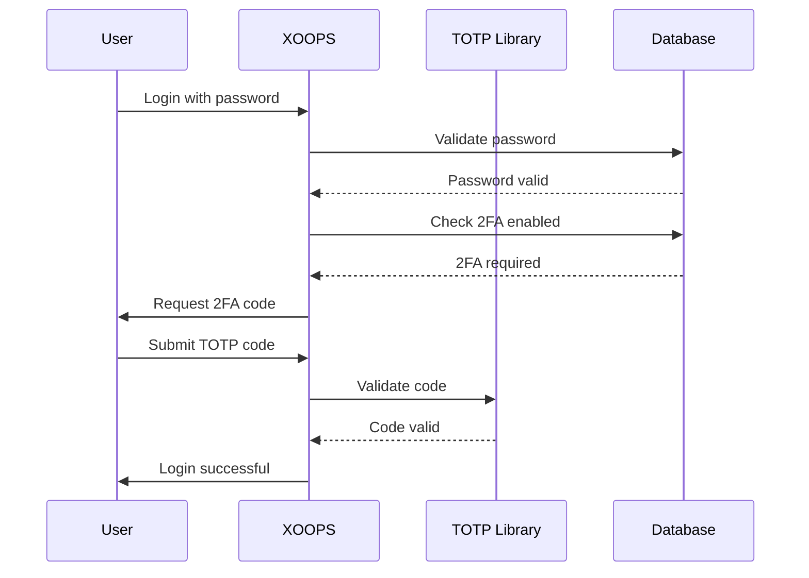

## סטטוס

מוצע

## הקשר

XOOPS זקוק לאבטחה משופרת עבור אימות משתמשים. אימות דו-גורמי (2FA) מספק שכבת אבטחה נוספת מעבר לסיסמאות, ומגן על חשבונות גם אם סיסמאות נפגעות.

שיקולים מרכזיים:
- תאימות לאחור עם אימות קיים
- תמיכה במספר שיטות 2FA
- חווית משתמש במהלך ההגדרה והכניסה
- מנגנוני שחזור של מכשירים שאבדו
- אינטגרציה עם מערכת ההרשאות הקיימת

## החלטה

ניישם את TOTP (סיסמה חד פעמית מבוססת זמן) כשיטה העיקרית של 2FA עם תמיכה בקודי גיבוי.

### גישת יישום

### סכימת מסד נתונים
```sql
CREATE TABLE `{PREFIX}_users_2fa` (
    `user_id` INT(11) NOT NULL,
    `secret` VARCHAR(32) NOT NULL,
    `enabled` TINYINT(1) DEFAULT 0,
    `backup_codes` TEXT,
    `last_used` INT(11),
    `created` INT(11) NOT NULL,
    PRIMARY KEY (`user_id`),
    FOREIGN KEY (`user_id`) REFERENCES `{PREFIX}_users`(`uid`)
);
```
### ממשק שירות
```php
interface TwoFactorAuthInterface
{
    public function enable(int $userId): TwoFactorSetup;
    public function disable(int $userId): void;
    public function verify(int $userId, string $code): bool;
    public function generateBackupCodes(int $userId): array;
    public function isEnabled(int $userId): bool;
}
```
### שילוב תוכנת אמצעית
```php
class TwoFactorMiddleware implements MiddlewareInterface
{
    public function process(
        ServerRequestInterface $request,
        RequestHandlerInterface $handler
    ): ResponseInterface {
        $session = $request->getAttribute('session');

        if ($session->has('pending_2fa_user_id')) {
            // User needs to complete 2FA
            if ($this->isVerificationRequest($request)) {
                return $handler->handle($request);
            }
            return new RedirectResponse('/2fa/verify');
        }

        return $handler->handle($request);
    }
}
```
## השלכות

### חיובי

- שיפור משמעותי באבטחת החשבון
- תאימות TOTP בתקן התעשייה (Google Authenticator, Authy וכו')
- קודי גיבוי מונעים נעילת חשבון
- אופציונלי לכל משתמש - לא כופה אימוץ
- PSR-15 תווך מאפשר אינטגרציה נקייה

### שלילי

- שלב התחברות נוסף משפיע על חווית המשתמש
- המשתמשים חייבים לנהל אפליקציות אימות
- מכשירים שאבדו דורשים תהליך שחזור
- אחסון ושאילתות נוסף של מסדי נתונים
- דורש תלות בספרייה קריפטוגרפית

### נתיב הגירה

1. הוסף טבלת מסד נתונים עבור נתוני 2FA
2. הטמעת שירות TOTP עם תלות בספרייה
3. הוסף תוכנת ביניים לשרשרת האימות
4. צור ממשק משתמש להגדרה ואימות
5. אפשרות אדמין לדרוש 2FA עבור קבוצות ספציפיות

## נשקלו חלופות

### SMS מבוסס OTP

נדחה עקב:
- SIM החלפת נקודות תורפה
- עלות שער SMS
- מורכבות אימות מספר טלפון
- חששות לפרטיות

### מפתחות אבטחת חומרה (WebAuthn)

נדחה לעתיד ADR:
- יישום מורכב יותר
- תמיכה מוגבלת בדפדפן מבחינה היסטורית
- עלות משתמש גבוהה יותר
- ניתן להוסיף לצד TOTP מאוחר יותר

### מבוסס אימייל OTP

נדחה עקב:
- התפשרות על חשבון דואר אלקטרוני מביס את המטרה
- עיכובים באספקה משפיעים על ה-UX
- בעיות במסנן דואר זבל

## הפניות

- [RFC 6238 - TOTP](https://tools.ietf.org/html/rfc6238)
- [פורמט מפתח המאמת של Google](https://github.com/google/google-authenticator/wiki/Key-Uri-Format)
- ../../02-Core-Concepts/Security/Security-Best-Practices - הנחיות אבטחה
- ../../02-Core-Concepts/Users-Permissions/Authentication - תיעוד מערכת אישור