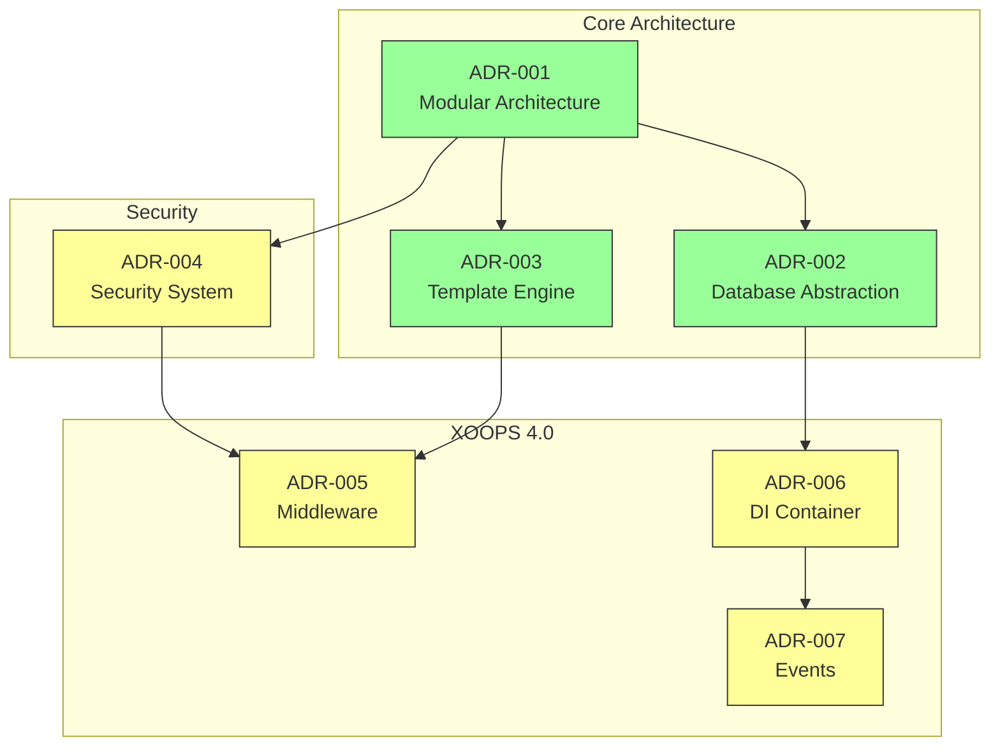
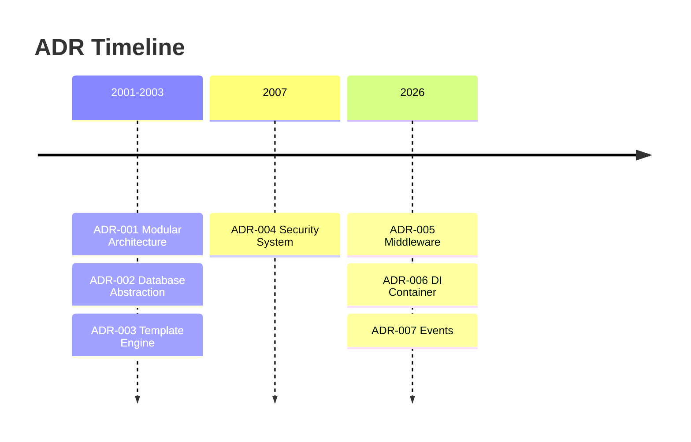

# 📋 אינדקס רשומות החלטות אדריכלות

> אינדקס מקיף של החלטות אדריכליות שעיצבו XOOPS CMS.

---

## מהן ADRs?

Architecture Decision Records (ADRs) מתעדים החלטות אדריכליות משמעותיות שהתקבלו במהלך הפיתוח של XOOPS. הם לוכדים את ההקשר, ההחלטה וההשלכות של כל בחירה, ומספקים הקשר היסטורי בעל ערך למנהלים ולתורמים.

---

## ADR מקרא סטטוס

| סטטוס | המשמעות |
|--------|--------|
| **מוצע** | בדיון, טרם התקבל |
| **מתקבל** | ההחלטה התקבלה |
| **הוצא משימוש** | כבר לא מומלץ |
| **מוחלף** | הוחלף באחר ADR |

---

## ADR נוכחיים

### החלטות יסוד

| ADR | כותרת | סטטוס | השפעה |
|-----|-------|--------|--------|
| ADR-001 | אדריכלות מודולרית | מקובל | ליבה |
| ADR-002 | גישה למסד נתונים מונחה עצמים | מקובל | ליבה |
| ADR-003 | Smarty מנוע תבנית | מקובל | ליבה |

### ADRs מתוכננים (XOOPS 4.0)

| ADR | כותרת | סטטוס | השפעה |
|-----|-------|--------|--------|
| ADR-004 | עיצוב מערכת אבטחה | מוצע | אבטחה |
| ADR-005 | PSR-15 תוכנת ביניים | מוצע | אדריכלות |
| ADR-006 | מיכל הזרקת תלות | מוצע | אדריכלות |
| ADR-007 | עיצוב מחדש של מערכת אירועים | מוצע | אדריכלות |

---

## ADR מערכות יחסים

---

## ציר זמן

---

## יצירת ADRs חדשות

כאשר מציעים החלטה אדריכלית חדשה:

1. העתק את תבנית ADR
2. מלא את כל הסעיפים
3. שלח כבקשת משיכה
4. לדון בנושאים GitHub
5. עדכון סטטוס לאחר החלטה

### ADR מבנה תבנית
```markdown
# ADR-XXX: Title

## Status
Proposed | Accepted | Deprecated | Superseded

## Context
What is the issue motivating this decision?

## Decision
What is the change that we're proposing?

## Consequences
What becomes easier or harder as a result?

## Alternatives Considered
What other options were evaluated?
```
---

## 🔗 תיעוד קשור

- מושגי ליבה
- הנחיות תרומות
- XOOPS 4.0 מפת דרכים

---

#xoops #adr #architecture #index #decisions