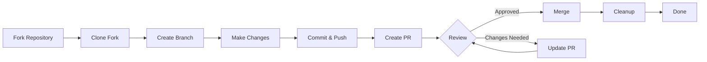

> מדריך זה מנחה אותך בתהליך השלם של תרומה ל-XOOPS, מההגדרה הראשונית ועד לבקשת המשיכה הממוזגת.

---

## דרישות מוקדמות

לפני שתתחיל לתרום, ודא שיש לך:

- **Git** מותקן ומוגדר
- **חשבון GitHub** (חינם)
- **PHP 7.4+** לפיתוח XOOPS
- **Composer** לניהול תלות
- ידע בסיסי בתהליכי עבודה של Git
- היכרות עם קוד ההתנהגות

---

## שלב 1: מזלג את המאגר

### על ממשק האינטרנט GitHub

1. נווט אל המאגר (לדוגמה, `XOOPS/XoopsCore27`)
2. לחץ על הלחצן **מזלג** בפינה השמאלית העליונה
3. בחר היכן לחלק (החשבון האישי שלך)
4. המתן עד שהמזלג יסתיים

### למה מזלג?

- אתה מקבל עותק משלך לעבוד עליו
- מתחזקים לא צריכים לנהל סניפים רבים
- יש לך שליטה מלאה על המזלג שלך
- Pull Requests מתייחסות למזלג שלך ולריפו במעלה הזרם

---

## שלב 2: שיבוט המזלג שלך באופן מקומי

```bash
# Clone your fork (replace YOUR_USERNAME)
git clone https://github.com/YOUR_USERNAME/XoopsCore27.git
cd XoopsCore27

# Add upstream remote to track original repository
git remote add upstream https://github.com/XOOPS/XoopsCore27.git

# Verify remotes are set correctly
git remote -v
# origin    https://github.com/YOUR_USERNAME/XoopsCore27.git (fetch)
# origin    https://github.com/YOUR_USERNAME/XoopsCore27.git (push)
# upstream  https://github.com/XOOPS/XoopsCore27.git (fetch)
# upstream  https://github.com/XOOPS/XoopsCore27.git (nofetch)
```

---

## שלב 3: הגדר סביבת פיתוח

### התקנת תלות

```bash
# Install Composer dependencies
composer install

# Install development dependencies
composer install --dev

# For module development
cd modules/mymodule
composer install
```

### הגדר את Git

```bash
# Set your Git identity
git config user.name "Your Name"
git config user.email "your.email@example.com"

# Optional: Set global Git config
git config --global user.name "Your Name"
git config --global user.email "your.email@example.com"
```

### הפעל בדיקות

```bash
# Make sure tests pass in clean state
./vendor/bin/phpunit

# Run specific test suite
./vendor/bin/phpunit --testsuite unit
```

---

## שלב 4: צור סניף תכונה

### אמנת מתן שמות של סניפים

עקוב אחר הדפוס הזה: `<type>/<description>`

**סוגים:**
- `feature/` - תכונה חדשה
- `fix/` - תיקון באגים
- `docs/` - תיעוד בלבד
- `refactor/` - ריפקטור קוד
- `test/` - תוספות בדיקה
- `chore/` - תחזוקה, כלי עבודה

**דוגמאות:**
```bash
# Feature branch
git checkout -b feature/add-two-factor-auth

# Bug fix branch
git checkout -b fix/prevent-xss-in-forms

# Documentation branch
git checkout -b docs/update-api-guide

# Always branch from upstream/main (or develop)
git checkout -b feature/my-feature upstream/main
```

### שמור את הסניף מעודכן

```bash
# Before you start work, sync with upstream
git fetch upstream
git merge upstream/main

# Later, if upstream has changed
git fetch upstream
git rebase upstream/main
```

---

## שלב 5: בצע את השינויים שלך

### שיטות פיתוח

1. **כתוב קוד** בהתאם לתקני PHP
2. **כתוב מבחנים** לפונקציונליות חדשה
3. **עדכן תיעוד** במידת הצורך
4. **הפעל linters** ומעצבי קוד

### בדיקות איכות קוד

```bash
# Run all tests
./vendor/bin/phpunit

# Run with coverage
./vendor/bin/phpunit --coverage-html coverage/

# Run PHP CS Fixer
./vendor/bin/php-cs-fixer fix --dry-run

# Run PHPStan static analysis
./vendor/bin/phpstan analyse class/ src/
```

### בצע שינויים טובים

```bash
# Check what you changed
git status
git diff

# Stage specific files
git add class/MyClass.php
git add tests/MyClassTest.php

# Or stage all changes
git add .

# Commit with descriptive message
git commit -m "feat(auth): add two-factor authentication support"
```

---

## שלב 6: שמור סניף מסונכרן

בזמן העבודה על התכונה שלך, הענף הראשי עשוי להתקדם:

```bash
# Fetch latest changes from upstream
git fetch upstream

# Option A: Rebase (preferred for clean history)
git rebase upstream/main

# Option B: Merge (simpler but adds merge commits)
git merge upstream/main

# If conflicts occur, resolve them then:
git add .
git rebase --continue  # or git merge --continue
```

---

## שלב 7: דחף אל המזלג שלך

```bash
# Push your branch to your fork
git push origin feature/my-feature

# On subsequent pushes
git push

# If you rebased, you might need force push (use carefully!)
git push --force-with-lease origin feature/my-feature
```

---

## שלב 8: צור בקשת משיכה

### בממשק האינטרנט GitHub

1. עבור אל המזלג שלך ב-GitHub
2. תראה הודעה ליצירת יחסי ציבור מהסניף שלך
3. לחץ על **"השוואה ומשוך בקשה"**
4. או לחץ ידנית על **"בקשת משיכה חדשה"** ובחר את הסניף שלך

### כותרת ותיאור יחסי ציבור

**פורמט כותרת:**
```
<type>(<scope>): <subject>
```

דוגמאות:
```
feat(auth): add two-factor authentication
fix(forms): prevent XSS in text input
docs: update installation guide
refactor(core): improve performance
```

**תבנית תיאור:**

```markdown
## Description
Brief explanation of what this PR does.

## Changes
- Changed X from A to B
- Added feature Y
- Fixed bug Z

## Type of Change
- [ ] New feature (adds new functionality)
- [ ] Bug fix (fixes an issue)
- [ ] Breaking change (API/behavior change)
- [ ] Documentation update

## Testing
- [ ] Added tests for new functionality
- [ ] All existing tests pass
- [ ] Manual testing performed

## Screenshots (if applicable)
Include before/after screenshots for UI changes.

## Related Issues
Closes #123
Related to #456

## Checklist
- [ ] Code follows style guidelines
- [ ] Self-reviewed own code
- [ ] Commented complex code
- [ ] Updated documentation
- [ ] No new warnings generated
- [ ] Tests pass locally
```

### רשימת ביקורת ליחסי ציבור

לפני השליחה, ודא:

- [ ] הקוד עומד בתקני PHP
- [ ] מבחנים כלולים ועוברים
- [ ] התיעוד עודכן (במידת הצורך)
- [ ] אין התנגשויות מיזוג
- [ ] הודעות התחייבות ברורות
- [ ] יש התייחסות לנושאים קשורים
- [ ] תיאור יחסי הציבור מפורט
- [ ] אין קוד ניפוי באגים או יומני מסוף

---

## שלב 9: השב למשוב

### במהלך סקירת קוד

1. **קרא תגובות בעיון** - הבן את המשוב
2. **שאל שאלות** - אם לא ברור, בקשו הבהרה
3. **לדון בחלופות** - דיון בכבוד על גישות
4. **בצע שינויים מבוקשים** - עדכן את הסניף שלך
5. **התחייבויות מעודכנות בכוח דחיפה** - אם משכתבים את ההיסטוריה

```bash
# Make changes
git add .
git commit --amend  # Modify last commit
git push --force-with-lease origin feature/my-feature

# Or add new commits
git commit -m "Address feedback on PR review"
git push origin feature/my-feature
```

### צפו לאיטרציה

- רוב אנשי יחסי הציבור דורשים סבבי ביקורת מרובים
- היו סבלניים ובונים
- ראה משוב כהזדמנות למידה
- מנהלי התחזוקה עשויים להציע רפקטורים

---

## שלב 10: מיזוג וניקוי

### לאחר אישור

לאחר שהמתחזקים מאשרים וממזגים:

1. **GitHub מתמזג אוטומטית** או קליקים של מנהלים מתמזגים
2. **הסניף שלך נמחק** (בדרך כלל אוטומטי)
3. **השינויים הם במעלה הזרם**

### ניקוי מקומי

```bash
# Switch to main branch
git checkout main

# Update main with merged changes
git fetch upstream
git merge upstream/main

# Delete local feature branch
git branch -d feature/my-feature

# Delete from your fork (if not auto-deleted)
git push origin --delete feature/my-feature
```

---

## תרשים זרימת עבודה



---

## תרחישים נפוצים

### סנכרון לפני התחלה

```bash
# Always start fresh
git fetch upstream
git checkout -b feature/new-thing upstream/main
```

### הוספת התחייבויות נוספות

```bash
# Just push again
git add .
git commit -m "feat: additional changes"
git push origin feature/new-thing
```

### תיקון טעויות

```bash
# Last commit has wrong message
git commit --amend -m "Correct message"
git push --force-with-lease

# Revert to previous state (careful!)
git reset --soft HEAD~1  # Keep changes
git reset --hard HEAD~1  # Discard changes
```

### טיפול בהתנגשויות מיזוג

```bash
# Rebase and resolve conflicts
git fetch upstream
git rebase upstream/main

# Edit conflicted files to resolve
# Then continue
git add .
git rebase --continue
git push --force-with-lease
```

---

## שיטות עבודה מומלצות

### תעשה

- שמור סניפים ממוקדים בנושאים בודדים
- בצע התחייבויות קטנות והגיוניות
- כתוב הודעות מחויבות תיאוריות
- עדכן את הסניף שלך לעתים קרובות
- בדוק לפני הדחיפה
- שינויים במסמכים
- היו קשובים למשוב

### אל תעשה

- עבודה ישירות על סניף main/master
- מערבבים שינויים לא קשורים ב-PR אחד
- Commit קבצים שנוצרו או node_modules
- דחיפה בכוח לאחר שיחסי ציבור הם ציבוריים (השתמש ב--force-with-חכירה)
- התעלם ממשוב על סקירת קוד
- צור יחסי ציבור ענקיים (פרוץ לקטנים יותר)
- העברת נתונים רגישים (API מפתחות, סיסמאות)

---

## טיפים להצלחה

### לתקשר

- שאלו שאלות בנושאים לפני תחילת העבודה
- בקשו הדרכה לגבי שינויים מורכבים
- לדון בגישה בתיאור יחסי הציבור
- השב למשוב מייד

### פעל לפי התקנים

- עיין בתקני PHP
- בדוק את ההנחיות לדיווח על בעיות
- קרא סקירה כללית של תרומה
- פעל לפי הנחיות Pull Request

### למד את בסיס הקוד

- קרא דפוסי קוד קיימים
- למד יישומים דומים
- להבין את הארכיטקטורה
- בדוק את מושגי ליבה

---

## תיעוד קשור

- קוד התנהגות
- משוך הנחיות בקשה
- דיווח על בעיות
- PHP תקני קידוד
- סקירה תורמת

---

#xoops #git #github #contributing #workflow #pull-request
