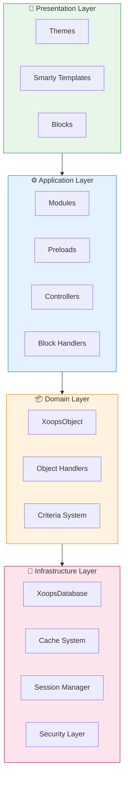
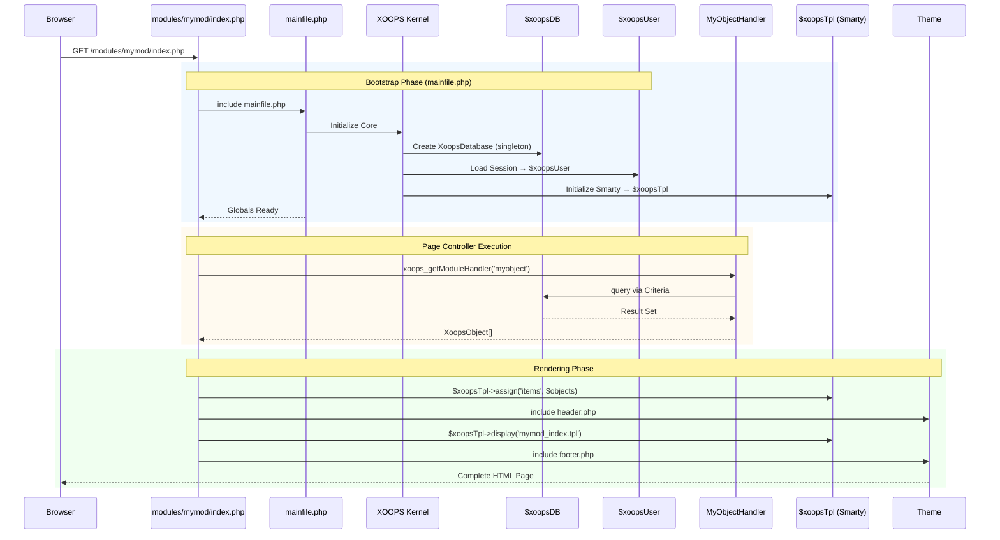

:::הערה[על מסמך זה]
דף זה מתאר את **הארכיטקטורה המושגית** של XOOPS החלה הן על גרסאות נוכחיות (2.5.x) ועתידיות (4.0.x). כמה דיאגרמות מציגות את חזון העיצוב המרובד.

**לפרטים ספציפיים לגרסה:**
- **XOOPS 2.5.x היום:** משתמש ב-`mainfile.php`, גלובליות (`$xoopsDB`, `$xoopsUser`), טעינות מוקדמות ודפוס מטפל
- **XOOPS 4.0 יעד:** תוכנת ביניים PSR-15, מיכל DI, נתב - ראה [מפת דרכים](../../07-XOOPS-4.0/XOOPS-4.0-Roadmap.md)
:::

מסמך זה מספק סקירה מקיפה של ארכיטקטורת המערכת XOOPS, ומסביר כיצד הרכיבים השונים פועלים יחד ליצירת מערכת ניהול תוכן גמישה וניתנת להרחבה.

## סקירה כללית

XOOPS עוקב אחר ארכיטקטורה מודולרית המפרידה בין דאגות לשכבות נפרדות. המערכת בנויה סביב מספר עקרונות ליבה:

- **מודולריות**: הפונקציונליות מאורגנת במודולים עצמאיים הניתנים להתקנה
- **הרחבה**: ניתן להרחיב את המערכת מבלי לשנות את קוד הליבה
- **הפשטה**: שכבות מסד הנתונים והמצגת מופשטות מהיגיון עסקי
- **אבטחה**: מנגנוני אבטחה מובנים מגנים מפני פגיעויות נפוצות

## שכבות מערכת



### 1. שכבת מצגת

שכבת המצגת מטפלת בעיבוד ממשק משתמש באמצעות מנוע התבנית Smarty.

**רכיבי מפתח:**
- **נושאים**: עיצוב ופריסה חזותית
- **Smarty תבניות**: עיבוד תוכן דינמי
- **בלוקים**: ווידג'טים של תוכן לשימוש חוזר

### 2. שכבת יישום

שכבת היישום מכילה לוגיקה עסקית, בקרים ופונקציונליות של מודול.

**רכיבי מפתח:**
- **מודולים**: חבילות פונקציונליות עצמאיות
- **מטפלים**: שיעורי מניפולציה של נתונים
- **טעינות מוקדמות**: מאזיני אירועים והוק

### 3. שכבת דומיין

שכבת התחום מכילה אובייקטים וכללים עסקיים ליבה.

**רכיבי מפתח:**
- **XoopsObject**: מחלקה בסיס לכל אובייקטי הדומיין
- **מטפלים**: פעולות CRUD עבור אובייקטי תחום

### 4. שכבת תשתית

שכבת התשתית מספקת שירותי ליבה כמו גישה למסד נתונים ואחסון בcache.

## בקש מחזור חיים

הבנת מחזור החיים של הבקשה חיונית לפיתוח יעיל של XOOPS.

### XOOPS 2.5.x זרימת בקר עמוד

ה-XOOPS 2.5.x הנוכחי משתמש בתבנית **Page Controller** שבה כל קובץ PHP מטפל בבקשה משלו. גלובלים (`$xoopsDB`, `$xoopsUser`, `$xoopsTpl` וכו') מאותחלים במהלך האתחול וזמינים לאורך כל הביצוע.



### Globals מפתח ב-2.5.x

| גלובלי | הקלד | אתחול | מטרה |
|--------|------|----------------|--------|
| `$xoopsDB` | `XoopsDatabase` | Bootstrap | חיבור למסד נתונים (יחיד) |
| `$xoopsUser` | `XoopsUser\|null` | עומס הפעלה | משתמש מחובר נוכחי |
| `$xoopsTpl` | `XoopsTpl` | תבנית init | מנוע תבנית Smarty |
| `$xoopsModule` | `XoopsModule` | עומס מודול | הקשר מודול נוכחי |
| `$xoopsConfig` | `array` | טעינת תצורה | תצורת מערכת |

:::הערה[השוואה XOOPS 4.0]
ב-XOOPS 4.0, דפוס בקר העמודים מוחלף ב-**PSR-15 Middleware Pipeline** ושיגור מבוסס נתב. גלובלים מוחלפים בהזרקת תלות. ראה [חוזה מצב היברידי](../../07-XOOPS-4.0/Specifications/Hybrid-Mode-Contract.md) לקבלת ערבויות תאימות במהלך ההגירה.
:::

### 1. Bootstrap Phase

```php
// mainfile.php is the entry point
include_once XOOPS_ROOT_PATH . '/mainfile.php';

// Core initialization
$xoops = Xoops::getInstance();
$xoops->boot();
```

**שלבים:**
1. טען תצורה (`mainfile.php`)
2. אתחול הטעינה האוטומטית
3. הגדר טיפול בשגיאות
4. צור חיבור למסד נתונים
5. טען סשן משתמש
6. אתחל את מנוע התבנית Smarty

### 2. שלב הניתוב

```php
// Request routing to appropriate module
$module = $GLOBALS['xoopsModule'];
$controller = $module->getController();
$controller->dispatch($request);
```

**שלבים:**
1. בקשת ניתוח URL
2. זיהוי מודול יעד
3. טען את תצורת המודול
4. בדוק הרשאות
5. נתיב למטפל המתאים

### 3. שלב הביצוע

```php
// Controller execution
$data = $handler->getObjects($criteria);
$xoopsTpl->assign('items', $data);
```

**שלבים:**
1. בצע את הלוגיקה של הבקר
2. אינטראקציה עם שכבת הנתונים
3. עיבוד חוקים עסקיים
4. הכן נתוני תצוגה

### 4. שלב העיבוד

```php
// Template rendering
include XOOPS_ROOT_PATH . '/header.php';
$xoopsTpl->display('db:module_template.tpl');
include XOOPS_ROOT_PATH . '/footer.php';
```

**שלבים:**
1. החל פריסת ערכת נושא
2. עיבוד תבנית מודול
3. עיבוד בלוקים
4. תגובת פלט

## רכיבי ליבה

### XoopsObject

מחלקת הבסיס לכל אובייקטי הנתונים ב-XOOPS.

```php
<?php
class MyModuleItem extends XoopsObject
{
    public function __construct()
    {
        $this->initVar('id', XOBJ_DTYPE_INT, null, false);
        $this->initVar('title', XOBJ_DTYPE_TXTBOX, '', true, 255);
        $this->initVar('content', XOBJ_DTYPE_TXTAREA, '', false);
        $this->initVar('created', XOBJ_DTYPE_INT, time(), false);
    }
}
```

**שיטות מפתח:**
- `initVar()` - הגדר מאפייני אובייקט
- `getVar()` - אחזר ערכי נכסים
- `setVar()` - הגדר ערכי מאפיינים
- `assignVars()` - הקצאה בכמות גדולה ממערך

### XoopsPersistableObjectHandler

מטפל בפעולות CRUD עבור מופעי XoopsObject.

```php
<?php
class MyModuleItemHandler extends XoopsPersistableObjectHandler
{
    public function __construct(\XoopsDatabase $db)
    {
        parent::__construct($db, 'mymodule_items', 'MyModuleItem', 'id', 'title');
    }

    public function getActiveItems($limit = 10)
    {
        $criteria = new CriteriaCompo();
        $criteria->add(new Criteria('status', 1));
        $criteria->setSort('created');
        $criteria->setOrder('DESC');
        $criteria->setLimit($limit);

        return $this->getObjects($criteria);
    }
}
```

**שיטות מפתח:**
- `create()` - צור מופע אובייקט חדש
- `get()` - אחזר אובייקט לפי מזהה
- `insert()` - שמור אובייקט במסד הנתונים
- `delete()` - הסר אובייקט ממסד הנתונים
- `getObjects()` - אחזר אובייקטים מרובים
- `getCount()` - ספירת אובייקטים תואמים

### מבנה מודול

כל מודול XOOPS עוקב אחר מבנה ספריות סטנדרטי:

```
modules/mymodule/
├── class/                  # PHP classes
│   ├── MyModuleItem.php
│   └── MyModuleItemHandler.php
├── include/                # Include files
│   ├── common.php
│   └── functions.php
├── templates/              # Smarty templates
│   ├── mymodule_index.tpl
│   └── mymodule_item.tpl
├── admin/                  # Admin area
│   ├── index.php
│   └── menu.php
├── language/               # Translations
│   └── english/
│       ├── main.php
│       └── modinfo.php
├── sql/                    # Database schema
│   └── mysql.sql
├── xoops_version.php       # Module info
├── index.php               # Module entry
└── header.php              # Module header
```

## מיכל הזרקת תלות

פיתוח מודרני XOOPS יכול למנף הזרקת תלות ליכולת בדיקה טובה יותר.

### יישום מיכל בסיסי

```php
<?php
class XoopsDependencyContainer
{
    private array $services = [];

    public function register(string $name, callable $factory): void
    {
        $this->services[$name] = $factory;
    }

    public function resolve(string $name): mixed
    {
        if (!isset($this->services[$name])) {
            throw new \InvalidArgumentException("Service not found: $name");
        }

        $factory = $this->services[$name];

        if (is_callable($factory)) {
            return $factory($this);
        }

        return $factory;
    }

    public function has(string $name): bool
    {
        return isset($this->services[$name]);
    }
}
```

### מיכל תואם PSR-11

```php
<?php
namespace Xmf\Di;

use Psr\Container\ContainerInterface;

class BasicContainer implements ContainerInterface
{
    protected array $definitions = [];

    public function set(string $id, mixed $value): void
    {
        $this->definitions[$id] = $value;
    }

    public function get(string $id): mixed
    {
        if (!$this->has($id)) {
            throw new \InvalidArgumentException("Service not found: $id");
        }

        $entry = $this->definitions[$id];

        if (is_callable($entry)) {
            return $entry($this);
        }

        return $entry;
    }

    public function has(string $id): bool
    {
        return isset($this->definitions[$id]);
    }
}
```

### דוגמה לשימוש

```php
<?php
// Service registration
$container = new XoopsDependencyContainer();

$container->register('database', function () {
    return XoopsDatabaseFactory::getDatabaseConnection();
});

$container->register('userHandler', function ($c) {
    return new XoopsUserHandler($c->resolve('database'));
});

// Service resolution
$userHandler = $container->resolve('userHandler');
$user = $userHandler->get($userId);
```

## נקודות הרחבה

XOOPS מספק מספר מנגנוני הרחבה:

### 1. טעינות מראש

טעינות מוקדמות מאפשרות למודולים להתחבר לאירועי ליבה.

```php
<?php
// modules/mymodule/preloads/core.php
class MymoduleCorePreload extends XoopsPreloadItem
{
    public static function eventCoreHeaderEnd($args)
    {
        // Execute when header processing ends
    }

    public static function eventCoreFooterStart($args)
    {
        // Execute when footer processing starts
    }
}
```

### 2. תוספים

תוספים מרחיבים פונקציונליות ספציפית בתוך מודולים.

```php
<?php
// modules/mymodule/plugins/notify.php
class MymoduleNotifyPlugin
{
    public function onItemCreate($item)
    {
        // Send notification when item is created
    }
}
```

### 3. מסננים

מסננים משנים נתונים בזמן שהם עוברים במערכת.

```php
<?php
// Content filter example
$myts = MyTextSanitizer::getInstance();
$content = $myts->displayTarea($rawContent, 1, 1, 1);
```

## שיטות עבודה מומלצות

### ארגון קוד

1. **השתמש במרחבי שמות** עבור קוד חדש:
   ```php
   namespace XoopsModules\MyModule;

   class Item extends \XoopsObject
   {
       // Implementation
   }
   ```

2. **עקוב אחר הטעינה האוטומטית של PSR-4**:
   ```json
   {
       "autoload": {
           "psr-4": {
               "XoopsModules\\MyModule\\": "class/"
           }
       }
   }
   ```

3. **חששות נפרדים**:
   - לוגיקה של תחום ב-`class/`
   - מצגת ב-`templates/`
   - בקרים בשורש המודול

### ביצועים

1. **השתמש בcache** לפעולות יקרות
2. **עומס בעצלתיים** משאבים כשאפשר
3. **צמצם את שאילתות מסד הנתונים** באמצעות אצווה של קריטריונים
4. **בצע אופטימיזציה של תבניות** על ידי הימנעות מהיגיון מורכב

### אבטחה

1. **אמת את כל הקלט** באמצעות `Xmf\Request`
2. **פלט בריחה** בתבניות
3. **השתמש בהצהרות מוכנות** עבור שאילתות מסד נתונים
4. **בדוק הרשאות** לפני פעולות רגישות

## תיעוד קשור

- [Design-Patterns](Design-Patterns.md) - דפוסי עיצוב בשימוש ב-XOOPS
- [שכבת מסד נתונים](../Database/Database-Layer.md) - פרטי הפשטת מסד נתונים
- [יסודות Smarty](../Templates/Smarty-Basics.md) - תיעוד מערכת תבניות
- [שיטות אבטחה מומלצות](../Security/Security-Best-Practices.md) - הנחיות אבטחה

---

#xoops #architecture #core #design #system-design
