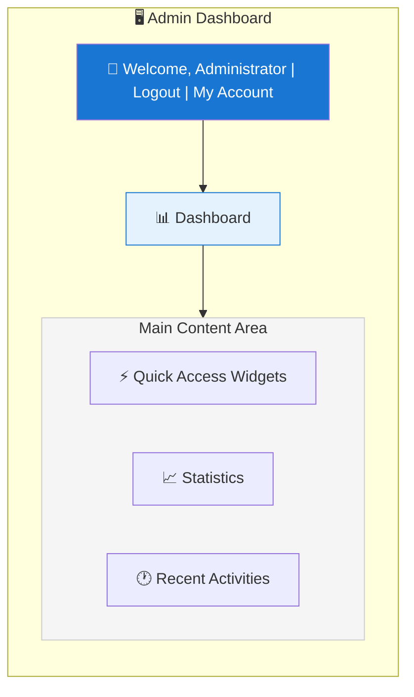
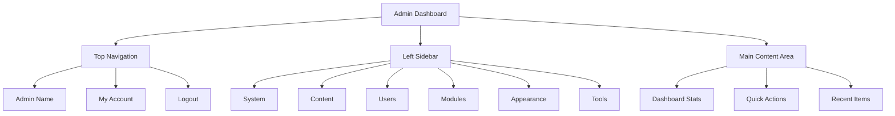

# XOOPS סקירה כללית של לוח הניהול

מדריך מלא לניווט ושימוש בלוח המחוונים XOOPS למנהל מערכת.

## גישה ללוח הניהול

### התחברות לניהול

פתח את הדפדפן שלך ונווט אל:
```
http://your-domain.com/xoops/admin/
```
או אם XOOPS נמצא בשורש:
```
http://your-domain.com/admin/
```
הזן את אישורי המנהל שלך:
```
Username: [Your admin username]
Password: [Your admin password]
```
### לאחר הכניסה

תראה את לוח המחוונים הראשי של מנהל המערכת:

## פריסת לוח הניהול

## רכיבי לוח המחוונים

### בר עליון

הסרגל העליון מכיל פקדים חיוניים:

| אלמנט | מטרה |
|---|---|
| **לוגו אדמין** | לחץ כדי לחזור ללוח המחוונים |
| **הודעת ברוכים הבאים** | מציג את שם המנהל המחובר |
| **החשבון שלי** | ערוך פרופיל מנהל וסיסמה |
| **עזרה** | גישה לתיעוד |
| **יציאה** | צא מפאנל הניהול |

### סרגל הצד השמאלי של הניווט

תפריט ראשי מאורגן לפי פונקציה:
```
├── System
│   ├── Dashboard
│   ├── Preferences
│   ├── Admin Users
│   ├── Groups
│   ├── Permissions
│   ├── Modules
│   └── Tools
├── Content
│   ├── Pages
│   ├── Categories
│   ├── Comments
│   └── Media Manager
├── Users
│   ├── Users
│   ├── User Requests
│   ├── Online Users
│   └── User Groups
├── Modules
│   ├── Modules
│   ├── Module Settings
│   └── Module Updates
├── Appearance
│   ├── Themes
│   ├── Templates
│   ├── Blocks
│   └── Images
└── Tools
    ├── Maintenance
    ├── Email
    ├── Statistics
    ├── Logs
    └── Backups
```
### אזור תוכן ראשי

מציג מידע ופקדים עבור החלק שנבחר:

- טפסים לתצורה
- טבלאות נתונים עם רשימות
- תרשימים וסטטיסטיקות
- כפתורי פעולה מהירים
- טקסט עזרה ועצות כלים

### ווידג'טים של לוח המחוונים

גישה מהירה למידע מרכזי:

- **מידע מערכת:** PHP גרסה, MySQL גרסה, XOOPS גרסה
- **סטטיסטיקה מהירה:** ספירת משתמשים, סך כל הפוסטים, מודולים מותקנים
- **פעילות אחרונה:** כניסות אחרונות, שינויים בתוכן, שגיאות
- **סטטוס שרת:** CPU, זיכרון, שימוש בדיסק
- **התראות:** התראות מערכת, עדכונים ממתינים

## פונקציות ניהול ליבה

### ניהול מערכת

**מיקום:** מערכת > [אפשרויות שונות]

#### העדפות

הגדר הגדרות מערכת בסיסיות:
```
System > Preferences > [Settings Category]
```
קטגוריות:
- הגדרות כלליות (שם אתר, אזור זמן)
- הגדרות משתמש (רישום, פרופילים)
- הגדרות דוא"ל (תצורת SMTP)
- הגדרות cache (אפשרויות אחסון בcache)
- URL הגדרות (ידידותי URLs)
- מטא תגים (הגדרות SEO)

ראה תצורה בסיסית והגדרות מערכת.

#### משתמשי מנהל

נהל חשבונות מנהל:
```
System > Admin Users
```
פונקציות:
- הוסף מנהלים חדשים
- ערוך פרופילי מנהל
- שנה סיסמאות מנהל
- מחק חשבונות ניהול
- הגדר הרשאות מנהל

### ניהול תוכן

**מיקום:** תוכן > [אפשרויות שונות]

#### Pages/Articles

נהל את תוכן האתר:
```
Content > Pages (or your module)
```
פונקציות:
- צור דפים חדשים
- ערוך תוכן קיים
- מחק דפים
- Publish/unpublish
- הגדר קטגוריות
- ניהול תיקונים

#### קטגוריות

ארגן תוכן:
```
Content > Categories
```
פונקציות:
- צור היררכיית קטגוריות
- ערוך קטגוריות
- מחק קטגוריות
- הקצה לדפים

#### הערות

מתן הערות משתמשים:
```
Content > Comments
```
פונקציות:
- הצג את כל ההערות
- אשר הערות
- ערוך הערות
- מחק ספאם
- חסום מגיבים

### ניהול משתמשים

**מיקום:** משתמשים > [אפשרויות שונות]

#### משתמשים

נהל חשבונות משתמש:
```
Users > Users
```
פונקציות:
- הצג את כל המשתמשים
- צור משתמשים חדשים
- ערוך פרופילי משתמשים
- מחק חשבונות
- אפס סיסמאות
- שנה סטטוס משתמש
- הקצה לקבוצות

#### משתמשים מקוונים

עקוב אחר משתמשים פעילים:
```
Users > Online Users
```
מופעים:
- משתמשים מקוונים כרגע
- שעת פעילות אחרונה
- כתובת IP
- מיקום משתמש (אם מוגדר)

#### קבוצות משתמשים

נהל תפקידים והרשאות משתמש:
```
Users > Groups
```
פונקציות:
- צור קבוצות מותאמות אישית
- הגדר הרשאות קבוצה
- הקצה משתמשים לקבוצות
- מחק קבוצות

### ניהול מודול

**מיקום:** מודולים > [אפשרויות שונות]

#### מודולים

התקן והגדר מודולים:
```
Modules > Modules
```
פונקציות:
- הצג מודולים מותקנים
- Enable/disable מודולים
- עדכון מודולים
- הגדר את הגדרות המודול
- התקן מודולים חדשים
- הצג את פרטי המודול

#### חפש עדכונים
```
Modules > Modules > Check for Updates
```
מציג:
- עדכוני מודול זמינים
- יומן שינויים
- אפשרויות הורדה והתקנה

### ניהול מראה

**מיקום:** מראה > [אפשרויות שונות]

#### ערכות נושא

נהל ערכות נושא של האתר:
```
Appearance > Themes
```
פונקציות:
- הצג ערכות נושא מותקנות
- הגדר ערכת נושא ברירת מחדל
- העלה ערכות נושא חדשות
- מחק ערכות נושא
- תצוגה מקדימה של נושא
- תצורת ערכת נושא

#### בלוקים

נהל בלוקים של תוכן:
```
Appearance > Blocks
```
פונקציות:
- צור בלוקים מותאמים אישית
- ערוך תוכן בלוק
- סדר בלוקים בדף
- הגדר נראות בלוק
- מחק בלוקים
- הגדר אחסון בcache בלוקים

#### תבניות

נהל תבניות (מתקדם):
```
Appearance > Templates
```
למשתמשים ולמפתחים מתקדמים.

### כלי מערכת

**מיקום:** מערכת > כלים

#### מצב תחזוקה

מנע גישה למשתמש במהלך תחזוקה:
```
System > Maintenance Mode
```
הגדר:
- Enable/disable תחזוקה
- הודעת תחזוקה מותאמת אישית
- כתובות IP מותרות (לבדיקה)

#### ניהול מסדי נתונים
```
System > Database
```
פונקציות:
- בדוק את עקביות מסד הנתונים
- הפעל עדכוני מסד נתונים
- תיקון שולחנות
- ייעול מסד הנתונים
- ייצוא מבנה מסד נתונים

#### יומני פעילות
```
System > Logs
```
צג:
- פעילות משתמשים
- פעולות מנהליות
- אירועי מערכת
- יומני שגיאות

## פעולות מהירות

משימות נפוצות הנגישות מלוח המחוונים:
```
Quick Links:
├── Create New Page
├── Add New User
├── Create Content Block
├── Upload Image
├── Send Mass Email
├── Update All Modules
└── Clear Cache
```
## קיצורי מקשים בלוח הניהול

ניווט מהיר:

| קיצור | פעולה |
|---|---|
| `Ctrl+H` | עבור לעזרה |
| `Ctrl+D` | עבור ללוח המחוונים |
| `Ctrl+Q` | חיפוש מהיר |
| `Ctrl+L` | התנתק |

## ניהול חשבון משתמש

### החשבון שלי

גישה לפרופיל המנהל שלך:

1. לחץ על "החשבון שלי" בפינה השמאלית העליונה
2. ערוך את פרטי הפרופיל:
   - כתובת אימייל
   - שם אמיתי
   - מידע על המשתמש
   - אווטאר

### שנה סיסמה

שנה את סיסמת המנהל שלך:

1. עבור אל **החשבון שלי**
2. לחץ על "שנה סיסמה"
3. הזן את הסיסמה הנוכחית
4. הזן סיסמה חדשה (פעמיים)
5. לחץ על "שמור"

**טיפים לאבטחה:**
- השתמש בסיסמאות חזקות (16+ תווים)
- כלול אותיות רישיות, קטנות, מספרים, סמלים
- שנה סיסמה כל 90 יום
- לעולם אל תשתף אישורי מנהל

### התנתק

צא מפאנל הניהול:

1. לחץ על "התנתק" בפינה השמאלית העליונה
2. תופנה לדף ההתחברות

## סטטיסטיקות של פאנל ניהול

### נתונים סטטיסטיים של לוח המחוונים

סקירה מהירה של מדדי האתר:

| מדד | ערך |
|--------|-------|
| משתמשים מקוונים | 12 |
| סה"כ משתמשים | 256 |
| סך כל ההודעות | 1,234 |
| סה"כ תגובות | 5,678 |
| סה"כ מודולים | 8 |

### מצב מערכת

מידע על שרת וביצועים:

| רכיב | Version/Value |
|--------|--------------|
| XOOPS גרסה | 2.5.11 |
| PHP גרסה | 8.2.x |
| MySQL גרסה | 8.0.x |
| טעינת שרת | 0.45, 0.42 |
| זמן פעילות | 45 ימים |

### פעילות אחרונה

ציר זמן של אירועים אחרונים:
```
12:45 - Admin login
12:30 - New user registered
12:15 - Page published
12:00 - Comment posted
11:45 - Module updated
```
## מערכת התראות

### התראות מנהל

קבלת התראות עבור:

- רישומי משתמשים חדשים
- הערות ממתינות למתן
- ניסיונות כניסה כושלים
- שגיאות מערכת
- עדכוני מודול זמינים
- בעיות במסד נתונים
- אזהרות על שטח דיסק

הגדר התראות:

**מערכת > העדפות > הגדרות דוא"ל**
```
Notify Admin on Registration: Yes
Notify Admin on Comments: Yes
Notify Admin on Errors: Yes
Alert Email: admin@your-domain.com
```
## משימות ניהול נפוצות

### צור דף חדש

1. עבור אל **תוכן > דפים** (או מודול רלוונטי)
2. לחץ על "הוסף דף חדש"
3. מלא:
   - כותרת
   - תוכן
   - תיאור
   - קטגוריה
   - מטא נתונים
4. לחץ על "פרסם"

### נהל משתמשים

1. עבור אל **משתמשים > משתמשים**
2. הצג רשימת משתמשים עם:
   - שם משתמש
   - אימייל
   - תאריך רישום
   - כניסה אחרונה
   - סטטוס

3. לחץ על שם המשתמש כדי:
   - ערוך פרופיל
   - שנה סיסמה
   - עריכת קבוצות
   - Block/unblock משתמש

### הגדר מודול

1. עבור אל **מודולים > מודולים**
2. מצא מודול ברשימה
3. לחץ על שם המודול
4. לחץ על "העדפות" או "הגדרות"
5. הגדר אפשרויות מודול
6. שמור שינויים

### צור בלוק חדש

1. עבור אל **מראה > בלוקים**
2. לחץ על "הוסף בלוק חדש"
3. הזן:
   - כותרת בלוק
   - חסימת תוכן (HTML מותר)
   - מיקום בעמוד
   - נראות (כל הדפים או ספציפיים)
   - מודול (אם רלוונטי)
4. לחץ על "שלח"

## עזרה בלוח הניהול

### תיעוד מובנה

גש לעזרה מפאנל הניהול:

1. לחץ על כפתור "עזרה" בסרגל העליון
2. עזרה תלוית הקשר עבור הדף הנוכחי
3. קישורים לתיעוד
4. שאלות נפוצות

### משאבים חיצוניים

- XOOPS האתר הרשמי: https://xoops.org/
- פורום קהילתי: https://xoops.org/modules/newbb/
- מאגר מודולים: https://xoops.org/modules/repository/
- Bugs/Issues: https://github.com/XOOPS/XoopsCore/issues

## התאמה אישית של לוח הניהול

### ערכת נושא לניהול

בחר ערכת נושא של ממשק ניהול:

**מערכת > העדפות > הגדרות כלליות**
```
Admin Theme: [Select theme]
```
ערכות נושא זמינות:
- ברירת מחדל (אור)
- מצב כהה
- ערכות נושא מותאמות אישית

### התאמה אישית של לוח המחוונים

בחר אילו ווידג'טים יופיעו:

**לוח מחוונים > התאמה אישית**

בחר:
- מידע מערכת
- סטטיסטיקה
- פעילות אחרונה
- קישורים מהירים
- ווידג'טים מותאמים אישית

## הרשאות פאנל ניהול

לרמות ניהול שונות יש הרשאות שונות:

| תפקיד | יכולות |
|---|---|
| **מנהל האתר** | גישה מלאה לכל פונקציות הניהול |
| **אדמין** | פונקציות אדמין מוגבלות |
| **מנחה** | ניהול תוכן בלבד |
| **עורך** | יצירה ועריכת תוכן |

ניהול הרשאות:

**מערכת > הרשאות**

## שיטות עבודה מומלצות לאבטחה עבור פאנל ניהול

1. **סיסמה חזקה:** השתמש בסיסמה של 16+ תווים
2. **שינויים רגילים:** שנה סיסמה כל 90 יום
3. **גישה לניטור:** בדוק את יומני "משתמשי ניהול" באופן קבוע
4. **הגבלת גישה:** שנה את שם תיקיית הניהול לאבטחה נוספת
5. **השתמש ב-HTTPS:** גש תמיד למנהל המערכת דרך HTTPS
6. **רשימת IP הלבנה:** הגבל גישת מנהל לכתובות IP ספציפיות
7. **התנתקות רגילה:** התנתק בסיום
8. **אבטחת דפדפן:** נקה את הcache של הדפדפן באופן קבוע

ראה תצורת אבטחה.

## פתרון בעיות פאנל ניהול

### לא יכול לגשת ללוח הניהול

**פתרון:**
1. אמת את אישורי הכניסה
2. נקה את הcache והעוגיות של הדפדפן
3. נסה דפדפן אחר
4. בדוק אם נתיב תיקיית הניהול נכון
5. אמת את הרשאות הקובץ בתיקיית הניהול
6. בדוק את חיבור מסד הנתונים ב-mainfile.php

### דף ניהול ריק

**פתרון:**
```bash
# Check PHP errors
tail -f /var/log/apache2/error.log

# Enable debug mode temporarily
sed -i "s/define('XOOPS_DEBUG', 0)/define('XOOPS_DEBUG', 1)/" /var/www/html/xoops/mainfile.php

# Check file permissions
ls -la /var/www/html/xoops/admin/
```
### פאנל ניהול איטי

**פתרון:**
1. נקה cache: **מערכת > כלים > נקה cache**
2. בצע אופטימיזציה של מסד הנתונים: **מערכת > מסד נתונים > אופטימיזציה**
3. בדוק את משאבי השרת: `htop`
4. סקור שאילתות איטיות ב-MySQL

### המודול לא מופיע

**פתרון:**
1. ודא שמודול מותקן: **מודולים > מודולים**
2. בדוק מודול מופעל
3. אמת את ההרשאות שהוקצו
4. בדוק שקיימים קבצי מודול
5. סקור יומני שגיאות

## השלבים הבאים

לאחר היכרות עם פאנל הניהול:

1. צור את הדף הראשון שלך
2. הגדר קבוצות משתמשים
3. התקן מודולים נוספים
4. הגדר הגדרות בסיסיות
5. ליישם אבטחה

---

**תגים:** #admin-panel #dashboard #navigation #getting-started

**מאמרים קשורים:**
- ../Configuration/Basic-Configuration
- ../Configuration/System-Settings
- יצירת-הדף-הראשון שלך
- ניהול-משתמשים
- התקנת-מודולים