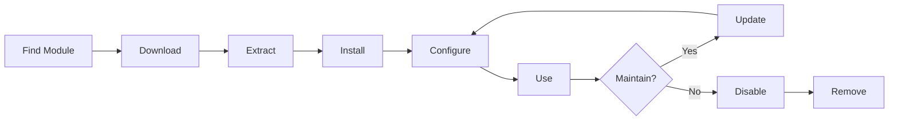

# התקנה וניהול של מודולי XOOPS

למד כיצד להרחיב את הפונקציונליות של XOOPS על ידי התקנה והגדרת מודולים.

## הבנת מודולי XOOPS

### מה הם מודולים?

מודולים הם הרחבות המוסיפות פונקציונליות ל-XOOPS:

| הקלד | מטרה | דוגמאות |
|---|---|---|
| **תוכן** | נהל סוגי תוכן ספציפיים | חדשות, בלוג, כרטיסים |
| **קהילה** | אינטראקציה עם משתמש | פורום, תגובות, ביקורות |
| **מסחר אלקטרוני** | מכירת מוצרים | חנות, עגלה, תשלומים |
| **מדיה** | ידית files/images | גלריה, הורדות, סרטונים |
| **כלי שירות** | כלים ועוזרים | דואר אלקטרוני, גיבוי, אנליטיקה |

### מודולים ליבה לעומת אופציונליים

| מודול | הקלד | כלול | ניתן להסרה |
|---|---|---|---|
| **מערכת** | ליבה | כן | לא |
| **משתמש** | ליבה | כן | לא |
| **פרופיל** | מומלץ | כן | כן |
| **PM (הודעה פרטית)** | מומלץ | כן | כן |
| **ערוץ WF** | אופציונלי | לעתים קרובות | כן |
| **חדשות** | אופציונלי | לא | כן |
| **פורום** | אופציונלי | לא | כן |

## מחזור חיים של מודול



## מציאת מודולים

### מאגר מודול XOOPS

מאגר המודולים הרשמי XOOPS:

**ביקור:** https://xoops.org/modules/repository/

```
Directory > Modules > [Browse Categories]
```

דפדוף לפי קטגוריות:
- ניהול תוכן
- קהילה
- מסחר אלקטרוני
- מולטימדיה
- פיתוח
- ניהול האתר

### הערכת מודולים

לפני ההתקנה, בדוק:

| קריטריונים | מה לחפש |
|---|---|
| **תאימות** | עובד עם גרסת XOOPS שלך |
| **דירוג** | ביקורות ודירוגים טובים של משתמשים |
| **עדכונים** | שוחזק לאחרונה |
| **הורדות** | פופולרי ונפוץ |
| **דרישות** | תואם לשרת שלך |
| **רישיון** | GPL או קוד פתוח דומה |
| **תמיכה** | מפתח וקהילה פעילים |

### קרא מידע על מודול

כל רישום מודול מציג:

```
Module Name: [Name]
Version: [X.X.X]
Requires: XOOPS [Version]
Author: [Name]
Last Update: [Date]
Downloads: [Number]
Rating: [Stars]
Description: [Brief description]
Compatibility: PHP [Version], MySQL [Version]
```

## התקנת מודולים

### שיטה 1: התקנת לוח ניהול

**שלב 1: סעיף מודולי גישה**

1. היכנס לפאנל הניהול
2. נווט אל **מודולים > מודולים**
3. לחץ על **"התקן מודול חדש"** או **"עיון במודולים"**

**שלב 2: העלאת מודול**

אפשרות א' - העלאה ישירה:
1. לחץ על **"בחר קובץ"**
2. בחר קובץ .zip של מודול מהמחשב
3. לחץ על **"העלה"**

אפשרות ב' - URL העלאה:
1. הדבק מודול URL
2. לחץ על **"הורד והתקן"**

**שלב 3: בדוק את פרטי המודול**

```
Module Name: [Name shown]
Version: [Version]
Author: [Author info]
Description: [Full description]
Requirements: [PHP/MySQL versions]
```

בדוק ולחץ על **"המשך בהתקנה"**

**שלב 4: בחר סוג התקנה**

```
☐ Fresh Install (New installation)
☐ Update (Upgrade existing)
☐ Delete Then Install (Replace existing)
```

בחר באפשרות המתאימה.

**שלב 5: אשר התקנה**

בדוק את האישור הסופי:
```
Module will be installed to: /modules/modulename/
Database: xoops_db
Proceed? [Yes] [No]
```

לחץ על **"כן"** כדי לאשר.

**שלב 6: ההתקנה הושלמה**

```
Installation successful!

Module: [Module Name]
Version: [Version]
Tables created: [Number]
Files installed: [Number]

[Go to Module Settings]  [Return to Modules]
```

### שיטה 2: התקנה ידנית (מתקדם)

להתקנה ידנית או לפתרון בעיות:

**שלב 1: הורדת מודול**

1. הורד את מודול .zip מהמאגר
2. חלץ ל-`/var/www/html/xoops/modules/modulename/`

```bash
# Extract module
unzip module_name.zip
cp -r module_name /var/www/html/xoops/modules/

# Set permissions
chmod -R 755 /var/www/html/xoops/modules/module_name
```

**שלב 2: הפעל סקריפט התקנה**

```
Visit: http://your-domain.com/xoops/modules/module_name/admin/index.php?op=install
```

או דרך פאנל הניהול (מערכת > מודולים > עדכן DB).

**שלב 3: אימות ההתקנה**

1. עבור אל **מודולים > מודולים** ב-admin
2. חפש את המודול שלך ברשימה
3. ודא שהוא מופיע כ"פעיל"

## תצורת מודול

### הגדרות מודול גישה

1. עבור אל **מודולים > מודולים**
2. מצא את המודול שלך
3. לחץ על שם המודול
4. לחץ על **"העדפות"** או **"הגדרות"**

### הגדרות מודול נפוצות

רוב המודולים מציעים:

```
Module Status: [Enabled/Disabled]
Display in Menu: [Yes/No]
Module Weight: [1-999] (display order)
Visible To Groups: [Checkboxes for user groups]
```

### אפשרויות ספציפיות למודול

לכל מודול יש הגדרות ייחודיות. דוגמאות:

**מודול חדשות:**
```
Items Per Page: 10
Show Author: Yes
Allow Comments: Yes
Moderation Required: Yes
```

**מודול הפורום:**
```
Topics Per Page: 20
Posts Per Page: 15
Maximum Attachment Size: 5MB
Enable Signatures: Yes
```

**מודול גלריה:**
```
Images Per Page: 12
Thumbnail Size: 150x150
Maximum Upload: 10MB
Watermark: Yes/No
```

עיין בתיעוד המודול שלך עבור אפשרויות ספציפיות.

### שמור תצורה

לאחר התאמת הגדרות:

1. לחץ על **"שלח"** או **"שמור"**
2. תראה אישור:
   ```
   Settings saved successfully!
   ```

## ניהול בלוקים של מודול

מודולים רבים יוצרים "בלוקים" - אזורי תוכן דמויי ווידג'טים.

### הצג בלוקים של מודול

1. עבור אל **מראה > בלוקים**
2. חפש בלוקים מהמודול שלך
3. רוב המודולים מציגים "[שם המודול] - [תיאור החסימה]"

### הגדר בלוקים

1. לחץ על שם הבלוק
2. התאם:
   - כותרת בלוק
   - נראות (כל הדפים או ספציפיים)
   - מיקום בדף (שמאל, מרכז, ימין)
   - קבוצות משתמשים שיכולות לראות
3. לחץ על **"שלח"**

### הצגת בלוק בדף הבית

1. עבור אל **מראה > בלוקים**
2. מצא את הבלוק שאתה רוצה
3. לחץ על **"ערוך"**
4. הגדר:
   - **גלוי ל:** קבוצות נבחרות
   - **מיקום:** בחר עמודה (left/center/right)
   - **דפים:** דף הבית או כל הדפים
5. לחץ על **"שלח"**

## התקנת דוגמאות מודול ספציפי

### התקנת מודול חדשות

**מושלם עבור:** פוסטים בבלוג, הכרזות

1. הורד את מודול החדשות מהמאגר
2. העלה דרך **מודולים > מודולים > התקנה**
3. הגדר ב-**מודולים > חדשות > העדפות**:
   - סיפורים לעמוד: 10
   - אפשר הערות: כן
   - אישור לפני פרסום: כן
4. צור בלוקים לחדשות האחרונות
5. התחילו לפרסם סיפורים!

### התקנת מודול הפורום

**מושלם עבור:** דיון בקהילה

1. הורד את מודול הפורום
2. התקן דרך פאנל ניהול
3. צור קטגוריות פורומים במודול
4. הגדר הגדרות:
   - Topics/page: 20
   - Posts/page: 15
   - אפשר ניהול: כן
5. הקצה הרשאות לקבוצות משתמשים
6. צור בלוקים לנושאים האחרונים

### התקנת מודול גלריה

**מושלם עבור:** חלון ראווה של תמונות

1. הורד את מודול הגלריה
2. התקן והגדר
3. צור אלבומי תמונות
4. העלה תמונות
5. הגדר הרשאות עבור viewing/uploading
6. הצג גלריה באתר

## עדכון מודולים

### חפש עדכונים

```
Admin Panel > Modules > Modules > Check for Updates
```

זה מראה:
- עדכוני מודול זמינים
- גרסה נוכחית לעומת חדשה
- הערות Changelog/release

### עדכן מודול

1. עבור אל **מודולים > מודולים**
2. לחץ על מודול עם עדכון זמין
3. לחץ על הלחצן **"עדכן"**
4. בחר **"עדכון" מתוך סוג ההתקנה**
5. עקוב אחר אשף ההתקנה
6. מודול מעודכן!

### הערות עדכון חשובות

לפני עדכון:

- [ ] מסד נתונים גיבוי
- [ ] קובצי מודול גיבוי
- [ ] עיין ביומן השינויים
- [ ] בדוק תחילה בשרת סטייינג
- [ ] שימו לב לשינויים מותאמים אישית

לאחר עדכון:
- [ ] בדוק את הפונקציונליות
- [ ] בדוק את הגדרות המודול
- [ ] סקירה עבור warnings/errors
- [ ] נקה cache

## הרשאות מודול

### הקצה גישה לקבוצת משתמשים

שליטה באילו קבוצות משתמשים יכולות לגשת למודולים:

**מיקום:** מערכת > הרשאות

עבור כל מודול, הגדר:

```
Module: [Module Name]

Admin Access: [Select groups]
User Access: [Select groups]
Read Permission: [Groups allowed to view]
Write Permission: [Groups allowed to post]
Delete Permission: [Administrators only]
```

### רמות הרשאה נפוצות

```
Public Content (News, Pages):
├── Admin Access: Webmaster
├── User Access: All logged-in users
└── Read Permission: Everyone

Community Features (Forum, Comments):
├── Admin Access: Webmaster, Moderators
├── User Access: All logged-in users
└── Write Permission: All logged-in users

Admin Tools:
├── Admin Access: Webmaster only
└── User Access: Disabled
```

## השבתה והסרה של מודולים

### השבת מודול (שמור קבצים)

שמור את המודול אך הסתר מהאתר:

1. עבור אל **מודולים > מודולים**
2. מצא מודול
3. לחץ על שם המודול
4. לחץ על **"השבת"** או הגדר את המצב לבלתי פעיל
5. מודול מוסתר אך הנתונים נשמרו

הפעל מחדש בכל עת:
1. לחץ על מודול
2. לחץ על **"הפעל"**

### הסר את המודול לחלוטין

מחק את המודול והנתונים שלו:

1. עבור אל **מודולים > מודולים**
2. מצא מודול
3. לחץ על **"הסר התקנה"** או **"מחק"**
4. אשר: "מחק את המודול ואת כל הנתונים?"
5. לחץ על **"כן"** כדי לאשר

**אזהרה:** הסרת ההתקנה מוחקת את כל נתוני המודול!

### התקן מחדש לאחר הסרת ההתקנה

אם תסיר התקנה של מודול:
- קבצי מודול נמחקו
- טבלאות מסד הנתונים נמחקו
- כל הנתונים אבדו
- יש להתקין מחדש כדי להשתמש שוב
- יכול לשחזר מגיבוי

## פתרון בעיות בהתקנת מודול

### המודול לא מופיע לאחר ההתקנה

**סימפטום:** המודול רשום אך אינו גלוי באתר

**פתרון:**
```
1. Check module is "Active" (Modules > Modules)
2. Enable module blocks (Appearance > Blocks)
3. Verify user permissions (System > Permissions)
4. Clear cache (System > Tools > Clear Cache)
5. Check .htaccess doesn't block module
```

### שגיאת התקנה: "טבלה כבר קיימת"

**סימפטום:** שגיאה במהלך התקנת המודול

**פתרון:**
```
1. Module partially installed before
2. Try "Delete then Install" option
3. Or uninstall first, then install fresh
4. Check database for existing tables:
   mysql> SHOW TABLES LIKE 'xoops_module%';
```

### תלות חסרות במודול

**סימפטום:** המודול לא יותקן - דורש מודול אחר

**פתרון:**
```
1. Note required modules from error message
2. Install required modules first
3. Then install the module
4. Install in correct order
```

### דף ריק בעת גישה למודול

**סימפטום:** המודול נטען אך אינו מציג דבר

**פתרון:**
```
1. Enable debug mode in mainfile.php:
   define('XOOPS_DEBUG', 1);

2. Check PHP error log:
   tail -f /var/log/php_errors.log

3. Verify file permissions:
   chmod -R 755 /var/www/html/xoops/modules/modulename

4. Check database connection in module config

5. Disable module and reinstall
```

### אתר שובר מודול

**סימפטום:** התקנת מודול שוברת את האתר

**פתרון:**
```
1. Disable the problematic module immediately:
   Admin > Modules > [Module] > Disable

2. Clear cache:
   rm -rf /var/www/html/xoops/cache/*
   rm -rf /var/www/html/xoops/templates_c/*

3. Restore from backup if needed

4. Check error logs for root cause

5. Contact module developer
```

## שיקולי אבטחה של מודול

### התקן רק ממקורות מהימנים

```
✓ Official XOOPS Repository
✓ GitHub official XOOPS modules
✓ Trusted module developers
✗ Unknown websites
✗ Unverified sources
```

### בדוק את הרשאות המודול

לאחר ההתקנה:

1. בדוק את קוד המודול לאיתור פעילות חשודה
2. בדוק אם יש חריגות בטבלאות מסד הנתונים
3. עקוב אחר שינויים בקבצים
4. שמור על מודולים מעודכנים
5. הסר מודולים שאינם בשימוש

### שיטות מומלצות להרשאות

```
Module directory: 755 (readable, not writable by web server)
Module files: 644 (readable only)
Module data: Protected by database
```

## משאבים לפיתוח מודול

### למד פיתוח מודול

- תיעוד רשמי: https://xoops.org/
- מאגר GitHub: https://github.com/XOOPS/
- פורום קהילה: https://xoops.org/modules/newbb/
- מדריך למפתחים: זמין בתיקיית docs

## שיטות עבודה מומלצות למודולים

1. **התקן אחד בכל פעם:** עקוב אחר התנגשויות
2. **בדיקה לאחר התקנה:** בדוק את הפונקציונליות
3. **תצורה מותאמת אישית של מסמך:** שימו לב להגדרות שלכם
4. **שמור על עדכון:** התקן עדכוני מודול באופן מיידי
5. **הסר לא בשימוש:** אין צורך למחוק מודולים
6. **גיבוי לפני:** גיבוי תמיד לפני ההתקנה
7. **קרא תיעוד:** בדוק את הוראות המודול
8. **הצטרף לקהילה:** בקש עזרה במידת הצורך

## רשימת בדיקה להתקנת מודול

עבור כל התקנת מודול:

- [ ] מחקר וקרא ביקורות
- [ ] ודא תאימות גרסת XOOPS
- [ ] מסד נתונים וקבצים גיבוי
- [ ] הורד את הגרסה האחרונה
- [ ] התקן דרך פאנל ניהול
- [ ] הגדר הגדרות
- [ ] בלוקים Create/position
- [ ] הגדר הרשאות משתמש
- [ ] בדיקת פונקציונליות
- [ ] תצורת מסמך
- [ ] לוח זמנים לעדכונים

## השלבים הבאים

לאחר התקנת מודולים:

1. צור תוכן עבור מודולים
2. הגדר קבוצות משתמשים
3. חקור את תכונות הניהול
4. ייעול ביצועים
5. התקן מודולים נוספים לפי הצורך

---

**תגים:** #מודולים #התקנה #הרחבה #ניהול

**מאמרים קשורים:**
- ניהול-פאנל-סקירה
- ניהול-משתמשים
- יצירת-הדף-הראשון שלך
- ../Configuration/System-Settings
