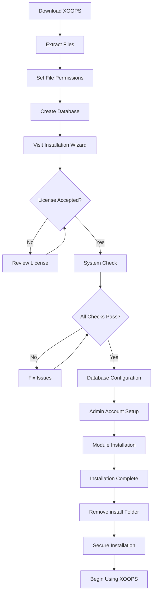

# מלא מדריך ההתקנה של XOOPS

מדריך זה מספק הדרכה מקיפה להתקנת XOOPS מאפס באמצעות אשף ההתקנה.

## דרישות מוקדמות

לפני תחילת ההתקנה, ודא שיש לך:

- גישה לשרת האינטרנט שלך דרך FTP או SSH
- גישת מנהל לשרת מסד הנתונים שלך
- שם מתחם רשום
- דרישות שרת מאומתות
- כלי גיבוי זמינים

## תהליך התקנה



## התקנה שלב אחר שלב

### שלב 1: הורד את XOOPS

הורד את הגרסה העדכנית ביותר מ-[https://xoops.org/](https://xoops.org/):

```bash
# Using wget
wget https://xoops.org/download/xoops-2.5.8.zip

# Using curl
curl -O https://xoops.org/download/xoops-2.5.8.zip
```

### שלב 2: חלץ קבצים

חלץ את ארכיון XOOPS לשורש האינטרנט שלך:

```bash
# Navigate to web root
cd /var/www/html

# Extract XOOPS
unzip xoops-2.5.8.zip

# Rename folder (optional, but recommended)
mv xoops-2.5.8 xoops
cd xoops
```

### שלב 3: הגדר הרשאות קובץ

הגדר הרשאות מתאימות עבור ספריות XOOPS:

```bash
# Make directories writable (755 for dirs, 644 for files)
find . -type d -exec chmod 755 {} \;
find . -type f -exec chmod 644 {} \;

# Make specific directories writable by web server
chmod 777 uploads/
chmod 777 templates_c/
chmod 777 var/
chmod 777 cache/

# Secure mainfile.php after installation
chmod 644 mainfile.php
```

### שלב 4: צור מסד נתונים

צור מסד נתונים חדש עבור XOOPS באמצעות MySQL:

```sql
-- Create database
CREATE DATABASE xoops_db CHARACTER SET utf8mb4 COLLATE utf8mb4_unicode_ci;

-- Create user
CREATE USER 'xoops_user'@'localhost' IDENTIFIED BY 'secure_password_here';

-- Grant privileges
GRANT ALL PRIVILEGES ON xoops_db.* TO 'xoops_user'@'localhost';
FLUSH PRIVILEGES;
```

או באמצעות phpMyAdmin:

1. היכנס ל-phpMyAdmin
2. לחץ על הכרטיסייה "מאגרי מידע".
3. הזן את שם מסד הנתונים: `xoops_db`
4. בחר איסוף "utf8mb4_unicode_ci".
5. לחץ על "צור"
6. צור משתמש באותו שם כמו מסד הנתונים
7. הענק את כל ההרשאות

### שלב 5: הפעל את אשף ההתקנה

פתח את הדפדפן שלך ונווט אל:

```
http://your-domain.com/xoops/install/
```

#### שלב בדיקת המערכת

האשף בודק את תצורת השרת שלך:

- PHP גרסה >= 5.6.0
- MySQL/MariaDB זמין
- הרחבות PHP נדרשות (GD, PDO וכו')
- הרשאות ספרייה
- קישוריות למסד נתונים

**אם ההמחאות נכשלות:**

עיין בסעיף #Common-Installation-Ssues לקבלת פתרונות.

#### תצורת מסד נתונים

הזן את אישורי מסד הנתונים שלך:

```
Database Host: localhost
Database Name: xoops_db
Database User: xoops_user
Database Password: [your_secure_password]
Table Prefix: xoops_
```

**הערות חשובות:**
- אם מארח מסד הנתונים שלך שונה מהמארח המקומי (למשל, שרת מרוחק), הזן את שם המארח הנכון
- קידומת הטבלה עוזרת אם מריצים מופעי XOOPS מרובים במסד נתונים אחד
- השתמש בסיסמה חזקה עם רישיות, מספרים וסמלים מעורבים

#### הגדרת חשבון מנהל

צור את חשבון המנהל שלך:

```
Admin Username: admin (or choose custom)
Admin Email: admin@your-domain.com
Admin Password: [strong_unique_password]
Confirm Password: [repeat_password]
```

**שיטות עבודה מומלצות:**
- השתמש בשם משתמש ייחודי, לא "אדמין"
- השתמש בסיסמה עם 16+ תווים
- אחסן אישורים במנהל סיסמאות מאובטח
- לעולם אל תשתף אישורי מנהל

#### התקנת מודול

בחר מודולי ברירת מחדל להתקנה:

- **מודול מערכת** (נדרש) - פונקציונליות ליבה XOOPS
- **מודול משתמש** (חובה) - ניהול משתמשים
- **מודול פרופיל** (מומלץ) - פרופילי משתמש
- **מודול PM (הודעה פרטית)** (מומלץ) - העברת הודעות פנימיות
- **WF-Channel Module** (אופציונלי) - ניהול תוכן

בחר את כל המודולים המומלצים להתקנה מלאה.

### שלב 6: השלם את ההתקנה

לאחר כל השלבים, תראה מסך אישור:

```
Installation Complete!

Your XOOPS installation is ready to use.
Admin Panel: http://your-domain.com/xoops/admin/
User Panel: http://your-domain.com/xoops/
```

### שלב 7: אבטח את ההתקנה שלך

#### הסר את תיקיית ההתקנה

```bash
# Remove the install directory (CRITICAL for security)
rm -rf /var/www/html/xoops/install/

# Or rename it
mv /var/www/html/xoops/install/ /var/www/html/xoops/install.bak
```

**WARNING:** לעולם אל תשאיר את תיקיית ההתקנה נגישה בהפקה!

#### מאובטח mainfile.php

```bash
# Make mainfile.php read-only
chmod 644 /var/www/html/xoops/mainfile.php

# Set ownership
chown www-data:www-data /var/www/html/xoops/mainfile.php
```

#### הגדר הרשאות קובץ מתאימות

```bash
# Recommended production permissions
find . -type f -name "*.php" -exec chmod 644 {} \;
find . -type d -exec chmod 755 {} \;

# Writable directories for web server
chmod 777 uploads/ var/ cache/ templates_c/
```

#### הפעל את HTTPS/SSL

הגדר את SSL בשרת האינטרנט שלך (nginx או Apache).

**עבור Apache:**
```apache
<VirtualHost *:443>
    ServerName your-domain.com
    DocumentRoot /var/www/html/xoops

    SSLEngine on
    SSLCertificateFile /etc/ssl/certs/your-cert.crt
    SSLCertificateKeyFile /etc/ssl/private/your-key.key

    # Force HTTPS redirect
    <IfModule mod_rewrite.c>
        RewriteEngine On
        RewriteCond %{HTTPS} off
        RewriteRule ^(.*)$ https://%{HTTP_HOST}%{REQUEST_URI} [L,R=301]
    </IfModule>
</VirtualHost>
```

## תצורה לאחר ההתקנה

### 1. גש ללוח הניהול

נווט אל:
```
http://your-domain.com/xoops/admin/
```

התחבר עם אישורי המנהל שלך.

### 2. הגדר הגדרות בסיסיות

הגדר את התצורה הבאה:

- שם האתר ותיאורו
- כתובת אימייל של מנהל מערכת
- אזור זמן ופורמט תאריך
- אופטימיזציה למנועי חיפוש

### 3. בדוק את ההתקנה

- [ ] בקר בדף הבית
- [ ] בדוק את טעינת המודולים
- [ ] ודא שהרישום משתמש עובד
- [ ] בדוק את פונקציות פאנל הניהול
- [ ] אשר SSL/HTTPS עובד

### 4. תזמן גיבויים

הגדר גיבויים אוטומטיים:

```bash
# Create backup script (backup.sh)
#!/bin/bash
DATE=$(date +%Y%m%d_%H%M%S)
BACKUP_DIR="/backups/xoops"
XOOPS_DIR="/var/www/html/xoops"

# Backup database
mysqldump -u xoops_user -p[password] xoops_db > $BACKUP_DIR/db_$DATE.sql

# Backup files
tar -czf $BACKUP_DIR/files_$DATE.tar.gz $XOOPS_DIR

echo "Backup completed: $DATE"
```

לוח זמנים עם cron:
```bash
# Daily backup at 2 AM
0 2 * * * /usr/local/bin/backup.sh
```

## בעיות התקנה נפוצות

### בעיה: שגיאות דחיית הרשאה

**סימפטום:** "הרשאה נדחתה" בעת העלאה או יצירה של קבצים

**פתרון:**
```bash
# Check web server user
ps aux | grep apache  # For Apache
ps aux | grep nginx   # For Nginx

# Fix permissions (replace www-data with your web server user)
chown -R www-data:www-data /var/www/html/xoops
chmod -R 755 /var/www/html/xoops
chmod 777 uploads/ var/ cache/ templates_c/
```

### בעיה: חיבור מסד הנתונים נכשל

**סימפטום:** "לא ניתן להתחבר לשרת מסד הנתונים"

**פתרון:**
1. אמת את אישורי מסד הנתונים באשף ההתקנה
2. בדוק ש-MySQL/MariaDB פועל:
   ```bash
   service mysql status  # or mariadb
   ```
3. ודא שבסיס הנתונים קיים:
   ```sql
   SHOW DATABASES;
   ```
4. בדוק את החיבור משורת הפקודה:
   ```bash
   mysql -h localhost -u xoops_user -p xoops_db
   ```

### בעיה: מסך לבן ריק

**סימפטום:** ביקור ב-XOOPS מציג דף ריק

**פתרון:**
1. בדוק את יומני השגיאה של PHP:
   ```bash
   tail -f /var/log/apache2/error.log
   ```
2. הפעל מצב ניפוי באגים ב-mainfile.php:
   ```php
   define('XOOPS_DEBUG', 1);
   ```
3. בדוק את הרשאות הקובץ בקבצי mainfile.php ו-config
4. ודא שההרחבה PHP-MySQL מותקנת

### בעיה: לא ניתן לכתוב למדריך ההעלאות

**סימפטום:** תכונת ההעלאה נכשלת, "לא ניתן לכתוב להעלאות/"

**פתרון:**
```bash
# Check current permissions
ls -la uploads/

# Fix permissions
chmod 777 uploads/
chown www-data:www-data uploads/

# For specific files
chmod 644 uploads/*
```

### בעיה: חסרים הרחבות PHP

**סימפטום:** בדיקת המערכת נכשלת עם הרחבות חסרות (GD, MySQL וכו')

**פתרון (Ubuntu/Debian):**
```bash
# Install PHP GD library
apt-get install php-gd

# Install PHP MySQL support
apt-get install php-mysql

# Restart web server
systemctl restart apache2  # or nginx
```

**פתרון (CentOS/RHEL):**
```bash
# Install PHP GD library
yum install php-gd

# Install PHP MySQL support
yum install php-mysql

# Restart web server
systemctl restart httpd
```

### בעיה: תהליך התקנה איטי

**סימפטום:** פסק זמן של אשף ההתקנה או פועל לאט מאוד

**פתרון:**
1. הגדל את פסק הזמן של PHP ב-php.ini:
   ```ini
   max_execution_time = 300  # 5 minutes
   ```
2. הגדל את MySQL max_allowed_packet:
   ```sql
   SET GLOBAL max_allowed_packet = 256M;
   ```
3. בדוק את משאבי השרת:
   ```bash
   free -h  # Check RAM
   df -h    # Check disk space
   ```

### בעיה: פאנל ניהול לא נגיש

**סימפטום:** לא ניתן לגשת ללוח הניהול לאחר ההתקנה

**פתרון:**
1. ודא שמשתמש מנהל קיים במסד הנתונים:
   ```sql
   SELECT * FROM xoops_users WHERE uid = 1;
   ```
2. נקה את הcache והעוגיות של הדפדפן
3. בדוק אם תיקיית הפעלות ניתנת לכתיבה:
   ```bash
   chmod 777 var/
   ```
4. ודא שכללי htaccess אינם חוסמים גישת מנהל

## רשימת רשימת אימות

לאחר ההתקנה, ודא:

- [x] דף הבית XOOPS נטען כהלכה
- [x] פאנל ניהול נגיש ב-/xoops/admin/
- [x] SSL/HTTPS פועל
- [x] תיקיית ההתקנה הוסרה או לא נגישה
- [x] הרשאות הקובץ מאובטחות (644 לקבצים, 755 לקבצים)
- [x] גיבויים של מסדי נתונים מתוכננים
- [x] מודולים נטענים ללא שגיאות
- [x] מערכת רישום משתמש עובדת
- [x] פונקציונליות העלאת קבצים עובדת
- [x] הודעות דוא"ל נשלחות כהלכה

## השלבים הבאים

לאחר השלמת ההתקנה:

1. קרא את מדריך תצורה בסיסי
2. אבטח את ההתקנה שלך
3. חקור את פאנל הניהול
4. התקן מודולים נוספים
5. הגדר קבוצות משתמשים והרשאות

---

**תגים:** #התקנה #התקנה #תחילת העבודה #פתרון בעיות

**מאמרים קשורים:**
- דרישות שרת
- שדרוג-XOOPS
- ../Configuration/Security-Configuration
