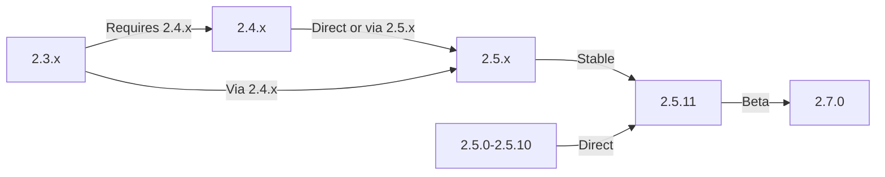

מדריך זה עוסק בשדרוג XOOPS מגרסאות ישנות יותר למהדורה האחרונה תוך שמירה על הנתונים וההתאמות האישיות שלך.

> **מידע על גרסה**
> - **יציב:** XOOPS 2.5.11
> - **ביטא:** XOOPS 2.7.0 (בדיקה)
> - **עתיד:** XOOPS 4.0 (בפיתוח - ראה מפת דרכים)

## רשימת רשימת טרום-שדרוג

לפני תחילת השדרוג, ודא:

- [ ] גרסה נוכחית של XOOPS מתועדת
- [ ] זוהתה גרסה של יעד XOOPS
- [ ] גיבוי מערכת מלא הושלם
- [ ] גיבוי מסד הנתונים אומת
- [ ] רשימת המודולים המותקנים נרשמה
- [ ] שינויים מותאמים אישית מתועדים
- [ ] סביבת בדיקה זמינה
- [ ] נתיב השדרוג נבדק (גרסאות מסוימות מדלגות על מהדורות ביניים)
- [ ] משאבי שרת אומתו (מספיק שטח דיסק, זיכרון)
- [ ] מצב תחזוקה מופעל

## מדריך נתיב שדרוג

נתיבי שדרוג שונים בהתאם לגרסה הנוכחית:

**חשוב:** לעולם אל תדלג על גרסאות מרכזיות. אם משדרגים מ-2.3.x, שדרג תחילה ל-2.4.x, ולאחר מכן ל-2.5.x.

## שלב 1: השלם את גיבוי המערכת

### גיבוי מסד נתונים

השתמש ב-mysqldump כדי לגבות את מסד הנתונים:
```bash
# Full database backup
mysqldump -u xoops_user -p xoops_db > /backups/xoops_db_backup_$(date +%Y%m%d_%H%M%S).sql

# Compressed backup
mysqldump -u xoops_user -p xoops_db | gzip > /backups/xoops_db_backup_$(date +%Y%m%d_%H%M%S).sql.gz
```
או באמצעות phpMyAdmin:

1. בחר את מסד הנתונים XOOPS שלך
2. לחץ על הכרטיסייה "ייצוא".
3. בחר בפורמט "SQL".
4. בחר "שמור כקובץ"
5. לחץ על "עבור"

אמת את קובץ הגיבוי:
```bash
# Check backup size
ls -lh /backups/xoops_db_backup*.sql

# Verify backup integrity (uncompressed)
head -20 /backups/xoops_db_backup_*.sql

# Verify compressed backup
zcat /backups/xoops_db_backup_*.sql.gz | head -20
```
### גיבוי של מערכת הקבצים

גבה את כל הקבצים XOOPS:
```bash
# Compressed file backup
tar -czf /backups/xoops_files_$(date +%Y%m%d_%H%M%S).tar.gz /var/www/html/xoops

# Uncompressed (faster, requires more disk space)
tar -cf /backups/xoops_files_$(date +%Y%m%d_%H%M%S).tar /var/www/html/xoops

# Show backup progress
tar -czf /backups/xoops_files_$(date +%Y%m%d_%H%M%S).tar.gz --verbose /var/www/html/xoops | tail
```
אחסן גיבויים בצורה מאובטחת:
```bash
# Secure backup storage
chmod 600 /backups/xoops_*
ls -lah /backups/

# Optional: Copy to remote storage
scp /backups/xoops_* user@backup-server:/secure/backups/
```
### בדוק שחזור גיבוי

**CRITICAL:** בדוק תמיד את עבודת הגיבוי שלך:
```bash
# Verify tar archive contents
tar -tzf /backups/xoops_files_*.tar.gz | head -20

# Extract to test location
mkdir /tmp/restore_test
cd /tmp/restore_test
tar -xzf /backups/xoops_files_*.tar.gz

# Verify key files exist
ls -la xoops/mainfile.php
ls -la xoops/install/
```
## שלב 2: הפעל מצב תחזוקה

מנע ממשתמשים לגשת לאתר במהלך השדרוג:

### אפשרות 1: XOOPS פאנל ניהול

1. היכנס לפאנל הניהול
2. עבור אל מערכת > תחזוקה
3. הפעל את "מצב תחזוקת אתר"
4. הגדר הודעת תחזוקה
5. שמור

### אפשרות 2: מצב תחזוקה ידנית

צור קובץ תחזוקה בשורש האינטרנט:
```html
<!-- /var/www/html/maintenance.html -->
<!DOCTYPE html>
<html>
<head>
    <title>Under Maintenance</title>
    <style>
        body { font-family: Arial; text-align: center; padding: 50px; }
        h1 { color: #333; }
        p { color: #666; margin: 20px 0; }
    </style>
</head>
<body>
    <h1>Site Under Maintenance</h1>
    <p>We're currently upgrading our site.</p>
    <p>Expected time: approximately 30 minutes.</p>
    <p>Thank you for your patience!</p>
</body>
</html>
```
הגדר את Apache כדי להציג דף תחזוקה:
```apache
# In .htaccess or vhost config
ErrorDocument 503 /maintenance.html

# Redirect all traffic to maintenance page
<IfModule mod_rewrite.c>
    RewriteEngine On
    RewriteCond %{REMOTE_ADDR} !^192\.168\.1\.100$  # Your IP
    RewriteRule ^(.*)$ - [R=503,L]
</IfModule>
```
## שלב 3: הורד גרסה חדשה

הורד XOOPS מהאתר הרשמי:
```bash
# Download latest version
cd /tmp
wget https://xoops.org/download/xoops-2.5.8.zip

# Verify checksum (if provided)
sha256sum xoops-2.5.8.zip
# Compare with official SHA256 hash

# Extract to temporary location
unzip xoops-2.5.8.zip
cd xoops-2.5.8
```
## שלב 4: הכנת קובץ מראש לשדרוג

### זהה שינויים מותאמים אישית

בדוק אם קיימים קבצי ליבה מותאמים אישית:
```bash
# Look for modified files (files with newer mtime)
find /var/www/html/xoops -type f -newer /var/www/html/xoops/install.php

# Check for custom themes
ls /var/www/html/xoops/themes/
# Note any custom themes

# Check for custom modules
ls /var/www/html/xoops/modules/
# Note any custom modules created by you
```
### מסמך מצב נוכחי

צור דוח שדרוג:
```bash
cat > /tmp/upgrade_report.txt << EOF
=== XOOPS Upgrade Report ===
Date: $(date)
Current Version: 2.5.6
Target Version: 2.5.8

=== Installed Modules ===
$(ls /var/www/html/xoops/modules/)

=== Custom Modifications ===
[Document any custom theme or module modifications]

=== Themes ===
$(ls /var/www/html/xoops/themes/)

=== Plugin Status ===
[List any custom code modifications]

EOF
```
## שלב 5: מיזוג קבצים חדשים עם התקנה נוכחית

### אסטרטגיה: שימור קבצים מותאמים אישית

החלף XOOPS קבצי ליבה אך שמור:
- `mainfile.php` (תצורת מסד הנתונים שלך)
- ערכות נושא מותאמות אישית ב-`themes/`
- מודולים מותאמים אישית ב-`modules/`
- העלאות משתמשים ב-`uploads/`
- נתוני האתר ב-`var/`

### תהליך מיזוג ידני
```bash
# Set variables
XOOPS_OLD="/var/www/html/xoops"
XOOPS_NEW="/tmp/xoops-2.5.8"
BACKUP="/backups/pre-upgrade"

# Create pre-upgrade backup in place
mkdir -p $BACKUP
cp -r $XOOPS_OLD/* $BACKUP/

# Copy new files (but preserve sensitive files)
# Copy everything except protected directories
rsync -av --exclude='mainfile.php' \
    --exclude='modules/custom*' \
    --exclude='themes/custom*' \
    --exclude='uploads' \
    --exclude='var' \
    --exclude='cache' \
    --exclude='templates_c' \
    $XOOPS_NEW/ $XOOPS_OLD/

# Verify critical files preserved
ls -la $XOOPS_OLD/mainfile.php
```
### שימוש ב-upgrade.php (אם זמין)

כמה גרסאות XOOPS כוללות סקריפט שדרוג אוטומטי:
```bash
# Copy new files with installer
cp -r /tmp/xoops-2.5.8/* /var/www/html/xoops/

# Run upgrade wizard
# Visit: http://your-domain.com/xoops/upgrade/
```
### הרשאות קובץ לאחר מיזוג

שחזר הרשאות מתאימות:
```bash
# Set ownership
chown -R www-data:www-data /var/www/html/xoops

# Set directory permissions
find /var/www/html/xoops -type d -exec chmod 755 {} \;

# Set file permissions
find /var/www/html/xoops -type f -exec chmod 644 {} \;

# Make writable directories
chmod 777 /var/www/html/xoops/cache
chmod 777 /var/www/html/xoops/templates_c
chmod 777 /var/www/html/xoops/uploads
chmod 777 /var/www/html/xoops/var

# Secure mainfile.php
chmod 644 /var/www/html/xoops/mainfile.php
```
## שלב 6: העברת מסדי נתונים

### סקור שינויים במסד הנתונים

בדוק את הערות השחרור של XOOPS עבור שינויים במבנה מסד הנתונים:
```bash
# Extract and review SQL migration files
find /tmp/xoops-2.5.8 -name "*.sql" -type f
# Document all .sql files found
```
### הפעל עדכוני מסד נתונים

### אפשרות 1: עדכון אוטומטי (אם זמין)

השתמש בפאנל ניהול:

1. היכנס ל-admin
2. עבור אל **מערכת > מסד נתונים**
3. לחץ על "בדוק עדכונים"
4. סקור שינויים ממתינים
5. לחץ על "החל עדכונים"

### אפשרות 2: עדכונים ידניים של מסד נתונים

בצע העברה SQL קבצים:
```bash
# Connect to database
mysql -u xoops_user -p xoops_db

# View pending changes (varies by version)
SELECT * FROM xoops_config WHERE conf_name LIKE '%version%';

# Run migration scripts manually if needed
SOURCE /tmp/xoops-2.5.8/migrate_2.5.6_to_2.5.8.sql;
```
### אימות מסד נתונים

אמת את שלמות מסד הנתונים לאחר עדכון:
```sql
-- Check database consistency
REPAIR TABLE xoops_users;
OPTIMIZE TABLE xoops_users;

-- Verify key tables exist
SHOW TABLES LIKE 'xoops_%';

-- Check row counts (should increase or stay same)
SELECT COUNT(*) FROM xoops_users;
SELECT COUNT(*) FROM xoops_posts;
```
## שלב 7: אמת שדרוג

### בדיקת דף הבית

בקר בדף הבית של XOOPS שלך:
```
http://your-domain.com/xoops/
```
צפוי: הדף נטען ללא שגיאות, מוצג כהלכה

### בדיקת לוח הניהול

גישה למנהל:
```
http://your-domain.com/xoops/admin/
```
אמת:
- [ ] לוח הניהול נטען
- [ ] הניווט עובד
- [ ] לוח המחוונים מוצג כהלכה
- [ ] אין שגיאות מסד נתונים ביומנים

### אימות מודול

בדוק מודולים מותקנים:

1. עבור אל **מודולים > מודולים** ב-admin
2. ודא שכל המודולים עדיין מותקנים
3. בדוק אם יש הודעות שגיאה
4. הפעל את כל המודולים שהושבתו

### בדיקת קובץ יומן

בדוק את יומני המערכת לאיתור שגיאות:
```bash
# Check web server error log
tail -50 /var/log/apache2/error.log

# Check PHP error log
tail -50 /var/log/php_errors.log

# Check XOOPS system log (if available)
# In admin panel: System > Logs
```
### בדוק פונקציות ליבה

- [ ] משתמש login/logout עובד
- [ ] רישום המשתמש עובד
- [ ] פונקציות העלאת קבצים
- [ ] הודעות אימייל נשלחות
- [ ] פונקציונליות החיפוש עובדת
- [ ] פונקציות הניהול פועלות
- [ ] פונקציונליות המודול ללא פגע

## שלב 8: ניקוי לאחר השדרוג

### הסר קבצים זמניים
```bash
# Remove extraction directory
rm -rf /tmp/xoops-2.5.8

# Clear template cache (safe to delete)
rm -rf /var/www/html/xoops/templates_c/*

# Clear site cache
rm -rf /var/www/html/xoops/cache/*
```
### הסר את מצב התחזוקה

הפעל מחדש גישה רגילה לאתר:
```apache
# Remove maintenance mode redirect from .htaccess
# Or delete maintenance.html file
rm /var/www/html/maintenance.html
```
### עדכן את התיעוד

עדכן את הערות השדרוג שלך:
```bash
# Document successful upgrade
cat >> /tmp/upgrade_report.txt << EOF

=== Upgrade Results ===
Status: SUCCESS
Upgrade Date: $(date)
New Version: 2.5.8
Duration: [time in minutes]

Post-Upgrade Tests:
- [x] Homepage loads
- [x] Admin panel accessible
- [x] Modules functional
- [x] User registration works
- [x] Database optimized

EOF
```
## פתרון בעיות בשדרוגים

### בעיה: מסך לבן ריק לאחר השדרוג

**סימפטום:** דף הבית אינו מציג דבר

**פתרון:**
```bash
# Check PHP errors
tail -f /var/log/apache2/error.log

# Enable debug mode temporarily
echo "define('XOOPS_DEBUG', 1);" >> /var/www/html/xoops/mainfile.php

# Check file permissions
ls -la /var/www/html/xoops/mainfile.php

# Restore from backup if needed
cp /backups/xoops_files_*.tar.gz /tmp/
cd /tmp && tar -xzf xoops_files_*.tar.gz
```
### בעיה: שגיאת חיבור מסד נתונים

**סימפטום:** הודעת "לא ניתן להתחבר למסד הנתונים".

**פתרון:**
```bash
# Verify database credentials in mainfile.php
grep -i "database\|host\|user" /var/www/html/xoops/mainfile.php

# Test connection
mysql -h localhost -u xoops_user -p xoops_db -e "SELECT 1"

# Check MySQL status
systemctl status mysql

# Verify database still exists
mysql -u xoops_user -p -e "SHOW DATABASES" | grep xoops
```
### בעיה: פאנל ניהול לא נגיש

**סימפטום:** אין אפשרות לגשת /xoops/admin/

**פתרון:**
```bash
# Check .htaccess rules
cat /var/www/html/xoops/.htaccess

# Verify admin files exist
ls -la /var/www/html/xoops/admin/

# Check mod_rewrite enabled
apache2ctl -M | grep rewrite

# Restart web server
systemctl restart apache2
```
### בעיה: מודולים לא נטענים

**סימפטום:** מודולים מציגים שגיאות או מושבתים

**פתרון:**
```bash
# Verify module files exist
ls /var/www/html/xoops/modules/

# Check module permissions
ls -la /var/www/html/xoops/modules/*/

# Check module configuration in database
mysql -u xoops_user -p xoops_db -e "SELECT * FROM xoops_modules WHERE module_status = 0"

# Reactivate modules in admin panel
# System > Modules > Click module > Update Status
```
### בעיה: שגיאות דחיית הרשאה

**סימפטום:** "הרשאה נדחתה" בעת העלאה או שמירה

**פתרון:**
```bash
# Check file ownership
ls -la /var/www/html/xoops/ | head -20

# Fix ownership
chown -R www-data:www-data /var/www/html/xoops

# Fix directory permissions
find /var/www/html/xoops -type d -exec chmod 755 {} \;

# Make cache/uploads writable
chmod 777 /var/www/html/xoops/cache
chmod 777 /var/www/html/xoops/templates_c
chmod 777 /var/www/html/xoops/uploads
chmod 777 /var/www/html/xoops/var
```
### בעיה: טעינת עמוד איטית

**סימפטום:** דפים נטענים לאט מאוד לאחר השדרוג

**פתרון:**
```bash
# Clear all caches
rm -rf /var/www/html/xoops/cache/*
rm -rf /var/www/html/xoops/templates_c/*

# Optimize database
mysql -u xoops_user -p xoops_db << EOF
OPTIMIZE TABLE xoops_users;
OPTIMIZE TABLE xoops_posts;
OPTIMIZE TABLE xoops_config;
ANALYZE TABLE xoops_users;
EOF

# Check PHP error log for warnings
grep -i "deprecated\|warning" /var/log/php_errors.log | tail -20

# Increase PHP memory/execution time temporarily
# Edit php.ini:
memory_limit = 256M
max_execution_time = 300
```
## הליך החזרה לאחור

אם השדרוג נכשל באופן קריטי, שחזר מגיבוי:

### שחזר מסד נתונים
```bash
# Restore from backup
mysql -u xoops_user -p xoops_db < /backups/xoops_db_backup_YYYYMMDD_HHMMSS.sql

# Or from compressed backup
gunzip < /backups/xoops_db_backup_YYYYMMDD_HHMMSS.sql.gz | mysql -u xoops_user -p xoops_db

# Verify restoration
mysql -u xoops_user -p xoops_db -e "SELECT COUNT(*) FROM xoops_users"
```
### שחזר את מערכת הקבצים
```bash
# Stop web server
systemctl stop apache2

# Remove current installation
rm -rf /var/www/html/xoops/*

# Extract backup
cd /var/www/html
tar -xzf /backups/xoops_files_YYYYMMDD_HHMMSS.tar.gz

# Fix permissions
chown -R www-data:www-data xoops/
find xoops -type d -exec chmod 755 {} \;
find xoops -type f -exec chmod 644 {} \;
chmod 777 xoops/cache xoops/templates_c xoops/uploads xoops/var

# Start web server
systemctl start apache2

# Verify restoration
# Visit http://your-domain.com/xoops/
```
## רשימת אימות לאימות שדרוג

לאחר השלמת השדרוג, ודא:

- [ ] XOOPS הגרסה עודכנה (בדוק מנהל מערכת > פרטי מערכת)
- [ ] דף הבית נטען ללא שגיאות
- [ ] כל המודולים פונקציונליים
- [ ] התחברות משתמש עובדת
- [ ] פאנל ניהול נגיש
- [ ] העלאת קבצים עובדת
- [ ] הודעות דוא"ל פונקציונליות
- [ ] מאומתת שלמות מסד הנתונים
- [ ] הרשאות הקובץ נכונות
- [ ] מצב התחזוקה הוסר
- [ ] גיבויים מאובטחים ונבדקו
- [ ] ביצועים מקובלים
- [ ] SSL/HTTPS עובד
- [ ] אין הודעות שגיאה ביומנים

## השלבים הבאים

לאחר שדרוג מוצלח:

1. עדכן כל מודולים מותאמים אישית לגרסאות האחרונות
2. עיין בהערות הגרסה עבור תכונות שהוצאו משימוש
3. שקול לייעל את הביצועים
4. עדכן את הגדרות האבטחה
5. בדוק את כל הפונקציונליות ביסודיות
6. שמור על קבצי גיבוי מאובטחים

---

**תגים:** #שדרוג #תחזוקה #גיבוי #העברת מסד נתונים

**מאמרים קשורים:**
- ../../06-Publisher-Module/User-Guide/Installation
- דרישות שרת
- ../Configuration/Basic-Configuration
- ../Configuration/Security-Configuration