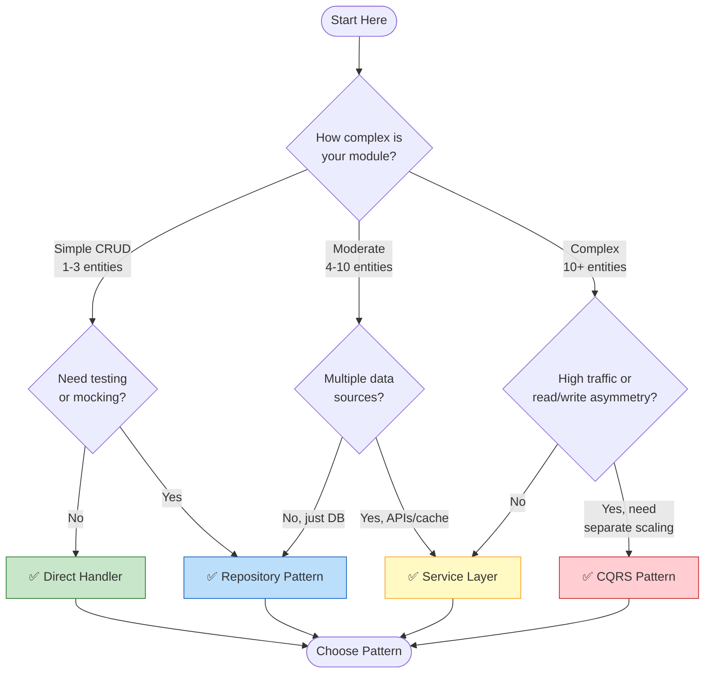
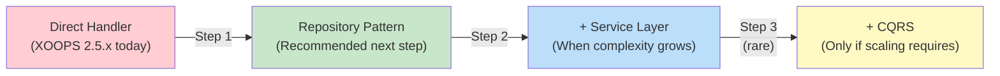

<span class="version-badge version-25x">2.5.x ✅</span> <span class="version-badge version-40x">4.0.x ✅</span>

> **באיזה דפוס עלי להשתמש?** עץ ההחלטות הזה עוזר לך לבחור בין מטפלים ישירים, תבנית מאגר, שכבת שירות ו-CQRS.

---

## עץ החלטות מהיר



---

## השוואת דפוסים

| קריטריונים | מטפל ישיר | מאגר | שכבת שירות | CQRS |
|--------|----------------|-------------------------|
| **מורכבות** | ⭐ | ⭐⭐ | ⭐⭐⭐ | ⭐⭐⭐⭐⭐ |
| **בדיקת כושר** | ❌ קשה | ✅ טוב | ✅ נהדר | ✅ נהדר |
| **גמישות** | ❌ נמוך | ✅ בינוני | ✅ גבוה | ✅ גבוה מאוד |
| **XOOPS 2.5.x** | ✅ יליד | ✅ עובד | ✅ עובד | ⚠️ מתחם |
| **XOOPS 4.0** | ⚠️ הוצא משימוש | ✅ מומלץ | ✅ מומלץ | ✅ לקנה מידה |
| **גודל קבוצה** | 1 dev | 1-3 פיתוחים | 2-5 פיתוחים | 5+ מפתחים |
| **תחזוקה** | ❌ גבוה יותר | ✅ בינוני | ✅ תחתון | ⚠️ דורש מומחיות |

---

## מתי להשתמש בכל דפוס

### ✅ מטפל ישיר (`XoopsPersistableObjectHandler`)

**הטוב ביותר עבור:** מודולים פשוטים, אבות טיפוס מהירים, לימוד XOOPS

```php
// Simple and direct - good for small modules
$handler = xoops_getModuleHandler('article', 'news');
$articles = $handler->getObjects(new Criteria('status', 1));
```

**בחר זאת כאשר:**
- בניית מודול פשוט עם 1-3 טבלאות מסד נתונים
- יצירת אב טיפוס מהיר
- אתה המפתח היחיד ולא צריך בדיקות
- המודול לא יגדל באופן משמעותי

**הגבלות:**
- קשה לבדיקה יחידה (תלות גלובלית)
- צימוד הדוק לשכבת מסד הנתונים XOOPS
- ההיגיון העסקי נוטה לדלוף לבקרים

---

### ✅ דפוס מאגר

**הטוב ביותר עבור:** רוב המודולים, צוותים שרוצים יכולת בדיקה

```php
// Abstraction allows mocking for tests
interface ArticleRepositoryInterface {
    public function findPublished(): array;
    public function save(Article $article): void;
}

class XoopsArticleRepository implements ArticleRepositoryInterface {
    private $handler;

    public function __construct() {
        $this->handler = xoops_getModuleHandler('article', 'news');
    }

    public function findPublished(): array {
        return $this->handler->getObjects(new Criteria('status', 1));
    }
}
```

**בחר זאת כאשר:**
- אתה רוצה לכתוב מבחני יחידה
- ייתכן שתשנה מקורות נתונים מאוחר יותר (DB → API)
- עבודה עם 2+ מפתחים
- בניית מודולים להפצה

**נתיב שדרוג:** זהו התבנית המומלצת להכנה XOOPS 4.0.

---

### ✅ שכבת שירות

**הטוב ביותר עבור:** מודולים עם היגיון עסקי מורכב

```php
// Service coordinates multiple repositories and contains business rules
class ArticlePublicationService {
    public function __construct(
        private ArticleRepositoryInterface $articles,
        private NotificationServiceInterface $notifications,
        private CacheInterface $cache
    ) {}

    public function publish(int $articleId): void {
        $article = $this->articles->find($articleId);
        $article->setStatus('published');
        $article->setPublishedAt(new DateTime());

        $this->articles->save($article);
        $this->notifications->notifySubscribers($article);
        $this->cache->invalidate("article:{$articleId}");
    }
}
```

**בחר זאת כאשר:**
- הפעולות משתרעות על מספר מקורות נתונים
- הכללים העסקיים מורכבים
- אתה צריך ניהול עסקאות
- חלקים מרובים של האפליקציה עושים את אותו הדבר

**נתיב שדרוג:** שלב עם Repository לארכיטקטורה חזקה.

---

### ⚠️ CQRS (הפרדת אחריות שאילתת פקודה)

**הטוב ביותר עבור:** מודולים בקנה מידה גבוה עם אסימטריה read/write

```php
// Commands modify state
class PublishArticleCommand {
    public function __construct(
        public readonly int $articleId,
        public readonly int $publisherId
    ) {}
}

// Queries read state (can use denormalized read models)
class GetPublishedArticlesQuery {
    public function __construct(
        public readonly int $limit = 10
    ) {}
}
```

**בחר זאת כאשר:**
- קורא הרבה יותר ממספר הכתובות (100:1 או יותר)
- אתה צריך קנה מידה שונה עבור קריאה לעומת כתיבה
- דרישות reporting/analytics מורכבות
- מיקור לאירועים יועיל לדומיין שלך

**אזהרה:** CQRS מוסיף מורכבות משמעותית. רוב המודולים של XOOPS לא צריכים את זה.

---

## נתיב שדרוג מומלץ



### שלב 1: עוטפים מטפלים במאגרים (2-4 שעות)

1. צור ממשק לצרכי הגישה שלך לנתונים
2. יישם אותו באמצעות המטפל הקיים
3. הזריק את המאגר במקום לקרוא ישירות ל-`xoops_getModuleHandler()`

### שלב 2: הוסף שכבת שירות בעת הצורך (1-2 ימים)

1. כאשר היגיון עסקי מופיע בבקרים, חלץ לשירות
2. השירות משתמש במאגרים, לא במטפלים ישירות
3. הבקרים הופכים להיות דקים (מסלול → שירות → תגובה)

### שלב 3: שקול את CQRS רק אם (נדיר)

1. יש לך מיליוני קריאות ביום
2. מודלים של קריאה וכתיבה שונים באופן משמעותי
3. אתה צריך מקורות לאירועים עבור שבילי ביקורת
4. יש לך צוות מנוסה עם CQRS

---

## כרטיס עזר מהיר

| שאלה | תשובה |
|--------|--------|
| **"אני רק צריך save/load נתונים"** | מטפל ישיר |
| **"אני רוצה לכתוב מבחנים"** | דפוס מאגר |
| **"יש לי חוקים עסקיים מורכבים"** | שכבת שירות |
| **"אני צריך לשנות את קנה המידה בנפרד"** | CQRS |
| **"אני מתכונן ל-XOOPS 4.0"** | מאגר + שכבת שירות |

---

## תיעוד קשור

- [מדריך לתבנית מאגר](Patterns/Repository-Pattern.md)
- [מדריך לתבנית שכבת שירות](Patterns/Service-Layer-Pattern.md)
- [מדריך לתבניות CQRS](../07-XOOPS-4.0/Implementation-Guides/CQRS-Pattern-Guide.md) *(מתקדם)*
- [חוזה מצב היברידי](../07-XOOPS-4.0/Specifications/Hybrid-Mode-Contract.md)

---

#דפוסים #גישה לנתונים #עץ החלטות #שיטות מומלצות #XOOPS
