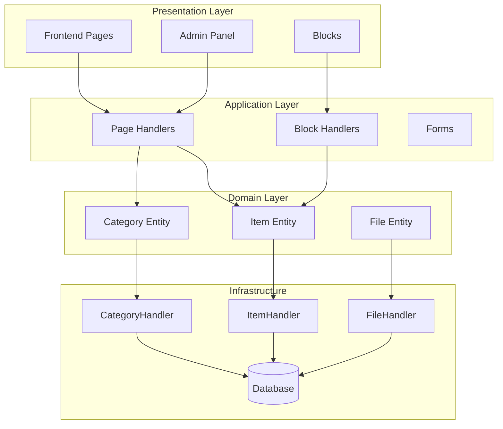
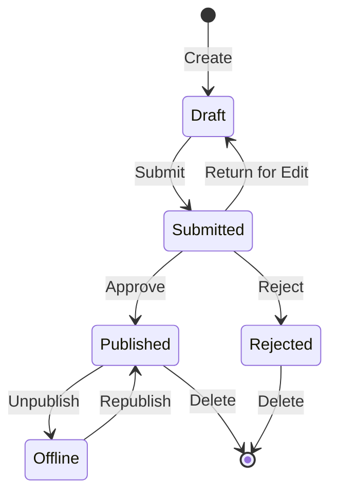

## סקירה כללית

מסמך זה מספק ניתוח טכני של ארכיטקטורת מודול Publisher, דפוסים ופרטי יישום. השתמש בזה כהתייחסות להבנה כיצד בנוי מודול XOOPS באיכות ייצור.

## סקירה כללית של אדריכלות

## מבנה ספריות
```
publisher/
├── admin/
│   ├── index.php           # Admin dashboard
│   ├── item.php            # Article management
│   ├── category.php        # Category management
│   ├── permission.php      # Permissions
│   ├── file.php            # File manager
│   └── menu.php            # Admin menu
├── assets/
│   ├── css/
│   ├── js/
│   └── images/
├── class/
│   ├── Category.php        # Category entity
│   ├── CategoryHandler.php # Category data access
│   ├── Item.php            # Article entity
│   ├── ItemHandler.php     # Article data access
│   ├── File.php            # File attachment
│   ├── FileHandler.php     # File data access
│   ├── Form/               # Form classes
│   ├── Common/             # Utilities
│   └── Helper.php          # Module helper
├── include/
│   ├── common.php          # Initialization
│   ├── functions.php       # Utility functions
│   ├── oninstall.php       # Install hooks
│   ├── onupdate.php        # Update hooks
│   └── search.php          # Search integration
├── language/
├── templates/
├── sql/
└── xoops_version.php
```
## ניתוח ישויות

### ישות פריט (מאמר).
```php
class Item extends \XoopsObject
{
    // Fields
    public function initVar(): void
    {
        $this->initVar('itemid', XOBJ_DTYPE_INT, null, false);
        $this->initVar('categoryid', XOBJ_DTYPE_INT, 0, false);
        $this->initVar('title', XOBJ_DTYPE_TXTBOX, '', true);
        $this->initVar('subtitle', XOBJ_DTYPE_TXTBOX, '');
        $this->initVar('summary', XOBJ_DTYPE_TXTAREA, '');
        $this->initVar('body', XOBJ_DTYPE_TXTAREA, '', true);
        $this->initVar('uid', XOBJ_DTYPE_INT, 0);
        $this->initVar('status', XOBJ_DTYPE_INT, 0);
        $this->initVar('datesub', XOBJ_DTYPE_INT, time());
        // ... more fields
    }

    // Business methods
    public function isPublished(): bool
    {
        return $this->getVar('status') == _PUBLISHER_STATUS_PUBLISHED;
    }

    public function canEdit(int $userId): bool
    {
        return $this->getVar('uid') == $userId
            || $this->isAdmin($userId);
    }
}
```
### דפוס מטפל
```php
class ItemHandler extends \XoopsPersistableObjectHandler
{
    public function __construct(\XoopsDatabase $db)
    {
        parent::__construct(
            $db,
            'publisher_items',
            Item::class,
            'itemid',
            'title'
        );
    }

    public function getPublishedItems(int $limit = 10): array
    {
        $criteria = new \CriteriaCompo();
        $criteria->add(new \Criteria('status', _PUBLISHER_STATUS_PUBLISHED));
        $criteria->setSort('datesub');
        $criteria->setOrder('DESC');
        $criteria->setLimit($limit);

        return $this->getObjects($criteria);
    }
}
```
## מערכת הרשאות

### סוגי הרשאות

| רשות | תיאור |
|------------|--------|
| `publisher_view` | צפה category/articles |
| `publisher_submit` | שלח מאמרים חדשים |
| `publisher_approve` | אישור אוטומטי של הגשות |
| `publisher_moderate` | סקור מאמרים ממתינים |
| `publisher_global` | הרשאות מודול גלובלי |

### בדיקת הרשאות
```php
class PermissionHandler
{
    public function isGranted(string $permission, int $categoryId): bool
    {
        $userId = $GLOBALS['xoopsUser']?->uid() ?? 0;
        $groups = $this->getUserGroups($userId);

        return $this->grouppermHandler->checkRight(
            $permission,
            $categoryId,
            $groups,
            $this->helper->getModule()->mid()
        );
    }
}
```
## מצבי זרימת עבודה

## מבנה התבנית

### תבניות קצה

| תבנית | מטרה |
|--------|--------|
| `publisher_index.tpl` | דף הבית של המודול |
| `publisher_item.tpl` | מאמר בודד |
| `publisher_category.tpl` | רישום קטגוריות |
| `publisher_submit.tpl` | טופס הגשה |
| `publisher_search.tpl` | תוצאות חיפוש |

### תבניות חסימה

| תבנית | מטרה |
|--------|--------|
| `publisher_block_latest.tpl` | מאמרים אחרונים |
| `publisher_block_spotlight.tpl` | מאמר מומלץ |
| `publisher_block_category.tpl` | תפריט קטגוריות |

## נעשה שימוש בתבניות מפתח

1. **דפוס מטפל** - אנקפסולציה של גישה לנתונים
2. **אובייקט ערך** - קבועי סטטוס
3. **שיטת תבנית** - יצירת טפסים
4. **אסטרטגיה** - מצבי תצוגה שונים
5. **מתבונן** - הודעות על אירועים

## שיעורים לפיתוח מודול

1. השתמש ב-XoopsPersistableObjectHandler עבור CRUD
2. הטמע הרשאות מפורטות
3. הפרד מצגת מהיגיון
4. השתמש בקריטריונים עבור שאילתות
5. תמיכה בסטטוסי תוכן מרובים
6. השתלב עם מערכת הודעות XOOPS

## תיעוד קשור

- יצירת מאמרים - ניהול מאמרים
- ניהול-קטגוריות - מערכת קטגוריות
- הרשאות-הגדרה - תצורת הרשאות
- Developer-Guide/Hooks-and-Events - נקודות הארכה