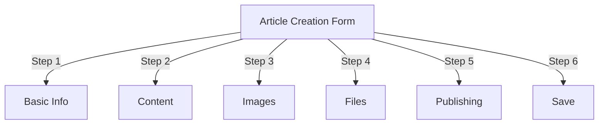
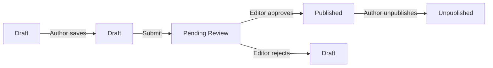
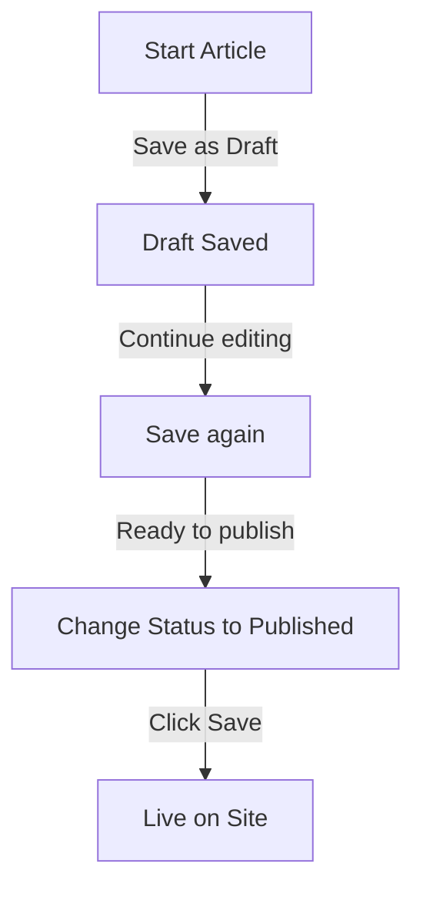

# יצירת מאמרים ב-Publisher

> מדריך שלב אחר שלב ליצירה, עריכה, עיצוב ופרסום מאמרים במודול Publisher.

---

## גישה לניהול מאמרים

### ניווט בלוח הניהול

```
Admin Panel
└── Modules
    └── Publisher
        └── Articles
            ├── Create New
            ├── Edit
            ├── Delete
            └── Publish
```

### הנתיב המהיר ביותר

1. היכנס בתור **מנהל מערכת**
2. לחץ על **מודולים** בסרגל הניהול
3. מצא את **Publisher**
4. לחץ על הקישור **Admin**
5. לחץ על **מאמרים** בתפריט הימני
6. לחץ על כפתור **הוסף מאמר**

---

## טופס יצירת מאמר

### מידע בסיסי

בעת יצירת מאמר חדש, מלא את הסעיפים הבאים:



---

## שלב 1: מידע בסיסי

### שדות חובה

#### כותרת המאמר

```
Field: Title
Type: Text input (required)
Max length: 255 characters
Example: "Top 5 Tips for Better Photography"
```

**הנחיות:**
- תיאורי וספציפי
- כלול מילות מפתח עבור SEO
- הימנע מ-ALL CAPS
- שמור מתחת ל-60 תווים לתצוגה הטובה ביותר

#### בחר קטגוריה

```
Field: Category
Type: Dropdown (required)
Options: List of created categories
Example: Photography > Tutorials
```

**טיפים:**
- הורים ותתי קטגוריות זמינות
- בחר את הקטגוריה הרלוונטית ביותר
- רק קטגוריה אחת לכל מאמר
- ניתן לשנות מאוחר יותר

#### כותרת משנה של מאמר (אופציונלי)

```
Field: Subtitle
Type: Text input (optional)
Max length: 255 characters
Example: "Learn photography fundamentals in 5 easy steps"
```

**השתמש עבור:**
- כותרת סיכום
- טקסט טיזר
- כותרת מורחבת

### תיאור מאמר

#### תיאור קצר

```
Field: Short Description
Type: Textarea (optional)
Max length: 500 characters
```

**מטרה:**
- טקסט תצוגה מקדימה של מאמר
- מוצג ברשימת הקטגוריות
- משמש בתוצאות חיפוש
- מטא תיאור עבור SEO

**דוגמה:**
```
"Discover essential photography techniques that will transform your photos
from ordinary to extraordinary. This comprehensive guide covers composition,
lighting, and exposure settings."
```

#### תוכן מלא

```
Field: Article Body
Type: WYSIWYG Editor (required)
Max length: Unlimited
Format: HTML
```

אזור תוכן המאמר הראשי עם עריכת טקסט עשיר.

---

## שלב 2: עיצוב תוכן

### שימוש בעורך WYSIWYG

#### עיצוב טקסט

```
Bold:           Ctrl+B or click [B] button
Italic:         Ctrl+I or click [I] button
Underline:      Ctrl+U or click [U] button
Strikethrough:  Alt+Shift+D or click [S] button
Subscript:      Ctrl+, (comma)
Superscript:    Ctrl+. (period)
```

#### מבנה כותרת

צור היררכיית מסמכים נכונה:

```html
<h1>Article Title</h1>      <!-- Use once at top -->
<h2>Main Section</h2>        <!-- For major sections -->
<h3>Subsection</h3>          <!-- For subtopics -->
<h4>Sub-subsection</h4>      <!-- For details -->
```

**בעורך:**
- לחץ על התפריט הנפתח **פורמט**
- בחר רמת כותרת (H1-H6)
- הקלד את הכותרת שלך

#### רשימות

**רשימה לא מסודרת (כדורים):**

```markdown
• Point one
• Point two
• Point three
```

שלבים בעורך:
1. לחץ על לחצן רשימת תבליטים [≡]
2. הקלד כל נקודה
3. הקש Enter לפריט הבא
4. הקש Backspace פעמיים כדי לסיים את הרשימה

**רשימה מסודרת (ממוספרת):**

```markdown
1. First step
2. Second step
3. Third step
```

שלבים בעורך:
1. לחץ על לחצן הרשימה הממוספרת [1.]
2. הקלד כל פריט
3. הקש Enter להמשך
4. הקש Backspace פעמיים כדי לסיים

**רשימות מקוננות:**

```markdown
1. Main point
   a. Sub-point
   b. Sub-point
2. Next point
```

שלבים:
1. צור רשימה ראשונה
2. הקש על Tab כדי להכנס
3. צור פריטים מקוננים
4. הקש Shift+Tab כדי לצאת

#### קישורים

**הוסף היפר-קישור:**

1. בחר טקסט לקישור
2. לחץ על כפתור **[🔗] קישור**
3. הזן URL: `https://example.com`
4. אופציונלי: הוסף title/target
5. לחץ על **הוסף קישור**

**הסר קישור:**

1. לחץ בתוך טקסט מקושר
2. לחץ על כפתור **[🔗] הסר קישור**

#### קוד & ציטוטים

**ציטוט בלוק:**

```
"This is an important quote from an expert"
- Attribution
```

שלבים:
1. הקלד טקסט ציטוט
2. לחץ על כפתור **[❝] Blockquote**
3. הטקסט מוזנח ומעוצב

**בלוק קוד:**

```python
def hello_world():
    print("Hello, World!")
```

שלבים:
1. לחץ על **פורמט → קוד**
2. הדבק קוד
3. בחר שפה (אופציונלי)
4. תצוגות קוד עם סימון תחביר

---

## שלב 3: הוספת תמונות

### תמונה מוצגת (תמונת גיבור)

```
Field: Featured Image / Main Image
Type: Image upload
Format: JPG, PNG, GIF, WebP
Max size: 5 MB
Recommended: 600x400 px
```

**להעלאה:**

1. לחץ על הלחצן **העלה תמונה**
2. בחר תמונה מהמחשב
3. Crop/resize במידת הצורך
4. לחץ על **השתמש בתמונה זו**

**מיקום תמונה:**
- מוצג בראש המאמר
- משמש ברשימות קטגוריות
- מוצג בארכיון
- משמש לשיתוף חברתי

### תמונות מוטבעות

הוסף תמונות בתוך טקסט המאמר:

1. מקם את הסמן בעורך לאן התמונה אמורה להגיע
2. לחץ על כפתור **[🖼️] תמונה** בסרגל הכלים
3. בחר באפשרות העלאה:
   - העלה תמונה חדשה
   - בחר מהגלריה
   - הזן תמונה URL
4. הגדר:
   ```
   Image Size:
   - Width: 300-600 px
   - Height: Auto (maintains ratio)
   - Alignment: Left/Center/Right
   ```
5. לחץ על **הוסף תמונה**

**עטוף טקסט סביב תמונה:**

בעורך לאחר הוספת:

```html
<!-- Image floats left, text wraps around -->

```

### גלריית תמונות

צור גלריית תמונות מרובות:

1. לחץ על לחצן **גלריה** (אם זמין)
2. העלה תמונות מרובות:
   - קליק בודד: הוסף אחד
   - גרור ושחרר: הוסף מרובים
3. סדרו את הסדר על ידי גרירה
4. הגדר כתוביות לכל תמונה
5. לחץ על **צור גלריה**

---

## שלב 4: צירוף קבצים

### הוסף קבצים מצורפים

```
Field: File Attachments
Type: File upload (multiple allowed)
Supported: PDF, DOC, XLS, ZIP, etc.
Max per file: 10 MB
Max per article: 5 files
```

**לצרף:**

1. לחץ על הלחצן **הוסף קובץ**
2. בחר קובץ מהמחשב
3. אופציונלי: הוסף תיאור קובץ
4. לחץ על **צרף קובץ**
5. חזור על מספר קבצים

**דוגמאות לקבצים:**
- מדריכי PDF
- גיליונות אלקטרוניים של אקסל
- מסמכי וורד
- ארכיון ZIP
- קוד מקור

### נהל קבצים מצורפים

**ערוך קובץ:**

1. לחץ על שם הקובץ
2. ערוך תיאור
3. לחץ על **שמור**

**מחק קובץ:**

1. מצא את הקובץ ברשימה
2. לחץ על סמל **[×] מחק**
3. אשר את המחיקה

---

## שלב 5: פרסום ומצב

### סטטוס מאמר

```
Field: Status
Type: Dropdown
Options:
  - Draft: Not published, only author sees
  - Pending: Waiting for approval
  - Published: Live on site
  - Archived: Old content
  - Unpublished: Was published, now hidden
```

**זרימת עבודה סטטוס:**



### אפשרויות פרסום

#### פרסם מיד

```
Status: Published
Start Date: Today (auto-filled)
End Date: (leave blank for no expiration)
```

#### לוח זמנים למועד מאוחר יותר

```
Status: Scheduled
Start Date: Future date/time
Example: February 15, 2024 at 9:00 AM
```

המאמר יפורסם אוטומטית במועד שצוין.

#### הגדר תפוגה

```
Enable Expiration: Yes
Expiration Date: Future date
Action: Archive/Hide/Delete
Example: April 1, 2024 (article auto-archives)
```

### אפשרויות נראות

```yaml
Show Article:
  - Display on front page: Yes/No
  - Show in category: Yes/No
  - Include in search: Yes/No
  - Include in recent articles: Yes/No

Featured Article:
  - Mark as featured: Yes/No
  - Featured section position: (number)
```

---

## שלב 6: SEO ומטא נתונים

### הגדרות SEO

```
Field: SEO Settings (Expand section)
```

#### מטא תיאור

```
Field: Meta Description
Type: Text (160 characters recommended)
Used by: Search engines, social media

Example:
"Learn photography fundamentals in 5 easy steps.
Discover composition, lighting, and exposure techniques."
```

#### מילות מפתח מטא

```
Field: Meta Keywords
Type: Comma-separated list
Max: 5-10 keywords

Example: Photography, Tutorial, Composition, Lighting, Exposure
```

#### URL Slug

```
Field: URL Slug (auto-generated from title)
Type: Text
Format: lowercase, hyphens, no spaces

Auto: "top-5-tips-for-better-photography"
Edit: Change before publishing
```

#### פתח תגי גרף

נוצר אוטומטית ממידע מאמר:
- כותרת
- תיאור
- תמונה מומלצת
- מאמר URL
- תאריך פרסום

בשימוש בפייסבוק, לינקדאין, וואטסאפ וכו'.

---

## שלב 7: הערות ואינטראקציה

### הגדרות הערה

```yaml
Allow Comments:
  - Enable: Yes/No
  - Default: Inherit from preferences
  - Override: Specific to this article

Moderate Comments:
  - Require approval: Yes/No
  - Default: Inherit from preferences
```

### הגדרות דירוג

```yaml
Allow Ratings:
  - Enable: Yes/No
  - Scale: 5 stars (default)
  - Show average: Yes/No
  - Show count: Yes/No
```

---

## שלב 8: אפשרויות מתקדמות

### מחבר ושורה

```
Field: Author
Type: Dropdown
Default: Current user
Options: All users with author permission

Display:
  - Show author name: Yes/No
  - Show author bio: Yes/No
  - Show author avatar: Yes/No
```

### ערוך מנעול

```
Field: Edit Lock
Purpose: Prevent accidental changes

Lock Article:
  - Locked: Yes/No
  - Lock reason: "Final version"
  - Unlock date: (optional)
```

### היסטוריית גרסאות

גרסאות שנשמרו אוטומטית של המאמר:

```
View Revisions:
  - Click "Revision History"
  - Shows all saved versions
  - Compare versions
  - Restore previous version
```

---

## שמירה ופרסום

### שמור זרימת עבודה



### שמור מאמר

**שמירה אוטומטית:**
- מופעל כל 60 שניות
- נשמר כטיוטה באופן אוטומטי
- מציג "נשמר לאחרונה: לפני 2 דקות"

**שמירה ידנית:**
- לחץ על **שמור והמשך** כדי להמשיך לערוך
- לחץ על **שמור והצג** כדי לראות את הגרסה שפורסמה
- לחץ על **שמור** כדי לשמור ולסגור

### פרסם מאמר

1. הגדר **סטטוס**: פורסם
2. הגדר **תאריך התחלה**: עכשיו (או תאריך עתידי)
3. לחץ על **שמור** או **פרסם**
4. מופיעה הודעת אישור
5. המאמר חי (או מתוכנן)

---

## עריכת מאמרים קיימים

### גישה לעורך מאמרים

1. עבור אל **אדמין → Publisher → מאמרים**
2. מצא מאמר ברשימה
3. לחץ על **ערוך** icon/button
4. בצע שינויים
5. לחץ על **שמור**

### עריכה בכמות גדולה

ערוך מספר מאמרים בבת אחת:

```
1. Go to Articles list
2. Select articles (checkboxes)
3. Choose "Bulk Edit" from dropdown
4. Change selected field
5. Click "Update All"

Available for:
  - Status
  - Category
  - Featured (Yes/No)
  - Author
```

### מאמר תצוגה מקדימה

לפני הפרסום:

1. לחץ על הלחצן **תצוגה מקדימה**
2. הצג כפי שהקוראים יראו
3. בדוק עיצוב
4. בדיקת קישורים
5. חזור לעורך כדי להתאים

---

## ניהול מאמרים

### הצג את כל המאמרים

**תצוגת רשימת מאמרים:**

```
Admin → Publisher → Articles

Columns:
  - Title
  - Category
  - Author
  - Status
  - Created date
  - Modified date
  - Actions (Edit, Delete, Preview)

Sorting:
  - By title (A-Z)
  - By date (newest/oldest)
  - By status (Published/Draft)
  - By category
```

### סנן מאמרים

```
Filter Options:
  - By category
  - By status
  - By author
  - By date range
  - Search by title

Example: Show all "Draft" articles by "John" in "News" category
```

### מחק מאמר

**מחיקה רכה (מומלץ):**

1. שנה את **סטטוס**: לא פורסם
2. לחץ על **שמור**
3. מאמר מוסתר אך לא נמחק
4. ניתן לשחזר מאוחר יותר

**מחיקה קשה:**

1. בחר מאמר ברשימה
2. לחץ על הלחצן **מחק**
3. אשר את המחיקה
4. מאמר הוסר לצמיתות

---

## שיטות עבודה מומלצות לתוכן

### כתיבת מאמרים איכותיים

```
Structure:
  ✓ Compelling title
  ✓ Clear subtitle/description
  ✓ Engaging opening paragraph
  ✓ Logical sections with headers
  ✓ Supporting visuals
  ✓ Conclusion/summary
  ✓ Call-to-action

Length:
  - Blog posts: 500-2000 words
  - News: 300-800 words
  - Guides: 2000-5000 words
  - Minimum: 300 words
```

### SEO אופטימיזציה

```
Title Optimization:
  ✓ Include primary keyword
  ✓ Keep under 60 characters
  ✓ Put keyword near beginning
  ✓ Be descriptive and specific

Content Optimization:
  ✓ Use headings (H1, H2, H3)
  ✓ Include keyword in heading
  ✓ Use bold for important terms
  ✓ Add descriptive links
  ✓ Include images with alt text

Meta Description:
  ✓ Include primary keyword
  ✓ 155-160 characters
  ✓ Action-oriented
  ✓ Unique per article
```

### טיפים לעיצוב

```
Readability:
  ✓ Short paragraphs (2-4 sentences)
  ✓ Bullet points for lists
  ✓ Subheadings every 300 words
  ✓ Generous whitespace
  ✓ Line breaks between sections

Visual Appeal:
  ✓ Featured image at top
  ✓ Inline images in content
  ✓ Alt text on all images
  ✓ Code blocks for technical
  ✓ Blockquotes for emphasis
```

---

## קיצורי מקלדת

### קיצורי דרך לעורך

```
Bold:               Ctrl+B
Italic:             Ctrl+I
Underline:          Ctrl+U
Link:               Ctrl+K
Save Draft:         Ctrl+S
```

### קיצורי טקסט

```
-- →  (dash to em dash)
... → … (three dots to ellipsis)
(c) → © (copyright)
(r) → ® (registered)
(tm) → ™ (trademark)
```

---

## משימות נפוצות

### העתק מאמר

1. פתח מאמר
2. לחץ על הלחצן **שכפל** או **שכפל**
3. מאמר הועתק כטיוטה
4. ערוך כותרת ותוכן
5. פרסם

### תזמון מאמר

1. צור מאמר
2. הגדר את **תאריך התחלה**: עתידי date/time
3. הגדר **סטטוס**: פורסם
4. לחץ על **שמור**
5. מאמר מתפרסם באופן אוטומטי

### פרסום אצווה

1. צור מאמרים כטיוטות
2. קבעו תאריכי פרסום
3. מאמרים מתפרסמים אוטומטית בזמנים קבועים
4. צג מתצוגה "מתוזמנת".

### מעבר בין קטגוריות

1. ערוך מאמר
2. שנה את התפריט הנפתח **קטגוריה**
3. לחץ על **שמור**
4. המאמר מופיע בקטגוריה חדשה

---

## פתרון בעיות

### בעיה: לא ניתן לשמור מאמר

**פתרון:**
```
1. Check form for required fields
2. Verify category is selected
3. Check PHP memory limit
4. Try saving as draft first
5. Clear browser cache
```

### בעיה: התמונות לא מוצגות

**פתרון:**
```
1. Verify image upload succeeded
2. Check image file format (JPG, PNG)
3. Verify image path in database
4. Check upload directory permissions
5. Try re-uploading image
```

### בעיה: סרגל הכלים של העורך לא מוצג

**פתרון:**
```
1. Clear browser cache
2. Try different browser
3. Disable browser extensions
4. Check JavaScript console for errors
5. Verify editor plugin installed
```

### בעיה: המאמר לא מתפרסם

**פתרון:**
```
1. Verify Status = "Published"
2. Check Start Date is today or earlier
3. Verify permissions allow publishing
4. Check category is published
5. Clear module cache
```

---

## מדריכים קשורים

- מדריך תצורה
- ניהול קטגוריות
- הגדרת הרשאות
- תבניות מותאמות אישית

---

## השלבים הבאים

- צור את המאמר הראשון שלך
- הגדר קטגוריות
- הגדר הרשאות
- סקירת התאמה אישית של תבנית

---

#Publisher #מאמרים #תוכן #יצירה #פורמט #עריכה #xoops
