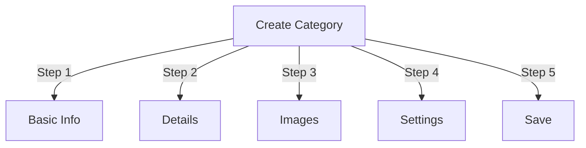

# ניהול קטגוריות ב-Publisher

> מדריך מלא ליצירה, ארגון היררכיות וניהול קטגוריות במודול Publisher.

---

## יסודות הקטגוריה

### מהן קטגוריות?

קטגוריות מארגנות מאמרים לקבוצות הגיוניות:

```
Example Structure:

  News (Main Category)
    ├── Technology
    ├── Sports
    └── Entertainment

  Tutorials (Main Category)
    ├── Photography
    │   ├── Basics
    │   └── Advanced
    └── Writing
        └── Blogging
```

### היתרונות של מבנה קטגוריה טוב

```
✓ Better user navigation
✓ Organized content
✓ Improved SEO
✓ Easier content management
✓ Better editorial workflow
```

---

## ניהול קטגוריות גישה

### ניווט בלוח הניהול

```
Admin Panel
└── Modules
    └── Publisher
        └── Categories
            ├── Create New
            ├── Edit
            ├── Delete
            ├── Permissions
            └── Organize
```

### גישה מהירה

1. היכנס בתור **מנהל מערכת**
2. עבור אל **אדמין → מודולים**
3. לחץ על **Publisher → ניהול**
4. לחץ על **קטגוריות** בתפריט הימני

---

## יצירת קטגוריות

### טופס יצירת קטגוריה



### שלב 1: מידע בסיסי

#### שם קטגוריה

```
Field: Category Name
Type: Text input (required)
Max length: 100 characters
Uniqueness: Should be unique
Example: "Photography"
```

**הנחיות:**
- תיאורי ויחיד או רבים באופן עקבי
- הוזן כראוי
- הימנע מתווים מיוחדים
- הקפידו על קצרים למדי

#### תיאור קטגוריה

```
Field: Description
Type: Textarea (optional)
Max length: 500 characters
Used in: Category listing pages, category blocks
```

**מטרה:**
- מסביר את תוכן הקטגוריות
- מופיע מעל מאמרי הקטגוריה
- עוזר למשתמשים להבין את ההיקף
- משמש עבור SEO meta description

**דוגמה:**
```
"Photography tips, tutorials, and inspiration for
all skill levels. From composition basics to advanced
lighting techniques, master your craft."
```

### שלב 2: קטגוריית אב

#### צור היררכיה

```
Field: Parent Category
Type: Dropdown
Options: None (root), or existing categories
```

**דוגמאות היררכיה:**

```
Flat Structure:
  News
  Tutorials
  Reviews

Nested Structure:
  News
    Technology
    Business
    Sports
  Tutorials
    Photography
      Basics
      Advanced
    Writing
```

**צור קטגוריית משנה:**

1. לחץ על התפריט הנפתח **קטגוריית אב**
2. בחר הורה (למשל, "חדשות")
3. מלא את שם הקטגוריה
4. שמור
5. קטגוריה חדשה מופיעה בתור ילד

### שלב 3: תמונת קטגוריה

#### העלה תמונת קטגוריה

```
Field: Category Image
Type: Image upload (optional)
Format: JPG, PNG, GIF, WebP
Max size: 5 MB
Recommended: 300x200 px (or your theme size)
```

**להעלאה:**

1. לחץ על הלחצן **העלה תמונה**
2. בחר תמונה מהמחשב
3. Crop/resize במידת הצורך
4. לחץ על **השתמש בתמונה זו**

**היכן בשימוש:**
- דף רישום קטגוריות
- כותרת בלוק קטגוריה
- פירורי לחם (כמה נושאים)
- שיתוף ברשתות חברתיות

### שלב 4: הגדרות קטגוריה

#### הגדרות תצוגה

```yaml
Status:
  - Enabled: Yes/No
  - Hidden: Yes/No (hidden from menus, still accessible)

Display Options:
  - Show description: Yes/No
  - Show image: Yes/No
  - Show article count: Yes/No
  - Show subcategories: Yes/No

Layout:
  - Items per page: 10-50
  - Display order: Date/Title/Author
  - Display direction: Ascending/Descending
```

#### הרשאות קטגוריה

```yaml
Who Can View:
  - Anonymous: Yes/No
  - Registered: Yes/No
  - Specific groups: Configure per group

Who Can Submit:
  - Registered: Yes/No
  - Specific groups: Configure per group
  - Author must have: "submit articles" permission
```

### שלב 5: הגדרות SEO

#### מטא תגים

```
Field: Meta Description
Type: Text (160 characters)
Purpose: Search engine description

Field: Meta Keywords
Type: Comma-separated list
Example: photography, tutorials, tips, techniques
```

#### URL תצורה

```
Field: URL Slug
Type: Text
Auto-generated from category name
Example: "photography" from "Photography"
Can be customized before saving
```

### שמור קטגוריה

1. מלא את כל השדות הנדרשים:
   - שם קטגוריה ✓
   - תיאור (מומלץ)
2. אופציונלי: העלה תמונה, הגדר SEO
3. לחץ על **שמור קטגוריה**
4. מופיעה הודעת אישור
5. הקטגוריה זמינה כעת

---

## היררכיית קטגוריות

### צור מבנה מקונן

```
Step-by-step example: Create News → Technology subcategory

1. Go to Categories admin
2. Click "Add Category"
3. Name: "News"
4. Parent: (leave blank - this is root)
5. Save
6. Click "Add Category" again
7. Name: "Technology"
8. Parent: "News" (select from dropdown)
9. Save
```

### הצג את עץ ההיררכיה

```
Categories view shows tree structure:

📁 News
  📄 Technology
  📄 Sports
  📄 Entertainment
📁 Tutorials
  📄 Photography
    📄 Basics
    📄 Advanced
  📄 Writing
```

לחץ על החצים הרחב לקטגוריות המשנה show/hide.

### ארגן מחדש את הקטגוריות

#### העבר קטגוריה

1. עבור אל רשימת הקטגוריות
2. לחץ על **ערוך** בקטגוריה
3. שנה את **קטגוריית האב**
4. לחץ על **שמור**
5. הקטגוריה הועברה לתפקיד חדש

#### סדר מחדש את הקטגוריות

אם זמין, השתמש בגרירה ושחרור:

1. עבור אל רשימת הקטגוריות
2. לחץ וגרור קטגוריה
3. ירידה בעמדה חדשה
4. ההזמנה נשמרת אוטומטית

#### מחק קטגוריה

**אפשרות 1: מחיקה רכה (הסתר)**

1. ערוך קטגוריה
2. הגדר את **סטטוס**: מושבת
3. לחץ על **שמור**
4. קטגוריה מוסתרת אך לא נמחקה

**אפשרות 2: מחיקה קשה**

1. עבור אל רשימת הקטגוריות
2. לחץ על **מחק** בקטגוריה
3. בחר פעולה עבור מאמרים:
   ```
   ☐ Move articles to parent category
   ☐ Move articles to root (News)
   ☐ Delete all articles in category
   ```
4. אשר את המחיקה

---

## פעולות קטגוריה

### ערוך קטגוריה

1. עבור אל **אדמין → Publisher → קטגוריות**
2. לחץ על **ערוך** בקטגוריה
3. שנה שדות:
   - שם
   - תיאור
   - קטגוריית הורים
   - תמונה
   - הגדרות
4. לחץ על **שמור**

### ערוך הרשאות קטגוריה

1. עבור אל קטגוריות
2. לחץ על **הרשאות** בקטגוריה (או לחץ על קטגוריה ואז לחץ על הרשאות)
3. הגדר קבוצות:

```
For each group:
  ☐ View articles in this category
  ☐ Submit articles to this category
  ☐ Edit own articles
  ☐ Edit all articles
  ☐ Approve/Moderate articles
  ☐ Manage category
```

4. לחץ על **שמור הרשאות**

### הגדר תמונת קטגוריה

**העלה תמונה חדשה:**

1. ערוך קטגוריה
2. לחץ על **שנה תמונה**
3. העלה או בחר תמונה
4. Crop/resize
5. לחץ על **השתמש בתמונה**
6. לחץ על **שמור קטגוריה**

**הסר תמונה:**

1. ערוך קטגוריה
2. לחץ על **הסר תמונה** (אם זמין)
3. לחץ על **שמור קטגוריה**

---

## הרשאות קטגוריה

### מטריצת הרשאות

```
                 Anonymous  Registered  Editor  Admin
View category        ✓         ✓         ✓       ✓
Submit article       ✗         ✓         ✓       ✓
Edit own article     ✗         ✓         ✓       ✓
Edit all articles    ✗         ✗         ✓       ✓
Moderate articles    ✗         ✗         ✓       ✓
Manage category      ✗         ✗         ✗       ✓
```

### הגדר הרשאות ברמת קטגוריה

#### בקרת גישה לכל קטגוריה

1. עבור לרשימת **קטגוריות**
2. בחר קטגוריה
3. לחץ על **הרשאות**
4. עבור כל קבוצה, בחר הרשאות:

```
Example: News category
  Anonymous:   View only
  Registered:  Submit articles
  Editors:     Approve articles
  Admins:      Full control
```

5. לחץ על **שמור**

#### הרשאות ברמת השדה

שליטה באילו שדות טופס המשתמשים יכולים see/edit:

```
Example: Limit field visibility for Registered users

Registered users can see/edit:
  ✓ Title
  ✓ Description
  ✓ Content
  ✗ Author (auto-set to current user)
  ✗ Scheduled date (only editors)
  ✗ Featured (only admins)
```

**הגדר ב:**
- הרשאות קטגוריה
- חפש את הקטע "נראות שדה".

---

## שיטות עבודה מומלצות לקטגוריות

### מבנה קטגוריה

```
✓ Keep hierarchy 2-3 levels deep
✗ Don't create too many top-level categories
✗ Don't create categories with one article

✓ Use consistent naming (plural or singular)
✗ Don't use vague names ("Stuff", "Other")

✓ Create categories for articles that exist
✗ Don't create empty categories in advance
```

### הנחיות למתן שמות

```
Good names:
  "Photography"
  "Web Development"
  "Travel Tips"
  "Business News"

Avoid:
  "Articles" (too vague)
  "Content" (redundant)
  "News&Updates" (inconsistent)
  "PHOTOGRAPHY STUFF" (formatting)
```

### טיפים לארגון

```
By Topic:
  News
    Technology
    Sports
    Entertainment

By Type:
  Tutorials
    Video
    Text
    Interactive

By Audience:
  For Beginners
  For Experts
  Case Studies

Geographic:
  North America
    United States
    Canada
  Europe
```

---

## קטגוריה בלוקים

### בלוק קטגוריית מפרסם

הצג רישומי קטגוריות באתר שלך:

1. עבור אל **אדמין → חסימות**
2. מצא את **מפרסם - קטגוריות**
3. לחץ על **ערוך**
4. הגדר:

```
Block Title: "News Categories"
Show subcategories: Yes/No
Show article count: Yes/No
Height: (pixels or auto)
```

5. לחץ על **שמור**

### בלוק מאמרים בקטגוריה

הצג מאמרים אחרונים מקטגוריה ספציפית:

1. עבור אל **אדמין → חסימות**
2. מצא את **Publisher - מאמרים בקטגוריה**
3. לחץ על **ערוך**
4. בחר:

```
Category: News (or specific category)
Number of articles: 5
Show images: Yes/No
Show description: Yes/No
```

5. לחץ על **שמור**

---

## ניתוח קטגוריות

### הצג סטטיסטיקות של קטגוריות

ממנהל קטגוריות:

```
Each category shows:
  - Total articles: 45
  - Published: 42
  - Draft: 2
  - Pending approval: 1
  - Total views: 5,234
  - Latest article: 2 hours ago
```

### הצג תנועה בקטגוריה

אם אנליטיקה מופעלת:

1. לחץ על שם הקטגוריה
2. לחץ על הכרטיסייה **סטטיסטיקה**
3. הצג:
   - צפיות בעמודים
   - מאמרים פופולריים
   - מגמות תנועה
   - בשימוש במונחי חיפוש

---

## תבניות קטגוריה

### התאם אישית את תצוגת הקטגוריה

אם משתמשים בתבניות מותאמות אישית, כל קטגוריה יכולה לעקוף:

```
publisher_category.tpl
  ├── Category header
  ├── Category description
  ├── Category image
  ├── Article listing
  └── Pagination
```

**להתאמה אישית:**

1. העתק את קובץ התבנית
2. שנה את HTML/CSS
3. הקצה לקטגוריה ב-admin
4. הקטגוריה משתמשת בתבנית מותאמת אישית

---

## משימות נפוצות

### צור היררכיית חדשות

```
Admin → Publisher → Categories
1. Create "News" (parent)
2. Create "Technology" (parent: News)
3. Create "Sports" (parent: News)
4. Create "Entertainment" (parent: News)
```

### העבר מאמרים בין קטגוריות

1. עבור אל **מאמרים** מנהל מערכת
2. בחר מאמרים (תיבות סימון)
3. בחר **"שנה קטגוריה"** מהתפריט הנפתח של פעולות בכמות גדולה
4. בחר קטגוריה חדשה
5. לחץ על **עדכן הכל**

### הסתר קטגוריה מבלי למחוק

1. ערוך קטגוריה
2. הגדר את **סטטוס**: Disabled/Hidden
3. שמור
4. קטגוריה לא מוצגת בתפריטים (עדיין נגישה דרך URL)

### צור קטגוריה עבור טיוטות

```
Best Practice:

Create "In Review" category
  ├── Purpose: Articles awaiting approval
  ├── Permissions: Hidden from public
  ├── Only admins/editors can see
  ├── Move articles here until approved
  └── Move to "News" when published
```

---

## Import/Export קטגוריות

### ייצוא קטגוריות

אם זמין:

1. עבור אל מנהל מערכת **קטגוריות**
2. לחץ על **ייצוא**
3. בחר פורמט: CSV/JSON/XML
4. הורד את הקובץ
5. הגיבוי נשמר

### ייבוא קטגוריות

אם זמין:

1. הכן קובץ עם קטגוריות
2. עבור אל מנהל מערכת **קטגוריות**
3. לחץ על **ייבוא**
4. העלה קובץ
5. בחר אסטרטגיית עדכון:
   - צור חדש בלבד
   - עדכון קיים
   - החלף הכל
6. לחץ על **ייבוא**

---

## קטגוריות פתרון בעיות

### בעיה: קטגוריות משנה אינן מוצגות

**פתרון:**
```
1. Verify parent category status is "Enabled"
2. Check permissions allow viewing
3. Verify subcategories have status "Enabled"
4. Clear cache: Admin → Tools → Clear Cache
5. Check theme shows subcategories
```

### בעיה: לא ניתן למחוק את הקטגוריה

**פתרון:**
```
1. Category must have no articles
2. Move or delete articles first:
   Admin → Articles
   Select articles in category
   Change category to another
3. Then delete empty category
4. Or choose "move articles" option when deleting
```

### בעיה: תמונת קטגוריה לא מוצגת

**פתרון:**
```
1. Verify image uploaded successfully
2. Check image file format (JPG, PNG)
3. Verify upload directory permissions
4. Check theme displays category images
5. Try re-uploading image
6. Clear browser cache
```

### בעיה: ההרשאות לא נכנסות לתוקף

**פתרון:**
```
1. Check group permissions in Category
2. Check global Publisher permissions
3. Check user belongs to configured group
4. Clear session cache
5. Log out and log back in
6. Check permission modules installed
```

---

## רשימת שיטות עבודה מומלצות לקטגוריה

לפני פריסת קטגוריות:

- [ ] ההיררכיה היא בעומק של 2-3 רמות
- [ ] לכל קטגוריה יש 5+ מאמרים
- [ ] שמות הקטגוריות עקביים
- [ ] הרשאות מתאימות
- [ ] תמונות הקטגוריה עוברות אופטימיזציה
- [ ] התיאורים מלאים
- [ ] מטא נתונים SEO מולאו
- [ ] URLs ידידותיים
- [ ] קטגוריות נבדקו בחזית הקצה
- [ ] התיעוד עודכן

---

## מדריכים קשורים

- יצירת מאמר
- ניהול הרשאות
- תצורת מודול
- מדריך התקנה

---

## השלבים הבאים

- צור מאמרים בקטגוריות
- הגדר הרשאות
- התאם אישית עם תבניות מותאמות אישית

---

#Publisher #קטגוריות #ארגון #היררכיה #ניהול #xoops
