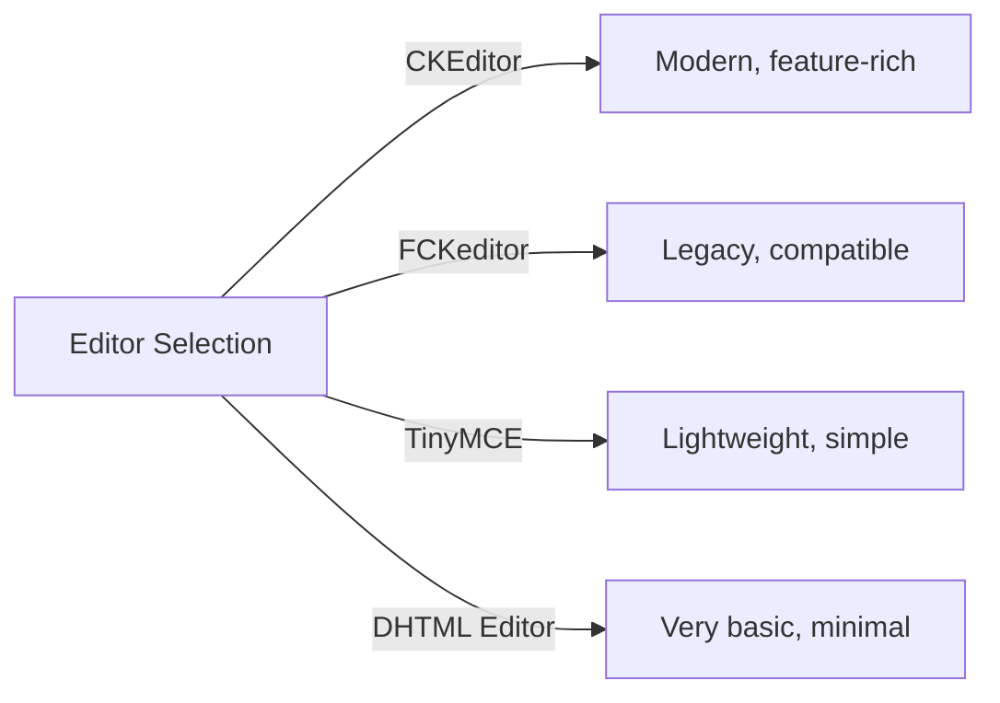
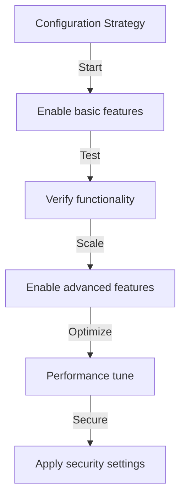

# תצורה בסיסית של Publisher

> הגדר את הגדרות מודול Publisher, העדפות ואפשרויות כלליות עבור התקנת XOOPS שלך.

---

## גישה לתצורה

### ניווט בלוח הניהול
```
XOOPS Admin Panel
└── Modules
    └── Publisher
        ├── Preferences
        ├── Settings
        └── Configuration
```
1. היכנס בתור **מנהל מערכת**
2. עבור אל **פאנל ניהול → מודולים**
3. מצא את מודול **Publisher**
4. לחץ על הקישור **העדפות** או **אדמין**

---

## הגדרות כלליות

### תצורת גישה
```
Admin Panel → Modules → Publisher
```
לחץ על **סמל גלגל השיניים** או **הגדרות** עבור האפשרויות הבאות:

#### אפשרויות תצוגה

| הגדרה | אפשרויות | ברירת מחדל | תיאור |
|--------|--------|--------|----------------|
| **פריטים בעמוד** | 5-50 | 10 | מאמרים המוצגים ברשימות |
| **הצג פירורי לחם** | Yes/No | כן | תצוגת שבילי ניווט |
| **השתמש בהחלפה** | Yes/No | כן | עמוד ברשימות ארוכות |
| **תאריך הצגה** | Yes/No | כן | הצג את תאריך המאמר |
| **הצג קטגוריה** | Yes/No | כן | הצג קטגוריית מאמרים |
| **הצג מחבר** | Yes/No | כן | הצג מחבר המאמר |
| **הצג תצוגות** | Yes/No | כן | הצג ספירת צפיות במאמר |

**תצורה לדוגמה:**
```yaml
Items Per Page: 15
Show Breadcrumb: Yes
Use Paging: Yes
Show Date: Yes
Show Category: Yes
Show Author: Yes
Show Views: Yes
```
#### אפשרויות מחבר

| הגדרה | ברירת מחדל | תיאור |
|--------|--------|----------------|
| **הצג את שם המחבר** | כן | הצג שם אמיתי או שם משתמש |
| **השתמש בשם משתמש** | לא | הצג שם משתמש במקום שם |
| **הצג דוא"ל של המחבר** | לא | הצג דוא"ל ליצירת קשר עם המחבר |
| **הצג את דמות המחבר** | כן | הצג דמות משתמש |

---

## תצורת עורך

### בחר WYSIWYG עורך

Publisher תומך במספר עורכים:

#### עורכים זמינים

### CKEditor (מומלץ)

**הטוב ביותר עבור:** רוב המשתמשים, דפדפנים מודרניים, תכונות מלאות

1. עבור אל **העדפות**
2. הגדר את **עורך**: CKEditor
3. הגדר אפשרויות:
```
Editor: CKEditor 4.x
Toolbar: Full
Height: 400px
Width: 100%
Remove plugins: []
Add plugins: [mathjax, codesnippet]
```
### FCKeditor

**הטוב ביותר עבור:** תאימות, מערכות ישנות יותר
```
Editor: FCKeditor
Toolbar: Default
Custom config: (optional)
```
### TinyMCE

**הטוב ביותר עבור:** טביעת רגל מינימלית, עריכה בסיסית
```
Editor: TinyMCE
Plugins: [paste, table, link, image]
Toolbar: minimal
```
---

## הגדרות קובץ והעלאה

### הגדר ספריות העלאה
```
Admin → Publisher → Preferences → Upload Settings
```
#### הגדרות סוג קובץ
```yaml
Allowed File Types:
  Images:
    - jpg
    - jpeg
    - gif
    - png
    - webp
  Documents:
    - pdf
    - doc
    - docx
    - xls
    - xlsx
    - ppt
    - pptx
  Archives:
    - zip
    - rar
    - 7z
  Media:
    - mp3
    - mp4
    - webm
    - mov
```
#### מגבלות גודל קובץ

| סוג קובץ | גודל מקסימלי | הערות |
|-----------|--------|-------|
| **תמונות** | 5 מגה-בייט | לכל קובץ תמונה |
| **מסמכים** | 10 מגה-בייט | PDF, קבצי Office |
| **מדיה** | 50 מגה-בייט | Video/audio קבצים |
| **כל הקבצים** | 100 מגה-בייט | סך הכל להעלאה |

**תְצוּרָה:**
```
Max Image Upload Size: 5 MB
Max Document Upload Size: 10 MB
Max Media Upload Size: 50 MB
Total Upload Size: 100 MB
Max Files per Article: 5
```
### שינוי גודל תמונה

בעל האתר משנה אוטומטית את גודל התמונות לצורך עקביות:
```yaml
Thumbnail Size:
  Width: 150
  Height: 150
  Mode: Crop/Resize

Category Image Size:
  Width: 300
  Height: 200
  Mode: Resize

Article Featured Image:
  Width: 600
  Height: 400
  Mode: Resize
```
---

## הגדרות הערה ואינטראקציה

### תצורת הערות
```
Preferences → Comments Section
```
#### אפשרויות הערה
```yaml
Allow Comments:
  - Enabled: Yes/No
  - Default: Yes
  - Per-article override: Yes

Comment Moderation:
  - Moderate comments: Yes/No
  - Moderate guest comments only: Yes/No
  - Spam filter: Enabled
  - Max comments per day: (unlimited)

Comment Display:
  - Display format: Threaded/Flat
  - Comments per page: 10
  - Date format: Full date/Time ago
  - Show comment count: Yes/No
```
### תצורת דירוגים
```yaml
Allow Ratings:
  - Enabled: Yes/No
  - Default: Yes
  - Per-article override: Yes

Rating Options:
  - Rating scale: 5 stars (default)
  - Allow user to rate own: No
  - Show average rating: Yes
  - Show rating count: Yes
```
---

## SEO & URL הגדרות

### אופטימיזציה למנועי חיפוש
```
Preferences → SEO Settings
```
#### URL תצורה
```yaml
SEO URLs:
  - Enabled: No (set to Yes for SEO URLs)
  - URL rewriting: None/Apache mod_rewrite/IIS rewrite

URL Format:
  - Category: /category/news
  - Article: /article/welcome-to-site
  - Archive: /archive/2024/01

Meta Description:
  - Auto-generate: Yes
  - Max length: 160 characters

Meta Keywords:
  - Auto-generate: Yes
  - From: Article tags, title
```
### אפשר SEO URLs (מתקדם)

**דרישות מוקדמות:**
- Apache עם `mod_rewrite` מופעל
- `.htaccess` תמיכה מופעלת

**שלבי תצורה:**

1. עבור אל **העדפות → SEO הגדרות**
2. הגדר **SEO URLs**: כן
3. הגדר **URL שכתוב**: Apache mod_rewrite
4. ודא שקובץ `.htaccess` קיים בתיקיית Publisher

**תצורת.htaccess:**
```apache
<IfModule mod_rewrite.c>
    RewriteEngine On
    RewriteBase /modules/publisher/

    # Category rewrites
    RewriteRule ^category/([0-9]+)-(.*)\.html$ index.php?op=showcategory&categoryid=$1 [L,QSA]

    # Article rewrites
    RewriteRule ^article/([0-9]+)-(.*)\.html$ index.php?op=showitem&itemid=$1 [L,QSA]

    # Archive rewrites
    RewriteRule ^archive/([0-9]+)/([0-9]+)/$ index.php?op=archive&year=$1&month=$2 [L,QSA]
</IfModule>
```
---

## cache וביצועים

### תצורת cache
```
Preferences → Cache Settings
```

```yaml
Enable Caching:
  - Enabled: Yes
  - Cache type: File (or Memcache)

Cache Lifetime:
  - Category lists: 3600 seconds (1 hour)
  - Article lists: 1800 seconds (30 minutes)
  - Single article: 7200 seconds (2 hours)
  - Recent articles block: 900 seconds (15 minutes)

Cache Clear:
  - Manual clear: Available in admin
  - Auto-clear on article save: Yes
  - Clear on category change: Yes
```
### נקה cache

**ניקוי cache ידני:**

1. עבור אל **אדמין ← מפרסם ← כלים**
2. לחץ על **נקה cache**
3. בחר סוגי cache לניקוי:
   - [ ] cache קטגוריה
   - [ ] cache מאמרים
   - [ ] חסום cache
   - [ ] כל הcache
4. לחץ על **נקה נבחרים**

**שורת פקודה:**
```bash
# Clear all Publisher cache
php /path/to/xoops/admin/cache_manage.php publisher

# Or directly delete cache files
rm -rf /path/to/xoops/var/cache/publisher/*
```
---

## הודעה וזרימת עבודה

### הודעות דוא"ל
```
Preferences → Notifications
```

```yaml
Notify Admin on New Article:
  - Enabled: Yes
  - Recipient: Admin email
  - Include summary: Yes

Notify Moderators:
  - Enabled: Yes
  - On new submission: Yes
  - On pending articles: Yes

Notify Author:
  - On approval: Yes
  - On rejection: Yes
  - On comment: No (optional)
```
### זרימת עבודה להגשה
```yaml
Require Approval:
  - Enabled: Yes
  - Editor approval: Yes
  - Admin approval: No

Draft Save:
  - Auto-save interval: 60 seconds
  - Save local versions: Yes
  - Revision history: Last 5 versions
```
---

## הגדרות תוכן

### ברירות מחדל לפרסום
```
Preferences → Content Settings
```

```yaml
Default Article Status:
  - Draft/Published: Draft
  - Featured by default: No
  - Auto-publish time: None

Default Visibility:
  - Public/Private: Public
  - Show on front page: Yes
  - Show in categories: Yes

Scheduled Publishing:
  - Enabled: Yes
  - Allow per-article: Yes

Content Expiration:
  - Enabled: No
  - Auto-archive old: No
  - Archive after days: (unlimited)
```
### WYSIWYG אפשרויות תוכן
```yaml
Allow HTML:
  - In articles: Yes
  - In comments: No

Allow Embedded Media:
  - Videos (iframe): Yes
  - Images: Yes
  - Plugins: No

Content Filtering:
  - Strip tags: No
  - XSS filter: Yes (recommended)
```
---

## הגדרות מנוע חיפוש

### הגדר את שילוב החיפוש
```
Preferences → Search Settings
```

```yaml
Enable Article Indexing:
  - Include in site search: Yes
  - Index type: Full text/Title only

Search Options:
  - Search in titles: Yes
  - Search in content: Yes
  - Search in comments: Yes

Meta Tags:
  - Auto generate: Yes
  - OG tags (social): Yes
  - Twitter cards: Yes
```
---

## הגדרות מתקדמות

### מצב ניפוי באגים (פיתוח בלבד)
```
Preferences → Advanced
```

```yaml
Debug Mode:
  - Enabled: No (only for development!)

Development Features:
  - Show SQL queries: No
  - Log errors: Yes
  - Error email: admin@example.com
```
### אופטימיזציה של מסדי נתונים
```
Admin → Tools → Optimize Database
```

```bash
# Manual optimization
mysql> OPTIMIZE TABLE publisher_items;
mysql> OPTIMIZE TABLE publisher_categories;
mysql> OPTIMIZE TABLE publisher_comments;
```
---

## התאמה אישית של מודול

### תבניות נושא
```
Preferences → Display → Templates
```
בחר ערכת תבניות:
- ברירת מחדל
- קלאסי
- מודרני
- כהה
- מותאם אישית

כל תבנית שולטת:
- פריסת מאמר
- רישום קטגוריות
- תצוגת ארכיון
- תצוגת הערות

---

## עצות תצורה

### שיטות עבודה מומלצות

1. **התחל פשוט** - הפעל תחילה תכונות ליבה
2. **בדוק כל שינוי** - אמת לפני שתמשיך הלאה
3. **הפעל cache** - משפר את הביצועים
4. **גיבוי ראשון** - ייצוא הגדרות לפני שינויים גדולים
5. **יומני מעקב** - בדוק יומני שגיאות באופן קבוע

### מיטוב ביצועים
```yaml
For Better Performance:
  - Enable caching: Yes
  - Cache lifetime: 3600 seconds
  - Limit items per page: 10-15
  - Compress images: Yes
  - Minify CSS/JS: Yes (if available)
```
### הקשחת אבטחה
```yaml
For Better Security:
  - Moderate comments: Yes
  - Disable HTML in comments: Yes
  - XSS filtering: Yes
  - File type whitelist: Strict
  - Max upload size: Reasonable limit
```
---

## Export/Import הגדרות

### תצורת גיבוי
```
Admin → Tools → Export Settings
```
**כדי לגבות את התצורה הנוכחית:**

1. לחץ על **ייצוא תצורה**
2. שמור קובץ `.cfg` שהורד
3. אחסן במקום בטוח

**כדי לשחזר:**

1. לחץ על **ייבא תצורה**
2. בחר `.cfg` קובץ
3. לחץ על **שחזר**

---

## מדריכי תצורה קשורים

- ניהול קטגוריות
- יצירת מאמר
- תצורת הרשאה
- מדריך התקנה

---

## פתרון בעיות בתצורה

### ההגדרות לא יישמרו

**פתרון:**
1. בדוק את הרשאות הספרייה ב-`/var/config/`
2. ודא גישת כתיבה PHP
3. בדוק אם יש בעיות ביומן השגיאות PHP
4. נקה את הcache של הדפדפן ונסה שוב

### העורך לא מופיע

**פתרון:**
1. ודא שהפלאגין של העורך מותקן
2. בדוק את תצורת העורך XOOPS
3. נסה אפשרות עורך אחרת
4. בדוק במסוף הדפדפן אם יש שגיאות JavaScript

### בעיות ביצועים

**פתרון:**
1. אפשר שמירה בcache
2. צמצם פריטים בעמוד
3. דחוס תמונות
4. בדוק אופטימיזציה של מסד הנתונים
5. עיין ביומן שאילתות איטי

---

## השלבים הבאים

- הגדר הרשאות קבוצה
- צור את המאמר הראשון שלך
- הגדר קטגוריות
- סקור תבניות מותאמות אישית

---

#publisher #configuration #preferences #settings #xoops