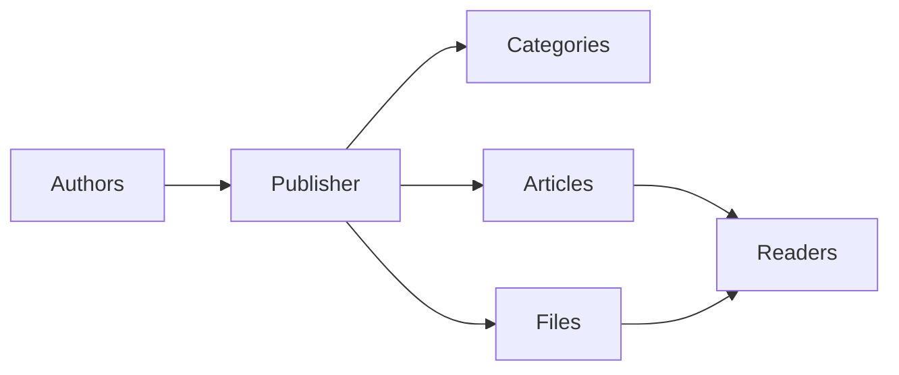
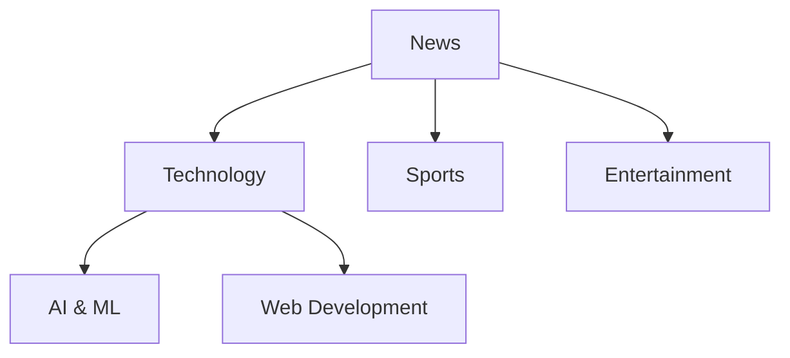
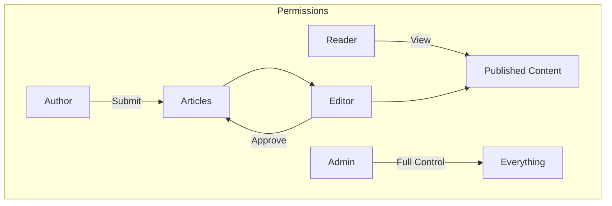
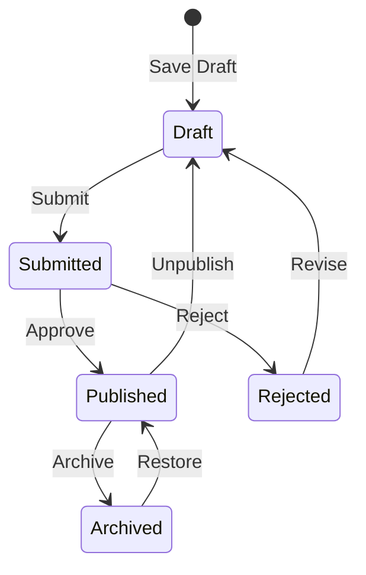

# תחילת העבודה עם Publisher

> מדריך שלב אחר שלב להגדרה ושימוש במודול Publisher news/blog.

---

## מה זה Publisher?

Publisher הוא מודול ניהול התוכן המוביל עבור XOOPS, המיועד עבור:

- **אתרי חדשות** - פרסום מאמרים עם קטגוריות
- **בלוגים** - בלוג אישי או ריבוי מחברים``
- **תיעוד** - מאגרי ידע מסודרים
- **פורטלי תוכן** - תוכן מדיה מעורב

---

## הגדרה מהירה

### שלב 1: התקן את Publisher

1. הורד מ-[GitHub](https://github.com/XoopsModules25x/publisher)
2. העלה ל-`modules/publisher/`
3. עבור אל ניהול ← מודולים ← התקנה

### שלב 2: צור קטגוריות

1. מנהל ← מפרסם ← קטגוריות
2. לחץ על "הוסף קטגוריה"
3. מלא:
   - **שם**: שם הקטגוריה
   - **תיאור**: מה מכילה קטגוריה זו
   - **תמונה**: תמונת קטגוריה אופציונלית
4. הגדר הרשאות (מי יכול submit/view)
5. שמור

### שלב 3: הגדר הגדרות

1. Admin → Publisher → Preferences
2. הגדרות מפתח להגדרה:

| הגדרה | מומלץ | תיאור |
|--------|-------------|--------|
| פריטים בעמוד | 10-20 | מאמרים על אינדקס |
| עורך | TinyMCE/CKEditor | עורך טקסט עשיר |
| אפשר דירוגים | כן | משוב מהקוראים |
| אפשר הערות | כן | דיונים |
| אישור אוטומטי | לא | בקרת עריכה |

### שלב 4: צור את המאמר הראשון שלך

1. תפריט ראשי ← Publisher ← שלח מאמר
2. מלאו את הטופס:
   - **כותרת**: כותרת המאמר
   - **קטגוריה**: לאן זה שייך
   - **סיכום**: תיאור קצר
   - **גוף**: תוכן המאמר המלא
3. הוסף אלמנטים אופציונליים:
   - תמונה מומלצת
   - קבצים מצורפים
   - הגדרות SEO
4. שלח לבדיקה או פרסום

---

## תפקידי משתמש

### קורא
- הצג מאמרים שפורסמו
- דרג והגיב
- חיפוש תוכן

### מחבר
- שלח מאמרים חדשים
- ערוך מאמרים משלך
- צרף קבצים

### עורך
- Approve/reject הגשות
- ערוך כל מאמר
- ניהול קטגוריות

### מנהל
- שליטה מלאה במודול
- הגדר הגדרות
- ניהול הרשאות

---

## כתיבת מאמרים

### עורך מאמרים
```
┌─────────────────────────────────────────────────────┐
│ Title: [Your Article Title                        ] │
├─────────────────────────────────────────────────────┤
│ Category: [Select Category          ▼]              │
├─────────────────────────────────────────────────────┤
│ Summary:                                            │
│ ┌─────────────────────────────────────────────────┐ │
│ │ Brief description shown in listings...          │ │
│ └─────────────────────────────────────────────────┘ │
├─────────────────────────────────────────────────────┤
│ Body:                                               │
│ ┌─────────────────────────────────────────────────┐ │
│ │ [B] [I] [U] [Link] [Image] [Code]               │ │
│ ├─────────────────────────────────────────────────┤ │
│ │                                                  │ │
│ │ Full article content goes here...               │ │
│ │                                                  │ │
│ └─────────────────────────────────────────────────┘ │
├─────────────────────────────────────────────────────┤
│ [Submit] [Preview] [Save Draft]                     │
└─────────────────────────────────────────────────────┘
```
### שיטות עבודה מומלצות

1. **כותרות מושכות** - כותרות ברורות ומושכות
2. **סיכומים טובים** - לפתות את הקוראים ללחוץ
3. **תוכן מובנה** - השתמש בכותרות, רשימות, תמונות
4. **סיווג נכון** - עזרו לקוראים למצוא תוכן
5. **SEO אופטימיזציה** - מילות מפתח בכותרת ובתוכן

---

## ניהול תוכן

### זרימת סטטוס מאמר

### תיאורי סטטוס

| סטטוס | תיאור |
|--------|----------------|
| טיוטה | עבודה בתהליך |
| הוגש | ממתין לסקירה |
| פורסם | בשידור חי באתר |
| פג תוקף | תאריך תפוגה עבר |
| נדחה | זקוק לתיקון |
| בארכיון | הוסר מהרישומים |

---

## ניווט

### גישה ל-Publisher

- **תפריט ראשי** → Publisher
- **ישיר URL**: `yoursite.com/modules/publisher/`

### דפי מפתח

| עמוד | URL | מטרה |
|------|-----|--------|
| אינדקס | `/modules/publisher/` | רשימות מאמרים |
| קטגוריה | `/modules/publisher/category.php?id=X` | מאמרי קטגוריה |
| מאמר | `/modules/publisher/item.php?itemid=X` | מאמר בודד |
| שלח | `/modules/publisher/submit.php` | מאמר חדש |
| חפש | `/modules/publisher/search.php` | מצא מאמרים |

---

## בלוקים

Publisher מספק מספר בלוקים לאתר שלך:

### מאמרים אחרונים
מציג מאמרים שפורסמו לאחרונה

### תפריט קטגוריות
ניווט לפי קטגוריות

### מאמרים פופולריים
התוכן הנצפה ביותר

### מאמר אקראי
הצג תוכן אקראי

### זרקור
מאמרים מומלצים

---

## תיעוד קשור

- יצירה ועריכה של מאמרים
- ניהול קטגוריות
- Publisher מרחיב

---

#xoops #Publisher #מדריך למשתמש #להתחיל #cms