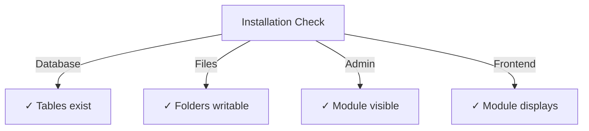

# מדריך התקנת Publisher

> הוראות מלאות להתקנה וקביעת התצורה של מודול Publisher עבור XOOPS CMS.

---

## דרישות מערכת

### דרישות מינימום

| דרישה | גרסה | הערות |
|-------------|--------|-------|
| XOOPS | 2.5.10+ | פלטפורמת Core CMS |
| PHP | 7.1+ | PHP 8.x מומלץ |
| MySQL | 5.7+ | שרת מסד נתונים |
| שרת אינטרנט | Apache/Nginx | עם תמיכה בשכתוב |

### PHP הרחבות

```
- PDO (PHP Data Objects)
- pdo_mysql or mysqli
- mb_string (multibyte strings)
- curl (for external content)
- json
- gd (image processing)
```

### שטח דיסק

- **קבצי מודול**: ~5MB
- **ספריית cache**: מומלץ 50+ MB
- **ספריית העלאות**: לפי הצורך לתוכן

---

## רשימת רשימת טרום התקנה

לפני התקנת Publisher, ודא:

- [ ] ליבת XOOPS מותקנת ופועלת
- [ ] לחשבון מנהל מערכת יש הרשאות ניהול מודול
- [ ] נוצר גיבוי מסד נתונים
- [ ] הרשאות קובץ מאפשרות גישת כתיבה לספריית `/modules/`
- [ ] PHP מגבלת הזיכרון היא לפחות 128 MB
- [ ] מגבלות גודל העלאת קבצים מתאימות (מינימום 10 MB)

---

## שלבי התקנה

### שלב 1: הורד את Publisher

#### אפשרות א': מ-GitHub (מומלץ)

```bash
# Navigate to modules directory
cd /path/to/xoops/htdocs/modules/

# Clone the repository
git clone https://github.com/XoopsModules25x/publisher.git

# Verify download
ls -la publisher/
```

#### אפשרות ב': הורדה ידנית

1. בקר ב-[GitHub Publisher Releases](https://github.com/XoopsModules25x/publisher/releases)
2. הורד את הקובץ האחרון `.zip`
3. חלץ ל-`modules/publisher/`

### שלב 2: הגדר הרשאות קובץ

```bash
# Set proper ownership
chown -R www-data:www-data /path/to/xoops/htdocs/modules/publisher

# Set directory permissions (755)
find publisher -type d -exec chmod 755 {} \;

# Set file permissions (644)
find publisher -type f -exec chmod 644 {} \;

# Make scripts executable
chmod 755 publisher/admin/index.php
chmod 755 publisher/index.php
```

### שלב 3: התקן דרך XOOPS Admin

1. היכנס ל-**XOOPS פאנל ניהול** כמנהל מערכת
2. נווט אל **מערכת → מודולים**
3. לחץ על **התקן מודול**
4. מצא את **Publisher** ברשימה
5. לחץ על הלחצן **התקן**
6. המתן לסיום ההתקנה (מראה טבלאות מסד נתונים שנוצרו)

```
Installation Progress:
✓ Tables created
✓ Configuration initialized
✓ Permissions set
✓ Cache cleared
Installation Complete!
```

---

## הגדרה ראשונית

### שלב 1: גישה ל-Publisher Admin

1. עבור אל **פאנל ניהול → מודולים**
2. מצא את מודול **Publisher**
3. לחץ על הקישור **Admin**
4. אתה נמצא כעת ב-Publisher Administration

### שלב 2: הגדר את העדפות המודול

1. לחץ על **העדפות** בתפריט הימני
2. הגדר הגדרות בסיסיות:

```
General Settings:
- Editor: Select your WYSIWYG editor
- Items per page: 10
- Show breadcrumb: Yes
- Allow comments: Yes
- Allow ratings: Yes

SEO Settings:
- SEO URLs: No (enable later if needed)
- URL rewriting: None

Upload Settings:
- Max upload size: 5 MB
- Allowed file types: jpg, png, gif, pdf, doc, docx
```

3. לחץ על **שמור הגדרות**

### שלב 3: צור קטגוריה ראשונה

1. לחץ על **קטגוריות** בתפריט הימני
2. לחץ על **הוסף קטגוריה**
3. מלא טופס:

```
Category Name: News
Description: Latest news and updates
Image: (optional) Upload category image
Parent Category: (leave blank for top-level)
Status: Enabled
```

4. לחץ על **שמור קטגוריה**

### שלב 4: אמת את ההתקנה

בדוק את האינדיקטורים הבאים:



#### בדיקת מסד נתונים

```bash
mysql -u xoops_user -p xoops_database
mysql> SHOW TABLES LIKE 'publisher%';

# Should show tables:
# - publisher_categories
# - publisher_items
# - publisher_comments
# - publisher_files
```

#### בדיקת Front-End

1. בקר בדף הבית של XOOPS שלך
2. חפש בלוק **Publisher** או **חדשות**
3. צריך להציג מאמרים אחרונים

---

## תצורה לאחר ההתקנה

### בחירת עורך

Publisher תומך במספר עורכי WYSIWYG:

| עורך | יתרונות | חסרונות |
|--------|------|------|
| FCKeditor | עשיר בתכונות | ישן יותר, גדול יותר |
| CKEeditor | תקן מודרני | מורכבות התצורה |
| TinyMCE | קל משקל | תכונות מוגבלות |
| עורך DHTML | בסיסי | מאוד בסיסי |

**כדי לשנות עורך:**

1. עבור אל **העדפות**
2. גלול להגדרת **עורך**
3. בחר מהתפריט הנפתח
4. שמור ובדוק

### העלאת הגדרות ספריה

```bash
# Create upload directories
mkdir -p /path/to/xoops/uploads/publisher/
mkdir -p /path/to/xoops/uploads/publisher/categories/
mkdir -p /path/to/xoops/uploads/publisher/images/
mkdir -p /path/to/xoops/uploads/publisher/files/

# Set permissions
chmod 755 /path/to/xoops/uploads/publisher/
chmod 755 /path/to/xoops/uploads/publisher/*
```

### הגדר גדלי תמונה

בהעדפות, הגדר גדלים של תמונות ממוזערות:

```
Category image size: 300 x 200 px
Article image size: 600 x 400 px
Thumbnail size: 150 x 100 px
```

---

## שלבים לאחר ההתקנה

### 1. הגדר הרשאות קבוצה

1. עבור אל **הרשאות** בתפריט הניהול
2. הגדר גישה לקבוצות:
   - אנונימי: תצוגה בלבד
   - משתמשים רשומים: שלח מאמרים
   - עורכים: מאמרים Approve/edit
   - מנהלים: גישה מלאה

### 2. הגדר את נראות המודול

1. עבור אל **בלוקים** ב-XOOPS admin
2. מצא בלוקים של בעלי אתרים:
   - Publisher - מאמרים אחרונים
   - Publisher - קטגוריות
   - Publisher - ארכיון
3. הגדר נראות בלוק לכל עמוד

### 3. יבא תוכן בדיקה (אופציונלי)

לבדיקה, ייבא מאמרים לדוגמה:

1. עבור אל **אדמין Publisher → ייבוא**
2. בחר **תוכן לדוגמה**
3. לחץ על **ייבוא**

### 4. הפעל את SEO URLs (אופציונלי)

עבור URLs הידידותי לחיפוש:

1. עבור אל **העדפות**
2. הגדר **SEO URLs**: כן
3. אפשר שכתוב **.htaccess**
4. ודא שקובץ `.htaccess` קיים בתיקיית Publisher

```apache
# .htaccess example
<IfModule mod_rewrite.c>
    RewriteEngine On
    RewriteBase /modules/publisher/
    RewriteRule ^category/([0-9]+)-(.*)\.html$ index.php?op=showcategory&categoryid=$1 [L]
    RewriteRule ^article/([0-9]+)-(.*)\.html$ index.php?op=showitem&itemid=$1 [L]
</IfModule>
```

---

## פתרון בעיות בהתקנה

### בעיה: המודול לא מופיע ב-admin

**פתרון:**
```bash
# Check file permissions
ls -la /path/to/xoops/modules/publisher/

# Check xoops_version.php exists
ls /path/to/xoops/modules/publisher/xoops_version.php

# Verify PHP syntax
php -l /path/to/xoops/modules/publisher/xoops_version.php
```

### בעיה: טבלאות מסד נתונים לא נוצרו

**פתרון:**
1. בדוק ל-MySQL יש הרשאות CREATE TABLE
2. בדוק את יומן השגיאות של מסד הנתונים:
   ```bash
   mysql> SHOW WARNINGS;
   ```
3. ייבוא ​​ידני של SQL:
   ```bash
   mysql -u user -p database < modules/publisher/sql/mysql.sql
   ```

### בעיה: העלאת הקובץ נכשלה

**פתרון:**
```bash
# Check directory exists and is writable
stat /path/to/xoops/uploads/publisher/

# Fix permissions
chmod 777 /path/to/xoops/uploads/publisher/

# Verify PHP settings
php -i | grep upload_max_filesize
```

### בעיה: שגיאות "הדף לא נמצא".

**פתרון:**
1. בדוק שיש קובץ `.htaccess`
2. ודא ש-Apache `mod_rewrite` מופעל:
   ```bash
   a2enmod rewrite
   systemctl restart apache2
   ```
3. בדוק את `AllowOverride All` בתצורת Apache

---

## שדרוג מגרסאות קודמות

### מ-Publisher 1.x ל-2.x

1. **גיבוי התקנה נוכחית:**
   ```bash
   cp -r modules/publisher/ modules/publisher-backup/
   mysqldump -u user -p database > publisher-backup.sql
   ```

2. **הורד את Publisher 2.x**

3. **החלפת קבצים:**
   ```bash
   rm -rf modules/publisher/
   unzip publisher-2.0.zip -d modules/
   ```

4. **הפעל עדכון:**
   - עבור אל **אדמין → Publisher → עדכן**
   - לחץ על **עדכן מסד נתונים**
   - המתן להשלמה

5. **אמת:**
   - בדוק את כל המאמרים המוצגים כהלכה
   - ודא שההרשאות שלמות
   - בדיקת העלאות קבצים

---

## שיקולי אבטחה

### הרשאות קובץ

```
- Core files: 644 (readable by web server)
- Directories: 755 (browseable by web server)
- Upload directories: 755 or 777
- Config files: 600 (not readable by web)
```

### השבת גישה ישירה לקבצים רגישים

צור `.htaccess` בספריות העלאה:

```apache
<FilesMatch "\.(php|phtml|php3|php4|php5|phtml)$">
    Deny from all
</FilesMatch>
```

### אבטחת מסד נתונים

```bash
# Use strong password
ALTER USER 'publisher_user'@'localhost' IDENTIFIED BY 'strong_password_here';

# Grant minimal permissions
GRANT SELECT, INSERT, UPDATE, DELETE ON publisher_db.* TO 'publisher_user'@'localhost';
FLUSH PRIVILEGES;
```

---

## רשימת רשימת אימות

לאחר ההתקנה, ודא:

- [ ] המודול מופיע ברשימת מודולי הניהול
- [ ] יכול לגשת לקטע הניהול של בעל האתר
- [ ] יכול ליצור קטגוריות
- [ ] יכול ליצור מאמרים
- [ ] מאמרים מוצגים בחזית
- [ ] העלאת קבצים עובדת
- [ ] תמונות מוצגות כהלכה
- [ ] ההרשאות מיושמות כהלכה
- [ ] נוצרו טבלאות מסד נתונים
- [ ] ספריית הcache ניתנת לכתיבה

---

## השלבים הבאים

לאחר התקנה מוצלחת:

1. קרא את מדריך התצורה הבסיסי
2. צור את המאמר הראשון שלך
3. הגדר הרשאות קבוצה
4. סקירת ניהול קטגוריות

---

## תמיכה ומשאבים

- **GitHub Issues**: [Publisher Issues](https://github.com/XoopsModules25x/publisher/issues)
- **פורום XOOPS**: [תמיכה בקהילה](https://www.xoops.org/modules/newbb/)
- **GitHub Wiki**: [עזרה להתקנה](https://github.com/XoopsModules25x/publisher/wiki)

---

#מפרסם #התקנה #הגדרה #xoops #מודול #תצורה
