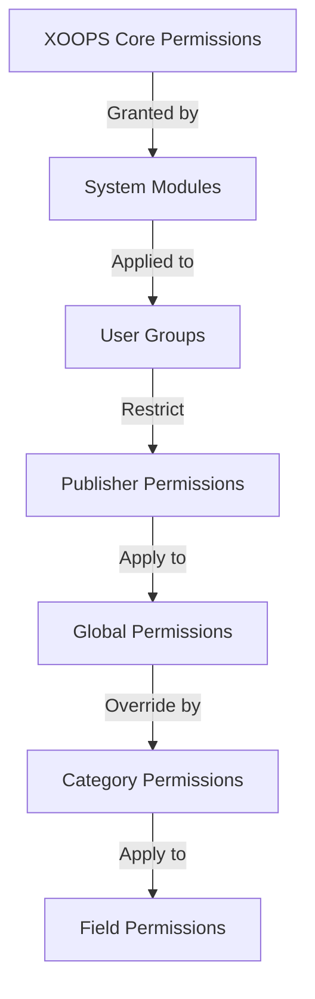

# הגדרת הרשאות מפרסם

> מדריך שלם להגדרת הרשאות קבוצה, בקרת גישה וניהול גישת משתמשים ב-Publisher.

---

## יסודות ההרשאה

### מהן הרשאות?

ההרשאות קובעות מה קבוצות משתמשים שונות יכולות לעשות ב-Publisher:
```
Who can:
  - View articles
  - Submit articles
  - Edit articles
  - Approve articles
  - Manage categories
  - Configure settings
```
### רמות הרשאה
```
Anonymous
  └── View published articles only

Registered Users
  ├── View articles
  ├── Submit articles (pending approval)
  └── Edit own articles

Editors/Moderators
  ├── All registered permissions
  ├── Approve articles
  ├── Edit all articles
  └── Manage some categories

Administrators
  └── Full access to everything
```
---

## ניהול הרשאות גישה

### נווט אל הרשאות
```
Admin Panel
└── Modules
    └── Publisher
        ├── Permissions
        ├── Category Permissions
        └── Group Management
```
### גישה מהירה

1. היכנס בתור **מנהל מערכת**
2. עבור אל **אדמין → מודולים**
3. לחץ על **Publisher → ניהול**
4. לחץ על **הרשאות** בתפריט הימני

---

## הרשאות גלובליות

### הרשאות ברמת מודול

שליטה בגישה למודול ולתכונות של Publisher:
```
Permissions configuration view:
┌─────────────────────────────────────┐
│ Permission             │ Anon │ Reg │ Editor │ Admin │
├────────────────────────┼──────┼─────┼────────┼───────┤
│ View articles          │  ✓   │  ✓  │   ✓    │  ✓   │
│ Submit articles        │  ✗   │  ✓  │   ✓    │  ✓   │
│ Edit own articles      │  ✗   │  ✓  │   ✓    │  ✓   │
│ Edit all articles      │  ✗   │  ✗  │   ✓    │  ✓   │
│ Approve articles       │  ✗   │  ✗  │   ✓    │  ✓   │
│ Manage categories      │  ✗   │  ✗  │   ✗    │  ✓   │
│ Access admin panel     │  ✗   │  ✗  │   ✓    │  ✓   │
└─────────────────────────────────────┘
```
### תיאורי הרשאות

| רשות | משתמשים | אפקט |
|------------|--------|--------|
| **צפה במאמרים** | כל הקבוצות | יכול לראות מאמרים שפורסמו בחזית הקצה |
| **שלח מאמרים** | רשום+ | יכול ליצור מאמרים חדשים (בהמתנה לאישור) |
| **ערוך מאמרים משלו** | רשום+ | האם edit/delete מאמרים משלהם |
| **ערוך את כל המאמרים** | עורכים+ | יכול לערוך מאמרים של כל משתמש |
| **מחק מאמרים משלו** | רשום+ | יכולים למחוק מאמרים שלא פורסמו |
| **מחק את כל המאמרים** | עורכים+ | יכול למחוק כל מאמר |
| **אשר מאמרים** | עורכים+ | יכול לפרסם מאמרים ממתינים |
| **נהל קטגוריות** | מנהלים | צור, ערוך, מחק קטגוריות |
| **גישה מנהלתית** | עורכים+ | גישה לממשק ניהול |

---

## הגדר הרשאות גלובליות

### שלב 1: גישה להגדרות הרשאות

1. עבור אל **ניהול → מודולים**
2. מצא את **Publisher**
3. לחץ על **הרשאות** (או על קישור מנהל מערכת ולאחר מכן על הרשאות)
4. אתה רואה מטריצת הרשאות

### שלב 2: הגדר הרשאות קבוצה

עבור כל קבוצה, הגדר מה הם יכולים לעשות:

#### משתמשים אנונימיים
```yaml
Anonymous Group Permissions:
  View articles: ✓ YES
  Submit articles: ✗ NO
  Edit articles: ✗ NO
  Delete articles: ✗ NO
  Approve articles: ✗ NO
  Manage categories: ✗ NO
  Admin access: ✗ NO

Result: Anonymous users can only view published content
```
#### משתמשים רשומים
```yaml
Registered Group Permissions:
  View articles: ✓ YES
  Submit articles: ✓ YES (with approval required)
  Edit own articles: ✓ YES
  Edit all articles: ✗ NO
  Delete own articles: ✓ YES (drafts only)
  Delete all articles: ✗ NO
  Approve articles: ✗ NO
  Manage categories: ✗ NO
  Admin access: ✗ NO

Result: Registered users can contribute content after approval
```
#### קבוצת עורכים
```yaml
Editors Group Permissions:
  View articles: ✓ YES
  Submit articles: ✓ YES
  Edit own articles: ✓ YES
  Edit all articles: ✓ YES
  Delete own articles: ✓ YES
  Delete all articles: ✓ YES
  Approve articles: ✓ YES
  Manage categories: ✓ LIMITED
  Admin access: ✓ YES
  Configure settings: ✗ NO

Result: Editors manage content but not settings
```
#### מנהלי מערכת
```yaml
Admins Group Permissions:
  ✓ FULL ACCESS to all features

  - All editor permissions
  - Manage all categories
  - Configure all settings
  - Manage permissions
  - Install/uninstall
```
### שלב 3: שמור הרשאות

1. הגדר את ההרשאות של כל קבוצה
2. תיבות סימון עבור פעולות מותרות
3. בטל את הסימון בתיבות עבור פעולות שנדחו
4. לחץ על **שמור הרשאות**
5. מופיעה הודעת אישור

---

## הרשאות ברמת קטגוריה

### הגדר גישה לקטגוריה

שליטה מי יכול view/submit לקטגוריות ספציפיות:
```
Admin → Publisher → Categories
→ Select category → Permissions
```
### מטריצת הרשאות קטגוריה
```
                 Anonymous  Registered  Editor  Admin
View category        ✓         ✓         ✓       ✓
Submit to category   ✗         ✓         ✓       ✓
Edit own in category ✗         ✓         ✓       ✓
Edit all in category ✗         ✗         ✓       ✓
Approve in category  ✗         ✗         ✓       ✓
Manage category      ✗         ✗         ✗       ✓
```
### הגדר הרשאות קטגוריה

1. עבור אל מנהל מערכת **קטגוריות**
2. מצא קטגוריה
3. לחץ על הלחצן **הרשאות**
4. עבור כל קבוצה, בחר:
   - [ ] הצג קטגוריה זו
   - [ ] שלח מאמרים
   - [ ] ערוך מאמרים משלך
   - [ ] ערוך את כל המאמרים
   - [ ] אשר מאמרים
   - [ ] נהל קטגוריה
5. לחץ על **שמור**

### דוגמאות להרשאות קטגוריות

#### קטגוריית חדשות ציבוריות
```
Anonymous: View only
Registered: View + Submit (pending approval)
Editors: Approve + Edit
Admins: Full control
```
#### קטגוריית עדכונים פנימיים
```
Anonymous: No access
Registered: View only
Editors: Submit + Approve
Admins: Full control
```
#### קטגוריית בלוג אורחים
```
Anonymous: View only
Registered: Submit (pending approval)
Editors: Approve
Admins: Full control
```
---

## הרשאות ברמת השדה

### נראות שדה של טופס בקרה

הגבל אילו שדות טפסים יכולים המשתמשים see/edit:
```
Admin → Publisher → Permissions → Fields
```
### אפשרויות שדה
```yaml
Visible Fields for Registered Users:
  ✓ Title
  ✓ Description
  ✓ Content (body)
  ✓ Featured image
  ✓ Category
  ✓ Tags
  ✗ Author (auto-set)
  ✗ Publication date (editors only)
  ✗ Scheduled date (editors only)
  ✗ Featured flag (editors only)
  ✗ Permissions (admins only)
```
### דוגמאות

#### הגשה מוגבלת לרשומים

משתמשים רשומים רואים פחות אפשרויות:
```
Available fields:
  - Title ✓
  - Description ✓
  - Content ✓
  - Featured image ✓
  - Category ✓

Hidden fields:
  - Author (auto-current user)
  - Publication date (editors decide)
  - Scheduled date (admins only)
  - Featured status (editors choose)
```
#### טופס מלא עבור עורכים

העורכים רואים את כל האפשרויות:
```
Available fields:
  - All basic fields
  - All metadata
  - Author selection ✓
  - Publication date/time ✓
  - Scheduled date ✓
  - Featured status ✓
  - Expiration date ✓
  - Permissions ✓
```
---

## תצורת קבוצת משתמשים

### צור קבוצה מותאמת אישית

1. עבור אל **ניהול → משתמשים → קבוצות**
2. לחץ על **צור קבוצה**
3. הזן את פרטי הקבוצה:
```
Group Name: "Community Bloggers"
Group Description: "Users who contribute blog content"
Type: Regular group
```
4. לחץ על **שמור קבוצה**
5. חזור אל הרשאות מפרסם
6. הגדר הרשאות לקבוצה חדשה

### דוגמאות לקבוצות
```
Suggested Groups for Publisher:

Group: Contributors
  - Regular members who submit articles
  - Can edit own articles
  - Cannot approve articles

Group: Reviewers
  - Can see submitted articles
  - Can approve/reject articles
  - Cannot delete others' articles

Group: Editors
  - Can edit any article
  - Can approve articles
  - Can moderate comments
  - Can manage some categories

Group: Publishers
  - Can edit any article
  - Can publish directly (no approval)
  - Can manage all categories
  - Can configure settings
```
---

## היררכיות הרשאות

### זרימת הרשאות

### הרשאה ירושה
```
Base: Global module permissions
  ↓
Category: Overrides for specific categories
  ↓
Field: Further restricts available fields
  ↓
User: Has permission if ALL levels allow
```
**דוּגמָה:**
```
User wants to edit article:
1. User group must have "edit articles" permission (global)
2. Category must allow editing (category level)
3. Field restrictions must allow (if applicable)
4. User must be author OR editor (for own vs all)

If ANY level denies → Permission denied
```
---

## הרשאות זרימת עבודה לאישור

### הגדר אישור הגשה

שליטה אם מאמרים צריכים אישור:
```
Admin → Publisher → Preferences → Workflow
```
#### אפשרויות אישור
```yaml
Submission Workflow:
  Require Approval: Yes

  For Registered Users:
    - New articles: Draft (pending approval)
    - Editors must approve
    - User can edit while pending
    - After approval: User can still edit

  For Editors:
    - New articles: Publish directly (optional)
    - Skip approval queue
    - Or always require approval
```
#### הגדר לפי קבוצה

1. עבור אל העדפות
2. מצא את "זרימת עבודה של הגשה"
3. עבור כל קבוצה, הגדר:
```
Group: Registered Users
  Require approval: ✓ YES
  Default status: Draft
  Can modify while pending: ✓ YES

Group: Editors
  Require approval: ✗ NO
  Default status: Published
  Can modify published: ✓ YES
```
4. לחץ על **שמור**

---

## מאמרים מתונים

### אשר מאמרים ממתינים

למשתמשים עם הרשאת "אשר מאמרים":

1. עבור אל **אדמין → Publisher → מאמרים**
2. סנן לפי **סטטוס**: בהמתנה
3. לחץ על מאמר לסקירה
4. בדקו את איכות התוכן
5. הגדר **סטטוס**: פורסם
6. אופציונלי: הוסף הערות עריכה
7. לחץ על **שמור**

### דחה מאמרים

אם המאמר אינו עומד בסטנדרטים:

1. פתח מאמר
2. הגדר את **סטטוס**: טיוטה
3. הוסף סיבת דחייה (בהערה או בדוא"ל)
4. לחץ על **שמור**
5. שלח הודעה למחבר המסביר את הדחייה

### הערות מתונות

אם מנחה הערות:

1. עבור אל **אדמין ← Publisher ← הערות**
2. סנן לפי **סטטוס**: בהמתנה
3. עיין בהערה
4. אפשרויות:
   - אישור: לחץ על **אשר**
   - דחייה: לחץ על **מחק**
   - ערוך: לחץ על **ערוך**, תקן, שמור
5. לחץ על **שמור**

---

## נהל גישת משתמש

### הצג קבוצות משתמשים

ראה אילו משתמשים שייכים לקבוצות:
```
Admin → Users → User Groups

For each user:
  - Primary group (one)
  - Secondary groups (multiple)

Permissions apply from all groups (union)
```
### הוסף משתמש לקבוצה

1. עבור אל **ניהול → משתמשים**
2. מצא משתמש
3. לחץ על **ערוך**
4. בקטע **קבוצות**, סמן קבוצות להוספה
5. לחץ על **שמור**

### שנה הרשאות משתמש

עבור משתמשים בודדים (אם נתמך):

1. עבור אל מנהל משתמש
2. מצא משתמש
3. לחץ על **ערוך**
4. חפש עקיפת הרשאות בודדות
5. הגדר לפי הצורך
6. לחץ על **שמור**

---

## תרחישי הרשאה נפוצים

### תרחיש 1: פתח את הבלוג

אפשר לכל אחד להגיש:
```
Anonymous: View
Registered: Submit, edit own, delete own
Editors: Approve, edit all, delete all
Admins: Full control

Result: Open community blog
```
### תרחיש 2: מנחה אתר חדשות

תהליך אישור קפדני:
```
Anonymous: View only
Registered: Cannot submit
Editors: Submit, approve others
Admins: Full control

Result: Only approved professionals publish
```
### תרחיש 3: בלוג צוות

עובדים יכולים לתרום:
```
Create group: "Staff"
Anonymous: View
Registered: View only (non-staff)
Staff: Submit, edit own, publish directly
Admins: Full control

Result: Staff-authored blog
```
### תרחיש 4: ריבוי קטגוריות עם עורכים שונים

עורכים שונים לקטגוריות שונות:
```
News category:
  Editors group A: Full control

Reviews category:
  Editors group B: Full control

Tutorials category:
  Editors group C: Full control

Result: Decentralized editorial control
```
---

## בדיקת הרשאות

### ודא שההרשאות פועלות

1. צור משתמש מבחן בכל קבוצה
2. היכנס בתור כל משתמש בבדיקה
3. נסה:
   - צפו במאמרים
   - שלח מאמר (צריך ליצור טיוטה אם מותר)
   - ערוך מאמר (של עצמו ואחרים)
   - מחק מאמר
   - גישה לפאנל ניהול
   - קטגוריות גישה

4. ודא שהתוצאות תואמות להרשאות הצפויות

### מקרי בדיקה נפוצים
```
Test Case 1: Anonymous user
  [ ] Can view published articles: ✓
  [ ] Cannot submit articles: ✓
  [ ] Cannot access admin: ✓

Test Case 2: Registered user
  [ ] Can submit articles: ✓
  [ ] Articles go to Draft: ✓
  [ ] Can edit own article: ✓
  [ ] Cannot edit others: ✓
  [ ] Cannot access admin: ✓

Test Case 3: Editor
  [ ] Can approve articles: ✓
  [ ] Can edit any article: ✓
  [ ] Can access admin: ✓
  [ ] Cannot delete all: ✓ (or ✓ if allowed)

Test Case 4: Admin
  [ ] Can do everything: ✓
```
---

## הרשאות פתרון בעיות

### בעיה: המשתמש לא יכול לשלוח מאמרים

**בדוק:**
```
1. User group has "submit articles" permission
   Admin → Publisher → Permissions

2. User belongs to allowed group
   Admin → Users → Edit user → Groups

3. Category allows submission from user's group
   Admin → Publisher → Categories → Permissions

4. User is registered (not anonymous)
```
**פִּתָרוֹן:**
```bash
1. Verify registered user group has submission permission
2. Add user to appropriate group
3. Check category permissions
4. Clear user session cache
```
### בעיה: העורך לא יכול לאשר מאמרים

**בדוק:**
```
1. Editor group has "approve articles" permission
2. Articles exist with "Pending" status
3. Editor is in correct group
4. Category allows approval from editor's group
```
**פִּתָרוֹן:**
```bash
1. Go to Permissions, check "approve articles" is checked for editor group
2. Create test article, set to Draft
3. Try to approve as editor
4. Check error messages in system log
```
### בעיה: יכול לראות מאמרים אבל לא יכול לגשת לקטגוריה

**בדוק:**
```
1. Category is not disabled/hidden
2. Category permissions allow viewing
3. User's group is permitted to view category
4. Category is published
```
**פִּתָרוֹן:**
```bash
1. Go to Categories, check category status is "Enabled"
2. Check category permissions are set
3. Add user's group to category view permission
```
### בעיה: ההרשאות השתנו אך לא נכנסות לתוקף

**פתרון:**
```bash
1. Clear cache: Admin → Tools → Clear Cache
2. Clear session: Logout and login again
3. Check system log for errors
4. Verify permissions actually saved
5. Try different browser/incognito window
```
---

## גיבוי וייצוא הרשאות

### הרשאות ייצוא

חלק מהמערכות מאפשרות ייצוא:

1. עבור אל **אדמין ← מפרסם ← כלים**
2. לחץ על **הרשאות ייצוא**
3. שמור `.xml` או `.json` קובץ
4. שמור כגיבוי

### הרשאות ייבוא

שחזור מגיבוי:

1. עבור אל **אדמין ← מפרסם ← כלים**
2. לחץ על **ייבוא הרשאות**
3. בחר קובץ גיבוי
4. בדוק שינויים
5. לחץ על **ייבוא**

---

## שיטות עבודה מומלצות

### רשימת תצורת הרשאות

- [ ] החליטו על קבוצות משתמשים
- [ ] הקצה שמות ברורים לקבוצות
- [ ] הגדר הרשאות בסיס לכל קבוצה
- [ ] בדוק כל רמת הרשאה
- [ ] מבנה הרשאות מסמך
- [ ] צור זרימת עבודה לאישור
- [ ] הדרכת עורכים על מתינות
- [ ] עקוב אחר השימוש בהרשאות
- [ ] בדוק את ההרשאות מדי רבעון
- [ ] הגדרות הרשאת גיבוי

### שיטות עבודה מומלצות לאבטחה
```
✓ Principle of Least Privilege
  - Grant minimum necessary permissions

✓ Role-Based Access
  - Use groups for roles (editor, moderator, etc)

✓ Audit Permissions
  - Review who has what access

✓ Separate Duties
  - Submitter, approver, publisher are different

✓ Regular Review
  - Check permissions quarterly
  - Remove access when users leave
  - Update for new requirements
```
---

## מדריכים קשורים

- יצירת מאמרים
- ניהול קטגוריות
- תצורה בסיסית
- התקנה

---

## השלבים הבאים

- הגדר הרשאות עבור זרימת העבודה שלך
- צור מאמרים עם הרשאות מתאימות
- הגדר קטגוריות עם הרשאות
- הדרכת משתמשים ביצירת מאמר

---

#מפרסם #הרשאות #קבוצות #בקרת גישה #אבטחה #התנהלות #XOOPS