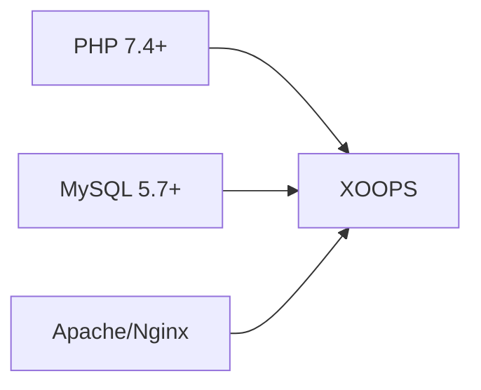
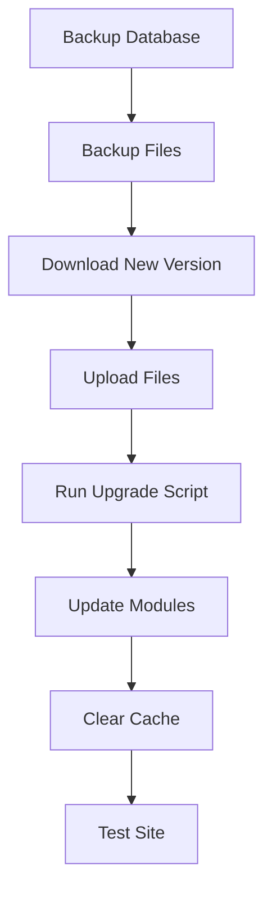

> שאלות ותשובות נפוצות לגבי התקנת XOOPS.

---

## התקנה מוקדמת

### ש: מהן דרישות השרת המינימליות?

**ת:** XOOPS 2.5.x דורש:
- PHP 7.4 ומעלה (מומלץ PHP 8.x)
- MySQL 5.7+ או MariaDB 10.3+
- Apache עם mod_rewrite או Nginx
- לפחות 64MB PHP מגבלת זיכרון (מומלץ 128MB+)



### ש: האם אוכל להתקין את XOOPS על אירוח משותף?

**ת:** כן, XOOPS עובד היטב על רוב האירוח המשותף שעומד בדרישות. בדוק שהמארח שלך מספק:
- PHP עם הרחבות נדרשות (mysqli, gd, curl, json, mbstring)
- MySQL גישה למסד נתונים
- יכולת העלאת קבצים
- תמיכה ב-.htaccess (עבור Apache)

### ש: אילו הרחבות PHP נדרשות?

**ת:** הרחבות נדרשות:
- `mysqli` - קישוריות למסד נתונים
- `gd` - עיבוד תמונה
- `json` - טיפול JSON
- `mbstring` - תמיכה במחרוזות מרובות בתים

מומלץ:
- `curl` - שיחות API חיצוניות
- `zip` - התקנת מודול
- `intl` - בינלאומי

---

## תהליך התקנה

### ש: אשף ההתקנה מציג עמוד ריק

**ת:** זו בדרך כלל שגיאת PHP. נסה:

1. אפשר תצוגת שגיאה זמנית:
```php
// Add to htdocs/install/index.php at the top
error_reporting(E_ALL);
ini_set('display_errors', 1);
```

2. בדוק את יומן השגיאות PHP
3. ודא תאימות גרסת PHP
4. ודא שכל ההרחבות הנדרשות נטענות

### ש: אני מקבל "לא ניתן לכתוב ל-mainfile.php"

**ת:** הגדר הרשאות כתיבה לפני ההתקנה:

```bash
chmod 666 mainfile.php
# After installation, secure it:
chmod 444 mainfile.php
```

### ש: טבלאות מסד נתונים לא נוצרות

**ת:** בדיקה:

1. למשתמש MySQL יש הרשאות CREATE TABLE:
```sql
GRANT ALL PRIVILEGES ON xoopsdb.* TO 'xoopsuser'@'localhost';
FLUSH PRIVILEGES;
```

2. מסד נתונים קיים:
```sql
CREATE DATABASE xoopsdb CHARACTER SET utf8mb4 COLLATE utf8mb4_unicode_ci;
```

3. אישורים בהגדרות מסד הנתונים של האשף

### ש: ההתקנה הושלמה אך האתר מציג שגיאות

**ת:** תיקונים נפוצים לאחר ההתקנה:

1. הסר או שנה את שם ספריית ההתקנה:
```bash
mv htdocs/install htdocs/install.bak
```

2. הגדר הרשאות מתאימות:
```bash
chmod -R 755 htdocs/
chmod -R 777 xoops_data/
chmod 444 mainfile.php
```

3. נקה את הcache:
```bash
rm -rf xoops_data/caches/smarty_cache/*
rm -rf xoops_data/caches/smarty_compile/*
```

---

## תצורה

### ש: איפה נמצא קובץ התצורה?

**ת:** התצורה הראשית היא ב-`mainfile.php` בשורש XOOPS. הגדרות מפתח:

```php
define('XOOPS_ROOT_PATH', '/path/to/htdocs');
define('XOOPS_VAR_PATH', '/path/to/xoops_data');
define('XOOPS_URL', 'https://yoursite.com');
define('XOOPS_DB_HOST', 'localhost');
define('XOOPS_DB_USER', 'username');
define('XOOPS_DB_PASS', 'password');
define('XOOPS_DB_NAME', 'database');
define('XOOPS_DB_PREFIX', 'xoops');
```

### ש: כיצד אוכל לשנות את האתר URL?

**ת:** ערוך `mainfile.php`:

```php
define('XOOPS_URL', 'https://newdomain.com');
```

לאחר מכן נקה את הcache ועדכן כל URLs מקודד קשה במסד הנתונים.

### ש: כיצד אוכל להעביר את XOOPS לספרייה אחרת?

**ת:**

1. העבר קבצים למיקום חדש
2. עדכון נתיבים ב-`mainfile.php`:
```php
define('XOOPS_ROOT_PATH', '/new/path/to/htdocs');
define('XOOPS_VAR_PATH', '/new/path/to/xoops_data');
```
3. עדכן את מסד הנתונים במידת הצורך
4. נקה את כל המטמונים

---

## שדרוגים

### ש: כיצד אוכל לשדרג את XOOPS?

**א:**



1. **גיבוי הכל** (בסיס נתונים + קבצים)
2. הורד גרסה חדשה של XOOPS
3. העלה קבצים (אל תחליף את `mainfile.php`)
4. הפעל את `htdocs/upgrade/` אם מסופק
5. עדכן מודולים באמצעות פאנל ניהול
6. נקה את כל המטמונים
7. בדוק היטב

### ש: האם אוכל לדלג על גרסאות בעת השדרוג?

**ת:** בדרך כלל לא. שדרג ברצף דרך גרסאות עיקריות כדי להבטיח שהעברת מסדי נתונים פועלת כהלכה. בדוק את הערות הגרסה לקבלת הנחיות ספציפיות.

### ש: המודולים שלי הפסיקו לעבוד לאחר השדרוג

**ת:**

1. בדוק את תאימות המודול לגרסה החדשה של XOOPS
2. עדכן מודולים לגרסאות האחרונות
3. צור מחדש תבניות: ניהול ← מערכת ← תחזוקה ← תבניות
4. נקה את כל המטמונים
5. בדוק את יומני השגיאות של PHP עבור שגיאות ספציפיות

---

## פתרון בעיות

### ש: שכחתי את סיסמת המנהל

**ת:** איפוס באמצעות מסד נתונים:

```sql
-- Generate new password hash
UPDATE xoops_users
SET pass = MD5('newpassword')
WHERE uname = 'admin';
```

או השתמש בתכונת איפוס הסיסמה אם הוגדר דוא"ל.

### ש: האתר איטי מאוד לאחר ההתקנה

**ת:**

1. אפשר שמירה בcache ב-Admin → System → Preferences
2. בצע אופטימיזציה של מסד הנתונים:
```sql
OPTIMIZE TABLE xoops_session;
OPTIMIZE TABLE xoops_online;
```
3. בדוק אם יש שאילתות איטיות במצב ניפוי באגים
4. הפעל את PHP OpCache

### ש: Images/CSS לא נטען

**ת:**

1. בדוק הרשאות קבצים (644 עבור קבצים, 755 עבור ספריות)
2. ודא ש-`XOOPS_URL` נכון ב-`mainfile.php`
3. בדוק את .htaccess עבור התנגשויות שכתוב
4. בדוק את קונסולת הדפדפן לאיתור שגיאות 404

---

## תיעוד קשור

- מדריך התקנה
- תצורה בסיסית
- מסך מוות לבן

---

#xoops #שאלות נפוצות #התקנה #פתרון בעיות
