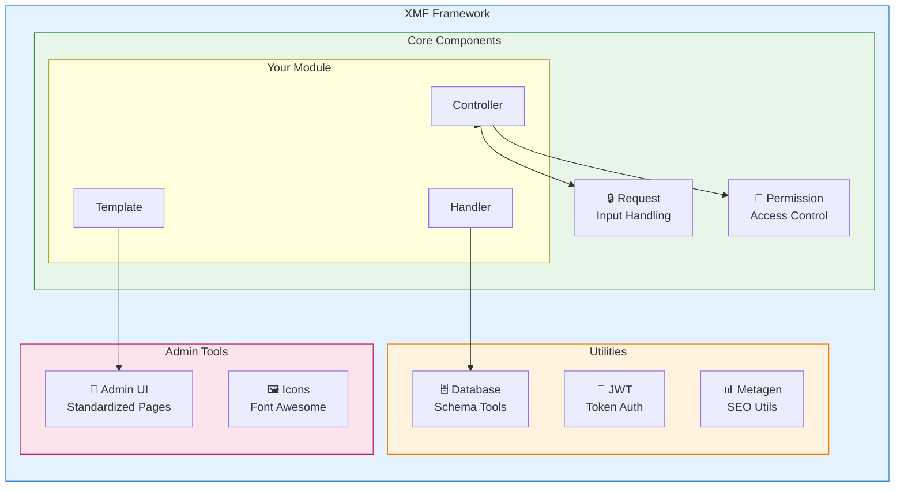
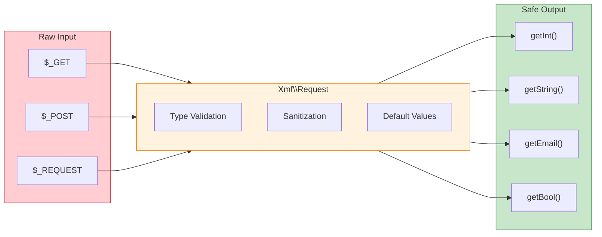

<span class="version-badge version-25x">2.5.x ✅</span> <span class="version-badge version-40x">4.0.x ✅</span>

:::טיפ[הגשר למודרני XOOPS]
XMF עובד ב-**גם XOOPS 2.5.x וגם XOOPS 4.0.x**. זו הדרך המומלצת למודרניזציה של המודולים שלך היום תוך כדי הכנה ל-XOOPS 4.0. XMF מספק PSR-4 טעינה אוטומטית, מרחבי שמות ועוזרים שמחליקים את המעבר.
:::

**XOOPS Module Framework (XMF)** היא ספרייה רבת עוצמה שנועדה לפשט ולתקן את פיתוח המודול XOOPS. XMF מספקת שיטות PHP מודרניות, כולל מרחבי שמות, טעינה אוטומטית וסדרה מקיפה של כיתות עוזרות המפחיתות את קוד ה-boilerplate ומשפרים את יכולת התחזוקה.

## מה זה XMF?

XMF הוא אוסף של מחלקות וכלי עזר המספקים:

- **תמיכה PHP מודרנית** - תמיכה מלאה במרחב השמות עם טעינה אוטומטית של PSR-4
- **טיפול בבקשות** - אימות קלט מאובטח וחיטוי
- **מסייעי מודולים** - גישה פשוטה לתצורות ואובייקטים של מודול
- **מערכת הרשאות** - ניהול הרשאות קל לשימוש
- **כלי עזר למסד נתונים** - העברת סכימה וכלים לניהול טבלאות
- **תמיכה בJWT** - יישום אסימון אינטרנט של JSON לאימות מאובטח
- **יצירת מטא נתונים** - SEO וכלי עזר לחילוץ תוכן
- **ממשק ניהול** - דפי ניהול מודול סטנדרטיים

### XMF סקירת רכיבים



## תכונות עיקריות

### מרחבי שמות וטעינה אוטומטית

כל מחלקות XMF שוכנות במרחב השמות `Xmf`. השיעורים נטענים אוטומטית עם הפניה - אין צורך במדריך כולל.

```php
use Xmf\Request;
use Xmf\Module\Helper;

// Classes load automatically when used
$input = Request::getString('input', '');
$helper = Helper::getHelper('mymodule');
```

### טיפול בטוח בבקשות

[מחלקת הבקשה](../05-XMF-Framework/Basics/XMF-Request.md) מספקת גישה בטוחה לפי סוג לנתוני בקשות HTTP עם חיטוי מובנה:



```php
use Xmf\Request;

$id = Request::getInt('id', 0);
$name = Request::getString('name', '');
$email = Request::getEmail('email', '');
```

### מערכת עוזר מודול

[מסייע המודול](../05-XMF-Framework/Basics/XMF-Module-Helper.md) מספק גישה נוחה לפונקציונליות הקשורה למודול:

```php
$helper = \Xmf\Module\Helper::getHelper('mymodule');

// Access module configuration
$configValue = $helper->getConfig('setting_name', 'default');

// Get module object
$module = $helper->getModule();

// Access handlers
$handler = $helper->getHandler('items');
```

### ניהול הרשאות

ה-[Permission-Helper](../05-XMF-Framework/Recipes/Permission-Helper.md) מפשט את הטיפול בהרשאות XOOPS:

```php
$permHelper = new \Xmf\Module\Helper\Permission();

// Check user permission
if ($permHelper->checkPermission('view', $itemId)) {
    // User has permission
}
```

## מבנה תיעוד

### יסודות

- [תחילת העבודה-עם-XMF](../05-XMF-Framework/Basics/Getting-Started-with-XMF.md) - התקנה ושימוש בסיסי
- [XMF-Request](../05-XMF-Framework/Basics/XMF-Request.md) - טיפול בבקשות ואימות קלט
- [XMF-Module-Helper](../05-XMF-Framework/Basics/XMF-Module-Helper.md) - שימוש בכיתה עוזר מודול

### מתכונים

- [Permission-Helper](../05-XMF-Framework/Recipes/Permission-Helper.md) - עבודה עם הרשאות
- [Module-Admin-Pages](../05-XMF-Framework/Recipes/Module-Admin-Pages.md) - יצירת ממשקי ניהול סטנדרטיים

### הפניה

- [JWT](../05-XMF-Framework/Reference/JWT.md) - JSON יישום אסימון אינטרנט
- [מסד נתונים](../05-XMF-Framework/Reference/Database.md) - כלי עזר למסד נתונים וניהול סכימה
- [Metagen](Reference/Metagen.md) - מטא נתונים ו-SEO כלי עזר

## דרישות

- XOOPS 2.5.8 ואילך
- PHP 7.2 ואילך (מומלץ PHP 8.x)

## התקנה

XMF כלול עם XOOPS 2.5.8 ואילך. עבור גרסאות קודמות או התקנה ידנית:

1. הורד את חבילת XMF ממאגר XOOPS
2. חלץ לספריית XOOPS `/class/xmf/` שלך
3. הטעינה האוטומטית יטפל בטעינת הכיתה באופן אוטומטי

## דוגמה להתחלה מהירה

הנה דוגמה מלאה המציגה דפוסי שימוש נפוצים של XMF:

```php
<?php
use Xmf\Request;
use Xmf\Module\Helper;
use Xmf\Module\Helper\Permission;

// Get module helper
$helper = Helper::getHelper('mymodule');

// Get configuration values
$itemsPerPage = $helper->getConfig('items_per_page', 10);

// Handle request input
$op = Request::getCmd('op', 'list');
$id = Request::getInt('id', 0);

// Check permissions
$permHelper = new Permission();
if (!$permHelper->checkPermission('view', $id)) {
    redirect_header('index.php', 3, 'Access denied');
}

// Process based on operation
switch ($op) {
    case 'view':
        $handler = $helper->getHandler('items');
        $item = $handler->get($id);
        // ... display item
        break;
    case 'list':
    default:
        // ... list items
        break;
}
```

## משאבים

- [XMF GitHub מאגר](https://github.com/XOOPS/XMF)
- [אתר פרויקט XOOPS](https://xoops.org)

---

#xmf #xoops #framework #php #module-development
